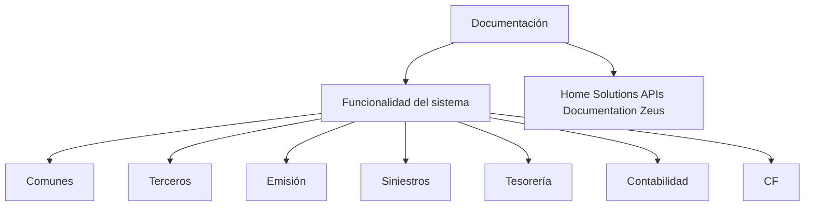

# Documentação Funcional do Sistema — Organização por Módulos

## 1. Metadados do Documento
- **Arquivo de Origem:** Não informado
- **Tipo de Documento:** Manual Operacional
- **Domínio / Sistema:** Home Solutions APIs Documentation Zeus
- **Público-Alvo:** Não identificado
- **Data/Versão Identificada:** Não identificada

---

## 2. Resumo Executivo & Contexto de Negócio

O documento apresenta uma estrutura de documentação relacionada à funcionalidade de um sistema. O conteúdo informa explicitamente que as informações funcionais estão organizadas por módulo.

Os módulos funcionais listados são: Comunes, Terceros, Emisión, Siniestros, Tesorería, Contabilidad e CF. Essa segmentação sugere que a documentação pretende permitir consulta por área funcional, embora não descreva os processos, regras ou interfaces de cada área.

O texto também referencia “Home Solutions APIs Documentation Zeus”, indicando uma associação documental com APIs, Home Solutions e Zeus. Entretanto, o documento não especifica se Zeus é um sistema, plataforma, produto, ambiente ou repositório de documentação.

Não há detalhamento de arquitetura, métodos de API, contratos, integrações, responsabilidades operacionais, permissões, URLs, tecnologias, versões ou procedimentos.

---

## 3. Arquitetura, Componentes & Tecnologias Envolvidas

O documento não descreve uma arquitetura técnica, componentes de software, tecnologias, serviços, bancos de dados ou ambientes. O único relacionamento identificável é a organização da documentação funcional por módulos.



**Nota de Análise:** O documento cita “Home Solutions APIs Documentation Zeus”, mas não detalha APIs, métodos HTTP, contratos JSON, autenticação, endpoints, tecnologias ou relações técnicas entre os módulos listados.

---

## 4. Regras de Negócio, Especificações Funcionais & Processos

O documento estabelece somente a seguinte regra de organização documental:

1. A documentação aborda assuntos relacionados à funcionalidade do sistema.
2. A informação é organizada por módulo.
3. Os módulos apresentados são:
   - Comunes
   - Terceros
   - Emisión
   - Siniestros
   - Tesorería
   - Contabilidad
   - CF

Não há regras de negócio, critérios de validação, cálculos, fluxos operacionais, condições, exceções, estados ou restrições funcionais descritos.

---

## 5. Tabelas de Parâmetros, Ambientes e Estruturas de Dados

| Item / Parâmetro | Descrição / Função | Tipo / Valores / Formato | Ambiente / Observações |
| :--- | :--- | :--- | :--- |
| Documentación | Seção documental apresentada no conteúdo bruto. | Texto | Relacionada à funcionalidade do sistema. |
| Funcionalidad del sistema | Escopo declarado da documentação. | Texto | As informações são organizadas por módulo. |
| Comunes | Módulo listado no documento. | Nome de módulo | Não há detalhamento funcional adicional. |
| Terceros | Módulo listado no documento. | Nome de módulo | Não há detalhamento funcional adicional. |
| Emisión | Módulo listado no documento. | Nome de módulo | Não há detalhamento funcional adicional. |
| Siniestros | Módulo listado no documento. | Nome de módulo | Não há detalhamento funcional adicional. |
| Tesorería | Módulo listado no documento. | Nome de módulo | Não há detalhamento funcional adicional. |
| Contabilidad | Módulo listado no documento. | Nome de módulo | Não há detalhamento funcional adicional. |
| CF | Módulo listado no documento. | Sigla ou nome de módulo | O significado de CF não é definido. |
| Home Solutions APIs Documentation Zeus | Referência exibida no texto. | Texto / identificação documental | Não há explicação sobre a relação entre Home Solutions, APIs e Zeus. |
| EN | Texto exibido ao final da extração. | Código ou rótulo | O significado não é explicado. |

---

## 6. Bateria de Perguntas & Respostas para RAG (FAQ Sintético)

### P1: Qual é o objetivo da documentação apresentada?
**R:** A documentação aborda assuntos relacionados à funcionalidade do sistema. O documento informa que a informação funcional está organizada por módulo.

### P2: Como a informação do sistema está organizada?
**R:** A informação está organizada por módulos funcionais. O documento lista os módulos Comunes, Terceros, Emisión, Siniestros, Tesorería, Contabilidad e CF.

### P3: Quais módulos estão listados na documentação?
**R:** Os módulos listados são Comunes, Terceros, Emisión, Siniestros, Tesorería, Contabilidad e CF.

### P4: O documento descreve regras de negócio do módulo Emisión?
**R:** Não. O documento apenas lista Emisión como um módulo da documentação. Não há regras de negócio, cálculos, validações ou fluxos específicos para Emisión.

### P5: Existe detalhamento funcional para o módulo Siniestros?
**R:** Não. Siniestros aparece somente como um módulo listado. O conteúdo fornecido não descreve funcionalidades, processos ou integrações desse módulo.

### P6: O que significa a sigla CF no documento?
**R:** O documento lista CF como um módulo, mas não define seu significado. Não é possível expandir ou interpretar a sigla sem informação adicional.

### P7: Quais APIs são documentadas em “Home Solutions APIs Documentation Zeus”?
**R:** O documento menciona “Home Solutions APIs Documentation Zeus”, mas não identifica APIs específicas, endpoints, métodos HTTP, contratos, autenticação ou versões.

### P8: O documento informa URLs de ambientes, servidores ou rotas de logs?
**R:** Não. Não há URLs, nomes de servidores, ambientes, portas, caminhos de log ou parâmetros operacionais no conteúdo fornecido.

### P9: Há uma arquitetura técnica descrita para os módulos?
**R:** Não. O documento apresenta uma organização documental por módulos, mas não descreve arquitetura de software, serviços, bancos de dados, tecnologias ou fluxo de integração.

### P10: Quem é o público-alvo da documentação?
**R:** O público-alvo não é identificado explicitamente. O conteúdo indica apenas que a documentação trata da funcionalidade do sistema.

---

## 7. Glossário de Termos, Siglas & Conceitos-Chave

- **Documentación:** Seção que trata de assuntos relacionados à funcionalidade do sistema.
- **Comunes:** Módulo listado no documento, sem detalhamento adicional.
- **Terceros:** Módulo listado no documento, sem detalhamento adicional.
- **Emisión:** Módulo listado no documento, sem detalhamento adicional.
- **Siniestros:** Módulo listado no documento, sem detalhamento adicional.
- **Tesorería:** Módulo listado no documento, sem detalhamento adicional.
- **Contabilidad:** Módulo listado no documento, sem detalhamento adicional.
- **CF:** Módulo ou sigla listada; significado não definido no conteúdo.
- **Home Solutions APIs Documentation Zeus:** Referência textual apresentada no documento; relação entre os termos não detalhada.
- **EN:** Código ou rótulo exibido no conteúdo; significado não definido.

---

## 8. Notas Críticas, Riscos & Limitações

- O conteúdo é extremamente resumido e não fornece descrições funcionais dos módulos listados.
- Não há especificação de arquitetura, componentes, tecnologias, integrações ou contratos de API.
- Não há regras de negócio, critérios de validação, parâmetros de cálculo ou fluxos operacionais.
- A referência “Home Solutions APIs Documentation Zeus” não é explicada.
- A sigla **CF** não possui definição no documento.
- O rótulo **EN** não possui definição no documento.
- Não foram identificadas data, versão, autoria, ambiente, URLs, servidores ou responsáveis operacionais.

---

## 9. Conteúdo Bruto Estruturado (Referência Fiel)

```text
--- [PÁGINA 1 DE 1] ---

DOCUMENTACIÓN
 En este apartado se aborda todo aquello relacionado con la funcionalidad
del sistema. La información está organizada por módulo.
 COMUNES
  TERCEROS
 EMISIÓN
  SINIESTROS
 TESORERÍA
  CONTABILIDAD
 / 
 CF
Home Solutions APIs Documentation Zeus
EN
```
