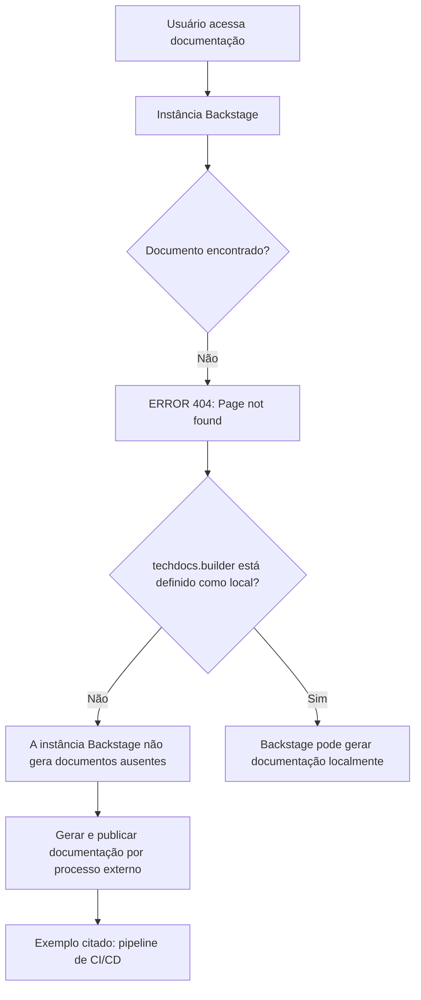

# Erro 404 de Documentação TechDocs no Backstage: Documento Não Encontrado

## 1. Metadados do Documento
- **Arquivo de Origem:** `Não identificado`
- **Tipo de Documento:** `Procedimento / página de erro de documentação`
- **Domínio / Sistema:** `Backstage, TechDocs, Zeus`
- **Público-Alvo:** `Não identificado`
- **Data/Versão Identificada:** `Não identificada`

---

## 2. Resumo Executivo & Contexto de Negócio

O conteúdo representa uma página de erro `ERROR 404` exibida durante o acesso a documentação técnica. A página informa que o documento requisitado não foi encontrado e associa o problema à configuração do componente `techdocs.builder`.

A mensagem esclarece que `techdocs.builder` não está configurado como `local`. Nessa condição, a instância Backstage não gera documentação localmente quando os documentos não estão disponíveis na origem publicada.

Como alternativa, o texto orienta que a documentação do projeto seja gerada e publicada por um processo externo, citando um pipeline de `CI/CD` como exemplo. Outra alternativa explicitamente apresentada é alterar `techdocs.builder` para `local`, permitindo que a instância Backstage gere a documentação.

A página também oferece mecanismos de recuperação: retornar à página anterior, entrar em contato com o suporte caso o comportamento seja considerado um defeito e navegar pelas áreas `Home`, `Solutions`, `APIs`, `Documentation` e `Zeus`.

---

## 3. Arquitetura, Componentes & Tecnologias Envolvidas

Os elementos técnicos explicitamente citados são:

- **Backstage:** instância que exibe o erro e cuja capacidade de geração de documentação é condicionada pela configuração `techdocs.builder`.
- **TechDocs:** componente ou contexto de documentação referido pela propriedade `techdocs.builder`.
- **`techdocs.builder`:** configuração que, quando não definida como `local`, impede a geração de documentação ausente pela instância Backstage.
- **Processo externo:** mecanismo alternativo para gerar e publicar a documentação.
- **Pipeline de CI/CD:** exemplo de processo externo capaz de gerar e publicar documentos.
- **Zeus:** área ou item de navegação citado na página.
- **CF:** texto exibido no rodapé, sem detalhamento funcional.



> **Nota de Análise:** o conteúdo não identifica o projeto, repositório, URL da documentação, configuração completa de `techdocs.builder`, tecnologia do pipeline CI/CD ou procedimento operacional para publicação.

---

## 4. Regras de Negócio, Especificações Funcionais & Processos

1. Quando a documentação requisitada não é encontrada, a página apresenta o erro `ERROR 404: Page not found`.
2. A página relaciona a indisponibilidade da documentação à configuração de `techdocs.builder`.
3. Quando `techdocs.builder` não está configurado como `local`, a instância Backstage não gera documentação se os documentos não forem encontrados.
4. A geração e publicação da documentação pode ser delegada a um processo externo.
5. Um pipeline de `CI/CD` é citado como exemplo de processo externo para gerar e publicar a documentação.
6. Como alternativa ao processo externo, a configuração `techdocs.builder` pode ser alterada para `local`.
7. A página orienta o usuário a retornar à navegação anterior ou a contatar o suporte se considerar que o erro é um defeito.
8. O conteúdo não especifica os comandos, permissões, repositórios, formatos de documentação, gatilhos de CI/CD nem responsáveis pela operação.

---

## 5. Tabelas de Parâmetros, Ambientes e Estruturas de Dados

| Item / Parâmetro | Descrição / Função | Tipo / Valores / Formato | Ambiente / Observações |
| :--- | :--- | :--- | :--- |
| `ERROR 404` | Indica que a página ou documento não foi encontrado. | Código de erro exibido na página. | O texto não fornece detalhes adicionais sobre a origem do erro. |
| `techdocs.builder` | Configuração relacionada à geração de documentação pela instância Backstage. | Valor citado: `local`. | Quando não está definido como `local`, o Backstage não gera documentos não encontrados. |
| `local` | Valor de configuração que permite a geração de documentação na instância Backstage. | Valor de `techdocs.builder`. | Não são informados os arquivos ou meios para alterar essa configuração. |
| Processo externo | Alternativa para gerar e publicar documentação. | Processo operacional. | Um pipeline de CI/CD é citado como exemplo. |
| CI/CD pipeline | Exemplo de processo externo para gerar e publicar documentação. | Pipeline de integração contínua e entrega/implantação contínua, conforme sigla usual; o documento não detalha sua implementação. | Ferramenta, repositório e etapas não identificados. |
| Backstage | Instância que exibe a página e pode gerar documentação conforme configuração. | Plataforma/sistema citado. | Nenhuma versão ou configuração adicional é apresentada. |
| Zeus | Item ou área de navegação exibido na página. | Nome próprio apresentado no menu. | Função não detalhada. |
| `CF` | Texto exibido no rodapé. | Sigla ou identificador não explicado. | Sem definição no conteúdo. |
| `EN` | Indicador exibido na interface. | Código textual. | O documento não explica formalmente seu significado. |

---

## 6. Bateria de Perguntas & Respostas para RAG (FAQ Sintético)

### P1: Qual erro é apresentado quando a documentação não é encontrada?
**R:** A página apresenta `ERROR 404: Page not found.`, indicando que a documentação ou página requisitada não foi encontrada.

### P2: Por que a instância Backstage não gera a documentação ausente?
**R:** Segundo a mensagem, `techdocs.builder` não está definido como `local`. Nessa condição, a instância Backstage não gera documentos quando eles não são encontrados.

### P3: Qual configuração é mencionada para permitir geração local de documentação?
**R:** A configuração citada é `techdocs.builder` com o valor `local`. O texto informa que essa alteração permite a geração de documentação a partir da instância Backstage.

### P4: Qual alternativa é recomendada quando a documentação não é gerada localmente pelo Backstage?
**R:** O conteúdo recomenda assegurar que a documentação do projeto seja gerada e publicada por um processo externo. Um pipeline de CI/CD é apresentado como exemplo desse processo.

### P5: O documento informa qual ferramenta de CI/CD deve ser usada?
**R:** Não. O texto menciona apenas “CI/CD pipeline” como exemplo de processo externo, sem especificar ferramenta, plataforma, comandos, repositório ou etapas de publicação.

### P6: O que o usuário pode fazer ao encontrar a página de erro?
**R:** O usuário pode retornar à página anterior por meio da opção “Go back” ou contatar o suporte se considerar que a ocorrência é um defeito.

### P7: Quais áreas de navegação aparecem na página?
**R:** A interface apresenta as áreas `Home`, `Solutions`, `APIs`, `Documentation` e `Zeus`. O texto também exibe `EN` e `CF`, sem explicar suas funções.

### P8: O conteúdo identifica qual documento técnico está ausente?
**R:** Não. O conteúdo informa apenas que uma página ou documento não foi encontrado; não há nome de arquivo, URL, projeto, componente ou repositório associado ao erro.

### P9: O conteúdo descreve como alterar `techdocs.builder` para `local`?
**R:** Não. A mensagem recomenda a alteração, mas não apresenta arquivo de configuração, sintaxe, comando, permissões ou processo de implantação necessários.

### P10: O Backstage sempre gera documentos ausentes?
**R:** Não. A página afirma que o Backstage não gera documentos ausentes quando `techdocs.builder` não está definido como `local`.

---

## 7. Glossário de Termos, Siglas & Conceitos-Chave

- **Backstage:** instância ou sistema citado na mensagem de erro; o documento informa que pode gerar documentação dependendo da configuração de `techdocs.builder`.
- **TechDocs:** termo associado à configuração `techdocs.builder`; o conteúdo não expande formalmente a sigla ou nome.
- **`techdocs.builder`:** parâmetro de configuração relacionado ao modo de geração da documentação.
- **`local`:** valor citado para `techdocs.builder`, associado à geração de documentação pela instância Backstage.
- **CI/CD:** sigla apresentada como exemplo de pipeline externo para geração e publicação de documentação; o documento não detalha a implementação.
- **ERROR 404:** erro exibido quando a página não é encontrada.
- **Zeus:** item de navegação exibido; sem definição funcional no conteúdo.
- **CF:** texto ou sigla exibido na página; sem significado definido no conteúdo.
- **EN:** indicador exibido na interface; sem significado definido no conteúdo.

---

## 8. Notas Críticas, Riscos & Limitações

- A indisponibilidade da documentação impede a consulta ao conteúdo técnico solicitado.
- A geração de documentação depende da configuração de `techdocs.builder` ou de um processo externo de geração e publicação.
- O conteúdo não identifica o projeto, documento, URL, repositório ou fonte de publicação que falhou.
- Não há instruções operacionais para configurar `techdocs.builder`, executar o pipeline CI/CD ou publicar documentação.
- Não são apresentados responsáveis, contatos específicos de suporte, níveis de serviço ou procedimentos de escalonamento.
- **Nota de Análise:** o conteúdo é uma página resumida de erro e não detalha a arquitetura interna do Backstage, os contratos de publicação nem os mecanismos de armazenamento da documentação.

---

## 9. Conteúdo Bruto Estruturado (Referência Fiel)

```text
--- [PÁGINA 1 DE 1] ---

ERROR 404: j: Page not found.
Note that techdocs.builder is not set to 'local' in
your config, which means this Backstage app will
not generate docs if they are not found. Make sure
the project's docs are generated and published by
some external process (e.g. CI/CD pipeline). Or
change techdocs.builder to 'local' to generate docs
from this Backstage instance.
Looks like someone
dropped the mic!
Go back... or please  if you
think this is a bug.
contact support
 / 
 CF
Home Solutions APIs Documentation Zeus
EN
```
