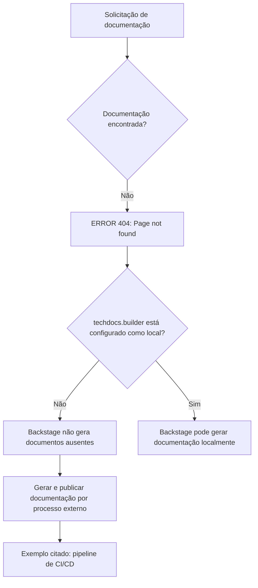

# Página de Erro 404 do Backstage TechDocs — Documentação Não Encontrada

## 1. Metadados do Documento
- **Arquivo de Origem:** `Não identificado`
- **Tipo de Documento:** `Página de erro / diagnóstico do Backstage TechDocs`
- **Domínio / Sistema:** `Backstage TechDocs; Home Solutions; APIs; Documentation; Zeus`
- **Público-Alvo:** `Usuários da documentação e equipes responsáveis pela publicação de documentação técnica`
- **Data/Versão Identificada:** `Não identificada`

---

## 2. Resumo Executivo & Contexto de Negócio

O conteúdo extraído corresponde a uma página de erro `ERROR 404` do Backstage TechDocs. A página informa que a documentação técnica solicitada não foi encontrada.

A mensagem indica que `techdocs.builder` não está configurado como `local`. Nessa condição, a instância Backstage não gera documentos quando os artefatos de documentação não estão disponíveis.

O texto orienta que a documentação do projeto deve ser gerada e publicada por um processo externo, citando um pipeline de `CI/CD` como exemplo. Como alternativa, a configuração `techdocs.builder` pode ser alterada para `local`, permitindo a geração de documentação por essa instância do Backstage.

A navegação exibida inclui os contextos `Home`, `Solutions`, `APIs`, `Documentation` e `Zeus`. O documento não apresenta especificações de APIs, arquitetura de aplicação, contratos, ambientes, URLs técnicas, logs ou configurações adicionais.

---

## 3. Arquitetura, Componentes & Tecnologias Envolvidas

Os componentes e termos identificados são:

- **Backstage:** aplicação que exibe a página de erro.
- **TechDocs:** recurso de documentação mencionado pela mensagem de erro.
- **`techdocs.builder`:** configuração citada; o valor `local` é apresentado como alternativa para gerar documentação na própria instância.
- **Processo externo de publicação:** mecanismo necessário quando a geração local não está configurada.
- **CI/CD pipeline:** exemplo de processo externo que pode gerar e publicar os documentos.
- **Home Solutions / APIs / Documentation / Zeus:** elementos exibidos na navegação da página.



**Nota de Análise:** o conteúdo não detalha a configuração efetiva de `techdocs.builder`, o repositório de origem, os comandos de geração, a tecnologia de CI/CD, os artefatos publicados ou o fluxo técnico de publicação.

---

## 4. Regras de Negócio, Especificações Funcionais & Processos

1. A página informa erro `404` quando a documentação solicitada não é encontrada.
2. A instância Backstage não gera documentos ausentes quando `techdocs.builder` não está configurado como `local`.
3. Nessa situação, a documentação do projeto deve ser gerada e publicada por um processo externo.
4. O texto cita um pipeline de `CI/CD` como exemplo de processo externo de geração e publicação.
5. Como alternativa, a configuração `techdocs.builder` pode ser definida como `local` para que a instância Backstage gere a documentação.
6. A página disponibiliza ação de retorno (“Go back”) e orienta o usuário a contatar o suporte caso considere o erro um defeito.

---

## 5. Tabelas de Parâmetros, Ambientes e Estruturas de Dados

| Item / Parâmetro | Descrição / Função | Tipo / Valores / Formato | Ambiente / Observações |
| :--- | :--- | :--- | :--- |
| `ERROR 404` | Indica que a página de documentação não foi encontrada. | Código de erro exibido | Página Backstage TechDocs |
| `techdocs.builder` | Configuração que determina a geração de documentação pela instância Backstage. | Valor citado: `local` | O valor atual não é informado; o texto apenas afirma que não está definido como `local`. |
| `local` | Alternativa de configuração para permitir geração de documentos pela instância Backstage. | Valor de configuração | Não há sintaxe de arquivo, comando ou local de configuração informado. |
| Processo externo | Processo responsável por gerar e publicar a documentação do projeto. | Mecanismo operacional | Necessário conforme a mensagem quando os documentos não são encontrados e o builder não é local. |
| Pipeline de CI/CD | Exemplo de processo externo para geração e publicação de documentação. | Exemplo citado | Ferramenta, pipeline, repositório e etapas não detalhados. |
| Home | Item de navegação exibido. | Rótulo de navegação | Sem detalhamento adicional. |
| Solutions | Item de navegação exibido. | Rótulo de navegação | Sem detalhamento adicional. |
| APIs | Item de navegação exibido. | Rótulo de navegação | Não há especificação de APIs no conteúdo. |
| Documentation | Item de navegação exibido. | Rótulo de navegação | Sem detalhamento adicional. |
| Zeus | Item de navegação exibido. | Rótulo de navegação | O documento não define Zeus. |
| `CF` | Texto exibido no rodapé/navegação da página. | Sigla ou rótulo | Significado não identificado no conteúdo. |
| `EN` | Indicador exibido na página. | Rótulo | O conteúdo não detalha se representa idioma ou outra classificação. |

---

## 6. Bateria de Perguntas & Respostas para RAG (FAQ Sintético)

### P1: Qual erro é apresentado na página de documentação?
**R:** A página apresenta `ERROR 404: Page not found`, indicando que a documentação ou página solicitada não foi encontrada.

### P2: Por que o Backstage não gera a documentação ausente?
**R:** A mensagem informa que `techdocs.builder` não está configurado como `local`. Nessa condição, a instância Backstage não gera documentos quando eles não são encontrados.

### P3: O que deve ser feito quando `techdocs.builder` não está configurado como `local`?
**R:** A documentação do projeto deve ser gerada e publicada por algum processo externo. A mensagem cita um pipeline de `CI/CD` como exemplo desse processo.

### P4: Qual alternativa permite gerar a documentação pela própria instância Backstage?
**R:** A alternativa indicada é alterar `techdocs.builder` para `local`, permitindo que a instância Backstage gere a documentação.

### P5: O documento informa qual pipeline de CI/CD deve ser utilizado?
**R:** Não. O conteúdo cita apenas um processo de `CI/CD` como exemplo de processo externo, sem identificar ferramenta, pipeline, repositório, comandos ou etapas.

### P6: O documento contém detalhes de APIs ou contratos técnicos?
**R:** Não. Embora `APIs` apareça na navegação, o conteúdo extraído não fornece endpoints, métodos HTTP, contratos, autenticação, payloads ou especificações de API.

### P7: Quais áreas aparecem na navegação da página?
**R:** A navegação exibe `Home`, `Solutions`, `APIs`, `Documentation` e `Zeus`. Também aparecem os textos `EN` e `CF`, sem explicação adicional.

### P8: A página oferece alguma orientação para o usuário após o erro 404?
**R:** Sim. A página apresenta a opção “Go back” e orienta o usuário a contatar o suporte caso considere que o problema seja um defeito.

### P9: O conteúdo identifica a configuração atual de `techdocs.builder`?
**R:** Não. O texto apenas afirma que `techdocs.builder` não está definido como `local`; nenhum outro valor de configuração é informado.

### P10: A documentação ausente pode ser publicada sem configurar o builder como local?
**R:** Sim, de acordo com a mensagem, os documentos podem ser gerados e publicados por um processo externo, como um pipeline de `CI/CD`.

---

## 7. Glossário de Termos, Siglas & Conceitos-Chave

- **Backstage:** aplicação mencionada na mensagem de erro que exibe a página de documentação.
- **TechDocs:** recurso de documentação citado na configuração `techdocs.builder`.
- **`techdocs.builder`:** parâmetro de configuração mencionado para a geração de documentos pelo Backstage.
- **`local`:** valor de configuração citado como alternativa para geração de documentação na instância Backstage.
- **CI/CD:** termo citado como exemplo de processo externo para gerar e publicar documentação; a expansão da sigla não é fornecida no conteúdo.
- **ERROR 404:** erro apresentado para indicar que a página não foi encontrada.
- **Zeus:** item exibido na navegação; não definido no conteúdo.
- **CF:** texto/sigla exibido na página; não definido no conteúdo.
- **EN:** rótulo exibido na página; não definido no conteúdo.

---

## 8. Notas Críticas, Riscos & Limitações

- O conteúdo extraído é uma página de erro, não uma especificação funcional ou técnica do sistema.
- Não há identificação do arquivo de origem, autor, data, versão, projeto, repositório ou ambiente.
- Não são informados o valor efetivo de `techdocs.builder`, o local do arquivo de configuração, nem os passos para sua alteração.
- O pipeline de `CI/CD` é apenas citado como exemplo; não há ferramenta, configuração, credenciais, gatilhos ou processo de publicação descritos.
- Não há conteúdo técnico das áreas `Home Solutions`, `APIs`, `Documentation` ou `Zeus`.
- **Nota de Análise:** o documento menciona `Zeus`, `CF` e `EN`, porém não fornece definição ou contexto adicional para esses termos.

---

## 9. Conteúdo Bruto Estruturado (Referência Fiel)

```text
--- [PÁGINA 1 DE 1] ---

ERROR 404: j: Page not found.
Note that techdocs.builder is not set to 'local' in
your config, which means this Backstage app will
not generate docs if they are not found. Make sure
the project's docs are generated and published by
some external process (e.g. CI/CD pipeline). Or
change techdocs.builder to 'local' to generate docs
from this Backstage instance.
Looks like someone
dropped the mic!
Go back... or please  if you
think this is a bug.
contact support
 / 
 CF
Home Solutions APIs Documentation Zeus
EN
```
