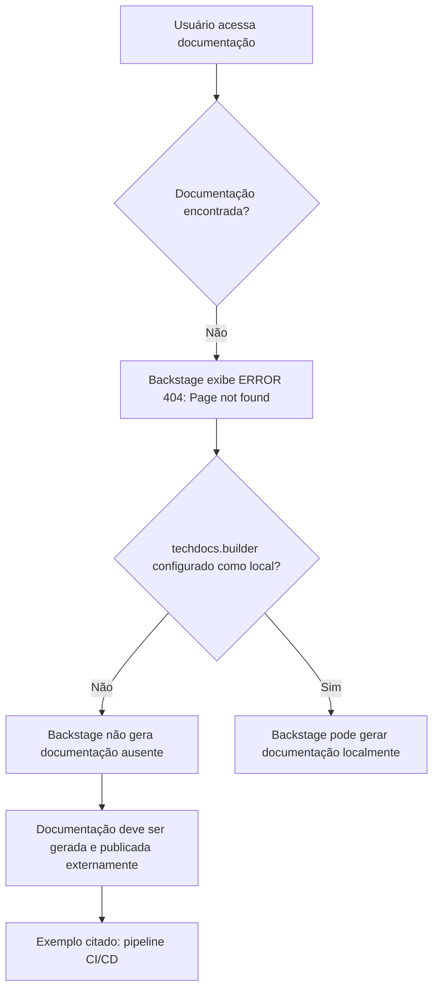

# Página de Erro 404 de Documentação Técnica — Backstage TechDocs

## 1. Metadados do Documento
- **Arquivo de Origem:** `Não identificado`
- **Tipo de Documento:** `Especificação Técnica`
- **Domínio / Sistema:** `Backstage TechDocs / APIs Documentation / Zeus`
- **Público-Alvo:** `Desenvolvedores, Arquitetos, Operação`
- **Data/Versão Identificada:** `Não identificada`

---

## 2. Resumo Executivo & Contexto de Negócio

O conteúdo fornecido registra uma página de erro **404 (Page not found)** em um ambiente de documentação. A página informa que a documentação técnica solicitada não foi localizada.

A mensagem associa a indisponibilidade ao parâmetro `techdocs.builder`, que não está configurado como `local`. Nessa configuração, a instância Backstage não gera documentação localmente quando ela não é encontrada.

O documento indica que a geração e publicação da documentação devem ser executadas por um processo externo, citado como exemplo de pipeline de **CI/CD**. Como alternativa, o parâmetro `techdocs.builder` pode ser alterado para `local`, permitindo a geração da documentação pela própria instância Backstage.

A navegação exibida contém referências a `Home`, `Solutions`, `APIs Documentation`, `Zeus`, ao idioma `EN` e ao identificador ou rótulo `CF`. O conteúdo não fornece detalhes sobre a aplicação Zeus, as APIs, o pipeline de publicação ou a configuração completa da plataforma.

---

## 3. Arquitetura, Componentes & Tecnologias Envolvidas

Os componentes e conceitos explicitamente citados são:

- **Backstage app:** instância que apresenta a página de erro e, conforme configuração, pode gerar documentação.
- **TechDocs:** mecanismo de documentação referido pela propriedade `techdocs.builder`.
- **`techdocs.builder`:** parâmetro de configuração que, no cenário apresentado, não está definido como `local`.
- **Processo externo:** mecanismo responsável por gerar e publicar documentação quando o builder não é local.
- **CI/CD pipeline:** exemplo de processo externo para geração e publicação dos documentos.
- **APIs Documentation:** seção de navegação relacionada à documentação.
- **Zeus:** elemento presente na navegação, sem detalhamento funcional.
- **Página 404:** resultado exibido quando a documentação não é encontrada.



> **Nota de Análise:** O conteúdo não descreve repositórios, fontes de documentação, comandos de publicação, formatos de arquivos, integrações, credenciais ou detalhes de implementação do pipeline de CI/CD.

---

## 4. Regras de Negócio, Especificações Funcionais & Processos

1. Quando uma documentação não é encontrada, a aplicação apresenta o erro `ERROR 404: Page not found`.
2. A mensagem indica que `techdocs.builder` não está configurado como `local`.
3. Quando `techdocs.builder` não é `local`, a aplicação Backstage não gera documentação ausente.
4. Nesse cenário, a documentação deve ser gerada e publicada por um processo externo.
5. O texto cita um pipeline de CI/CD como exemplo de processo externo de geração e publicação.
6. Como alternativa à publicação externa, o parâmetro `techdocs.builder` pode ser alterado para `local`.
7. A página fornece duas orientações de navegação ou suporte:
   - Retornar para a página anterior por meio de `Go back`.
   - Contatar o suporte caso o problema seja considerado um erro.

> **Nota de Análise:** O conteúdo não informa quem é responsável pela configuração de `techdocs.builder`, onde a configuração está armazenada, nem quais etapas de CI/CD devem gerar ou publicar a documentação.

---

## 5. Tabelas de Parâmetros, Ambientes e Estruturas de Dados

| Item / Parâmetro | Descrição / Função | Tipo / Valores / Formato | Ambiente / Observações |
| :--- | :--- | :--- | :--- |
| `ERROR 404` | Indica que a página de documentação não foi encontrada. | Mensagem de erro | Exibida na página analisada. |
| `techdocs.builder` | Parâmetro de configuração relacionado à geração de documentação pelo Backstage. | Valor citado: `local` | O texto informa que não está definido como `local`. |
| `local` | Valor de configuração que permite à instância Backstage gerar documentação localmente. | Valor de `techdocs.builder` | Alternativa indicada pela própria mensagem de erro. |
| Processo externo | Processo responsável por gerar e publicar documentação quando ela não é encontrada e o builder não é local. | Processo operacional | Não detalhado. |
| CI/CD pipeline | Exemplo de processo externo de geração e publicação de documentação. | Pipeline | Citado apenas como exemplo. |
| `Home` | Item de navegação. | Rótulo de interface | Sem detalhamento adicional. |
| `Solutions` | Item de navegação. | Rótulo de interface | Sem detalhamento adicional. |
| `APIs Documentation` | Item de navegação relacionado à documentação de APIs. | Rótulo de interface | Sem detalhes sobre APIs disponíveis. |
| `Zeus` | Elemento exibido na navegação. | Nome/rótulo | O documento não explica seu significado ou função. |
| `EN` | Indicador de idioma exibido na interface. | Rótulo de interface | Provavelmente relacionado ao idioma, sem confirmação adicional no conteúdo. |
| `CF` | Rótulo exibido no rodapé ou na navegação. | Rótulo de interface | Sem detalhamento adicional. |
| `Go back` | Ação de retorno oferecida ao usuário. | Ação de interface | Disponível na página de erro. |
| `contact support` | Orientação para acionar suporte se a situação for considerada um bug. | Ação de suporte | Não informa canal, equipe ou procedimento. |

---

## 6. Bateria de Perguntas & Respostas para RAG (FAQ Sintético)

### P1: Qual erro é apresentado quando a documentação não é encontrada?
**R:** A página apresenta a mensagem `ERROR 404: Page not found`, indicando que a documentação ou página solicitada não foi localizada.

### P2: Por que a instância Backstage não gera a documentação ausente?
**R:** A mensagem informa que `techdocs.builder` não está configurado como `local`. Nessa configuração, a instância Backstage não gera documentos quando eles não são encontrados.

### P3: O que deve ocorrer quando `techdocs.builder` não está definido como `local`?
**R:** A documentação deve ser gerada e publicada por algum processo externo. O texto cita um pipeline de CI/CD como exemplo desse processo externo.

### P4: Qual alternativa permite gerar documentação diretamente pela instância Backstage?
**R:** A alternativa indicada é alterar `techdocs.builder` para `local`, para que a documentação seja gerada pela própria instância Backstage.

### P5: O documento descreve como configurar `techdocs.builder`?
**R:** Não. O conteúdo apenas informa que o parâmetro não está definido como `local` e sugere alterá-lo para esse valor como alternativa à publicação externa.

### P6: O documento identifica qual pipeline de CI/CD publica a documentação?
**R:** Não. O pipeline de CI/CD é citado apenas como exemplo de processo externo que poderia gerar e publicar a documentação.

### P7: O que o usuário pode fazer ao encontrar essa página de erro?
**R:** O usuário pode retornar usando a opção `Go back` ou contatar o suporte se considerar que a ausência da documentação representa um erro.

### P8: Quais elementos de navegação aparecem na página?
**R:** A página exibe os elementos `Home`, `Solutions`, `APIs Documentation`, `Zeus`, `EN` e `CF`. O conteúdo não detalha a função de cada item além de sua presença na interface.

### P9: O que significa Zeus no conteúdo analisado?
**R:** `Zeus` aparece como um elemento de navegação, mas o texto não define seu significado, escopo funcional ou relação técnica com a documentação indisponível.

### P10: A página informa qual documento técnico está ausente?
**R:** Não. A página informa somente que uma página ou documentação não foi encontrada; ela não apresenta nome, URL, identificador ou versão do documento ausente.

---

## 7. Glossário de Termos, Siglas & Conceitos-Chave

- **404:** Código ou mensagem de erro exibida para indicar que uma página não foi encontrada.
- **APIs:** Termo exibido em `APIs Documentation`; o conteúdo não fornece expansão ou descrição adicional.
- **Backstage:** Aplicação mencionada como a instância que não gerará a documentação ausente caso `techdocs.builder` não seja `local`.
- **CI/CD:** Termo citado como exemplo de pipeline externo para gerar e publicar documentação; o conteúdo não apresenta expansão da sigla.
- **TechDocs:** Contexto de documentação relacionado à configuração `techdocs.builder`.
- **`techdocs.builder`:** Parâmetro de configuração citado na mensagem de erro.
- **`local`:** Valor de `techdocs.builder` que permitiria a geração de documentação pela instância Backstage.
- **Zeus:** Rótulo presente na navegação, sem definição adicional.

---

## 8. Notas Críticas, Riscos & Limitações

- A documentação solicitada está indisponível no momento da captura, resultando em erro 404.
- A geração local de documentação não está ativa, pois `techdocs.builder` não está definido como `local`.
- Existe dependência de um processo externo para geração e publicação da documentação.
- O processo externo é citado genericamente; não há identificação de pipeline, repositório, responsável, ambiente ou procedimento operacional.
- O conteúdo não informa a URL da página ausente, o nome do projeto, a origem da documentação ou a causa raiz da ausência.
- `Zeus`, `CF`, `Home`, `Solutions` e `APIs Documentation` aparecem na interface, mas não possuem explicação funcional adicional.
- **Nota de Análise:** Não é possível afirmar que `EN` representa idioma, embora o rótulo seja exibido dessa forma na interface; o documento não define explicitamente esse campo.

---

## 9. Conteúdo Bruto Estruturado (Referência Fiel)

```text
--- [PÁGINA 1 DE 1] ---

ERROR 404: j: Page not found.
Note that techdocs.builder is not set to 'local' in
your config, which means this Backstage app will
not generate docs if they are not found. Make sure
the project's docs are generated and published by
some external process (e.g. CI/CD pipeline). Or
change techdocs.builder to 'local' to generate docs
from this Backstage instance.
Looks like someone
dropped the mic!
Go back... or please  if you
think this is a bug.
contact support
 / 
 CF
Home Solutions APIs Documentation Zeus
EN
```
