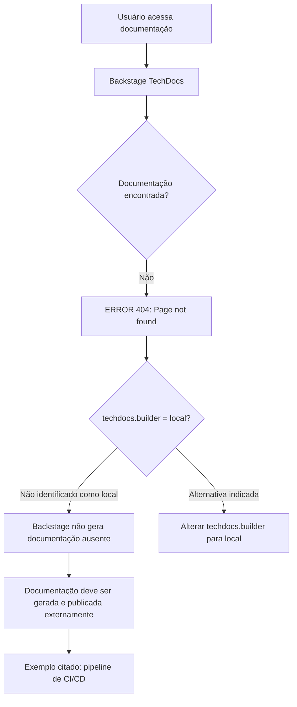

# Página de Erro 404 do Backstage TechDocs — Documentação Não Encontrada

## 1. Metadados do Documento
- **Arquivo de Origem:** `Não identificado`
- **Tipo de Documento:** `Página de erro / documentação indisponível`
- **Domínio / Sistema:** `Backstage TechDocs; CF Home Solutions APIs Documentation Zeus`
- **Público-Alvo:** `Desenvolvedores, Arquitetos, Operação`
- **Data/Versão Identificada:** `Não identificada`

---

## 2. Resumo Executivo & Contexto de Negócio

O conteúdo disponível consiste em uma página de erro HTTP 404 do Backstage TechDocs. A página informa que a documentação solicitada não foi encontrada.

A mensagem indica que a configuração `techdocs.builder` não está definida como `local`. Nessa condição, a instância do Backstage não gera documentação localmente quando os documentos não são encontrados.

O documento orienta que a documentação do projeto deve ser gerada e publicada por um processo externo, citando como exemplo um pipeline de CI/CD. Como alternativa, a configuração `techdocs.builder` pode ser alterada para `local`, permitindo que a instância do Backstage gere a documentação.

O contexto de navegação exibido inclui `CF Home Solutions APIs Documentation Zeus`, com idioma `EN`. Não há especificações funcionais, contratos de API, arquitetura de microsserviços ou detalhes de implementação do sistema Zeus no conteúdo fornecido.

---

## 3. Arquitetura, Componentes & Tecnologias Envolvidas

Componentes e conceitos identificados:

| Componente / Termo | Descrição sustentada pelo conteúdo |
| :--- | :--- |
| Backstage | Aplicação que exibe a página de erro e hospeda a funcionalidade TechDocs. |
| TechDocs | Recurso de documentação mencionado pela configuração `techdocs.builder`. |
| `techdocs.builder` | Configuração que, segundo a mensagem, não está definida como `local`. |
| CI/CD pipeline | Exemplo de processo externo que pode gerar e publicar a documentação. |
| CF Home Solutions APIs Documentation Zeus | Contexto de navegação exibido na página. |
| HTTP 404 | Erro exibido: `ERROR 404: Page not found.` |



> **Nota de Análise:** O conteúdo não identifica repositórios, pipelines específicos, ferramentas de CI/CD, comandos de publicação, URLs completas, métodos HTTP de APIs ou contratos de integração.

---

## 4. Regras de Negócio, Especificações Funcionais & Processos

1. Quando a documentação não é encontrada, a página apresenta o erro `ERROR 404: Page not found.`  
2. Quando `techdocs.builder` não está definido como `local`, a aplicação Backstage não gera documentos ausentes a partir dessa instância.  
3. A documentação do projeto deve ser gerada e publicada por um processo externo.  
4. Um pipeline de CI/CD é citado como exemplo de processo externo para geração e publicação da documentação.  
5. Como alternativa à publicação externa, a configuração `techdocs.builder` pode ser alterada para `local`, para gerar documentação a partir da instância do Backstage.  
6. A página oferece ações de retorno (`Go back...`) e de contato com suporte caso o problema seja considerado um defeito (`contact support`).  

> **Nota de Análise:** O documento não detalha permissões, responsáveis pela publicação, critérios de sucesso do pipeline, localização da configuração `techdocs.builder` ou procedimento operacional para corrigir o erro.

---

## 5. Tabelas de Parâmetros, Ambientes e Estruturas de Dados

| Item / Parâmetro | Descrição / Função | Tipo / Valores / Formato | Ambiente / Observações |
| :--- | :--- | :--- | :--- |
| Erro exibido | Indica que a página solicitada não foi encontrada. | `ERROR 404: Page not found.` | Página do Backstage TechDocs |
| `techdocs.builder` | Controla o modo mencionado para geração de documentação pelo Backstage. | Valor citado: `local` | A mensagem informa que não está definido como `local`. |
| Processo externo | Deve gerar e publicar a documentação quando não há geração local. | Exemplo: `CI/CD pipeline` | Não detalhado. |
| Contexto de navegação | Identificação textual exibida no rodapé/cabeçalho da página. | `CF Home Solutions APIs Documentation Zeus` | Não há detalhamento adicional. |
| Idioma | Idioma mostrado na interface. | `EN` | Não há configuração adicional descrita. |
| Ação de suporte | Orientação para contato em caso de possível defeito. | `contact support` | Canal de suporte não identificado. |

---

## 6. Bateria de Perguntas & Respostas para RAG (FAQ Sintético)

### P1: Qual erro é apresentado pela página de documentação?
**R:** A página apresenta o erro `ERROR 404: Page not found.`, indicando que a documentação ou página solicitada não foi encontrada.

### P2: Por que o Backstage não gera a documentação ausente?
**R:** A mensagem informa que `techdocs.builder` não está definido como `local`. Por esse motivo, a instância do Backstage não gera documentos quando eles não são encontrados.

### P3: Qual configuração é citada como alternativa para gerar documentação localmente?
**R:** A configuração citada é `techdocs.builder` com o valor `local`. A mensagem orienta alterar essa configuração para `local` caso a geração de documentação deva ocorrer a partir da instância do Backstage.

### P4: Como a documentação pode ser disponibilizada quando o builder não é local?
**R:** O conteúdo orienta que os documentos do projeto sejam gerados e publicados por algum processo externo.

### P5: Que exemplo de processo externo é mencionado para publicar a documentação?
**R:** A página cita um pipeline de CI/CD como exemplo de processo externo para geração e publicação da documentação.

### P6: Qual sistema ou contexto aparece na navegação da página?
**R:** O contexto exibido é `CF Home Solutions APIs Documentation Zeus`. O conteúdo não detalha a função, a arquitetura ou as APIs desse sistema.

### P7: O documento informa uma URL de documentação válida?
**R:** Não. O conteúdo mostra apenas que a página acessada retornou erro 404 e não fornece uma URL alternativa válida.

### P8: Existem detalhes sobre APIs, microsserviços ou contratos técnicos do Zeus?
**R:** Não. O conteúdo não descreve endpoints, métodos HTTP, payloads, microsserviços, contratos JSON ou dependências técnicas do sistema Zeus.

### P9: O que fazer se o erro 404 for considerado um defeito?
**R:** A página orienta o usuário a entrar em contato com o suporte por meio da opção textual `contact support`, mas não identifica o canal ou a equipe de suporte.

### P10: O Backstage está configurado para construir TechDocs localmente?
**R:** Não segundo a mensagem exibida. Ela afirma que `techdocs.builder` não está definido como `local`.

---

## 7. Glossário de Termos, Siglas & Conceitos-Chave

- **404:** Código de erro HTTP exibido para indicar que uma página não foi encontrada.
- **Backstage:** Aplicação mencionada na mensagem de erro e associada à instância que exibe a documentação.
- **TechDocs:** Funcionalidade de documentação associada ao Backstage e à configuração `techdocs.builder`.
- **`techdocs.builder`:** Parâmetro de configuração citado para determinar a geração de documentação; o valor `local` é explicitamente mencionado.
- **CI/CD:** Termo citado como exemplo de pipeline externo capaz de gerar e publicar documentação. A expansão da sigla não é fornecida no conteúdo.
- **Zeus:** Nome presente no contexto de navegação `CF Home Solutions APIs Documentation Zeus`; não há definição adicional.

---

## 8. Notas Críticas, Riscos & Limitações

- A documentação originalmente pretendida não está disponível, pois a página retornou erro HTTP 404.
- A instância do Backstage não gera a documentação ausente enquanto `techdocs.builder` não estiver configurado como `local`.
- A disponibilidade da documentação depende de um processo externo de geração e publicação, possivelmente um pipeline de CI/CD.
- Não há detalhes sobre o projeto, repositório, pipeline, responsável operacional, configuração de ambiente ou endereço correto da documentação.
- O conteúdo não permite inferir tecnologias, versões, URLs, APIs ou componentes internos do sistema Zeus.

---

## 9. Conteúdo Bruto Estruturado (Referência Fiel)

```text
--- [PÁGINA 1 DE 1] ---

ERROR 404: j: Page not found.
Note that techdocs.builder is not set to 'local' in
your config, which means this Backstage app will
not generate docs if they are not found. Make sure
the project's docs are generated and published by
some external process (e.g. CI/CD pipeline). Or
change techdocs.builder to 'local' to generate docs
from this Backstage instance.
Looks like someone
dropped the mic!
Go back... or please  if you
think this is a bug.
contact support
 / 
 CF
Home Solutions APIs Documentation Zeus
EN
```
