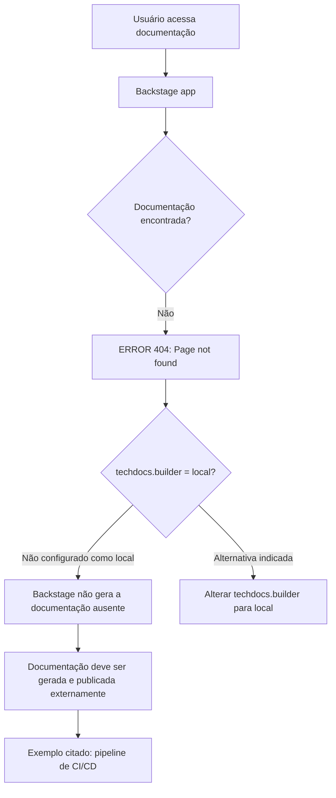

# Página de Erro 404 do Portal de Documentação TechDocs

## 1. Metadados do Documento
- **Arquivo de Origem:** Não identificado; conteúdo bruto fornecido pelo solicitante
- **Tipo de Documento:** Procedimento / Página de erro operacional
- **Domínio / Sistema:** Portal de documentação; Backstage; TechDocs; Zeus
- **Público-Alvo:** Desenvolvedores, Arquitetos e Operação
- **Data/Versão Identificada:** Não identificada

---

## 2. Resumo Executivo & Contexto de Negócio

O conteúdo registra uma página de erro `ERROR 404` para uma documentação não encontrada no portal. A página informa que `techdocs.builder` não está configurado como `local`, impedindo que a instância Backstage gere a documentação ausente localmente.

A orientação operacional apresentada é garantir que a documentação do projeto seja gerada e publicada por um processo externo, como um pipeline de CI/CD. Como alternativa, a página indica alterar a configuração de `techdocs.builder` para `local`, permitindo a geração da documentação pela instância Backstage.

O contexto de navegação disponível identifica o portal com itens como `Home`, `Solutions`, `APIs`, `Documentation`, `Zeus`, idioma `EN` e a marcação `CF`. O conteúdo não detalha a causa específica da ausência da página, nem identifica qual projeto, URL, repositório, pipeline ou configuração originou o erro.

> **Nota de Análise:** O texto menciona Backstage, TechDocs e CI/CD, mas não informa versões, arquivos de configuração, comandos de publicação, responsáveis operacionais ou contratos de integração.

---

## 3. Arquitetura, Componentes & Tecnologias Envolvidas

| Componente / Termo | Papel descrito no conteúdo |
| :--- | :--- |
| Backstage app | Instância que apresenta a página de erro e pode gerar documentação quando configurada para isso. |
| TechDocs | Mecanismo de documentação referido pela configuração `techdocs.builder`. |
| `techdocs.builder` | Configuração cujo valor não está definido como `local`, segundo a mensagem de erro. |
| Processo externo | Processo responsável por gerar e publicar documentação quando a instância Backstage não a gera localmente. |
| CI/CD pipeline | Exemplo de processo externo citado para geração e publicação de documentação. |
| Portal de documentação | Interface com navegação por `Home`, `Solutions`, `APIs`, `Documentation` e `Zeus`. |



> **Nota de Análise:** O diagrama representa exclusivamente o comportamento e as alternativas explicitamente descritos pela página. Não há detalhes sobre armazenamento, repositórios, infraestrutura, serviços de CI/CD ou publicação.

---

## 4. Regras de Negócio, Especificações Funcionais & Processos

1. A página exibe `ERROR 404: Page not found` quando a documentação solicitada não é localizada.
2. Quando `techdocs.builder` não está definido como `local`, a aplicação Backstage não gera documentos que não sejam encontrados.
3. A documentação do projeto deve ser gerada e publicada por algum processo externo quando a geração local não estiver habilitada.
4. Um pipeline de CI/CD é citado como exemplo de processo externo para geração e publicação da documentação.
5. A alternativa indicada é alterar `techdocs.builder` para `local`, permitindo gerar documentação a partir da instância Backstage.
6. A página oferece opções textuais de retorno e contato com suporte caso o usuário considere a situação um defeito.

---

## 5. Tabelas de Parâmetros, Ambientes e Estruturas de Dados

| Item / Parâmetro | Descrição / Função | Tipo / Valores / Formato | Ambiente / Observações |
| :--- | :--- | :--- | :--- |
| Código de erro | Indica que a página não foi encontrada. | `ERROR 404` | Apresentado na página. |
| `techdocs.builder` | Configuração que determina a geração de documentação pela instância Backstage. | Valor mencionado: `local` | A página afirma que não está configurado como `local`. |
| Geração externa | Responsabilidade por gerar e publicar documentos ausentes. | Processo externo | Pipeline de CI/CD é citado como exemplo. |
| Geração local | Alternativa para produzir documentação na própria instância Backstage. | Configuração `techdocs.builder = local` | A página sugere essa alteração. |
| Navegação | Itens disponíveis na interface do portal. | `Home / Solutions / APIs / Documentation / Zeus / EN / CF` | Não há detalhamento funcional dos itens. |
| Contato com suporte | Canal textual sugerido quando o usuário acredita que há um defeito. | `contact support` | Não há URL, e-mail ou procedimento informado. |

---

## 6. Bateria de Perguntas & Respostas para RAG (FAQ Sintético)

### P1: O que significa o erro `ERROR 404: Page not found` exibido pelo portal?
**R:** O erro indica que a página de documentação solicitada não foi encontrada. O conteúdo não informa qual documento, projeto ou endereço específico está ausente.

### P2: Por que a instância Backstage não gera a documentação ausente?
**R:** A página informa que `techdocs.builder` não está definido como `local`. Nessa condição, a instância Backstage não gera documentos que não sejam encontrados.

### P3: Qual configuração é mencionada para habilitar a geração local de documentação?
**R:** A configuração mencionada é `techdocs.builder`. A página sugere alterá-la para `local` para gerar documentação a partir da instância Backstage.

### P4: Qual alternativa existe quando `techdocs.builder` não está configurado como `local`?
**R:** A documentação do projeto deve ser gerada e publicada por um processo externo. A página cita um pipeline de CI/CD como exemplo desse processo.

### P5: A página informa qual pipeline de CI/CD deve publicar a documentação?
**R:** Não. O conteúdo apenas cita “CI/CD pipeline” como exemplo de processo externo, sem informar ferramenta, repositório, job, comando ou configuração.

### P6: Quais tecnologias ou plataformas são explicitamente mencionadas?
**R:** O conteúdo menciona Backstage, TechDocs, a configuração `techdocs.builder` e um pipeline de CI/CD como exemplo de processo externo.

### P7: Quais opções de navegação aparecem no portal de documentação?
**R:** A interface mostra `Home`, `Solutions`, `APIs`, `Documentation`, `Zeus`, `EN` e `CF`. O conteúdo não explica a finalidade detalhada de cada item.

### P8: O que fazer se o usuário acreditar que o erro 404 é um defeito?
**R:** A página sugere voltar ou entrar em contato com o suporte. Não são informados canais, URLs, contatos ou processo de escalonamento.

### P9: O documento identifica a causa raiz da documentação não encontrada?
**R:** Não. O conteúdo informa a condição de configuração relacionada à geração local, mas não identifica a causa concreta da ausência da página solicitada.

### P10: A documentação pode ser gerada pela própria instância Backstage?
**R:** Sim, segundo a alternativa apresentada na página, caso `techdocs.builder` seja alterado para `local`.

---

## 7. Glossário de Termos, Siglas & Conceitos-Chave

- **404:** Código de erro apresentado para indicar que uma página não foi encontrada.
- **Backstage:** Aplicação mencionada como a instância que não gerará documentos ausentes quando `techdocs.builder` não estiver definido como `local`.
- **TechDocs:** Componente ou contexto de documentação referido pela configuração `techdocs.builder`.
- **`techdocs.builder`:** Parâmetro de configuração mencionado na página.
- **`local`:** Valor de configuração sugerido para permitir geração de documentação pela instância Backstage.
- **CI/CD:** Termo citado como exemplo de processo externo para gerar e publicar documentação. O texto não expande a sigla.
- **Zeus:** Item exibido na navegação do portal; não possui explicação adicional no conteúdo.
- **CF:** Marcação exibida na navegação; não possui definição no conteúdo.

---

## 8. Notas Críticas, Riscos & Limitações

- A página não identifica a documentação, projeto ou URL que resultou no erro 404.
- Não há instruções concretas para localizar, editar ou validar a configuração `techdocs.builder`.
- Não são fornecidos arquivos de configuração, comandos, pipelines, repositórios ou responsáveis pela publicação.
- Alterar `techdocs.builder` para `local` é apresentado como alternativa, mas impactos técnicos, requisitos e procedimento de alteração não são detalhados.
- O processo externo de geração e publicação é mencionado de forma genérica; o pipeline de CI/CD é apenas um exemplo.
- Os itens `Zeus` e `CF` são apresentados sem definição funcional ou técnica.

---

## 9. Conteúdo Bruto Estruturado (Referência Fiel)

```text
--- [PÁGINA 1 DE 1] ---

ERROR 404: j: Page not found.
Note that techdocs.builder is not set to 'local' in
your config, which means this Backstage app will
not generate docs if they are not found. Make sure
the project's docs are generated and published by
some external process (e.g. CI/CD pipeline). Or
change techdocs.builder to 'local' to generate docs
from this Backstage instance.
Looks like someone
dropped the mic!
Go back... or please  if you
think this is a bug.
contact support
 / 
 CF
Home Solutions APIs Documentation Zeus
EN
```
