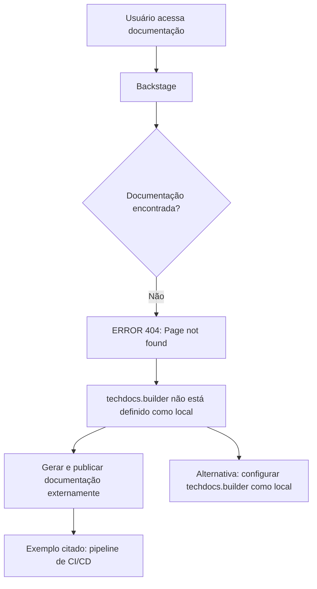

# Página de Erro 404 do Backstage TechDocs — Documentação Não Localizada

## 1. Metadados do Documento
- **Arquivo de Origem:** Não informado
- **Tipo de Documento:** Procedimento / Página de erro de documentação
- **Domínio / Sistema:** Backstage TechDocs; navegação “Home / Solutions / APIs / Documentation / Zeus”
- **Público-Alvo:** Desenvolvedores, Arquitetos, Operação
- **Data/Versão Identificada:** Não identificada

---

## 2. Resumo Executivo & Contexto de Negócio

O conteúdo fornecido não contém uma especificação técnica, manual funcional ou apresentação de arquitetura. O documento consiste em uma página de erro `ERROR 404: Page not found.` apresentada por uma instância Backstage.

A mensagem informa que `techdocs.builder` não está configurado como `local`. Nessa condição, a aplicação Backstage não gera documentação quando os documentos não são encontrados; a geração e publicação devem ocorrer por um processo externo, como um pipeline de CI/CD.

A página sugere duas alternativas: garantir que a documentação do projeto seja gerada e publicada externamente ou alterar a configuração `techdocs.builder` para `local`, permitindo a geração pelo próprio Backstage.

Não há detalhes sobre o projeto, APIs, componente Zeus, pipeline existente, repositório, tecnologia de publicação, responsáveis ou procedimentos operacionais. Portanto, não é possível inferir configurações adicionais além das explicitamente exibidas.

---

## 3. Arquitetura, Componentes & Tecnologias Envolvidas

Componentes e termos explicitamente citados:

| Componente / Termo | Descrição baseada no conteúdo |
| :--- | :--- |
| Backstage | Aplicação que exibe a página de erro e hospeda a documentação. |
| TechDocs | Mecanismo de documentação mencionado pela configuração `techdocs.builder`. |
| `techdocs.builder` | Configuração que não está definida como `local`. |
| CI/CD pipeline | Exemplo de processo externo que pode gerar e publicar a documentação. |
| Zeus | Item presente na navegação da página; o conteúdo não explica sua função. |
| Documentation | Item de navegação associado à página não encontrada. |



> **Nota de Análise:** O conteúdo não detalha a arquitetura do Backstage, o mecanismo de armazenamento de documentação, os pipelines de CI/CD, nem a configuração efetiva do parâmetro `techdocs.builder`.

---

## 4. Regras de Negócio, Especificações Funcionais & Processos

1. Quando uma página de documentação não é encontrada, a aplicação exibe o erro `ERROR 404: Page not found.`.
2. Quando `techdocs.builder` não está configurado como `local`, a instância Backstage não gera documentos ausentes.
3. A documentação deve ser gerada e publicada por um processo externo quando o builder não é local.
4. Um pipeline de CI/CD é citado como exemplo de processo externo para geração e publicação documental.
5. Como alternativa, `techdocs.builder` pode ser alterado para `local`, habilitando a geração de documentação pela instância Backstage.
6. A página orienta o usuário a retornar à navegação anterior ou contatar o suporte caso o erro seja considerado um defeito.

---

## 5. Tabelas de Parâmetros, Ambientes e Estruturas de Dados

| Item / Parâmetro | Descrição / Função | Tipo / Valores / Formato | Ambiente / Observações |
| :--- | :--- | :--- | :--- |
| `techdocs.builder` | Define o modo de geração da documentação TechDocs. | Valor citado: `local` | O valor atual não está configurado como `local`, segundo a página. |
| `ERROR 404` | Indica que a página requisitada não foi encontrada. | Código de erro HTTP exibido como texto | Página Backstage / TechDocs. |
| Processo externo | Responsável por gerar e publicar documentação quando ela não é encontrada pelo Backstage. | Exemplo: pipeline de CI/CD | Não há detalhes de implementação. |
| `Zeus` | Item de navegação exibido. | Nome / rótulo | Não detalhado no conteúdo. |
| `CF` | Elemento exibido no rodapé ou navegação. | Sigla não definida | Não detalhado no conteúdo. |
| Idioma | Idioma exibido na interface. | `EN` | A mensagem de erro está em inglês. |

---

## 6. Bateria de Perguntas & Respostas para RAG (FAQ Sintético)

### P1: Qual erro é exibido quando a página de documentação não é encontrada?
**R:** A página exibe `ERROR 404: Page not found.`, indicando que o conteúdo de documentação solicitado não foi localizado.

### P2: Qual configuração TechDocs é mencionada na mensagem de erro?
**R:** A configuração mencionada é `techdocs.builder`. A mensagem informa que ela não está definida como `local`.

### P3: O Backstage gera a documentação ausente automaticamente nessa configuração?
**R:** Não. A mensagem afirma que a aplicação Backstage não gera documentação se ela não for encontrada quando `techdocs.builder` não está configurado como `local`.

### P4: Como a documentação deve ser disponibilizada quando `techdocs.builder` não é local?
**R:** A documentação deve ser gerada e publicada por algum processo externo. A própria mensagem cita um pipeline de CI/CD como exemplo.

### P5: Qual alternativa é indicada para gerar a documentação diretamente pela instância Backstage?
**R:** A alternativa indicada é alterar a configuração `techdocs.builder` para `local`, permitindo que a instância Backstage gere a documentação.

### P6: O documento especifica qual pipeline de CI/CD deve ser usado?
**R:** Não. O conteúdo menciona “CI/CD pipeline” apenas como exemplo de processo externo e não informa ferramenta, repositório, etapas ou configuração de pipeline.

### P7: O que deve ser feito caso o usuário considere o erro um defeito?
**R:** A página orienta o usuário a entrar em contato com o suporte caso considere que o erro seja um bug.

### P8: Quais itens de navegação são visíveis na página?
**R:** A página exibe os itens `Home`, `Solutions`, `APIs`, `Documentation` e `Zeus`, além de `CF` e da indicação de idioma `EN`.

### P9: O conteúdo descreve APIs, contratos ou endpoints do item Zeus?
**R:** Não. Embora `Zeus` apareça na navegação, não há descrição de APIs, métodos HTTP, contratos JSON, URLs ou funcionalidades associadas.

---

## 7. Glossário de Termos, Siglas & Conceitos-Chave

- **404:** Código de erro exibido para indicar que a página solicitada não foi encontrada.
- **Backstage:** Aplicação mencionada como responsável por exibir a página e, potencialmente, gerar documentação TechDocs.
- **TechDocs:** Recurso de documentação associado à configuração `techdocs.builder`.
- **`techdocs.builder`:** Parâmetro de configuração que controla o modo de geração da documentação TechDocs.
- **`local`:** Valor de configuração citado como alternativa para permitir a geração documental pela instância Backstage.
- **CI/CD:** Processo citado como exemplo de mecanismo externo para gerar e publicar documentação.
- **Zeus:** Item de navegação; não possui definição funcional no conteúdo.
- **CF:** Sigla exibida na página, sem significado definido no conteúdo.

---

## 8. Notas Críticas, Riscos & Limitações

- A documentação requisitada está indisponível, impedindo a consulta ao conteúdo técnico ou funcional esperado.
- Não há identificação do arquivo, projeto, versão, responsável, repositório ou ambiente afetado.
- Não é possível confirmar se a ausência decorre de falha de publicação, inexistência da documentação, rota incorreta ou erro de configuração.
- O documento não informa o valor atual efetivo de `techdocs.builder`; apenas afirma que ele não está definido como `local`.
- Não há detalhamento do pipeline externo de CI/CD, incluindo ferramentas, gatilhos, artefatos ou destino de publicação.
- **Nota de Análise:** O termo `Zeus` é exibido somente na navegação e não recebe detalhamento adicional.

---

## 9. Conteúdo Bruto Estruturado (Referência Fiel)

```text
--- [PÁGINA 1 DE 1] ---

ERROR 404: j: Page not found.
Note that techdocs.builder is not set to 'local' in
your config, which means this Backstage app will
not generate docs if they are not found. Make sure
the project's docs are generated and published by
some external process (e.g. CI/CD pipeline). Or
change techdocs.builder to 'local' to generate docs
from this Backstage instance.
Looks like someone
dropped the mic!
Go back... or please  if you
think this is a bug.
contact support
 / 
 CF
Home Solutions APIs Documentation Zeus
EN
```
