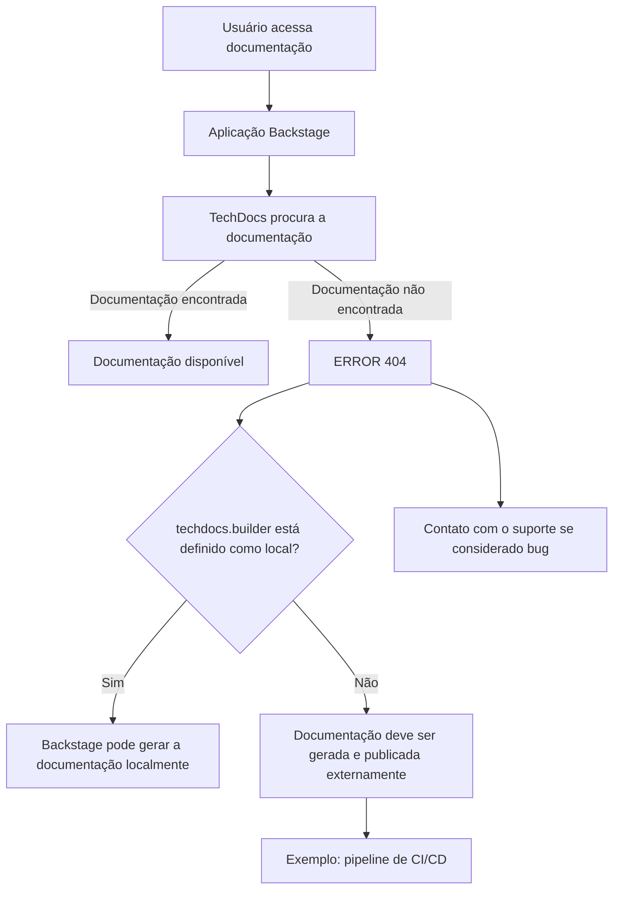

# Página de Erro 404 do TechDocs no Backstage — Documentação Não Encontrada

## 1. Metadados do Documento
- **Arquivo de Origem:** `Não informado`
- **Tipo de Documento:** `Procedimento`
- **Domínio / Sistema:** `Backstage / TechDocs`
- **Público-Alvo:** `Desenvolvedores, Arquitetos, Operação`
- **Data/Versão Identificada:** `Não identificada`

---

## 2. Resumo Executivo & Contexto de Negócio

O conteúdo apresenta uma página de erro `ERROR 404` do TechDocs em uma aplicação Backstage. A mensagem informa que a documentação solicitada não foi encontrada pela instância do Backstage.

A causa contextual indicada é que a configuração `techdocs.builder` não está definida como `local`. Nessa configuração, a aplicação Backstage não gera documentos localmente quando eles não são encontrados.

O conteúdo orienta que a documentação do projeto deve ser gerada e publicada por um processo externo, como um pipeline de `CI/CD`. Como alternativa, a configuração `techdocs.builder` pode ser alterada para `local`, permitindo que a instância Backstage gere a documentação.

A página também disponibiliza navegação para retorno e orientação para entrar em contato com o suporte caso o problema seja considerado um defeito.

---

## 3. Arquitetura, Componentes & Tecnologias Envolvidas

Os componentes explicitamente citados são:

| Componente / Tecnologia | Papel identificado no conteúdo |
| :--- | :--- |
| Backstage | Aplicação que exibe a página de erro e hospeda a documentação TechDocs. |
| TechDocs | Mecanismo de documentação citado na mensagem de erro. |
| `techdocs.builder` | Configuração que determina se a geração de documentação ocorre localmente. |
| Processo externo | Mecanismo requerido para gerar e publicar a documentação quando `techdocs.builder` não está definido como `local`. |
| CI/CD pipeline | Exemplo de processo externo para geração e publicação de documentação. |
| Support | Canal indicado para contato quando o erro for considerado um bug. |
| Zeus | Item presente na navegação da página. O conteúdo não detalha sua função. |
| CF | Item presente na página. O conteúdo não detalha seu significado ou função. |



> **Nota de Análise:** o conteúdo não informa onde a configuração `techdocs.builder` é armazenada, nem detalha comandos, arquivos de configuração, repositórios, pipelines ou mecanismos de publicação.

---

## 4. Regras de Negócio, Especificações Funcionais & Processos

1. Quando a documentação solicitada não é encontrada, a aplicação apresenta a condição `ERROR 404: Page not found`.
2. Se `techdocs.builder` não estiver definido como `local`, a instância Backstage não gera documentos ausentes.
3. Quando a geração local não está habilitada, a documentação do projeto deve ser gerada e publicada por um processo externo.
4. Um pipeline de `CI/CD` é apresentado como exemplo de processo externo de geração e publicação.
5. A configuração `techdocs.builder` pode ser alterada para `local` para permitir geração de documentação pela instância Backstage.
6. A página oferece retorno de navegação e contato com suporte para casos considerados defeito.

---

## 5. Tabelas de Parâmetros, Ambientes e Estruturas de Dados

| Item / Parâmetro | Descrição / Função | Tipo / Valores / Formato | Ambiente / Observações |
| :--- | :--- | :--- | :--- |
| `ERROR 404` | Indica que a página de documentação não foi encontrada. | Código de erro exibido na página. | Associado à ausência de documentação no TechDocs. |
| `techdocs.builder` | Define o comportamento de geração da documentação no Backstage. | Valor citado: `local`. | Quando não é `local`, a aplicação não gera documentos ausentes. |
| `local` | Valor de configuração que permite geração de documentação pela instância Backstage. | Valor de `techdocs.builder`. | O conteúdo não detalha como configurar esse valor. |
| Processo externo | Deve gerar e publicar documentação quando a geração local não está habilitada. | Processo operacional ou automatizado. | `CI/CD pipeline` é citado como exemplo. |
| CI/CD pipeline | Exemplo de processo externo para geração e publicação de documentação. | Pipeline de integração e entrega contínuas. | Não há plataforma, ferramenta ou etapas especificadas. |
| Support | Canal indicado para reporte caso a situação seja considerada um bug. | Serviço de suporte. | Nenhum contato ou procedimento é informado. |
| `Zeus` | Item apresentado na navegação. | Nome próprio não detalhado. | Função não identificada. |
| `CF` | Item apresentado na página. | Sigla ou rótulo não detalhado. | Significado não identificado. |
| Idioma | Idioma selecionado na interface. | `EN`. | A página exibida está em inglês. |

---

## 6. Bateria de Perguntas & Respostas para RAG (FAQ Sintético)

### P1: O que significa o erro `ERROR 404: Page not found` exibido no TechDocs?
**R:** O erro indica que a página de documentação solicitada não foi encontrada pela aplicação Backstage que hospeda o TechDocs.

### P2: Por que o Backstage não gera a documentação ausente automaticamente?
**R:** A mensagem informa que `techdocs.builder` não está definido como `local`. Nessa condição, a instância Backstage não gera documentos quando eles não são encontrados.

### P3: O que deve ser feito quando `techdocs.builder` não está configurado como `local`?
**R:** A documentação do projeto deve ser gerada e publicada por algum processo externo. O conteúdo cita um pipeline de `CI/CD` como exemplo desse processo.

### P4: Qual configuração permite que o Backstage gere documentação localmente?
**R:** O valor `local` para a configuração `techdocs.builder` é indicado como a alternativa que permite a geração de documentação pela instância Backstage.

### P5: O documento especifica como alterar a configuração `techdocs.builder`?
**R:** Não. O conteúdo apenas informa que `techdocs.builder` pode ser alterado para `local`; não apresenta arquivo de configuração, comando, localização ou procedimento de alteração.

### P6: O documento identifica qual pipeline de CI/CD deve publicar a documentação?
**R:** Não. O conteúdo cita “CI/CD pipeline” apenas como exemplo de processo externo que pode gerar e publicar os documentos.

### P7: O que fazer se a ausência da documentação for considerada um bug?
**R:** A página orienta o usuário a entrar em contato com o suporte, mas não fornece canal, equipe responsável ou dados de contato.

### P8: Quais sistemas são explicitamente mencionados na página de erro?
**R:** A página menciona Backstage, TechDocs, a configuração `techdocs.builder`, um processo externo de publicação, um possível pipeline de `CI/CD`, suporte, Zeus e CF.

### P9: O que é Zeus no contexto apresentado?
**R:** Zeus aparece como um item de navegação na página. O conteúdo não descreve sua finalidade, responsabilidades ou relação técnica com TechDocs.

### P10: Há detalhes sobre a documentação que não foi encontrada?
**R:** Não. A página confirma apenas que uma página de documentação não foi encontrada; não identifica o projeto, componente, repositório, caminho ou arquivo correspondente.

---

## 7. Glossário de Termos, Siglas & Conceitos-Chave

- **Backstage:** aplicação mencionada como a instância que exibe a página de erro e pode gerar documentação quando configurada apropriadamente.
- **TechDocs:** componente ou mecanismo de documentação citado na mensagem de erro.
- **`techdocs.builder`:** configuração mencionada para controlar a geração de documentação pela instância Backstage.
- **`local`:** valor citado para `techdocs.builder`, associado à geração local de documentação.
- **ERROR 404:** erro exibido para indicar que a página solicitada não foi encontrada.
- **CI/CD:** sigla exibida no conteúdo como exemplo de pipeline para geração e publicação externa de documentos. O texto não expande a sigla.
- **CF:** rótulo ou sigla presente na página; significado não detalhado.
- **Zeus:** nome presente na navegação; função não detalhada.

---

## 8. Notas Críticas, Riscos & Limitações

- A configuração `techdocs.builder` não está definida como `local`, impedindo a geração local de documentos não encontrados.
- A disponibilidade da documentação depende de geração e publicação por processo externo quando a geração local não está habilitada.
- O conteúdo não identifica o projeto, a documentação, o repositório ou o artefato específico que está ausente.
- Não há detalhes sobre a implementação do pipeline de `CI/CD`, responsáveis, frequência de publicação ou critérios de falha.
- Não são fornecidos procedimentos técnicos para alterar `techdocs.builder`.
- Não há informações de contato para o suporte.
- Os itens `CF` e `Zeus` não possuem detalhamento funcional ou arquitetural.

---

## 9. Conteúdo Bruto Estruturado (Referência Fiel)

```text
--- [PÁGINA 1 DE 1] ---

ERROR 404: j: Page not found.
Note that techdocs.builder is not set to 'local' in
your config, which means this Backstage app will
not generate docs if they are not found. Make sure
the project's docs are generated and published by
some external process (e.g. CI/CD pipeline). Or
change techdocs.builder to 'local' to generate docs
from this Backstage instance.
Looks like someone
dropped the mic!
Go back... or please  if you
think this is a bug.
contact support
 / 
 CF
Home Solutions APIs Documentation Zeus
EN
```
