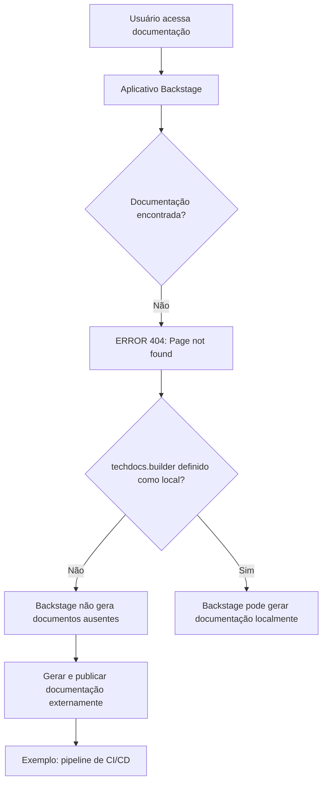

# Página de Erro 404 do TechDocs/Backstage — Documentação Não Encontrada

## 1. Metadados do Documento
- **Arquivo de Origem:** Não identificado no conteúdo fornecido
- **Tipo de Documento:** Procedimento / Página de erro de documentação
- **Domínio / Sistema:** Backstage TechDocs; portal de documentação Zeus
- **Público-Alvo:** Desenvolvedores, Arquitetos, Operação
- **Data/Versão Identificada:** Não identificada

---

## 2. Resumo Executivo & Contexto de Negócio

O conteúdo fornecido registra uma página de erro `ERROR 404`, indicando que a documentação solicitada não foi encontrada pelo aplicativo Backstage. A página identifica o problema como uma ausência de conteúdo publicado ou disponível para consulta.

A mensagem informa que a configuração `techdocs.builder` não está definida como `local`. Nessa condição, a instância Backstage não gera documentação quando os documentos não são localizados. A geração e a publicação precisam ser realizadas por um processo externo.

Como exemplo de processo externo, a página cita um pipeline de CI/CD. Alternativamente, o texto informa que `techdocs.builder` pode ser alterado para `local`, permitindo que a instância Backstage gere os documentos localmente.

A navegação exibida associa a ocorrência ao portal com os itens `Home`, `Solutions`, `APIs`, `Documentation` e `Zeus`, além do indicador de idioma `EN`. O conteúdo não especifica qual projeto, endpoint, repositório ou documento provocou o erro 404.

---

## 3. Arquitetura, Componentes & Tecnologias Envolvidas

Os componentes e conceitos explicitamente citados são:

| Componente / Tecnologia | Papel identificado no conteúdo |
| :--- | :--- |
| Backstage | Aplicativo que exibe a página de erro e hospeda a experiência de documentação. |
| TechDocs | Mecanismo de documentação mencionado pela configuração `techdocs.builder`. |
| `techdocs.builder` | Configuração que determina, conforme a mensagem, se o Backstage gera documentação localmente. |
| Processo externo | Processo necessário para gerar e publicar documentação quando `techdocs.builder` não está configurado como `local`. |
| Pipeline de CI/CD | Exemplo de processo externo para geração e publicação de documentação. |
| Zeus | Elemento exibido na navegação do portal. O conteúdo não detalha sua função técnica. |
| `CF` | Elemento exibido na interface. O conteúdo não define o significado da sigla. |



> **Nota de Análise:** O conteúdo não identifica a configuração efetiva de `techdocs.builder`, o arquivo de configuração correspondente, o projeto afetado, nem os comandos ou estágios necessários para publicação por CI/CD.

---

## 4. Regras de Negócio, Especificações Funcionais & Processos

1. Quando a documentação não é encontrada, o Backstage apresenta o erro `ERROR 404: Page not found`.
2. Quando `techdocs.builder` não está configurado como `local`, a instância Backstage não gera documentação caso ela não seja encontrada.
3. Nessa configuração, os documentos precisam ser gerados e publicados por um processo externo.
4. Um pipeline de CI/CD é citado como exemplo de processo externo de geração e publicação.
5. Como alternativa ao processo externo, a configuração `techdocs.builder` pode ser alterada para `local`, permitindo a geração de documentação pela instância Backstage.
6. A página apresenta opções de retorno e orientação para contato com suporte caso o usuário considere que o problema seja um defeito.

> **Nota de Análise:** Não há detalhamento sobre critérios de publicação, permissões, repositórios-fonte, formatos aceitos, periodicidade de geração, responsáveis operacionais ou fluxo de aprovação da documentação.

---

## 5. Tabelas de Parâmetros, Ambientes e Estruturas de Dados

| Item / Parâmetro | Descrição / Função | Tipo / Valores / Formato | Ambiente / Observações |
| :--- | :--- | :--- | :--- |
| `ERROR 404` | Indica que a página/documentação solicitada não foi encontrada. | Código de erro exibido na página. | Associado ao aplicativo Backstage. |
| `techdocs.builder` | Controla, conforme a mensagem, a geração local de documentação pelo Backstage. | Valor citado: `local`. | Quando não está definido como `local`, documentos ausentes não são gerados pela instância. |
| Processo externo | Gera e publica a documentação não encontrada pelo Backstage. | Processo operacional externo. | Necessário segundo a mensagem quando `techdocs.builder` não é `local`. |
| CI/CD pipeline | Exemplo de processo externo de geração e publicação documental. | Pipeline de integração contínua e entrega/implantação contínua. | Citado apenas como exemplo; não há ferramenta, URL ou pipeline identificado. |
| Backstage | Aplicativo que apresenta a página de documentação e o erro. | Aplicação. | Não há versão identificada. |
| TechDocs | Contexto funcional associado à configuração `techdocs.builder`. | Componente/recurso de documentação. | Não há detalhes de implementação. |
| Zeus | Item presente na navegação da página. | Nome exibido na interface. | Função não detalhada. |
| Idioma `EN` | Indicador de idioma exibido na interface. | Código de idioma. | O conteúdo da mensagem está em inglês. |
| `Home / Solutions / APIs / Documentation / Zeus` | Itens de navegação exibidos na página. | Caminho/menu de navegação. | Não há URLs ou destinos associados no texto. |
| `CF` | Texto exibido na interface. | Sigla ou rótulo. | Significado não identificado. |

---

## 6. Bateria de Perguntas & Respostas para RAG (FAQ Sintético)

### P1: O que significa o erro `ERROR 404: Page not found` exibido pelo Backstage?
**R:** O erro `ERROR 404: Page not found` indica que a página ou documentação solicitada não foi encontrada pelo aplicativo Backstage.

### P2: Por que o Backstage não gera a documentação ausente automaticamente?
**R:** A mensagem informa que `techdocs.builder` não está definido como `local`. Nessa condição, a instância Backstage não gera documentos quando eles não são encontrados.

### P3: O que deve ocorrer quando `techdocs.builder` não está configurado como `local`?
**R:** A documentação deve ser gerada e publicada por um processo externo, pois o Backstage não realizará a geração local de documentos ausentes nessa configuração.

### P4: Qual processo externo é citado como exemplo para gerar e publicar documentação?
**R:** O conteúdo cita um pipeline de CI/CD como exemplo de processo externo responsável por gerar e publicar a documentação.

### P5: Qual alternativa existe ao uso de um processo externo de CI/CD para documentação?
**R:** A alternativa indicada é alterar `techdocs.builder` para `local`, para que a própria instância Backstage gere os documentos localmente.

### P6: A página informa qual documentação específica está ausente?
**R:** Não. O conteúdo apresenta somente o erro 404 e orientações gerais sobre a configuração `techdocs.builder`; não identifica o projeto, a página, o repositório ou o documento ausente.

### P7: Quais elementos de navegação aparecem na página de erro?
**R:** A página exibe os itens `Home`, `Solutions`, `APIs`, `Documentation` e `Zeus`. Também aparecem os textos `EN` e `CF`.

### P8: O que o usuário pode fazer se considerar o erro uma falha do sistema?
**R:** A página orienta o usuário a voltar ou a entrar em contato com o suporte caso considere que o problema seja um bug.

### P9: O documento informa como configurar `techdocs.builder`?
**R:** Não. O conteúdo apenas informa que `techdocs.builder` pode ser alterado para `local`; não apresenta arquivo de configuração, sintaxe, comando ou procedimento de alteração.

### P10: A página informa qual ferramenta de CI/CD deve ser utilizada?
**R:** Não. Um pipeline de CI/CD é mencionado somente como exemplo de processo externo, sem identificação de ferramenta, fornecedor, pipeline ou configuração.

---

## 7. Glossário de Termos, Siglas & Conceitos-Chave

- **404:** Código de erro exibido para indicar que a página solicitada não foi encontrada.
- **Backstage:** Aplicativo citado como responsável por exibir a página de documentação e a mensagem de erro.
- **TechDocs:** Recurso ou contexto de documentação associado à configuração `techdocs.builder`.
- **`techdocs.builder`:** Parâmetro de configuração citado pela página; o valor `local` está associado à geração local de documentação pelo Backstage.
- **CI/CD:** Sigla exibida no contexto de um pipeline externo para geração e publicação de documentação. O texto não expande formalmente a sigla.
- **Zeus:** Nome exibido na navegação da página; sem definição adicional.
- **CF:** Sigla ou rótulo exibido na interface; sem definição no conteúdo.
- **EN:** Indicador de idioma exibido na página.

---

## 8. Notas Críticas, Riscos & Limitações

- A documentação solicitada não está disponível na instância Backstage acessada.
- A indisponibilidade pode estar relacionada à ausência de um processo externo que gere e publique os documentos.
- O conteúdo sugere uma dependência operacional de pipeline de CI/CD quando `techdocs.builder` não está definido como `local`.
- Não há identificação do projeto, entidade, URL, repositório, pipeline, equipe responsável ou artefato documental ausente.
- Não há instruções executáveis para ajustar `techdocs.builder` nem para configurar a geração/publicação externa.
- A sigla `CF` e o papel de `Zeus` não são explicados.
- **Nota de Análise:** O conteúdo é uma página de erro resumida e não fornece detalhamento adicional sobre arquitetura, contratos, ambientes, logs ou procedimentos de recuperação.

---

## 9. Conteúdo Bruto Estruturado (Referência Fiel)

```text
--- [PÁGINA 1 DE 1] ---

ERROR 404: j: Page not found.
Note that techdocs.builder is not set to 'local' in
your config, which means this Backstage app will
not generate docs if they are not found. Make sure
the project's docs are generated and published by
some external process (e.g. CI/CD pipeline). Or
change techdocs.builder to 'local' to generate docs
from this Backstage instance.
Looks like someone
dropped the mic!
Go back... or please  if you
think this is a bug.
contact support
 / 
 CF
Home Solutions APIs Documentation Zeus
EN
```
