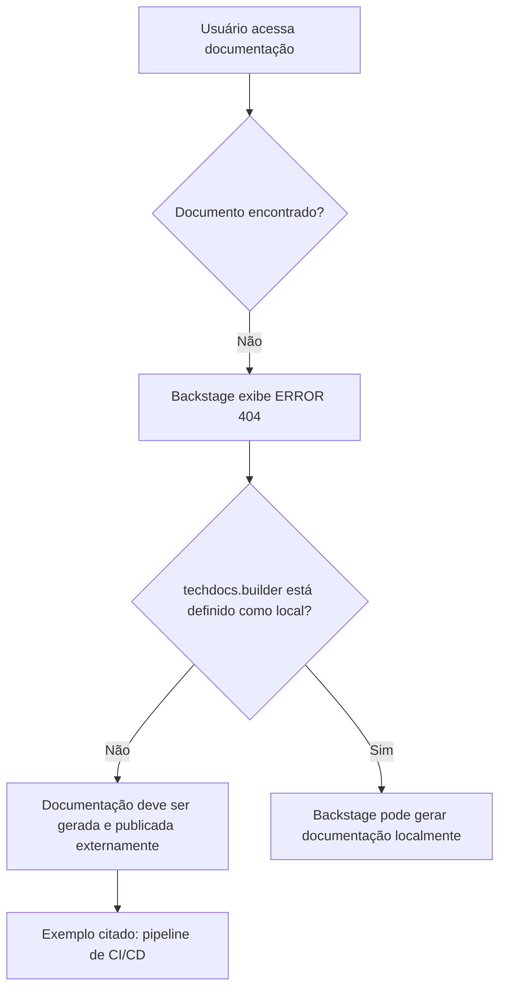

# Página de Erro 404 de Documentação Técnica no Backstage

## 1. Metadados do Documento
- **Arquivo de Origem:** `Não identificado`
- **Tipo de Documento:** `Procedimento / Página de erro de documentação`
- **Domínio / Sistema:** `Backstage / TechDocs / Zeus`
- **Público-Alvo:** `Desenvolvedores, Arquitetos, Operação`
- **Data/Versão Identificada:** `Não identificada`

---

## 2. Resumo Executivo & Contexto de Negócio

O conteúdo apresenta uma página de erro `ERROR 404`, indicando que a documentação técnica solicitada não foi encontrada. A interface exibida aparenta pertencer a um ambiente de documentação com navegação por “Home”, “Solutions”, “APIs”, “Documentation” e “Zeus”.

A mensagem informa que a configuração `techdocs.builder` não está definida como `local`. Como consequência, a instância Backstage não gera documentação localmente quando os documentos não são encontrados.

O documento orienta que a documentação do projeto deve ser gerada e publicada por um processo externo, citando um pipeline de CI/CD como exemplo. Alternativamente, o parâmetro `techdocs.builder` pode ser alterado para `local`, permitindo a geração de documentação a partir da própria instância Backstage.

Não há especificação do projeto, API, solução ou documento originalmente buscado. O conteúdo disponível é exclusivamente uma evidência de indisponibilidade de página e uma orientação de configuração/publicação de documentação.

---

## 3. Arquitetura, Componentes & Tecnologias Envolvidas

Componentes e termos explicitamente citados:

- **Backstage:** instância que exibe a página de erro e possui configuração `techdocs.builder`.
- **TechDocs:** contexto de documentação técnica associado ao parâmetro `techdocs.builder`.
- **`techdocs.builder`:** configuração que controla a geração local de documentos no Backstage.
- **Processo externo:** mecanismo esperado para gerar e publicar documentação quando `techdocs.builder` não está configurado como `local`.
- **CI/CD pipeline:** exemplo de processo externo de geração e publicação de documentação.
- **Zeus:** item presente na navegação da interface, sem detalhamento funcional adicional.
- **CF:** item exibido na interface, sem detalhamento adicional.



> **Nota de Análise:** O conteúdo não identifica repositórios, pipelines específicos, tecnologias de CI/CD, URLs, métodos de publicação ou configurações completas do Backstage.

---

## 4. Regras de Negócio, Especificações Funcionais & Processos

1. Quando uma página de documentação não é encontrada, a interface apresenta o erro `ERROR 404`.
2. Se `techdocs.builder` não estiver configurado como `local`, a instância Backstage não gera documentos ausentes localmente.
3. Nessa configuração, os documentos do projeto devem ser gerados e publicados por um processo externo.
4. O texto cita um pipeline de CI/CD como exemplo de processo externo capaz de gerar e publicar a documentação.
5. Como alternativa ao processo externo, a configuração `techdocs.builder` pode ser alterada para `local`.
6. A página oferece retorno à navegação anterior (“Go back”) ou contato com suporte caso o comportamento seja entendido como defeito.

---

## 5. Tabelas de Parâmetros, Ambientes e Estruturas de Dados

| Item / Parâmetro | Descrição / Função | Tipo / Valores / Formato | Ambiente / Observações |
| :--- | :--- | :--- | :--- |
| `ERROR 404` | Informa que a página solicitada não foi encontrada. | Código/mensagem de erro | Exibido na página de documentação. |
| `techdocs.builder` | Configuração relacionada à geração de documentação pelo Backstage. | Valor citado: `local` | Quando não configurado como `local`, o Backstage não gera documentos ausentes. |
| `local` | Valor de configuração que permite gerar documentos a partir da instância Backstage. | Valor de configuração | Citado como alternativa à publicação externa. |
| Processo externo | Deve gerar e publicar a documentação quando a geração local não estiver habilitada. | Processo operacional | Um pipeline de CI/CD é citado como exemplo. |
| CI/CD pipeline | Exemplo de processo externo para geração e publicação de documentação. | Pipeline | Não há ferramenta, repositório ou etapa detalhada. |
| Backstage | Instância que exibe o erro e processa a configuração de TechDocs. | Plataforma/sistema citado | Não há versão identificada. |
| Zeus | Item de navegação exibido na interface. | Nome exibido | Sem descrição funcional. |
| CF | Item exibido na interface. | Sigla/nome exibido | Sem expansão ou detalhamento. |
| Idioma | Idioma apresentado na interface. | `EN` | Exibido no cabeçalho da página. |

---

## 6. Bateria de Perguntas & Respostas para RAG (FAQ Sintético)

### P1: O que significa o erro `ERROR 404` apresentado na página?
**R:** O erro `ERROR 404` indica que a página de documentação solicitada não foi encontrada. O conteúdo não identifica qual projeto ou documento específico estava ausente.

### P2: Por que o Backstage não gera a documentação automaticamente?
**R:** A mensagem informa que `techdocs.builder` não está configurado como `local`. Nessa condição, a instância Backstage não gera documentos quando eles não são encontrados.

### P3: O que deve acontecer quando `techdocs.builder` não está definido como `local`?
**R:** A documentação do projeto deve ser gerada e publicada por um processo externo. O texto usa um pipeline de CI/CD como exemplo desse processo.

### P4: Qual alternativa permite gerar documentação diretamente a partir do Backstage?
**R:** O texto indica que a configuração `techdocs.builder` pode ser alterada para `local`, permitindo que a documentação seja gerada a partir da instância Backstage.

### P5: O documento informa qual ferramenta de CI/CD deve ser utilizada?
**R:** Não. O conteúdo menciona apenas “CI/CD pipeline” como exemplo de processo externo para geração e publicação da documentação, sem identificar ferramenta, plataforma ou configuração.

### P6: O que fazer se a página 404 for considerada um erro?
**R:** A interface orienta o usuário a voltar (“Go back”) ou entrar em contato com o suporte caso considere a situação um bug.

### P7: O documento descreve a API ou solução chamada Zeus?
**R:** Não. “Zeus” aparece apenas como item de navegação na interface. Não há detalhamento de funcionalidades, arquitetura, APIs ou processos associados a Zeus.

### P8: Há uma URL, ambiente ou servidor identificado para a documentação indisponível?
**R:** Não. O conteúdo não apresenta URL, hostname, servidor, ambiente, porta ou caminho de publicação da documentação.

### P9: Quais são os elementos de navegação visíveis na página?
**R:** A interface apresenta os elementos “Home”, “Solutions”, “APIs”, “Documentation” e “Zeus”. Também exibe “CF” e o idioma “EN”.

### P10: O documento permite determinar como corrigir completamente a publicação da documentação?
**R:** Não completamente. O texto fornece duas direções: gerar e publicar os documentos por processo externo, como CI/CD, ou alterar `techdocs.builder` para `local`. Não há detalhes sobre arquivos, comandos, permissões ou pipeline necessários.

---

## 7. Glossário de Termos, Siglas & Conceitos-Chave

- **404:** Código de erro exibido quando a página solicitada não é encontrada.
- **Backstage:** Sistema citado na mensagem de erro como a instância que não gerará documentos ausentes sob a configuração atual.
- **TechDocs:** Contexto de documentação técnica associado ao parâmetro `techdocs.builder`.
- **`techdocs.builder`:** Parâmetro de configuração mencionado para controlar a geração de documentação.
- **`local`:** Valor citado para permitir a geração de documentação a partir da instância Backstage.
- **CI/CD:** Termo citado como exemplo de pipeline externo que pode gerar e publicar documentação.
- **Zeus:** Nome exibido na navegação, sem explicação adicional.
- **CF:** Sigla ou item exibido na interface, sem significado expandido no conteúdo.

---

## 8. Notas Críticas, Riscos & Limitações

- O conteúdo não fornece o nome do arquivo de origem, projeto, API ou documento que resultou em erro 404.
- Não há detalhes sobre a configuração atual de `techdocs.builder`, além de a mensagem afirmar que ela não está definida como `local`.
- Não são informados repositórios, ferramentas de CI/CD, pipelines, comandos de build ou destinos de publicação.
- Não há URL, hostname, ambiente, credenciais, permissões ou informações de suporte.
- **Nota de Análise:** O documento apresenta uma página de erro, não uma especificação técnica do sistema ou da documentação originalmente esperada.
- **Nota de Análise:** “Zeus” e “CF” são exibidos na interface, porém o conteúdo não fornece definição, responsabilidade ou relacionamento técnico para esses termos.

---

## 9. Conteúdo Bruto Estruturado (Referência Fiel)

```text
--- [PÁGINA 1 DE 1] ---

ERROR 404: j: Page not found.
Note that techdocs.builder is not set to 'local' in
your config, which means this Backstage app will
not generate docs if they are not found. Make sure
the project's docs are generated and published by
some external process (e.g. CI/CD pipeline). Or
change techdocs.builder to 'local' to generate docs
from this Backstage instance.
Looks like someone
dropped the mic!
Go back... or please  if you
think this is a bug.
contact support
 / 
 CF
Home Solutions APIs Documentation Zeus
EN
```
