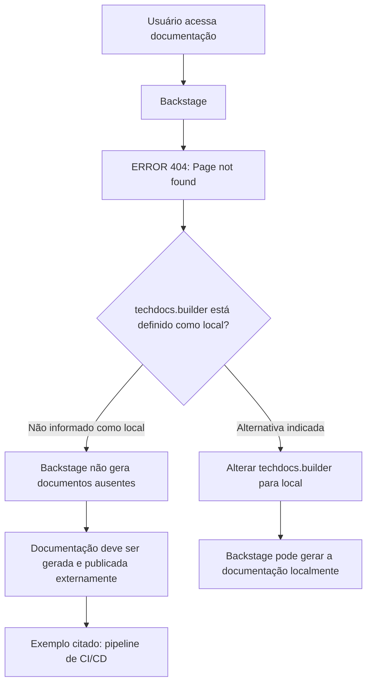

# Página de Erro 404 do Backstage TechDocs — Documentação Não Encontrada

## 1. Metadados do Documento
- **Arquivo de Origem:** `Não identificado`
- **Tipo de Documento:** `Não identificado — conteúdo extraído corresponde a uma página de erro`
- **Domínio / Sistema:** `Backstage / TechDocs`
- **Público-Alvo:** `Operação, Desenvolvedores, Arquitetos e usuários da documentação`
- **Data/Versão Identificada:** `Não identificada`

---

## 2. Resumo Executivo & Contexto de Negócio

O conteúdo original não descreve uma especificação técnica, manual operacional, arquitetura de software ou processo de negócio. O texto extraído corresponde a uma página de erro HTTP 404, indicando que o recurso de documentação solicitado não foi encontrado.

A página informa que a configuração `techdocs.builder` não está definida como `local`. Como consequência declarada, a instância do Backstage não gera documentos quando eles não são encontrados. O texto recomenda garantir que a documentação do projeto seja gerada e publicada por um processo externo, como um pipeline de CI/CD.

Como alternativa, a página indica que a configuração `techdocs.builder` pode ser alterada para `local`, permitindo que a instância Backstage gere a documentação localmente. O conteúdo não apresenta detalhes sobre arquivos de configuração, repositórios, comandos, pipelines, permissões ou responsáveis pela publicação.

A navegação exibida inclui áreas como Solutions, Architectures, APIs, Events, Components, Cloud Documentation, Zeus, Reef, Help e News. Contudo, o conteúdo não explica a finalidade, arquitetura ou integração dessas áreas.

---

## 3. Arquitetura, Componentes & Tecnologias Envolvidas

Os únicos componentes explicitamente identificados são:

| Componente / Termo | Papel descrito no conteúdo |
| :--- | :--- |
| Backstage | Instância que apresenta a página de documentação não encontrada. |
| TechDocs | Recurso de documentação associado à configuração `techdocs.builder`. |
| `techdocs.builder` | Configuração que, segundo o texto, não está definida como `local`. |
| CI/CD pipeline | Exemplo de processo externo que pode gerar e publicar documentação. |
| ERROR 404 | Estado apresentado quando a página/documentação não é encontrada. |



> **Nota de Análise:** O conteúdo não detalha a topologia do Backstage, o mecanismo de publicação, o sistema de origem da documentação, as tecnologias do pipeline de CI/CD ou o local da configuração `techdocs.builder`.

---

## 4. Regras de Negócio, Especificações Funcionais & Processos

1. A página exibe `ERROR 404: Page not found.` quando a documentação solicitada não é encontrada.
2. Quando `techdocs.builder` não está configurado como `local`, a instância Backstage não gera documentação ausente.
3. O documento orienta que a documentação do projeto seja gerada e publicada por um processo externo.
4. Um pipeline de CI/CD é apresentado apenas como exemplo de processo externo de geração e publicação.
5. Como alternativa, o documento recomenda alterar `techdocs.builder` para `local` para permitir a geração de documentação pela instância Backstage.
6. A página disponibiliza navegação para retorno e indicação de contato com suporte caso o erro seja considerado um defeito.

> **Nota de Análise:** Não há regras de validação adicionais, contratos de API, parâmetros de execução, responsáveis operacionais ou critérios para determinar se o erro 404 decorre de publicação ausente, URL incorreta ou falha de configuração.

---

## 5. Tabelas de Parâmetros, Ambientes e Estruturas de Dados

| Item / Parâmetro | Descrição / Função | Tipo / Valores / Formato | Ambiente / Observações |
| :--- | :--- | :--- | :--- |
| `ERROR 404` | Indica que a página solicitada não foi encontrada. | Mensagem de erro HTTP exibida como texto. | Não há ambiente identificado. |
| `techdocs.builder` | Configuração relacionada à geração de documentação no Backstage. | Valor citado: `local`. | O texto afirma que não está definido como `local`. |
| `local` | Valor de configuração que permite geração de documentação pela instância Backstage. | Valor textual de configuração. | A alteração é apresentada como alternativa. |
| Processo externo | Mecanismo recomendado para gerar e publicar documentação. | Processo operacional. | O documento cita CI/CD como exemplo. |
| CI/CD pipeline | Exemplo de processo externo para geração e publicação de documentação. | Pipeline de integração e entrega contínuas. | Sem tecnologia, ferramenta ou URL especificadas. |
| Contact support | Opção indicada quando o usuário considera o erro um possível defeito. | Ação de suporte. | Canal de suporte não identificado. |
| Soluções, Arquiteturas, APIs, Eventos, Componentes, Cloud Documentation, Zeus, Reef, Help, News | Itens de navegação apresentados na página. | Menu de navegação. | Nenhuma função adicional é detalhada. |

---

## 6. Bateria de Perguntas & Respostas para RAG (FAQ Sintético)

### P1: Qual erro é apresentado no conteúdo extraído?
**R:** O conteúdo apresenta a mensagem `ERROR 404: Page not found.`, indicando que a página ou documentação solicitada não foi encontrada.

### P2: Qual configuração do Backstage é mencionada na página de erro?
**R:** A página menciona a configuração `techdocs.builder` e informa que ela não está definida como `local`.

### P3: O que acontece quando `techdocs.builder` não está configurado como `local`?
**R:** Segundo a mensagem exibida, a instância Backstage não gera documentos quando esses documentos não são encontrados.

### P4: Como a documentação deve ser disponibilizada quando o gerador local não está configurado?
**R:** O conteúdo orienta que a documentação do projeto seja gerada e publicada por algum processo externo.

### P5: Qual processo externo é citado como exemplo para gerar documentação?
**R:** Um pipeline de CI/CD é citado como exemplo de processo externo capaz de gerar e publicar a documentação.

### P6: Qual alternativa é sugerida para que a própria instância Backstage gere documentação?
**R:** A alternativa indicada é alterar a configuração `techdocs.builder` para `local`.

### P7: O conteúdo especifica qual ferramenta de CI/CD deve ser utilizada?
**R:** Não. O texto cita apenas um “CI/CD pipeline” como exemplo e não identifica ferramenta, fornecedor, repositório, comando ou fluxo de publicação.

### P8: O conteúdo fornece a URL da documentação ausente?
**R:** Não. A extração informa que a página não foi encontrada, mas não apresenta a URL do recurso solicitado.

### P9: O que o usuário pode fazer se considerar que o erro é um defeito?
**R:** A página sugere entrar em contato com o suporte, embora não informe um canal, endereço ou equipe responsável.

### P10: Quais áreas de navegação aparecem na página?
**R:** A página apresenta as áreas Search, Home, Solutions, Architectures, APIs, Events, Components, Cloud Documentation, Zeus, Reef, Help e News.

---

## 7. Glossário de Termos, Siglas & Conceitos-Chave

- **404:** Código de erro HTTP apresentado para indicar que uma página não foi encontrada.
- **Backstage:** Sistema mencionado na mensagem como a instância que não gerará documentos ausentes conforme a configuração atual.
- **TechDocs:** Recurso de documentação associado ao parâmetro `techdocs.builder`.
- **`techdocs.builder`:** Configuração mencionada para determinar a geração de documentação pelo Backstage.
- **`local`:** Valor de configuração citado como alternativa para habilitar a geração local de documentos pela instância Backstage.
- **CI/CD:** Termo citado como exemplo de processo externo para geração e publicação da documentação.
- **Cloud Documentation:** Item de navegação exibido na página, sem detalhamento funcional.
- **Zeus:** Item de navegação exibido na página, sem definição adicional.
- **Reef:** Item de navegação exibido na página, sem definição adicional.

---

## 8. Notas Críticas, Riscos & Limitações

- O conteúdo fonte é uma página de erro, não um documento corporativo de requisitos, arquitetura ou operação.
- Não há informação suficiente para identificar o arquivo original, versão, data, autor, sistema proprietário ou ambiente afetado.
- Não foram identificadas URLs, nomes de repositórios, credenciais, contratos de API, parâmetros de pipeline ou procedimentos de correção detalhados.
- A configuração `techdocs.builder` é mencionada, mas o local do arquivo de configuração e o impacto de alterar o valor para `local` não são detalhados.
- As áreas Zeus, Reef e Cloud Documentation aparecem somente na navegação; suas finalidades não podem ser inferidas com segurança.
- A causa raiz do erro 404 não é comprovada pelo conteúdo: a página apenas indica que os documentos não serão gerados localmente sob a configuração descrita.

---

## 9. Conteúdo Bruto Estruturado (Referência Fiel)

```text
--- [PÁGINA 1 DE 1] ---

ERROR 404: j: Page not found.
Note that techdocs.builder is not set to 'local' in your config, which means this
Backstage app will not generate docs if they are not found. Make sure the project's
docs are generated and published by some external process (e.g. CI/CD pipeline).
Or change techdocs.builder to 'local' to generate docs from this Backstage instance.
Looks like someone dropped the mic!
Go back... or please  if you think this is a bug.contact support
 / 
 CF
Search Home Solutions Architectures APIs Events Components Cloud Documentation Zeus Reef Help News
EN
```
