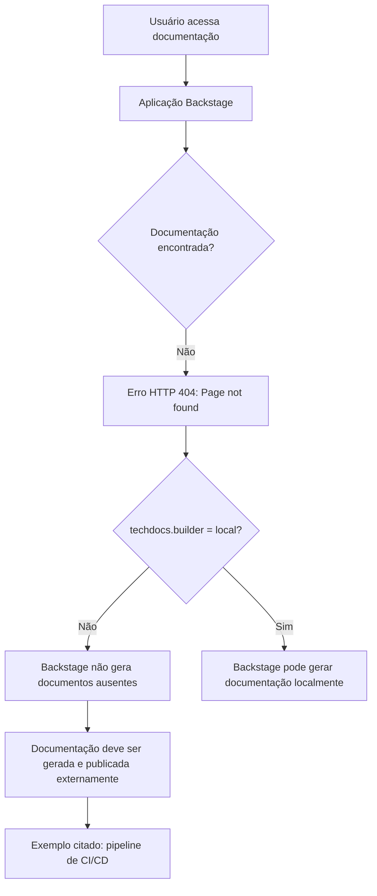

# Erro 404 de Documentação Técnica no Backstage / TechDocs

## 1. Metadados do Documento
- **Arquivo de Origem:** Não identificado
- **Tipo de Documento:** Procedimento / Registro de Erro
- **Domínio / Sistema:** Backstage, TechDocs, Zeus
- **Público-Alvo:** Desenvolvedores, Arquitetos, Operação
- **Data/Versão Identificada:** Não identificada

---

## 2. Resumo Executivo & Contexto de Negócio

O conteúdo apresenta uma página de erro HTTP 404 para documentação técnica em uma aplicação Backstage. A página informa que a documentação solicitada não foi encontrada.

A mensagem identifica que a configuração `techdocs.builder` não está definida como `local`. Nessa condição, a instância Backstage não gera documentação quando os documentos não são encontrados.

O texto orienta que a documentação do projeto seja gerada e publicada por um processo externo, citando como exemplo um pipeline de CI/CD. Como alternativa, indica alterar `techdocs.builder` para `local`, permitindo que a instância Backstage gere a documentação.

O conteúdo também disponibiliza ações de retorno, contato com suporte e navegação por áreas denominadas `Home`, `Solutions`, `APIs`, `Documentation` e `Zeus`.

---

## 3. Arquitetura, Componentes & Tecnologias Envolvidas

Componentes e conceitos identificados:

- **Backstage:** aplicação que exibe a página de erro e hospeda a funcionalidade de documentação.
- **TechDocs:** componente de documentação mencionado pela configuração `techdocs.builder`.
- **`techdocs.builder`:** configuração que define, conforme a mensagem, se a instância Backstage gera documentação localmente.
- **Processo externo:** mecanismo necessário para gerar e publicar documentos quando `techdocs.builder` não está definido como `local`.
- **CI/CD pipeline:** exemplo de processo externo para geração e publicação da documentação.
- **Zeus:** item presente na navegação da página; o conteúdo não detalha sua função.
- **HTTP 404:** erro exibido para indicar que a página de documentação não foi encontrada.



> **Nota de Análise:** O conteúdo não identifica o projeto, a URL acessada, o repositório de origem, os comandos de geração de documentação nem a configuração completa do `techdocs.builder`.

---

## 4. Regras de Negócio, Especificações Funcionais & Processos

1. Quando a documentação não é encontrada, a aplicação exibe o erro `ERROR 404: Page not found.`.
2. A configuração atual informada não possui `techdocs.builder` definido como `local`.
3. Quando `techdocs.builder` não está definido como `local`, a aplicação Backstage não gera documentos que não foram encontrados.
4. Para disponibilizar a documentação nessa condição, o projeto deve gerar e publicar os documentos por meio de um processo externo.
5. O documento cita um pipeline de CI/CD como exemplo de processo externo para geração e publicação.
6. Como alternativa ao processo externo, o documento orienta alterar a configuração `techdocs.builder` para `local`.
7. A página oferece opções de voltar e de contatar o suporte caso o erro seja considerado um defeito.

---

## 5. Tabelas de Parâmetros, Ambientes e Estruturas de Dados

| Item / Parâmetro | Descrição / Função | Tipo / Valores / Formato | Ambiente / Observações |
| :--- | :--- | :--- | :--- |
| `techdocs.builder` | Configuração relacionada à geração da documentação TechDocs | Valor mencionado: `local` | Não está definido como `local`, segundo a página |
| Backstage | Aplicação que apresenta a documentação e o erro | Aplicação / plataforma | Não gera documentos ausentes quando o builder não é `local` |
| TechDocs | Funcionalidade de documentação citada pela configuração | Componente de documentação | Não há detalhamento de versão ou implementação |
| Processo externo | Processo responsável por gerar e publicar documentação | Processo operacional | Necessário quando os documentos não estão disponíveis e o builder não é `local` |
| CI/CD pipeline | Exemplo de processo externo citado | Pipeline de integração e entrega contínuas | O documento não especifica ferramenta, etapas ou repositório |
| `ERROR 404` | Erro de página não encontrada | Código HTTP | Exibido pela página de documentação |
| Zeus | Item de navegação | Nome/área não detalhada | Função não informada |
| `EN` | Idioma exibido na navegação | Código de idioma | Não há detalhamento adicional |

---

## 6. Bateria de Perguntas & Respostas para RAG (FAQ Sintético)

### P1: Qual erro é apresentado quando a página de documentação não é encontrada?
**R:** A página apresenta a mensagem `ERROR 404: Page not found.`, indicando que a documentação ou página solicitada não foi localizada.

### P2: O que a mensagem informa sobre a configuração `techdocs.builder`?
**R:** A mensagem informa que `techdocs.builder` não está definido como `local` na configuração da aplicação.

### P3: O Backstage gera automaticamente a documentação ausente na configuração apresentada?
**R:** Não. Segundo a página, a instância Backstage não gera documentos quando eles não são encontrados se `techdocs.builder` não estiver definido como `local`.

### P4: Como a documentação deve ser disponibilizada quando `techdocs.builder` não está configurado como `local`?
**R:** A documentação do projeto deve ser gerada e publicada por algum processo externo.

### P5: Qual exemplo de processo externo é citado para publicar a documentação?
**R:** A página cita um pipeline de CI/CD como exemplo de processo externo que pode gerar e publicar a documentação.

### P6: Qual alternativa é indicada para permitir geração de documentação pela própria instância Backstage?
**R:** A alternativa indicada é alterar a configuração `techdocs.builder` para `local`, para que a instância Backstage gere a documentação.

### P7: O documento especifica qual ferramenta de CI/CD deve ser utilizada?
**R:** Não. O conteúdo apenas cita um pipeline de CI/CD como exemplo, sem informar ferramenta, fornecedor, configuração ou etapas.

### P8: Quais ações estão disponíveis ao usuário na página de erro?
**R:** A página indica a possibilidade de voltar e de contatar o suporte caso o usuário considere que o erro seja um defeito.

### P9: O que é Zeus no contexto do conteúdo apresentado?
**R:** `Zeus` aparece como item de navegação da página. O conteúdo não fornece descrição funcional, técnica ou de negócio para Zeus.

---

## 7. Glossário de Termos, Siglas & Conceitos-Chave

- **Backstage:** aplicação mencionada como responsável por exibir a página de documentação e a mensagem de erro.
- **TechDocs:** componente ou funcionalidade de documentação referenciada pela configuração `techdocs.builder`.
- **`techdocs.builder`:** parâmetro de configuração relacionado à geração de documentação pelo Backstage.
- **CI/CD:** termo citado como exemplo de pipeline externo para gerar e publicar a documentação; o conteúdo não expande a sigla.
- **HTTP 404:** código de erro apresentado como `Page not found`.
- **Zeus:** item da navegação da página; sem definição adicional no conteúdo.
- **`local`:** valor de configuração citado para `techdocs.builder`, associado à geração de documentação pela instância Backstage.

---

## 8. Notas Críticas, Riscos & Limitações

- A documentação requerida não está disponível na instância Backstage acessada.
- A configuração informada impede a geração local de documentação ausente pela instância Backstage.
- A disponibilidade da documentação depende de geração e publicação por um processo externo, como um pipeline de CI/CD.
- O conteúdo não informa qual projeto teve a documentação ausente.
- O conteúdo não informa onde a documentação deve ser publicada.
- O conteúdo não fornece detalhes sobre a configuração atual, os valores permitidos por `techdocs.builder` ou os procedimentos para alteração.
- O conteúdo não detalha Zeus, o suporte, as rotas, os ambientes, os responsáveis operacionais ou o pipeline de CI/CD.

---

## 9. Conteúdo Bruto Estruturado (Referência Fiel)

```text
--- [PÁGINA 1 DE 1] ---

ERROR 404: j: Page not found.
Note that techdocs.builder is not set to 'local' in
your config, which means this Backstage app will
not generate docs if they are not found. Make sure
the project's docs are generated and published by
some external process (e.g. CI/CD pipeline). Or
change techdocs.builder to 'local' to generate docs
from this Backstage instance.
Looks like someone
dropped the mic!
Go back... or please  if you
think this is a bug.
contact support
 / 
 CF
Home Solutions APIs Documentation Zeus
EN
```
