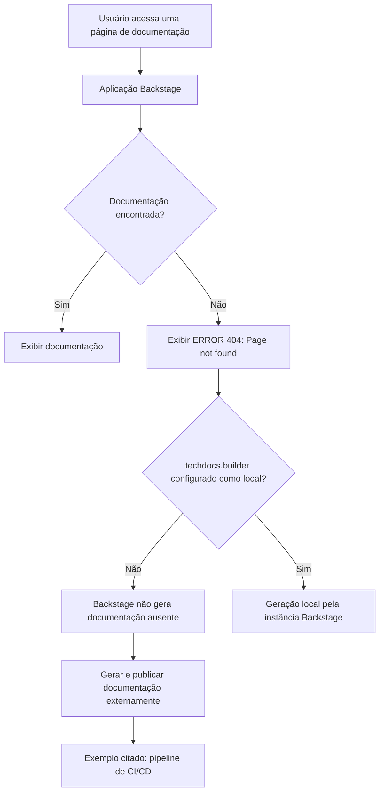

# Página de Erro 404 do TechDocs/Backstage — Documentação Não Encontrada

## 1. Metadados do Documento
- **Arquivo de Origem:** `Não informado`
- **Tipo de Documento:** `Procedimento / Página de erro`
- **Domínio / Sistema:** `TechDocs, Backstage, Documentation Zeus`
- **Público-Alvo:** `Desenvolvedores, Arquitetos, Operação`
- **Data/Versão Identificada:** `Não identificada`

---

## 2. Resumo Executivo & Contexto de Negócio

O conteúdo registra uma página de erro HTTP 404 informando que uma página de documentação não foi encontrada. A mensagem está associada a uma aplicação Backstage que utiliza TechDocs para disponibilizar documentação.

A causa indicada é que `techdocs.builder` não está configurado como `local`. Nessa configuração, a instância Backstage não gera documentação quando os documentos não são encontrados.

O texto recomenda que a documentação do projeto seja gerada e publicada por um processo externo, citando como exemplo um pipeline de CI/CD. Como alternativa, o parâmetro `techdocs.builder` pode ser alterado para `local`, permitindo a geração de documentação pela própria instância Backstage.

A página apresenta opções de navegação para retornar, acessar áreas como `Home`, `Solutions`, `APIs`, `Documentation` e `Zeus`, além de instruir o usuário a contatar o suporte caso considere que o erro seja um defeito.

---

## 3. Arquitetura, Componentes & Tecnologias Envolvidas

Os elementos identificados são:

- **Backstage:** aplicação que exibe a página de erro e hospeda a experiência de documentação.
- **TechDocs:** componente mencionado na configuração `techdocs.builder`.
- **`techdocs.builder`:** configuração que define se a documentação será gerada localmente pela instância Backstage.
- **CI/CD pipeline:** processo externo citado como exemplo para gerar e publicar a documentação.
- **Documentation Zeus:** item de navegação ou contexto documental exibido na página.
- **HTTP 404:** código de erro reportado para a página não encontrada.



> **Nota de Análise:** o conteúdo não informa valores concretos para `techdocs.builder`, mecanismos de publicação, repositórios, URLs, pipelines específicos, tecnologias de CI/CD ou responsáveis operacionais.

---

## 4. Regras de Negócio, Especificações Funcionais & Processos

1. Quando a página de documentação solicitada não é encontrada, a aplicação apresenta o erro `ERROR 404: Page not found`.
2. A configuração observada possui `techdocs.builder` diferente de `local`.
3. Quando `techdocs.builder` não está configurado como `local`, a aplicação Backstage não gera documentação caso os documentos não sejam encontrados.
4. A documentação do projeto deve ser gerada e publicada por um processo externo.
5. O conteúdo cita um pipeline de CI/CD como exemplo de processo externo que pode gerar e publicar documentação.
6. Como alternativa ao processo externo, a configuração `techdocs.builder` pode ser alterada para `local`, para que a documentação seja gerada a partir da instância Backstage.
7. O usuário pode retornar para a navegação anterior ou contatar o suporte quando acreditar que a ocorrência representa um defeito.

---

## 5. Tabelas de Parâmetros, Ambientes e Estruturas de Dados

| Item / Parâmetro | Descrição / Função | Tipo / Valores / Formato | Ambiente / Observações |
| :--- | :--- | :--- | :--- |
| `ERROR 404` | Indica que a página solicitada não foi encontrada. | Código de erro HTTP. | Exibido pela página analisada. |
| `techdocs.builder` | Configuração relacionada à geração de documentação pelo TechDocs. | Valor citado: `local`. | O texto informa que o valor atual não é `local`. |
| `local` | Valor de configuração que permite geração de documentação pela instância Backstage. | Valor de `techdocs.builder`. | Alternativa indicada para gerar documentação localmente. |
| Backstage | Aplicação que exibe a página de erro. | Aplicação / plataforma. | Não há versão identificada. |
| TechDocs | Componente citado na mensagem de configuração. | Componente de documentação. | O conteúdo não detalha sua arquitetura interna. |
| CI/CD pipeline | Exemplo de processo externo para gerar e publicar documentação. | Processo de automação. | Nenhuma ferramenta específica é identificada. |
| Documentation Zeus | Elemento exibido na navegação da página. | Área, produto ou seção não detalhada. | Sem explicação funcional adicional. |
| `EN` | Indicador de idioma exibido na página. | Código de idioma. | O conteúdo não detalha suporte multilíngue. |
| `CF` | Texto exibido no rodapé ou navegação da página. | Sigla não definida. | Significado não identificado. |

---

## 6. Bateria de Perguntas & Respostas para RAG (FAQ Sintético)

### P1: Qual erro é apresentado quando a página de documentação não é encontrada?
**R:** A página apresenta a mensagem `ERROR 404: Page not found`, indicando que o recurso ou página de documentação solicitado não foi localizado.

### P2: Por que a instância Backstage não gera automaticamente a documentação ausente?
**R:** O texto informa que `techdocs.builder` não está definido como `local`. Nessa condição, a aplicação Backstage não gera documentação quando os documentos não são encontrados.

### P3: Qual configuração deve ser alterada para permitir geração local de documentação no Backstage?
**R:** A configuração mencionada é `techdocs.builder`. O conteúdo orienta alterar esse parâmetro para `local` caso se deseje que a instância Backstage gere a documentação.

### P4: Qual alternativa é recomendada quando o TechDocs não utiliza geração local?
**R:** A documentação do projeto deve ser gerada e publicada por um processo externo. A mensagem cita um pipeline de CI/CD como exemplo desse processo externo.

### P5: O documento identifica qual ferramenta de CI/CD deve gerar a documentação?
**R:** Não. O conteúdo menciona apenas “CI/CD pipeline” como exemplo e não especifica ferramenta, fornecedor, repositório, configuração ou pipeline concreto.

### P6: O que deve ser verificado após receber a página `ERROR 404: Page not found`?
**R:** Deve-se verificar se a documentação do projeto foi gerada e publicada externamente. Também deve-se avaliar se a configuração `techdocs.builder` deveria estar definida como `local`.

### P7: Quais tecnologias ou componentes são citados na página de erro?
**R:** A página cita Backstage, TechDocs, a configuração `techdocs.builder` e um processo de CI/CD como exemplo de mecanismo externo de geração e publicação documental.

### P8: A página fornece detalhes sobre a documentação inexistente, como projeto, URL ou repositório?
**R:** Não. O conteúdo não identifica o projeto, a URL específica, o repositório, o documento procurado ou qualquer caminho técnico para a documentação ausente.

### P9: O que o usuário pode fazer se acreditar que o erro 404 é um defeito?
**R:** A página orienta o usuário a contatar o suporte caso considere que a ocorrência seja um bug.

### P10: O que significa `Documentation Zeus` no conteúdo analisado?
**R:** `Documentation Zeus` aparece como item de navegação da página. O documento não fornece detalhamento funcional, técnico ou organizacional adicional sobre Zeus.

---

## 7. Glossário de Termos, Siglas & Conceitos-Chave

- **404:** código de erro HTTP exibido quando uma página não é encontrada.
- **Backstage:** aplicação mencionada como a instância que não gerará documentos ausentes quando `techdocs.builder` não estiver definido como `local`.
- **CI/CD:** sigla exibida na forma `CI/CD pipeline`; é citada como exemplo de processo externo para gerar e publicar documentação.
- **TechDocs:** componente de documentação associado à configuração `techdocs.builder`.
- **`techdocs.builder`:** parâmetro de configuração relacionado à geração de documentos pelo TechDocs.
- **`local`:** valor citado para `techdocs.builder`, associado à geração de documentação pela instância Backstage.
- **Documentation Zeus:** item de navegação exibido, sem definição adicional no conteúdo.
- **CF:** sigla exibida sem significado definido no conteúdo.

---

## 8. Notas Críticas, Riscos & Limitações

- A indisponibilidade da página de documentação impede o acesso ao conteúdo técnico solicitado.
- A geração e publicação da documentação podem depender de um processo externo, como um pipeline de CI/CD.
- Não há evidência de que o processo externo de geração e publicação esteja configurado, executado ou saudável.
- A configuração atual de `techdocs.builder` não está definida como `local`, segundo a própria página.
- O conteúdo não apresenta o projeto afetado, o documento ausente, o ambiente, a URL, logs, responsáveis, SLAs ou instruções operacionais detalhadas.
- **Nota de Análise:** o conteúdo identifica a condição de configuração e alternativas gerais, mas não permite diagnosticar a causa raiz da ausência documental sem informações externas adicionais.

---

## 9. Conteúdo Bruto Estruturado (Referência Fiel)

```text
--- [PÁGINA 1 DE 1] ---

ERROR 404: j: Page not found.
Note that techdocs.builder is not set to 'local' in
your config, which means this Backstage app will
not generate docs if they are not found. Make sure
the project's docs are generated and published by
some external process (e.g. CI/CD pipeline). Or
change techdocs.builder to 'local' to generate docs
from this Backstage instance.
Looks like someone
dropped the mic!
Go back... or please  if you
think this is a bug.
contact support
 / 
 CF
Home Solutions APIs Documentation Zeus
EN
```
