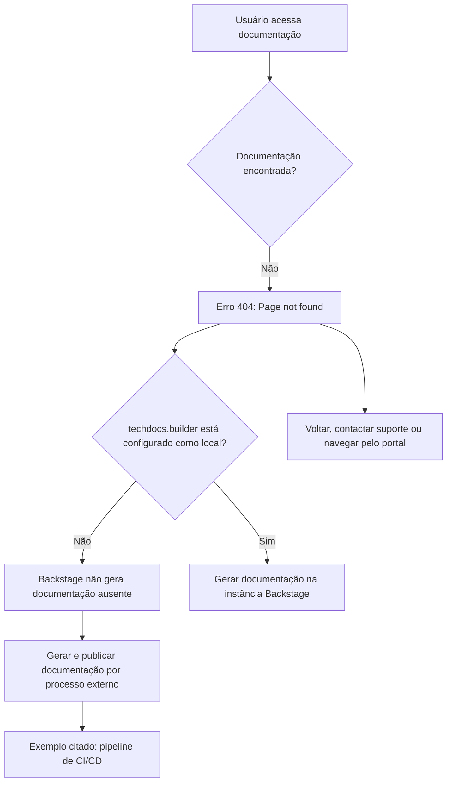

# Página de Erro 404 — Documentação Técnica Não Encontrada no Backstage

## 1. Metadados do Documento
- **Arquivo de Origem:** Não identificado
- **Tipo de Documento:** Procedimento / Mensagem de erro de documentação
- **Domínio / Sistema:** Backstage TechDocs; portal “Zeus”
- **Público-Alvo:** Desenvolvedores, Arquitetos, Operação
- **Data/Versão Identificada:** Não identificada

---

## 2. Resumo Executivo & Contexto de Negócio

O conteúdo apresenta uma página de erro HTTP 404 indicando que uma página de documentação técnica não foi encontrada. A interface informa que `techdocs.builder` não está configurado como `local`.

Segundo a mensagem, a instância Backstage não gerará documentação quando os documentos não forem encontrados. A publicação e a geração da documentação devem ocorrer por um processo externo, como um pipeline de CI/CD, ou a configuração deve ser alterada para usar o builder local.

A navegação disponível na página inclui retorno à página anterior, contato com o suporte e acesso a áreas identificadas como Home, Solutions, APIs, Documentation e Zeus. O texto não apresenta detalhes sobre o projeto afetado, repositório, pipeline, configuração efetiva ou responsável pela publicação.

---

## 3. Arquitetura, Componentes & Tecnologias Envolvidas

Componentes e termos identificados:

- **Backstage:** Aplicação na qual a página de documentação foi exibida.
- **TechDocs:** Mecanismo de documentação mencionado pela configuração `techdocs.builder`.
- **`techdocs.builder`:** Configuração citada como não definida para `local`.
- **Processo externo:** Mecanismo esperado para gerar e publicar documentação quando o builder local não é utilizado.
- **Pipeline de CI/CD:** Exemplo de processo externo indicado para geração e publicação da documentação.
- **Zeus:** Item presente na navegação da interface; o documento não detalha sua função.
- **APIs Documentation:** Item de navegação associado à documentação de APIs.



---

## 4. Regras de Negócio, Especificações Funcionais & Processos

1. A ausência da página de documentação resulta na exibição de erro `ERROR 404: Page not found`.
2. Quando `techdocs.builder` não está configurado como `local`, a instância Backstage não gera documentos que não foram encontrados.
3. A documentação do projeto deve ser gerada e publicada por um processo externo quando o builder local não estiver habilitado.
4. O texto cita explicitamente um pipeline de CI/CD como exemplo de processo externo para gerar e publicar a documentação.
5. Como alternativa ao processo externo, a configuração `techdocs.builder` pode ser alterada para `local`, permitindo a geração de documentação pela instância Backstage.
6. A página oferece opções de retorno, contato com suporte e navegação pelo portal.
7. **Nota de Análise:** O conteúdo não especifica onde `techdocs.builder` deve ser configurado, qual processo de CI/CD é utilizado, nem como a documentação deve ser publicada.

---

## 5. Tabelas de Parâmetros, Ambientes e Estruturas de Dados

| Item / Parâmetro | Descrição / Função | Tipo / Valores / Formato | Ambiente / Observações |
| :--- | :--- | :--- | :--- |
| `ERROR 404` | Indica que a página solicitada não foi encontrada. | Código de erro HTTP exibido como `ERROR 404: Page not found`. | Página de documentação. |
| `techdocs.builder` | Configuração que controla o comportamento de geração de documentação no Backstage. | Valor mencionado: `local`. | O conteúdo informa que não está definido como `local`. |
| Builder local | Alternativa para a instância Backstage gerar documentação. | Configuração `techdocs.builder = local`. | O documento não detalha o arquivo ou mecanismo de configuração. |
| Processo externo | Responsável por gerar e publicar documentação quando o builder local não é utilizado. | Exemplo: pipeline de CI/CD. | Não identificado no conteúdo. |
| CI/CD pipeline | Exemplo de processo externo para geração e publicação da documentação. | Pipeline de integração contínua e entrega contínua, conforme texto. | Não detalhado. |
| Zeus | Item da navegação exibida. | Texto de interface. | Função não detalhada. |
| APIs Documentation | Item da navegação exibida. | Texto de interface. | Função não detalhada. |
| `CF` | Elemento textual presente no rodapé/navegação. | Sigla não expandida. | Sem detalhamento adicional. |
| Idioma | Idioma selecionado na interface. | `EN`. | Interface exibida em inglês. |

---

## 6. Bateria de Perguntas & Respostas para RAG (FAQ Sintético)

### P1: Qual erro é exibido quando a página de documentação não é encontrada?
**R:** A página apresenta a mensagem `ERROR 404: Page not found`, indicando que a página de documentação solicitada não foi encontrada.

### P2: Por que a instância Backstage não gera a documentação ausente?
**R:** A mensagem informa que `techdocs.builder` não está configurado como `local`. Nessa condição, a instância Backstage não gera documentos que não forem encontrados.

### P3: Qual configuração é mencionada para permitir a geração de documentação pelo Backstage?
**R:** O texto cita a configuração `techdocs.builder` com o valor `local`. A mensagem orienta alterar essa configuração para `local` caso se deseje gerar a documentação a partir da própria instância Backstage.

### P4: Qual alternativa existe quando o builder local não está habilitado?
**R:** A documentação do projeto deve ser gerada e publicada por algum processo externo. O conteúdo apresenta um pipeline de CI/CD como exemplo desse processo externo.

### P5: O documento informa qual pipeline de CI/CD deve publicar a documentação?
**R:** Não. O conteúdo menciona um pipeline de CI/CD somente como exemplo de processo externo, sem identificar ferramenta, repositório, pipeline, etapa ou configuração.

### P6: Quais ações de navegação são apresentadas na página de erro?
**R:** A página oferece retorno à navegação anterior, opção de contato com suporte e itens de navegação como Home, Solutions, APIs, Documentation e Zeus.

### P7: O que significa o item Zeus presente na página?
**R:** O conteúdo apresenta “Zeus” como item de navegação, mas não define sua finalidade, escopo funcional ou relação com a documentação indisponível.

### P8: O documento descreve como configurar `techdocs.builder`?
**R:** Não. O conteúdo apenas informa que `techdocs.builder` não está definido como `local` e sugere alterar essa configuração; não há caminho de arquivo, comando ou procedimento técnico detalhado.

### P9: A página identifica o projeto cuja documentação está ausente?
**R:** Não. A mensagem refere-se genericamente à documentação de um projeto, sem apresentar nome, identificador, URL ou repositório do projeto afetado.

### P10: Qual é a limitação principal da mensagem de erro para diagnóstico operacional?
**R:** A mensagem não fornece detalhes sobre a causa específica da ausência da documentação, a localização da configuração, o processo de publicação ou o responsável pelo suporte. Ela apenas apresenta alternativas gerais: publicação externa ou uso do builder local.

---

## 7. Glossário de Termos, Siglas & Conceitos-Chave

- **404:** Código de erro exibido para indicar que uma página não foi encontrada.
- **API:** Sigla presente no item de navegação `APIs`; o conteúdo não fornece expansão ou definição adicional.
- **Backstage:** Aplicação mencionada como a instância que não gera documentação ausente quando o builder não está configurado como local.
- **CF:** Sigla exibida na interface; significado não definido no conteúdo.
- **CI/CD:** Sigla presente na expressão “CI/CD pipeline”; citada como exemplo de processo externo para gerar e publicar documentação.
- **Documentation:** Item de navegação referente à documentação.
- **TechDocs:** Componente de documentação referido pela configuração `techdocs.builder`.
- **`techdocs.builder`:** Parâmetro de configuração mencionado na mensagem de erro.
- **Zeus:** Item de navegação; significado e responsabilidade não definidos no conteúdo.

---

## 8. Notas Críticas, Riscos & Limitações

- A documentação solicitada não está disponível na instância acessada.
- A configuração `techdocs.builder` não está definida como `local`, segundo a mensagem exibida.
- Sem geração local, a disponibilidade da documentação depende de um processo externo de geração e publicação.
- O texto não identifica o processo externo responsável, seu estado de execução, logs, equipe proprietária ou canal de suporte.
- O conteúdo não especifica o projeto afetado, a origem da documentação, o repositório ou a localização de configuração.
- **Nota de Análise:** A mensagem sugere duas abordagens — publicação externa ou builder local — mas não detalha requisitos, impactos ou procedimentos de implementação para nenhuma delas.

---

## 9. Conteúdo Bruto Estruturado (Referência Fiel)

```text
--- [PÁGINA 1 DE 1] ---

ERROR 404: j: Page not found.
Note that techdocs.builder is not set to 'local' in
your config, which means this Backstage app will
not generate docs if they are not found. Make sure
the project's docs are generated and published by
some external process (e.g. CI/CD pipeline). Or
change techdocs.builder to 'local' to generate docs
from this Backstage instance.
Looks like someone
dropped the mic!
Go back... or please  if you
think this is a bug.
contact support
 /
 CF
Home Solutions APIs Documentation Zeus
EN
```
