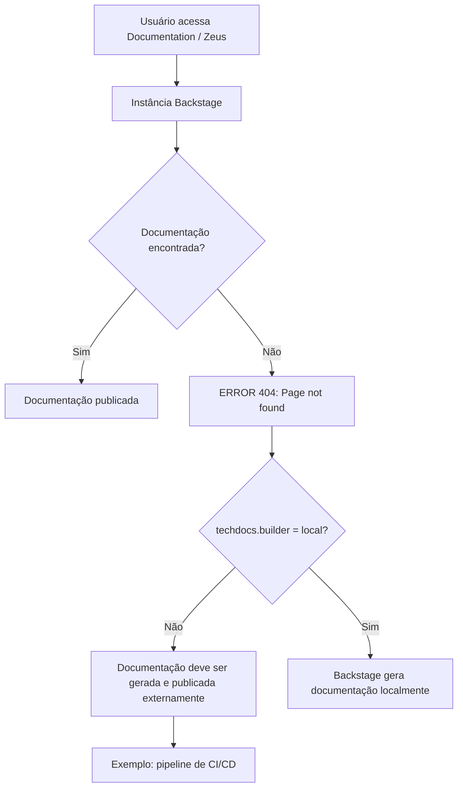

# Falha 404 de Documentação Técnica no Backstage TechDocs

## 1. Metadados do Documento
- **Arquivo de Origem:** Não identificado
- **Tipo de Documento:** Procedimento / Página de erro operacional
- **Domínio / Sistema:** Backstage TechDocs; portal de documentação Zeus
- **Público-Alvo:** Desenvolvedores, Arquitetos, Operação
- **Data/Versão Identificada:** Não identificada

---

## 2. Resumo Executivo & Contexto de Negócio

O conteúdo apresenta uma página de erro HTTP 404 no contexto de um portal Backstage, acessado pela navegação “Home / Solutions / APIs / Documentation / Zeus”. A página informa que a documentação técnica solicitada não foi encontrada.

A mensagem atribui o problema ao fato de `techdocs.builder` não estar configurado como `local`. Nessa configuração, a instância Backstage não gera documentação localmente quando os documentos não são encontrados.

O conteúdo orienta que a documentação do projeto deve ser gerada e publicada por um processo externo, com CI/CD citado como exemplo. Alternativamente, o parâmetro `techdocs.builder` pode ser alterado para `local`, permitindo a geração de documentação pela própria instância Backstage.

Não há especificação de projeto, URL, pipeline, repositório, tecnologia de documentação de origem, responsáveis ou procedimento operacional detalhado além das alternativas explicitamente apresentadas.

---

## 3. Arquitetura, Componentes & Tecnologias Envolvidas

Componentes e conceitos identificados:

| Componente / Tecnologia | Papel identificado no conteúdo |
| :--- | :--- |
| Backstage | Aplicação que exibe a página de erro e hospeda ou apresenta documentação técnica. |
| TechDocs | Mecanismo de documentação referido pela configuração `techdocs.builder`. |
| `techdocs.builder` | Configuração que determina se o Backstage gerará documentos localmente. |
| CI/CD pipeline | Processo externo citado como exemplo para geração e publicação de documentação. |
| Zeus | Elemento presente na navegação do portal; o conteúdo não detalha sua função. |
| Documentation | Área de documentação acessada no portal. |
| HTTP 404 | Erro apresentado para indicar que a página ou documentação não foi encontrada. |



> **Nota de Análise:** O conteúdo não informa onde a configuração `techdocs.builder` é mantida, como publicar a documentação, nem quais etapas compõem o pipeline de CI/CD.

---

## 4. Regras de Negócio, Especificações Funcionais & Processos

1. Quando uma documentação não é encontrada no portal Backstage, a aplicação apresenta a mensagem `ERROR 404: Page not found.`

2. Quando `techdocs.builder` não está definido como `local`, a instância Backstage não gera documentação caso ela não seja encontrada.

3. Nesse cenário, a documentação do projeto deve ser gerada e publicada por um processo externo.

4. Um pipeline de CI/CD é apresentado como exemplo de processo externo capaz de gerar e publicar os documentos.

5. Como alternativa ao processo externo, a configuração `techdocs.builder` pode ser alterada para `local`, para que a documentação seja gerada pela instância Backstage.

6. A tela oferece ações de retorno (“Go back”) e contato com suporte (“contact support”), mas não detalha destinos, responsáveis, canais ou critérios para acionamento.

---

## 5. Tabelas de Parâmetros, Ambientes e Estruturas de Dados

| Item / Parâmetro | Descrição / Função | Tipo / Valores / Formato | Ambiente / Observações |
| :--- | :--- | :--- | :--- |
| `techdocs.builder` | Configuração relacionada à geração de documentação pelo Backstage. | Valor citado: `local`. | Quando não está definido como `local`, a instância não gera documentos ausentes. |
| `local` | Valor de configuração que permite gerar documentação pela instância Backstage. | Valor textual de configuração. | O documento não descreve arquivo, variável de ambiente ou procedimento de alteração. |
| Processo externo | Mecanismo para gerar e publicar a documentação do projeto. | Processo operacional. | Necessário quando a documentação não é encontrada e o builder não é `local`. |
| CI/CD pipeline | Exemplo de processo externo para geração e publicação de documentos. | Pipeline de integração e entrega contínuas. | Apenas citado como exemplo; não há estágios, ferramentas ou comandos informados. |
| `ERROR 404` | Mensagem de erro exibida para página não encontrada. | Código HTTP / texto de interface. | Associado à indisponibilidade da documentação solicitada. |
| Zeus | Item exibido na navegação do portal. | Nome próprio / contexto de portal. | Sem detalhamento funcional adicional. |
| Idioma | Seletor visível na interface. | `EN`. | O conteúdo da página está em inglês. |

---

## 6. Bateria de Perguntas & Respostas para RAG (FAQ Sintético)

### P1: Por que a página de documentação exibe `ERROR 404: Page not found`?
**R:** A página informa que a documentação solicitada não foi encontrada. O conteúdo também indica que a instância Backstage não gera documentação ausente quando `techdocs.builder` não está configurado como `local`.

### P2: O que acontece quando `techdocs.builder` não está definido como `local`?
**R:** Quando `techdocs.builder` não está definido como `local`, a aplicação Backstage não gera os documentos caso eles não sejam encontrados. Nessa situação, a geração e a publicação devem ocorrer por um processo externo.

### P3: Como a documentação deve ser disponibilizada quando o Backstage não usa builder local?
**R:** A documentação deve ser gerada e publicada por um processo externo. A página cita um pipeline de CI/CD como exemplo desse processo externo.

### P4: Qual alternativa permite ao Backstage gerar documentação diretamente?
**R:** A alternativa mencionada é alterar `techdocs.builder` para `local`. Segundo a mensagem, essa configuração permite a geração dos documentos pela instância Backstage.

### P5: O conteúdo especifica qual pipeline de CI/CD deve ser utilizado?
**R:** Não. O conteúdo apenas cita um pipeline de CI/CD como exemplo de processo externo para geração e publicação da documentação. Não são identificadas ferramentas, estágios, comandos ou repositórios.

### P6: Em qual área do portal ocorreu o erro de documentação?
**R:** A navegação exibida na página é “Home / Solutions / APIs / Documentation / Zeus”. O conteúdo não detalha se Zeus representa uma solução, API, projeto ou outro recurso.

### P7: O documento informa como alterar a configuração `techdocs.builder`?
**R:** Não. A página apenas recomenda alterar `techdocs.builder` para `local` como alternativa. Não são fornecidos arquivo de configuração, comando, variável de ambiente ou procedimento de implantação.

### P8: O que fazer se a documentação não foi encontrada e a geração local não está habilitada?
**R:** A orientação apresentada é garantir que os documentos do projeto sejam gerados e publicados por um processo externo, como um pipeline de CI/CD.

### P9: A página de erro oferece alguma ação ao usuário?
**R:** Sim. A interface apresenta as opções “Go back” e “contact support”. O conteúdo não especifica os links, fluxos ou canais associados a essas ações.

### P10: O erro 404 significa que há falha confirmada no pipeline de CI/CD?
**R:** Não. O conteúdo não confirma falha em pipeline algum. Ele apenas informa que a documentação não foi encontrada e que, quando o builder não é local, um processo externo — por exemplo, CI/CD — deve gerar e publicar os documentos.

---

## 7. Glossário de Termos, Siglas & Conceitos-Chave

- **Backstage:** Aplicação mencionada como a instância que apresenta a documentação e a mensagem de erro.
- **TechDocs:** Componente ou mecanismo de documentação associado à configuração `techdocs.builder`.
- **`techdocs.builder`:** Parâmetro de configuração relacionado à forma de geração da documentação.
- **`local`:** Valor de `techdocs.builder` citado como opção para gerar documentos a partir da instância Backstage.
- **CI/CD:** Pipeline citado como exemplo de processo externo para gerar e publicar documentação.
- **HTTP 404:** Código de erro apresentado com a mensagem “Page not found”.
- **Zeus:** Nome exibido na navegação do portal; sem definição adicional no conteúdo.
- **Documentation:** Área de documentação exibida na navegação da aplicação.

---

## 8. Notas Críticas, Riscos & Limitações

- A documentação solicitada não está disponível no momento da consulta, resultando em erro 404.
- A geração local de documentação não está habilitada, conforme a mensagem sobre `techdocs.builder` não definido como `local`.
- Existe dependência de processo externo para geração e publicação dos documentos quando o builder local não é utilizado.
- O pipeline de CI/CD é apenas um exemplo; o conteúdo não confirma sua existência, execução, saúde ou responsável.
- Não há instruções para localizar a configuração, executar uma publicação, validar artefatos ou diagnosticar a causa da ausência da documentação.
- Não são fornecidos detalhes técnicos sobre Zeus, APIs, contratos, ambientes, URLs, versões ou equipes responsáveis.

---

## 9. Conteúdo Bruto Estruturado (Referência Fiel)

```text
--- [PÁGINA 1 DE 1] ---

ERROR 404: j: Page not found.
Note that techdocs.builder is not set to 'local' in
your config, which means this Backstage app will
not generate docs if they are not found. Make sure
the project's docs are generated and published by
some external process (e.g. CI/CD pipeline). Or
change techdocs.builder to 'local' to generate docs
from this Backstage instance.
Looks like someone
dropped the mic!
Go back... or please  if you
think this is a bug.
contact support
 / 
 CF
Home Solutions APIs Documentation Zeus
EN
```
