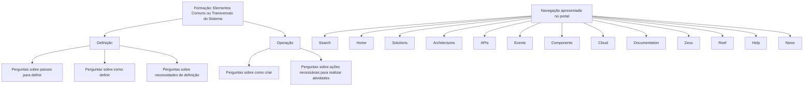

# Formação de Elementos Comuns do Sistema — Definição e Operação

## 1. Metadados do Documento
- **Arquivo de Origem:** Não identificado
- **Tipo de Documento:** Procedimento / Material de formação
- **Domínio / Sistema:** Sistema — elementos comuns ou transversais
- **Público-Alvo:** Utilizadores que necessitam definir ou operar elementos comuns do Sistema
- **Data/Versão Identificada:** Não identificada

---

## 2. Resumo Executivo & Contexto de Negócio

O documento apresenta a formação relacionada com os **elementos comuns ou transversais existentes no Sistema**. A formação é organizada em dois eixos funcionais: **Definição** e **Operação**.

A secção de **Definição** destina-se a apoiar questões sobre como configurar ou estabelecer elementos no Sistema. Os exemplos de perguntas apresentados incluem quais passos devem ser seguidos para definir algo, como um elemento é definido e o que fazer quando existe uma necessidade específica de definição.

A secção de **Operação** destina-se a apoiar atividades práticas realizadas sobre os elementos comuns ou transversais. Os exemplos incluem como criar algo e quais ações devem ser realizadas para executar determinada atividade.

O conteúdo fornecido não identifica quais elementos comuns são abrangidos, nem descreve telas, campos, permissões, regras de validação, integrações, APIs ou procedimentos detalhados. Também apresenta uma navegação de portal com categorias como *Search*, *Home*, *Solutions*, *Architectures*, *APIs*, *Events*, *Components*, *Cloud*, *Documentation*, *Zeus*, *Reef*, *Help* e *News*.

---

## 3. Arquitetura, Componentes & Tecnologias Envolvidas

O documento não apresenta uma arquitetura técnica de software, componentes tecnológicos, microsserviços, protocolos, ambientes ou integrações. O conteúdo descreve apenas a organização funcional da formação relativa aos elementos comuns ou transversais do Sistema.



**Nota de Análise:** O documento não detalha a relação entre as opções de navegação do portal e os conteúdos de formação sobre elementos comuns ou transversais.

---

## 4. Regras de Negócio, Especificações Funcionais & Processos

### 4.1 Organização da formação

A formação sobre elementos comuns ou transversais do Sistema é dividida nos seguintes apartados:

1. **Definição**
2. **Operação**

### 4.2 Escopo da secção Definição

A secção **Definição** deve permitir obter respostas para perguntas do tipo:

- Quais passos devem ser seguidos para definir determinado elemento.
- Como determinado elemento é definido.
- Quais ações devem ser tomadas quando for necessário realizar uma definição.

O documento não especifica:

- Quais elementos podem ser definidos.
- A sequência operacional de definição.
- Campos, valores, pré-requisitos ou validações.
- Perfis autorizados.
- Persistência, aprovação ou publicação das definições.

### 4.3 Escopo da secção Operação

A secção **Operação** deve permitir obter respostas para perguntas do tipo:

- Como criar determinado elemento.
- O que deve ser feito para realizar determinada atividade.

O documento não especifica:

- Quais objetos podem ser criados.
- Quais operações são permitidas após a criação.
- Fluxos de aprovação, exceções ou tratamento de erros.
- Regras de negócio associadas às operações.
- Interfaces, menus ou APIs utilizados para executar as operações.

---

## 5. Tabelas de Parâmetros, Ambientes e Estruturas de Dados

| Item / Parâmetro | Descrição / Função | Tipo / Valores / Formato | Ambiente / Observações |
| :--- | :--- | :--- | :--- |
| Elementos comuns | Elementos classificados pelo documento como comuns ou transversais no Sistema | Não detalhado | O documento não enumera os elementos |
| Formação | Conteúdo de capacitação relativo aos elementos comuns ou transversais | Dividida em Definição e Operação | Não identifica plataforma, curso ou versão |
| Definição | Apartado voltado a orientar como definir elementos | Perguntas sobre passos, definição e necessidades | Sem procedimento detalhado |
| Operação | Apartado voltado a orientar criação e execução de atividades | Perguntas sobre criação e ações necessárias | Sem procedimento detalhado |
| Search | Opção apresentada na navegação | Rótulo de navegação | Relação com a formação não detalhada |
| Home | Opção apresentada na navegação | Rótulo de navegação | Relação com a formação não detalhada |
| Solutions | Opção apresentada na navegação | Rótulo de navegação | Relação com a formação não detalhada |
| Architectures | Opção apresentada na navegação | Rótulo de navegação | Relação com a formação não detalhada |
| APIs | Opção apresentada na navegação | Rótulo de navegação | Relação com a formação não detalhada |
| Events | Opção apresentada na navegação | Rótulo de navegação | Relação com a formação não detalhada |
| Components | Opção apresentada na navegação | Rótulo de navegação | Relação com a formação não detalhada |
| Cloud | Opção apresentada na navegação | Rótulo de navegação | Relação com a formação não detalhada |
| Documentation | Opção apresentada na navegação | Rótulo de navegação | Relação com a formação não detalhada |
| Zeus | Opção apresentada na navegação | Rótulo de navegação | Significado não definido |
| Reef | Opção apresentada na navegação | Rótulo de navegação | Significado não definido |
| Help | Opção apresentada na navegação | Rótulo de navegação | Relação com a formação não detalhada |
| News | Opção apresentada na navegação | Rótulo de navegação | Relação com a formação não detalhada |
| EN | Indicador exibido na navegação | Código apresentado literalmente | O documento não explica o significado operacional |

---

## 6. Bateria de Perguntas & Respostas para RAG (FAQ Sintético)

### P1: Qual é o objetivo da formação sobre elementos comuns do Sistema?
**R:** O objetivo é disponibilizar formação relativa aos elementos comuns ou transversais existentes no Sistema. A formação está dividida nos apartados de Definição e Operação.

### P2: Em quais apartados a formação sobre elementos comuns ou transversais está dividida?
**R:** A formação está dividida em dois apartados: **Definição** e **Operação**.

### P3: Que tipo de perguntas a secção Definição deve responder?
**R:** A secção Definição deve responder a perguntas sobre os passos necessários para definir algo, como algo é definido e quais ações devem ser tomadas quando existe a necessidade de realizar uma definição.

### P4: O documento explica quais passos devem ser seguidos para definir um elemento específico?
**R:** Não. O documento informa que a secção Definição deve responder a perguntas sobre os passos para definir algo, mas não apresenta os passos concretos para nenhum elemento específico.

### P5: O que a secção Operação pretende esclarecer?
**R:** A secção Operação pretende esclarecer questões como a forma de criar algo e as ações necessárias para realizar determinada atividade.

### P6: O documento identifica quais elementos comuns podem ser criados ou operados?
**R:** Não. O documento menciona elementos comuns ou transversais existentes no Sistema, mas não apresenta uma lista desses elementos nem detalha suas operações.

### P7: Existem regras de validação, permissões ou campos de configuração descritos no material?
**R:** Não. O conteúdo fornecido não descreve regras de validação, perfis de acesso, campos, parâmetros ou valores de configuração.

### P8: Quais opções de navegação são exibidas no documento?
**R:** São exibidas as opções: Search, Home, Solutions, Architectures, APIs, Events, Components, Cloud, Documentation, Zeus, Reef, Help e News. Também aparece o indicador “EN”.

### P9: O documento descreve uma arquitetura técnica ou integração entre sistemas?
**R:** Não. O material não apresenta arquitetura técnica, tecnologias, integrações, APIs, microsserviços, ambientes ou fluxos de dados.

### P10: O que significa “elementos transversais” no contexto deste documento?
**R:** O documento utiliza a expressão “elementos comuns ou transversais existentes no Sistema”, mas não fornece uma definição adicional nem identifica quais elementos pertencem a essa classificação.

---

## 7. Glossário de Termos, Siglas & Conceitos-Chave

- **Elementos comuns:** Elementos existentes no Sistema classificados pelo documento como comuns; não são enumerados nem definidos em maior detalhe.
- **Elementos transversais:** Elementos existentes no Sistema classificados como transversais; o documento não esclarece seu escopo funcional ou técnico.
- **Definição:** Apartado da formação destinado a responder questões sobre como definir algo, quais passos seguir e o que fazer diante de uma necessidade de definição.
- **Operação:** Apartado da formação destinado a responder questões sobre como criar algo e o que fazer para realizar determinada atividade.
- **APIs:** Opção de navegação apresentada no documento. O significado e a relação com a formação não são detalhados.
- **Cloud:** Opção de navegação apresentada no documento. O significado e a relação com a formação não são detalhados.
- **Zeus:** Rótulo apresentado na navegação; não definido no conteúdo fornecido.
- **Reef:** Rótulo apresentado na navegação; não definido no conteúdo fornecido.
- **EN:** Indicador apresentado na navegação; não definido no conteúdo fornecido.

---

## 8. Notas Críticas, Riscos & Limitações

- O documento possui conteúdo resumido e não identifica os elementos comuns ou transversais cobertos pela formação.
- Não há instruções passo a passo para definição, criação ou operação de elementos.
- Não há detalhes sobre componentes técnicos, URLs, ambientes, APIs, permissões, contratos, dados, logs ou procedimentos de exceção.
- Os rótulos de navegação apresentados não possuem contexto funcional no conteúdo fornecido.
- **Nota de Análise:** O documento indica que as secções de Definição e Operação devem responder a determinados tipos de perguntas, porém não fornece as respostas operacionais para essas perguntas.

---

## 9. Conteúdo Bruto Estruturado (Referência Fiel)

```text
--- [PÁGINA 1 DE 1] ---

FORMACIÓN ELEMENTOS COMUNES
 En este apartado se encuentra la formación relativa a los elementos comunes o transversales existentes en el Sistema. Dicha formación está
dividida en los apartados siguientes:
Definición
Operación
DEFINICIÓN
Conseguir respuestas a preguntas del estilo:
¿Qué pasos he de seguir para poder definir...?
¿Cómo se define...?
¿Qué he de hacer si necesito...?
...
OPERACIÓN
Obtener respuestas a preguntas del tipo...
¿Cómo puedo crear...?
¿Qué hago para poder hacer...?
...
 / 
 CF
Search Home Solutions Architectures APIs Events Components Cloud Documentation Zeus Reef Help News
EN
```
