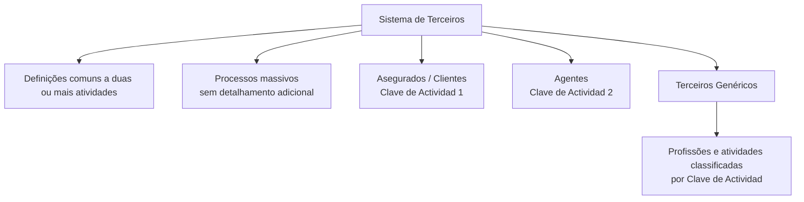

# Formação de Terceiros — Definição por Código de Atividade no Sistema

## 1. Metadados do Documento
- **Arquivo de Origem:** Não identificado
- **Tipo de Documento:** Especificação Funcional
- **Domínio / Sistema:** Cadastro e classificação de Terceiros
- **Público-Alvo:** Negócio, analistas funcionais, desenvolvedores e operação
- **Data/Versão Identificada:** Não identificada

---

## 2. Resumo Executivo & Contexto de Negócio

O documento descreve a formação, ou definição, de Terceiros no sistema por meio de códigos de atividade. A classificação abrange definições próprias ou particulares para cada atividade de Terceiros contemplada pelo sistema.

No contexto apresentado, pessoas físicas e pessoas jurídicas são consideradas sinônimos de Terceiros. Portanto, os documentos do domínio podem utilizar os termos “pessoas físicas”, “pessoas jurídicas” e “Terceiros” de maneira indistinta.

A estrutura funcional prevê definições comuns a múltiplas atividades de Terceiros, além de definições específicas para Asegurados/Clientes, Agentes e Terceiros Genéricos. O sistema identifica Asegurados/Clientes pela Clave de Actividad `1` e Agentes pela Clave de Actividad `2`.

Os Terceiros Genéricos correspondem a pessoas físicas ou jurídicas cujas atividades profissionais se enquadram em códigos de atividade predefinidos, tais como Peritos, Médicos, Advogados, Provedores, Oficinas, Clínicas e outros perfis operacionais.

> **Nota de Análise:** O conteúdo fornecido não detalha telas, entidades de dados, contratos de integração, regras de validação, métodos HTTP, processos massivos ou procedimentos operacionais associados aos códigos de atividade.

---

## 3. Arquitetura, Componentes & Tecnologias Envolvidas

O documento não apresenta arquitetura técnica de software, tecnologias, servidores, bancos de dados, APIs, microsserviços ou ambientes. A estrutura identificada é uma classificação funcional de Terceiros pelo código de atividade.



### Componentes e conceitos identificados

| Componente / Conceito | Descrição sustentada pelo documento |
| :--- | :--- |
| Sistema | Sistema que identifica categorias de Terceiros por Clave de Actividad. |
| Definições comuns | Definições aplicáveis a duas ou mais atividades de Terceiros, sem vinculação a uma atividade específica. |
| Processos massivos | Item citado no documento, sem descrição adicional. |
| Asegurados/Clientes | Categoria identificada no sistema pela Clave de Actividad `1`. |
| Agentes | Categoria identificada no sistema pela Clave de Actividad `2`. |
| Terceiros Genéricos | Pessoas físicas ou jurídicas cujas atividades laborais correspondem às profissões listadas no documento. |

---

## 4. Regras de Negócio, Especificações Funcionais & Processos

1. O sistema utiliza a **Clave de Actividad** para identificar e classificar Terceiros.
2. Pessoas físicas e pessoas jurídicas são tratadas como sinônimos de **Terceiros** no contexto documental.
3. As definições podem ser:
   - Próprias ou particulares de cada atividade de Terceiros.
   - Comuns a duas ou mais atividades de Terceiros.
4. As definições comuns não pertencem a uma atividade específica; elas afetam duas ou mais atividades de Terceiros.
5. A categoria **Asegurados/Clientes** é identificada pela Clave de Actividad `1`.
6. A categoria **Agentes** é identificada pela Clave de Actividad `2`.
7. A categoria **Terceiros Genéricos** inclui pessoas físicas ou jurídicas cuja atividade laboral corresponda às profissões ou atividades classificadas na tabela de códigos.
8. O documento cita **Processos Masivos**, mas não informa quais operações são executadas, quais Terceiros são afetados, nem condições de processamento.

---

## 5. Tabelas de Parâmetros, Ambientes e Estruturas de Dados

### Categorias principais de Terceiros

| Item / Parâmetro | Descrição / Função | Tipo / Valores / Formato | Ambiente / Observações |
| :--- | :--- | :--- | :--- |
| Clave de Actividad | Código utilizado pelo sistema para identificar uma categoria de Terceiro. | Código numérico. | Não há ambiente identificado. |
| Asegurados/Clientes | Terceiros classificados como Asegurados/Clientes. | Clave de Actividad `1`. | O documento não detalha regras adicionais. |
| Agentes | Terceiros classificados como Agentes. | Clave de Actividad `2`. | O documento não detalha regras adicionais. |
| Terceiros Genéricos | Pessoas físicas ou jurídicas enquadradas nas atividades listadas. | Códigos numéricos de atividade. | As atividades apresentadas constituem a classificação de Terceiros Genéricos. |
| Definições comuns | Definições aplicáveis a duas ou mais atividades de Terceiros. | Não especificado. | Não associadas a uma única atividade. |
| Processos Massivos | Processo citado como parte da estrutura documental. | Não especificado. | Sem detalhamento funcional ou técnico. |

### Códigos de atividade para Terceiros Genéricos

| Item / Parâmetro | Descrição / Função | Tipo / Valores / Formato | Ambiente / Observações |
| :--- | :--- | :--- | :--- |
| Clave de Actividad `3` | Peritos | Código numérico | Terceiro Genérico |
| Clave de Actividad `4` | Inspectores | Código numérico | Terceiro Genérico |
| Clave de Actividad `5` | Médicos | Código numérico | Terceiro Genérico |
| Clave de Actividad `6` | Abogados | Código numérico | Terceiro Genérico |
| Clave de Actividad `7` | Procuradores | Código numérico | Terceiro Genérico |
| Clave de Actividad `10` | Proveedores | Código numérico | Terceiro Genérico |
| Clave de Actividad `11` | Ejecutivos de Cta. | Código numérico | Terceiro Genérico |
| Clave de Actividad `12` | Cobradores | Código numérico | Terceiro Genérico |
| Clave de Actividad `15` | Empleados | Código numérico | Terceiro Genérico |
| Clave de Actividad `17` | Talleres | Código numérico | Terceiro Genérico |
| Clave de Actividad `18` | Clínicas | Código numérico | Terceiro Genérico |
| Clave de Actividad `19` | Juzgados | Código numérico | Terceiro Genérico |
| Clave de Actividad `20` | Cristaleros | Código numérico | Terceiro Genérico |
| Clave de Actividad `21` | Cerrajeros | Código numérico | Terceiro Genérico |
| Clave de Actividad `22` | Plomeros | Código numérico | Terceiro Genérico |
| Clave de Actividad `23` | Electricistas | Código numérico | Terceiro Genérico |
| Clave de Actividad `24` | Grúas | Código numérico | Terceiro Genérico |
| Clave de Actividad `25` | Investigadores | Código numérico | Terceiro Genérico |
| Clave de Actividad `26` | Recuperadores | Código numérico | Terceiro Genérico |
| Clave de Actividad `27` | Ajustadores | Código numérico | Terceiro Genérico |
| Clave de Actividad `28` | Herreros | Código numérico | Terceiro Genérico |
| Clave de Actividad `29` | Tribunales | Código numérico | Terceiro Genérico |
| Clave de Actividad `30` | Terceros Seg. MOTOR | Código numérico | Terceiro Genérico |
| Clave de Actividad `31` | Terceros Seg. SALUD | Código numérico | Terceiro Genérico |
| Clave de Actividad `32` | Terceros Seg. PATRIMONIALES | Código numérico | Terceiro Genérico |
| Clave de Actividad `33` | Depósitos | Código numérico | Terceiro Genérico |
| Clave de Actividad `34` | Notarías | Código numérico | Terceiro Genérico |
| Clave de Actividad `35` | Centros de Peritación | Código numérico | Terceiro Genérico |
| Clave de Actividad `36` | Comisarías | Código numérico | Terceiro Genérico |
| Clave de Actividad `38` | Filial | Código numérico | Terceiro Genérico |
| Clave de Actividad `45` | Representantes Legales | Código numérico | Terceiro Genérico |

---

## 6. Bateria de Perguntas & Respostas para RAG (FAQ Sintético)

### P1: Como o sistema identifica Asegurados ou Clientes?
**R:** O sistema identifica Asegurados/Clientes utilizando a **Clave de Actividad `1`**.

### P2: Qual é o código de atividade associado a Agentes?
**R:** Os Agentes são identificados no sistema pela **Clave de Actividad `2`**.

### P3: O que são Terceiros Genéricos no contexto do sistema?
**R:** Terceiros Genéricos são pessoas físicas ou jurídicas cujas atividades laborais correspondem às profissões e atividades classificadas pelos códigos de atividade apresentados no documento.

### P4: Pessoas físicas e pessoas jurídicas são tratadas de maneira diferente no cadastro de Terceiros?
**R:** Não. O documento estabelece que pessoas físicas e pessoas jurídicas são sinônimos de Terceiros, e os termos podem ser utilizados indistintamente na documentação.

### P5: O que são definições comuns a várias atividades de Terceiros?
**R:** São definições que não afetam uma atividade específica, mas que se aplicam a duas ou mais atividades de Terceiros.

### P6: Qual código deve ser utilizado para classificar Médicos?
**R:** Médicos são classificados pela **Clave de Actividad `5`** na categoria de Terceiros Genéricos.

### P7: Qual é a Clave de Actividad de Oficinas, identificadas como Talleres no documento?
**R:** Talleres são classificados pela **Clave de Actividad `17`**.

### P8: Quais códigos correspondem a Terceiros de seguros?
**R:** O documento lista `30` para **Terceros Seg. MOTOR**, `31` para **Terceros Seg. SALUD** e `32` para **Terceros Seg. PATRIMONIALES**.

### P9: Qual código identifica Representantes Legais?
**R:** Representantes Legales são classificados pela **Clave de Actividad `45`**.

### P10: O documento detalha como os Processos Masivos funcionam?
**R:** Não. O documento apenas cita “Procesos Masivos”, sem informar fluxo, regras, entradas, saídas, responsáveis ou tecnologias relacionadas.

---

## 7. Glossário de Termos, Siglas & Conceitos-Chave

- **Terceiro:** Pessoa física ou jurídica tratada pelo sistema e classificada por uma Clave de Actividad.
- **Clave de Actividad:** Código numérico usado para identificar a categoria ou atividade de um Terceiro.
- **Asegurados/Clientes:** Categoria de Terceiros identificada pela Clave de Actividad `1`.
- **Agentes:** Categoria de Terceiros identificada pela Clave de Actividad `2`.
- **Terceiros Genéricos:** Categoria que agrupa pessoas físicas ou jurídicas associadas às atividades profissionais listadas no documento.
- **Procesos Masivos:** Termo citado no documento sem detalhamento adicional.
- **Terceros Seg. MOTOR:** Categoria de Terceiros de seguros associada ao código `30`.
- **Terceros Seg. SALUD:** Categoria de Terceiros de seguros associada ao código `31`.
- **Terceros Seg. PATRIMONIALES:** Categoria de Terceiros de seguros associada ao código `32`.
- **Ejecutivos de Cta.:** Descrição associada ao código de atividade `11`; a expansão da abreviação “Cta.” não é informada no texto.

---

## 8. Notas Críticas, Riscos & Limitações

- O arquivo de origem, data, versão, autor e contexto organizacional não foram identificados no conteúdo fornecido.
- Não há descrição de arquitetura técnica, ambientes, URLs, serviços, APIs, bancos de dados, contratos de dados ou mecanismos de integração.
- O documento não explica o processo de criação, alteração, exclusão ou validação de uma Clave de Actividad.
- A listagem de atividades possui indicação de continuidade (`... ...`), portanto não é possível afirmar que a relação de códigos fornecida seja completa.
- O item **Processos Masivos** não contém detalhamento operacional ou técnico.
- Termos como **Terceros Seg. MOTOR**, **Terceros Seg. SALUD** e **Terceros Seg. PATRIMONIALES** são listados, mas não possuem definição funcional adicional.
- O conteúdo de navegação “CF / Search / Home / Solutions / Architectures / APIs / Events / Components / Cloud / Documentation / Zeus / Reef / Help / News / EN” aparece na extração, mas não é explicado como parte da especificação funcional.

---

## 9. Conteúdo Bruto Estruturado (Referência Fiel)

```text
--- [PÁGINA 1 DE 2] ---

FORMACIÓN de TERCEROS, DEFINICIÓN por Código de Actividad
Formación orientada a las Definiciones propias o particulares de cada una de las Actividades de Terceros contempladas en el Sistema.
Las personas físicas y jurídicas son sinónimos de Terceros por lo que en la redacción de los documentos se utilizarán estos términos indistintamente.
Definiciones COMUNES a Varias Actividades de Terceros
Este Apartado afecta no a una Actividad Específicas sino a 2 o más Actividades de los Terceros.
Procesos Masivos
Definiciones propias de Asegurados/Clientes
El Sistema identifica a los Asegurados con la Clave de Actividad... 1.
-
Definiciones específicas de Agentes
El Sistema identifica a los Agentes con la Clave de Actividad... 2.
-
Definiciones particulares de Terceros Genéricos
En el Sistema se consideran "Terceros Genéricos" todas aquellas personas físicas o jurídicas cuyas actividades laborales se corresponden con las siguientes
profesiones...
Clave Actividad Descripción
3 Peritos
4 Inspectores
5 Médicos
6 Abogados
7 Procuradores
10 Proveedores
11 Ejecutivos de Cta.
12 Cobradores
 / 
 CF
Search Home Solutions Architectures APIs Events Components Cloud Documentation Zeus Reef Help News
EN


--- [PÁGINA 2 DE 2] ---

Clave Actividad Descripción
15 Empleados
17 Talleres
18 Clínicas
19 Juzgados
20 Cristaleros
21 Cerrajeros
22 Plomeros
23 Electricistas
24 Grúas
25 Investigadores
26 Recuperadores
27 Ajustadores
28 Herreros
29 Tribunales
30 Terceros Seg. MOTOR
31 Terceros Seg. SALUD
32 Terceros Seg. PATRIMONIALES
33 Depósitos
34 Notarías
35 Centros de Peritación
36 Comisarías
38 Filial
45 Representantes Legales
... ...
-
```
