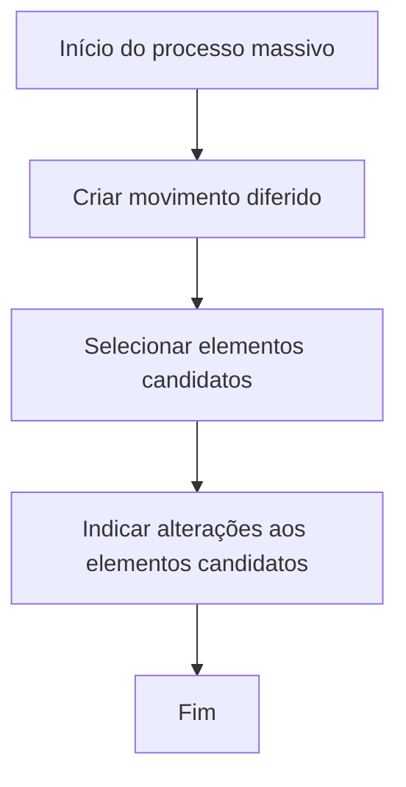

# Processo Massivo de Terceiros — Criação de Movimento Diferido

## 1. Metadados do Documento
- **Arquivo de Origem:** `Não informado`
- **Tipo de Documento:** `Procedimento`
- **Domínio / Sistema:** `Processo massivo de terceiros`
- **Público-Alvo:** `Não identificado`
- **Data/Versão Identificada:** `Não identificada`

---

## 2. Resumo Executivo & Contexto de Negócio

O documento descreve o processo denominado **processo massivo**, utilizado para preparar a execução diferida de determinadas operações relacionadas a terceiros. As operações podem ser realizadas em linha ou de forma diferida, sendo o processo massivo o mecanismo que determina qual operação diferida será executada, quais terceiros serão afetados e quais modificações serão aplicadas.

O objetivo declarado é orientar as ações necessárias no sistema para permitir a execução diferida de uma operação de **criação** ou **modificação** de um terceiro. O procedimento é aplicável independentemente do código ou dos códigos de atividade atribuídos ao terceiro.

O fluxo apresentado contém três etapas sequenciais: criar um movimento diferido, selecionar os elementos candidatos e indicar as alterações aplicáveis aos elementos selecionados. O documento não detalha telas, permissões, critérios de seleção, contratos de integração, métodos HTTP, persistência de dados ou validações técnicas.

---

## 3. Arquitetura, Componentes & Tecnologias Envolvidas

O conteúdo não apresenta uma arquitetura de software, servidores, microsserviços, APIs, bancos de dados ou tecnologias implementacionais. São citadas referências visuais ou de navegação: **CF**, **Home Solutions**, **APIs Documentation** e **Zeus**, sem explicação de função ou relação técnica.

O fluxo funcional explicitamente apresentado é:



**Nota de Análise:** o documento lista referências como “Home Solutions”, “APIs Documentation” e “Zeus”, porém não detalha se representam sistemas, módulos, links, ambientes ou componentes técnicos.

---

## 4. Regras de Negócio, Especificações Funcionais & Processos

1. Certas operações podem ser executadas em linha ou de maneira diferida.
2. Um **processo massivo** determina:
   - qual operação diferida será realizada;
   - quais terceiros serão afetados pela operação;
   - quais modificações serão aplicadas aos terceiros afetados.
3. O processo descrito permite preparar uma operação diferida de:
   - criação de um terceiro;
   - modificação de um terceiro.
4. A preparação da operação diferida independe do código ou dos códigos de atividade atribuídos ao terceiro.
5. O procedimento segue a sequência obrigatória:
   1. Criar movimento diferido.
   2. Selecionar elementos candidatos.
   3. Indicar alterações aos elementos candidatos.
   4. Finalizar o processo.

**Nota de Análise:** o documento não informa quais operações podem ser diferidas, como os terceiros são selecionados, quais alterações são permitidas, nem quais regras validam ou rejeitam um movimento diferido.

---

## 5. Tabelas de Parâmetros, Ambientes e Estruturas de Dados

| Item / Parâmetro | Descrição / Função | Tipo / Valores / Formato | Ambiente / Observações |
| :--- | :--- | :--- | :--- |
| Processo massivo | Define a operação diferida, os terceiros afetados e as modificações aplicáveis. | Processo funcional | Sem ambiente identificado. |
| Operação em linha | Execução de certas operações de forma imediata. | Modalidade de execução | Operações específicas não identificadas. |
| Operação diferida | Execução não imediata de certas operações. | Modalidade de execução | Usada no processo massivo descrito. |
| Movimento diferido | Primeira etapa do procedimento. | Etapa de processo | Não há detalhamento sobre campos, estados ou persistência. |
| Elementos candidatos | Elementos selecionados após a criação do movimento diferido. | Conjunto de elementos | O documento não define critérios de candidatura. |
| Alterações aos elementos candidatos | Modificações informadas para os elementos selecionados. | Etapa de processo | Tipos de alteração não identificados. |
| Terceiro | Entidade afetada por operações de criação ou modificação. | Entidade de negócio | Pode possuir um ou mais códigos de atividade. |
| Código de atividade | Código atribuído a um terceiro. | Código de classificação não especificado | O processo independe dos códigos atribuídos. |
| CF | Referência apresentada no documento. | Não especificado | Sem detalhamento adicional. |
| Home Solutions | Referência apresentada no documento. | Não especificado | Sem detalhamento adicional. |
| APIs Documentation | Referência apresentada no documento. | Não especificado | Sem detalhamento adicional. |
| Zeus | Referência apresentada no documento. | Não especificado | Sem detalhamento adicional. |

---

## 6. Bateria de Perguntas & Respostas para RAG (FAQ Sintético)

### P1: O que é um processo massivo de terceiros?
**R:** Um processo massivo é o processo que determina qual operação diferida será executada, quais terceiros serão afetados por essa operação e quais modificações serão aplicadas aos terceiros selecionados.

### P2: Quais modalidades de execução de operação são mencionadas?
**R:** O documento informa que certas operações podem ser realizadas em linha ou de maneira diferida. Não especifica quais operações estão disponíveis em cada modalidade.

### P3: Qual é o objetivo do procedimento de criação de processo massivo?
**R:** O objetivo é conhecer as ações necessárias no sistema para executar de maneira diferida uma operação de criação ou modificação de um terceiro, independentemente dos códigos de atividade atribuídos ao terceiro.

### P4: Quais são as etapas do processo massivo apresentado?
**R:** O processo possui três etapas: criar um movimento diferido, selecionar elementos candidatos e indicar alterações aos elementos candidatos. Após essas etapas, o fluxo é concluído.

### P5: O processo depende do código de atividade do terceiro?
**R:** Não. O documento afirma que a operação diferida de criação ou modificação pode ser preparada independentemente do código ou dos códigos de atividade atribuídos ao terceiro.

### P6: O que deve ser feito antes de selecionar elementos candidatos?
**R:** Deve ser criado um movimento diferido. A criação do movimento diferido é a primeira etapa do fluxo apresentado.

### P7: Como os elementos candidatos são selecionados?
**R:** O documento informa que os elementos candidatos devem ser selecionados após a criação do movimento diferido, mas não fornece critérios, filtros, regras de elegibilidade ou detalhes operacionais para essa seleção.

### P8: Quais alterações podem ser indicadas aos elementos candidatos?
**R:** O documento determina que devem ser indicadas alterações aos elementos candidatos, mas não especifica os tipos de alteração permitidos, campos envolvidos ou regras de validação.

### P9: O documento descreve APIs ou contratos técnicos para o processo massivo?
**R:** Não. Embora o texto apresente a referência “APIs Documentation”, não há métodos HTTP, endpoints, contratos JSON, autenticação, payloads ou códigos de resposta descritos.

### P10: O documento identifica sistemas ou componentes técnicos envolvidos?
**R:** O documento apresenta as referências “CF”, “Home Solutions”, “APIs Documentation” e “Zeus”, mas não explica sua função, integração ou responsabilidade no processo massivo.

---

## 7. Glossário de Termos, Siglas & Conceitos-Chave

- **Processo massivo:** processo que define uma operação diferida, os terceiros afetados e as modificações a aplicar.
- **Operação em linha:** modalidade de execução imediata mencionada no documento.
- **Operação diferida:** modalidade de execução preparada para realização não imediata.
- **Movimento diferido:** primeira etapa do fluxo de criação do processo massivo.
- **Elementos candidatos:** elementos selecionados para participação no processo massivo.
- **Terceiro:** entidade de negócio objeto de criação ou modificação.
- **Código de atividade:** código ou códigos atribuídos a um terceiro.
- **CF:** referência citada sem expansão ou definição no documento.
- **Home Solutions:** referência citada sem definição funcional ou técnica.
- **APIs Documentation:** referência citada sem documentação técnica associada no conteúdo fornecido.
- **Zeus:** referência citada sem definição funcional ou técnica.

---

## 8. Notas Críticas, Riscos & Limitações

- O conteúdo não identifica o arquivo de origem, versão, data, autor, sistema proprietário ou público-alvo.
- O documento não detalha critérios para selecionar terceiros ou elementos candidatos.
- Não há definição dos dados necessários para criar o movimento diferido.
- Não são descritos estados, agendamento, execução, monitoramento, cancelamento ou tratamento de falhas da operação diferida.
- Não há regras de autorização, matriz de permissões, trilha de auditoria ou controles operacionais.
- As referências **CF**, **Home Solutions**, **APIs Documentation** e **Zeus** não possuem detalhamento adicional.
- Não há contratos de API, interfaces, URLs, ambientes, logs, tabelas de banco de dados ou integrações identificadas.

---

## 9. Conteúdo Bruto Estruturado (Referência Fiel)

```text
--- [PÁGINA 1 DE 2] ---

CREAR PROCESO MASIVO TERCEROS
¿En qué consiste?
Temporalmente, la ejecución de ciertas operaciones se puede realizar en línea o de manera diferida.
Al proceso que determina qué operación diferida se va a realizar, cuales van a ser los Terceros
afectados por dicha operación y qué modificaciones van a sufrir estos, se le denomina proceso
masivo.
Objetivo
Conocer qué acciones se deben realizar en el Sistema para estar en disposición de ejecutar de
manera diferida una operación de Creación o Modificación de un Tercero, independientemente del
Código ó Códigos de Actividad que este tenga asignados.
Proceso a seguir
CREAR
movimiento
diferido (1)
SELECCIONAR
elementos
candidatos (2)
INDICAR cambios
a elementos
candidatos (3)
FIN
1. CREAR movimiento diferido
2. SELECCIONAR elementos candidatos
3. INDICAR cambios a elementos candidatos
 /
 CF
Home Solutions APIs Documentation Zeus
EN


--- [PÁGINA 2 DE 2] ---

[Página em branco ou apenas elementos visuais/imagem]
```
