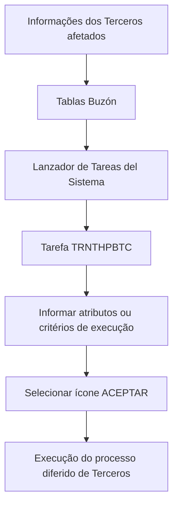

# Procedimento de Execução de Processo Diferido de Terceiros no Sistema

## 1. Metadados do Documento
- **Arquivo de Origem:** Não identificado
- **Tipo de Documento:** Procedimento
- **Domínio / Sistema:** Módulo de Terceros
- **Público-Alvo:** Operação e usuários responsáveis pela execução de processos no sistema
- **Data/Versão Identificada:** Não identificada

---

## 2. Resumo Executivo & Contexto de Negócio

O documento descreve o procedimento para executar um processo diferido em massa relacionado a **Terceros** no sistema. O objetivo declarado é orientar a execução após o detalhamento das informações dos terceiros afetados nas diferentes **Tablas Buzón**.

A execução ocorre por meio do **Lanzador de Tareas del Sistema**, utilizando a tarefa identificada pela chave **`TRNTHPBTC`**. O procedimento exige o preenchimento de atributos ou critérios de execução antes da confirmação.

O conteúdo disponível enumera critérios como código de companhia, data de tratamento, identificador do processo diferido, ordem, reprocessamento em caso de erro, idioma e usuário. Após o preenchimento, o operador deve selecionar o ícone **ACEPTAR**.

Não há detalhamento sobre os contratos técnicos da tarefa `TRNTHPBTC`, regras de validação dos campos, formatos esperados, efeitos do processamento, mensagens de erro ou comportamento de reprocessamento.

---

## 3. Arquitetura, Componentes & Tecnologias Envolvidas

Os elementos citados são:

- **Módulo de Terceros:** módulo no qual os processos diferidos são executados.
- **Tablas Buzón:** tabelas onde são detalhadas as informações dos terceiros afetados antes da execução.
- **Lanzador de Tareas del Sistema:** componente utilizado para iniciar o processo definido.
- **Tarefa `TRNTHPBTC`:** chave da tarefa usada para executar processos diferidos do módulo de Terceros.
- **Ícone ACEPTAR:** ação final de confirmação da execução.



> **Nota de Análise:** O documento não descreve servidores, APIs, métodos HTTP, bancos de dados, protocolos, tecnologias de implementação ou fluxos internos da tarefa `TRNTHPBTC`.

---

## 4. Regras de Negócio, Especificações Funcionais & Processos

1. As informações dos **Terceros afetados** devem ser detalhadas previamente nas diferentes **Tablas Buzón**.
2. Após o detalhamento nas Tablas Buzón, o processo definido deve ser executado pelo **Lanzador de Tareas del Sistema**.
3. Os processos diferidos do módulo de Terceros são executados pela tarefa cuja chave é **`TRNTHPBTC`**.
4. A execução requer o preenchimento dos atributos ou critérios informados no documento.
5. Entre os critérios apresentados estão:
   - Código de Companhia;
   - Data de Tratamento;
   - Identificador do Processo Diferido;
   - Ordem;
   - Voltar a Processar em caso de Erro;
   - Idioma;
   - Usuário;
   - Chave de Usuário.
6. Após informar os atributos ou critérios de execução, o operador deve selecionar o ícone **ACEPTAR**.

> **Nota de Análise:** O documento não informa quais critérios são obrigatórios, quais valores são aceitos, como a ordem é interpretada, nem em quais condições o reprocessamento por erro deve ser habilitado.

---

## 5. Tabelas de Parâmetros, Ambientes e Estruturas de Dados

| Item / Parâmetro | Descrição / Função | Tipo / Valores / Formato | Ambiente / Observações |
| :--- | :--- | :--- | :--- |
| `TRNTHPBTC` | Chave da tarefa para executar processos diferidos do módulo de Terceros. | Chave de tarefa. | Executada pelo Lanzador de Tareas del Sistema. |
| Código de Companhia | Critério de execução informado para a tarefa. | Não especificado. | O documento não detalha valores aceitos. |
| Data de Tratamento | Critério de execução informado para a tarefa. | Data; formato não especificado. | É citada duas vezes no conteúdo extraído. |
| Identificador do Processo Diferido | Critério para identificar o processo diferido. | Não especificado. | O documento não descreve a origem ou estrutura do identificador. |
| Ordem | Critério de execução. | Não especificado. | Sem regra de ordenação documentada. |
| Voltar a Processar em caso de Erro | Critério relacionado ao reprocessamento em caso de erro. | Não especificado. | Não há condições ou comportamento de reprocessamento descritos. |
| Idioma | Critério de execução. | Não especificado. | Repetido três vezes no conteúdo extraído. |
| Usuário | Critério de execução. | Não especificado. | Sem detalhamento de autenticação ou perfil. |
| Chave de Usuário | Critério associado ao usuário. | Não especificado. | O documento não define formato ou finalidade adicional. |
| Tablas Buzón | Estruturas onde são detalhadas as informações dos Terceros afetados. | Tabelas; estrutura não especificada. | Pré-requisito para a execução do processo. |
| Lanzador de Tareas del Sistema | Componente para executar o processo definido. | Componente funcional do sistema. | Aciona a tarefa `TRNTHPBTC`. |
| ACEPTAR | Ícone utilizado para confirmar a execução. | Ação de interface. | Deve ser acionado após o preenchimento dos critérios. |

---

## 6. Bateria de Perguntas & Respostas para RAG (FAQ Sintético)

### P1: Qual é o objetivo do procedimento de execução do processo diferido de Terceros?
**R:** O objetivo é orientar o procedimento necessário para executar um processo diferido de Terceros no sistema, depois que as informações dos terceiros afetados tiverem sido detalhadas nas diferentes Tablas Buzón.

### P2: Qual tarefa deve ser utilizada para executar processos diferidos do módulo de Terceros?
**R:** Os processos diferidos do módulo de Terceros devem ser executados pela tarefa cuja chave é `TRNTHPBTC`.

### P3: Onde o processo diferido de Terceros deve ser iniciado?
**R:** O processo definido deve ser executado por meio do Lanzador de Tareas del Sistema.

### P4: Qual é o pré-requisito antes de iniciar a tarefa `TRNTHPBTC`?
**R:** Antes de iniciar a tarefa `TRNTHPBTC`, as informações dos Terceros afetados devem estar detalhadas nas diferentes Tablas Buzón.

### P5: Quais critérios de execução são citados para a tarefa `TRNTHPBTC`?
**R:** O documento cita Código de Companhia, Data de Tratamento, Identificador do Processo Diferido, Ordem, Voltar a Processar em caso de Erro, Idioma, Usuário e Chave de Usuário.

### P6: Como o operador confirma a execução do processo diferido?
**R:** Após informar os atributos ou critérios de execução, o operador deve selecionar o ícone ACEPTAR.

### P7: O documento informa o formato da Data de Tratamento?
**R:** Não. O documento menciona a Data de Tratamento como critério de execução, mas não especifica o formato aceito.

### P8: O documento explica quando habilitar “Voltar a Processar em caso de Erro”?
**R:** Não. O campo é listado entre os critérios de execução, mas o documento não detalha as condições, regras ou efeitos do reprocessamento.

### P9: O documento informa métodos HTTP ou contratos de integração da tarefa `TRNTHPBTC`?
**R:** Não. O conteúdo não apresenta métodos HTTP, endpoints, contratos JSON, APIs ou detalhes técnicos internos da tarefa `TRNTHPBTC`.

### P10: O que são as Tablas Buzón no contexto do procedimento?
**R:** As Tablas Buzón são as tabelas onde devem ser detalhadas as informações dos Terceros afetados antes da execução do processo diferido.

---

## 7. Glossário de Termos, Siglas & Conceitos-Chave

- **Terceros:** Entidade ou módulo citado no documento; o conteúdo não apresenta tradução ou definição funcional adicional.
- **Tablas Buzón:** Tabelas utilizadas para detalhar informações dos Terceros afetados antes da execução.
- **Lanzador de Tareas del Sistema:** Componente do sistema usado para iniciar o processo definido.
- **Processo Diferido:** Processo executado por meio da tarefa `TRNTHPBTC`; o documento não detalha seu agendamento ou processamento interno.
- **`TRNTHPBTC`:** Chave da tarefa que executa processos diferidos do módulo de Terceros.
- **ACEPTAR:** Ícone selecionado para confirmar a execução após o preenchimento dos critérios.

---

## 8. Notas Críticas, Riscos & Limitações

- O documento não identifica arquivo de origem, versão, data, sistema corporativo completo ou ambiente de execução.
- Não há definição de campos obrigatórios, formatos, domínios de valores ou validações para os critérios de execução.
- Não são descritos os efeitos funcionais da tarefa `TRNTHPBTC` sobre os registros de Terceros.
- O comportamento do reprocessamento em caso de erro não é detalhado.
- Não há informações sobre logs, monitoramento, mensagens de erro, permissões, auditoria ou recuperação operacional.
- Não são apresentados contratos técnicos, APIs, URLs, tecnologias ou dependências externas.

---

## 9. Conteúdo Bruto Estruturado (Referência Fiel)

```text
--- [PÁGINA 1 DE 2] ---

EJECUTAR Proceso Masivo TERCEROS
Objetivo
Conocer el procedimiento que se ha de seguir para ejecutar un proceso diferido de Terceros en el
Sistema.
Ejecutar Proceso Diferido
Una vez se ha detallado la información de los Terceros afectados en las diferentes Tablas Buzón se
tiene que ejecutar el proceso definido mediante el Lanzador de Tareas del Sistema:
Los Procesos Diferidos del módulo de Terceros se ejecutan con la Tarea que tiene por clave:
TRNTHPBTC, informando los siguientes Atributos o criterios de ejecución...
Código de Compañía
 /
 CF
Home Solutions APIs Documentation Zeus
EN


--- [PÁGINA 2 DE 2] ---

Código de Compañía
Fecha de Tratamiento
Fecha de Tratamiento.
#### Identificador del Proceso Diferido
Orden
Volver a Procesar en caso de Error
Idioma
Idioma
Idioma
Usuario
Clave de Usuario
... y por último, se pulsa el icono ACEPTAR.
```
