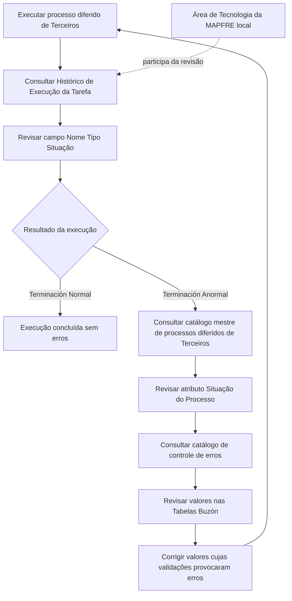

# Procedimento de Revisão do Processo Massivo de Terceiros

## 1. Metadados do Documento
- **Arquivo de Origem:** Não identificado
- **Tipo de Documento:** Procedimento
- **Domínio / Sistema:** Processo diferido de Terceiros — MAPFRE local
- **Público-Alvo:** Operação e área de Tecnologia da empresa MAPFRE local
- **Data/Versão Identificada:** Não identificada

---

## 2. Resumo Executivo & Contexto de Negócio

O documento descreve o procedimento para revisar o resultado da execução de um processo diferido associado ao domínio de Terceiros. A verificação principal ocorre no Histórico de Execução da Tarefa, com foco no campo **Nome Tipo Situação**.

O resultado esperado de uma execução sem erros é o valor **“Terminación Normal”**. Quando a execução apresenta falhas, o campo exibe **“Terminación Anormal”**, iniciando um fluxo adicional de diagnóstico e correção.

Em caso de término anormal, a equipe deve consultar o catálogo mestre de processos diferidos de Terceiros para identificar o valor do atributo **Situação do Processo**, além de consultar o detalhe registrado no catálogo de controle de erros dos processos diferidos de Terceiros.

A correção requer a revisão dos valores informados nas Tabelas Buzón e o ajuste daqueles cujas validações tenham provocado erros. Após as correções, o processo diferido deve ser executado novamente, de forma sucessiva, até alcançar o resultado final.

O documento ressalta que, no estado atual, a revisão do processo deve ser realizada com participação da área de Tecnologia da empresa MAPFRE local.

---

## 3. Arquitetura, Componentes & Tecnologias Envolvidas

Os componentes e repositórios de informação explicitamente citados são:

- Processo diferido de Terceiros.
- Histórico de Execução da Tarefa.
- Campo **Nome Tipo Situação**.
- Catálogo mestre de processos diferidos de Terceiros.
- Atributo **Situação do Processo**.
- Catálogo de controle de erros dos processos diferidos de Terceiros.
- Tabelas Buzón.
- Área de Tecnologia da empresa MAPFRE local.



> **Nota de Análise:** O documento não detalha tecnologias de implementação, métodos HTTP, contratos de integração, estruturas de banco de dados, endereços de ambientes ou responsabilidades específicas por equipe além da participação da área de Tecnologia da MAPFRE local.

---

## 4. Regras de Negócio, Especificações Funcionais & Processos

1. Após executar o processo diferido, deve-se comprovar o resultado no Histórico de Execução da Tarefa.
2. A revisão deve ser realizada especificamente no conteúdo do campo **Nome Tipo Situação**.
3. Quando a execução termina sem erros, o campo deve apresentar o valor **“Terminación Normal”**.
4. Quando a execução termina com erros, o campo deve apresentar o valor **“Terminación Anormal”**.
5. Para uma execução com **“Terminación Anormal”**, deve-se:
   1. Acessar o catálogo mestre de processos diferidos de Terceiros.
   2. Consultar o valor do atributo **Situação do Processo**.
   3. Consultar o detalhe no catálogo de controle de erros dos processos diferidos de Terceiros.
   4. Revisar os valores informados nas Tabelas Buzón.
   5. Corrigir os valores cujas validações tenham provocado erros.
   6. Executar novamente o processo diferido.
6. A reexecução deve ocorrer por aproximações sucessivas até obter o resultado final.
7. A revisão do processo requer, atualmente, a participação da área de Tecnologia da empresa MAPFRE local.

---

## 5. Tabelas de Parâmetros, Ambientes e Estruturas de Dados

| Item / Parâmetro | Descrição / Função | Tipo / Valores / Formato | Ambiente / Observações |
| :--- | :--- | :--- | :--- |
| Processo diferido de Terceiros | Processo submetido à execução e posterior revisão operacional | Não detalhado | Deve ser executado novamente após correções |
| Histórico de Execução da Tarefa | Local de comprovação do resultado da execução | Não detalhado | Revisar especificamente o campo Nome Tipo Situação |
| Campo Nome Tipo Situação | Campo usado para identificar o resultado da execução | “Terminación Normal” ou “Terminación Anormal” | “Terminación Normal” indica ausência de erros |
| Terminación Normal | Resultado de execução concluída sem erros | Valor textual | Resultado esperado para conclusão normal |
| Terminación Anormal | Resultado de execução concluída com erros | Valor textual | Exige consulta aos catálogos e correção de dados |
| Catálogo mestre de processos diferidos de Terceiros | Catálogo consultado após término anormal | Não detalhado | Usado para conhecer o atributo Situação do Processo |
| Situação do Processo | Atributo do catálogo mestre | Não detalhado | Deve ser consultado quando houver término anormal |
| Catálogo de controle de erros dos processos diferidos de Terceiros | Fonte de detalhe sobre erros | Não detalhado | Consultado após término anormal |
| Tabelas Buzón | Tabelas cujos valores devem ser revisados e corrigidos | Não detalhado | Corrigir valores com validações que provocaram erros |
| Área de Tecnologia da MAPFRE local | Área que participa da revisão do processo | Área organizacional | Participação requerida no estado atual do procedimento |

---

## 6. Bateria de Perguntas & Respostas para RAG (FAQ Sintético)

### P1: Onde deve ser verificado o resultado do processo diferido de Terceiros?
**R:** O resultado deve ser comprovado no Histórico de Execução da Tarefa, revisando especificamente o conteúdo do campo **Nome Tipo Situação**.

### P2: Qual valor indica que o processo diferido foi executado sem erros?
**R:** O valor **“Terminación Normal”** no campo Nome Tipo Situação indica que a execução terminou sem erros.

### P3: O que significa o valor “Terminación Anormal” no Histórico de Execução?
**R:** **“Terminación Anormal”** indica que a execução do processo terminou com erros. Nessa condição, deve-se investigar a Situação do Processo, o catálogo de controle de erros e os valores das Tabelas Buzón.

### P4: O que deve ser consultado após uma execução com término anormal?
**R:** Deve-se acessar o catálogo mestre de processos diferidos de Terceiros para conhecer o valor do atributo **Situação do Processo** e consultar o detalhe disponível no catálogo de controle de erros dos processos diferidos de Terceiros.

### P5: Qual é o papel das Tabelas Buzón na correção do processo?
**R:** Os valores informados nas Tabelas Buzón devem ser revisados. Aqueles cujas validações tenham provocado erros devem ser corrigidos antes de uma nova execução do processo diferido.

### P6: O processo deve ser executado novamente após corrigir erros?
**R:** Sim. Após corrigir os valores que provocaram erros de validação nas Tabelas Buzón, o processo diferido deve ser executado novamente.

### P7: Como deve ocorrer a reexecução do processo diferido?
**R:** A reexecução deve ocorrer por aproximações sucessivas, repetindo revisão, correção e execução até chegar ao resultado final.

### P8: A revisão do processo pode ser feita sem participação da área de Tecnologia?
**R:** O documento informa que, atualmente, a revisão do processo deve ser realizada com participação da área de Tecnologia da empresa MAPFRE local.

### P9: O documento especifica quais validações causam os erros nas Tabelas Buzón?
**R:** Não. O documento determina que sejam corrigidos os valores cujas validações tenham provocado erros, mas não detalha regras de validação, campos específicos ou mensagens de erro.

### P10: O documento descreve contratos técnicos, métodos HTTP ou interfaces do processo?
**R:** Não. O documento apresenta o procedimento operacional de revisão e correção, mas não detalha métodos HTTP, contratos JSON, tecnologias, URLs, portas ou interfaces técnicas.

---

## 7. Glossário de Termos, Siglas & Conceitos-Chave

- **Buzón:** Nome das tabelas cujos valores devem ser revisados e corrigidos quando suas validações provocarem erros.
- **Histórico de Execução da Tarefa:** Registro consultado para comprovar o resultado da execução do processo diferido.
- **MAPFRE local:** Empresa ou unidade local cuja área de Tecnologia deve participar da revisão do processo.
- **Processo diferido:** Processo cuja execução é revisada após seu término e que pode ser reexecutado após correções.
- **Situação do Processo:** Atributo disponível no catálogo mestre de processos diferidos de Terceiros, consultado em caso de término anormal.
- **Terminación Anormal:** Valor que indica término da execução com erros.
- **Terminación Normal:** Valor que indica término da execução sem erros.
- **Terceiros:** Domínio funcional associado ao processo diferido, aos catálogos e ao controle de erros descritos.

---

## 8. Notas Críticas, Riscos & Limitações

- O procedimento depende da participação da área de Tecnologia da empresa MAPFRE local.
- Uma execução com **“Terminación Anormal”** exige investigação em múltiplas fontes: Histórico de Execução, catálogo mestre, catálogo de controle de erros e Tabelas Buzón.
- O processo pode exigir múltiplas reexecuções por aproximações sucessivas até atingir o resultado final.
- O documento não detalha os critérios de validação aplicados às Tabelas Buzón.
- O documento não informa como localizar tecnicamente os catálogos, quais campos específicos devem ser corrigidos, nem quais mensagens de erro podem ocorrer.
- Não foram identificados ambientes, URLs, credenciais, versões, tecnologias ou contratos de integração.

---

## 9. Conteúdo Bruto Estruturado (Referência Fiel)

```text
--- [PÁGINA 1 DE 1] ---

REVISAR Proceso Masivo TERCEROS
Revisar el Resultado de la Ejecución del Proceso Diferido
Una vez ejecutado el proceso se tiene que comprobar el resultado en el Historial de Ejecución de la
Tarea: Específicamente revisar el contenido del Campo Nombre Tipo Situación.
Si la ejecución ha terminado sin errores su valor será “Terminación Normal”, mientras que en caso
contrario mostrará "Terminación Anormal". En este caso se debe acceder al catálogo maestro de
procesos diferidos de Terceros para conocer el valor del Atributo Situación del Proceso además del
detalle en el catálogo de control de errores de los procesos diferidos de Terceros.
Se deberán revisar los valores informados en las Tablas Buzón y corregir aquellos cuyas validaciones
hayan provocado errores.
Tras ello se tendrá que ejecutar nuevamente el proceso diferido para llegar a su resultado final
mediante la ejecución de aproximaciones sucesivas.
NOTA: La revisión del Proceso, hoy por hoy, se tiene que realizar con la participación del área de
Tecnología de la empresa MAPFRE local.
 / 
 CF
Home Solutions APIs Documentation Zeus
EN
```
