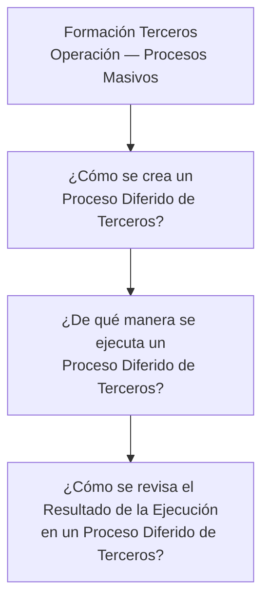

# Formação de Terceiros — Operação de Processos Massivos: Processos Diferidos

## 1. Metadados do Documento
- **Arquivo de Origem:** `Não identificado no conteúdo fornecido`
- **Tipo de Documento:** `Material de formação operacional`
- **Domínio / Sistema:** `Terceiros — Operação — Processos Massivos`
- **Público-Alvo:** `Operação`
- **Data/Versão Identificada:** `Não identificada`

---

## 2. Resumo Executivo & Contexto de Negócio

O conteúdo fornecido é um trecho de material de formação intitulado **“FORMACIÓN TERCEROS - OPERACIÓN - PROCESOS MASIVOS”**. O material está associado ao domínio de Terceiros, à operação e a processos massivos.

O trecho estrutura a formação em torno de três questões operacionais: criação de um **Proceso Diferido de Terceros**, execução de um **Proceso Diferido de Terceros** e revisão do resultado de execução desse processo.

Também há uma sequência de rótulos de navegação ou categorias: `Search`, `Home`, `Solutions`, `Architectures`, `APIs`, `Events`, `Components`, `Cloud`, `Documentation`, `Zeus`, `Reef`, `Help` e `News`, além dos marcadores `CF` e `EN`.

**Nota de Análise:** o conteúdo fornecido não descreve procedimentos, pré-requisitos, telas, parâmetros, papéis, métodos de execução, resultados esperados, contratos de API ou critérios de validação para os Processos Diferidos de Terceiros.

---

## 3. Arquitetura, Componentes & Tecnologias Envolvidas

O trecho não apresenta arquitetura técnica, integração entre sistemas, tecnologias, componentes de software, ambientes ou interfaces detalhadas. Os únicos elementos identificáveis são o tema operacional de Processos Diferidos de Terceiros e os rótulos de navegação exibidos no conteúdo bruto.



**Nota de Análise:** o diagrama representa somente a sequência temática das três perguntas apresentadas no material. O conteúdo não detalha um fluxo operacional executável nem relações técnicas entre componentes.

---

## 4. Regras de Negócio, Especificações Funcionais & Processos

O conteúdo fornecido apresenta os seguintes tópicos de processo:

1. Criação de um **Proceso Diferido de Terceros**.
2. Execução de um **Proceso Diferido de Terceros**.
3. Revisão do **Resultado de la Ejecución** de um **Proceso Diferido de Terceros**.

Não foram identificadas regras de negócio explícitas, condições de elegibilidade, validações, cálculos, exceções, critérios de aprovação, permissões, prazos ou instruções passo a passo.

| Processo ou tópico | Informação sustentada pelo conteúdo | Detalhamento disponível |
| :--- | :--- | :--- |
| Criação de Processo Diferido de Terceiros | O material pergunta como criar um processo diferido relacionado a Terceiros. | Não detalhado. |
| Execução de Processo Diferido de Terceiros | O material pergunta de que maneira executar um processo diferido relacionado a Terceiros. | Não detalhado. |
| Revisão do resultado de execução | O material pergunta como revisar o resultado da execução de um processo diferido relacionado a Terceiros. | Não detalhado. |

---

## 5. Tabelas de Parâmetros, Ambientes e Estruturas de Dados

| Item / Parâmetro | Descrição / Função | Tipo / Valores / Formato | Ambiente / Observações |
| :--- | :--- | :--- | :--- |
| Formação de Terceiros | Título ou contexto principal do material. | `FORMACIÓN TERCEROS` | Associado a Operação e Processos Massivos. |
| Operação | Área indicada no título do material. | `OPERACIÓN` | Não há detalhamento de responsabilidades operacionais. |
| Processos Massivos | Tema indicado no título do material. | `PROCESOS MASIVOS` | Não há definição adicional. |
| Processo Diferido de Terceiros | Processo citado nas três perguntas do material. | `Proceso Diferido de Terceros` | Não são informados parâmetros, entradas ou saídas. |
| Resultado da Execução | Resultado cuja revisão é abordada como tópico de formação. | `Resultado de la Ejecución` | Não são informados status, métricas ou formato de resultado. |
| CF | Marcador presente no conteúdo bruto. | `CF` | Significado não detalhado. |
| EN | Marcador de idioma ou navegação presente no conteúdo bruto. | `EN` | O significado não é explicado no material. |
| Search | Rótulo presente no conteúdo bruto. | `Search` | Possível item de navegação; função não detalhada. |
| Home | Rótulo presente no conteúdo bruto. | `Home` | Possível item de navegação; função não detalhada. |
| Solutions | Rótulo presente no conteúdo bruto. | `Solutions` | Possível item de navegação; função não detalhada. |
| Architectures | Rótulo presente no conteúdo bruto. | `Architectures` | Possível item de navegação; função não detalhada. |
| APIs | Rótulo presente no conteúdo bruto. | `APIs` | Não há endpoints, contratos ou tecnologias descritos. |
| Events | Rótulo presente no conteúdo bruto. | `Events` | Não há eventos, tópicos ou mensagens descritos. |
| Components | Rótulo presente no conteúdo bruto. | `Components` | Não há componentes identificados. |
| Cloud | Rótulo presente no conteúdo bruto. | `Cloud` | Não há provedor, conta ou ambiente informado. |
| Documentation | Rótulo presente no conteúdo bruto. | `Documentation` | Possível item de navegação; função não detalhada. |
| Zeus | Rótulo presente no conteúdo bruto. | `Zeus` | Não há definição do termo. |
| Reef | Rótulo presente no conteúdo bruto. | `Reef` | Não há definição do termo. |
| Help | Rótulo presente no conteúdo bruto. | `Help` | Possível item de navegação; função não detalhada. |
| News | Rótulo presente no conteúdo bruto. | `News` | Possível item de navegação; função não detalhada. |

---

## 6. Bateria de Perguntas & Respostas para RAG (FAQ Sintético)

### P1: Qual é o tema principal do material fornecido?
**R:** O material trata de Formação de Terceiros, Operação e Processos Massivos, conforme o título `FORMACIÓN TERCEROS - OPERACIÓN - PROCESOS MASIVOS`.

### P2: Quais tópicos sobre Processo Diferido de Terceiros são apresentados?
**R:** O material apresenta três tópicos: como criar um Processo Diferido de Terceiros, como executar um Processo Diferido de Terceiros e como revisar o resultado da execução de um Processo Diferido de Terceiros.

### P3: O documento explica como criar um Processo Diferido de Terceiros?
**R:** Não. O documento apresenta a pergunta “¿Cómo se crea un Proceso Diferido de Terceros?”, mas não fornece etapas, parâmetros, telas, permissões ou critérios para a criação.

### P4: O documento informa como executar um Processo Diferido de Terceiros?
**R:** Não. O material pergunta “¿De qué manera se ejecuta un Proceso Diferido de Terceros?”, porém não descreve o mecanismo, comando, interface, agenda ou requisito de execução.

### P5: Como o resultado da execução deve ser revisado?
**R:** O material indica a revisão do resultado da execução como um tópico de formação, por meio da pergunta “¿Cómo se revisa el Resultado de la Ejecución en un Proceso Diferido de Terceros?”. Não há instruções adicionais sobre consulta, status, evidências ou tratamento de erros.

### P6: Existem regras de negócio para Processos Diferidos de Terceiros?
**R:** Não foram identificadas regras de negócio explícitas no conteúdo fornecido. O trecho contém apenas perguntas orientadoras sobre criação, execução e revisão de resultados.

### P7: O material fornece APIs, eventos ou contratos de integração?
**R:** Não. Embora os rótulos `APIs` e `Events` apareçam no conteúdo bruto, o material não apresenta endpoints, payloads, eventos, filas, tópicos, protocolos ou contratos de integração.

### P8: Quais ambientes ou tecnologias são definidos no documento?
**R:** Nenhum ambiente ou tecnologia é definido. O rótulo `Cloud` aparece no conteúdo bruto, mas não há indicação de provedor, conta, região, infraestrutura ou configuração.

### P9: O que significam Zeus, Reef e CF no contexto apresentado?
**R:** O conteúdo contém os termos `Zeus`, `Reef` e `CF`, mas não fornece definição, expansão de sigla, relação com o processo ou responsabilidades associadas.

### P10: O documento contém critérios para identificar sucesso ou falha de execução?
**R:** Não. O documento menciona a revisão do resultado da execução, mas não especifica status, mensagens, códigos de erro, indicadores de sucesso ou procedimentos de contingência.

---

## 7. Glossário de Termos, Siglas & Conceitos-Chave

- **Formación Terceros:** expressão presente no título do material; refere-se ao contexto de formação associado a Terceiros.
- **Operación:** área ou contexto operacional indicado no título do material.
- **Procesos Masivos:** tema indicado no título; o trecho não fornece definição adicional.
- **Proceso Diferido de Terceros:** processo relacionado a Terceiros cuja criação, execução e revisão de resultado são abordadas como perguntas de formação.
- **Resultado de la Ejecución:** resultado produzido pela execução de um Processo Diferido de Terceiros; formato e critérios não especificados.
- **API:** termo exibido como rótulo `APIs`; não há definição ou contrato técnico no conteúdo.
- **CF:** marcador presente no conteúdo bruto, sem significado informado.
- **EN:** marcador presente no conteúdo bruto, sem significado informado.
- **Zeus:** termo exibido no conteúdo bruto, sem definição informada.
- **Reef:** termo exibido no conteúdo bruto, sem definição informada.

---

## 8. Notas Críticas, Riscos & Limitações

- O conteúdo fornecido é extremamente resumido e não contém instruções operacionais para criação, execução ou revisão de Processos Diferidos de Terceiros.
- Não há identificação de arquivo de origem, autor, data, versão ou sistema responsável pelo processo.
- Não foram fornecidos ambientes, URLs, credenciais, perfis de acesso, parâmetros, logs, evidências de execução ou rotas de suporte.
- Os termos `CF`, `Zeus` e `Reef` não são definidos; qualquer interpretação adicional constituiria inferência não sustentada.
- Os rótulos `APIs`, `Events`, `Cloud`, `Components` e `Architectures` aparecem sem conteúdo técnico associado.
- A ausência de critérios de sucesso, falha e tratamento de exceções impede a elaboração de um procedimento operacional completo.

---

## 9. Conteúdo Bruto Estruturado (Referência Fiel)

```text
--- [PÁGINA 1 DE 1] ---

FORMACIÓN TERCEROS - OPERACIÓN - PROCESOS MASIVOS
1 ¿Cómo se crea un Proceso Diferido de Terceros?
2 ¿De qué manera se ejecuta un Proceso Diferido de Terceros?
3 ¿Cómo se revisa el Resultado de la Ejecución en un Proceso Diferido de Terceros?
 / 
 CF
Search Home Solutions Architectures APIs Events Components Cloud Documentation Zeus Reef Help News
EN
```
