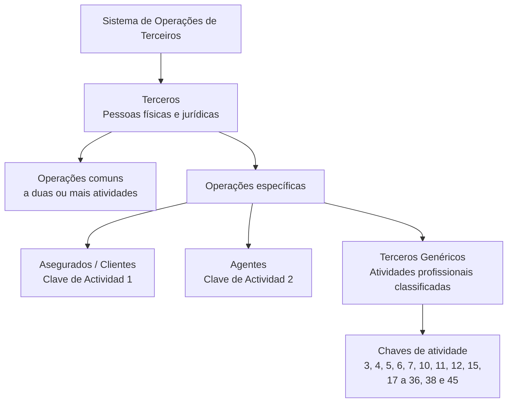

# Formação de Operações de Terceiros — Classificação por Chave de Atividade

## 1. Metadados do Documento
- **Arquivo de Origem:** Não identificado
- **Tipo de Documento:** Material de formação sobre operações de terceiros
- **Domínio / Sistema:** Operações de Terceiros
- **Público-Alvo:** Não identificado
- **Data/Versão Identificada:** Não identificada

---

## 2. Resumo Executivo & Contexto de Negócio

O documento apresenta uma formação orientada às operações próprias ou particulares das atividades de terceiros contempladas no sistema. No contexto apresentado, pessoas físicas e pessoas jurídicas são tratadas como sinônimos de **Terceros**, e os dois termos podem ser usados indistintamente na redação documental.

O conteúdo distingue operações comuns a várias atividades de terceiros de operações específicas para categorias determinadas. As operações comuns abrangem duas ou mais atividades de terceiros, enquanto operações específicas são organizadas para segurados/clientes, agentes e terceiros genéricos.

O sistema identifica segurados/clientes por meio da **Clave de Actividad 1** e agentes por meio da **Clave de Actividad 2**. As demais categorias profissionais listadas são classificadas como terceiros genéricos, cada uma associada a uma chave de atividade.

O documento também lista exemplos de terceiros genéricos, incluindo peritos, médicos, advogados, fornecedores, oficinas, clínicas, guinchos, investigadores, depósitos, cartórios e representantes legais. Não há detalhamento sobre telas, procedimentos operacionais, regras de cadastro, contratos de integração ou comportamentos específicos por atividade.

---

## 3. Arquitetura, Componentes & Tecnologias Envolvidas

O conteúdo não descreve uma arquitetura de software, componentes técnicos, microsserviços, bases de dados, APIs, ambientes ou tecnologias de implementação.

A estrutura funcional explicitamente apresentada é a classificação de terceiros no sistema segundo uma chave de atividade:



**Nota de Análise:** O texto contém uma barra de navegação com os termos “CF”, “Search”, “Home”, “Solutions”, “Architectures”, “APIs”, “Events”, “Components”, “Cloud”, “Documentation”, “Zeus”, “Reef”, “Help”, “News” e “EN”. O documento não explica a relação desses termos com as operações de terceiros; portanto, eles não são tratados como componentes confirmados da arquitetura.

---

## 4. Regras de Negócio, Especificações Funcionais & Processos

1. A formação é orientada às operações próprias ou particulares de cada atividade de terceiros contemplada no sistema.
2. Pessoas físicas e jurídicas são consideradas sinônimos de terceiros no contexto documental.
3. Os termos relativos a pessoas físicas, pessoas jurídicas e terceiros podem ser utilizados indistintamente na redação dos documentos.
4. Existem operações comuns que não se limitam a uma atividade específica e podem abranger duas ou mais atividades de terceiros.
5. O documento cita **Procesos Masivos** como uma categoria de operações, mas não detalha seus critérios, entradas, saídas ou execução.
6. O sistema identifica segurados/clientes pela **Clave de Actividad 1**.
7. O sistema identifica agentes pela **Clave de Actividad 2**.
8. Terceiros genéricos são pessoas físicas ou jurídicas cujas atividades laborais correspondem às profissões classificadas na tabela de chaves de atividade.
9. As profissões de terceiros genéricos listadas no conteúdo possuem chaves de atividade específicas.
10. O documento usa reticências após a chave 45, indicando que a relação de atividades pode não estar completa no trecho disponível.

---

## 5. Tabelas de Parâmetros, Ambientes e Estruturas de Dados

| Item / Parâmetro | Descrição / Função | Tipo / Valores / Formato | Ambiente / Observações |
| :--- | :--- | :--- | :--- |
| Terceros | Termo usado para pessoas físicas e jurídicas. | Categoria conceitual. | Os termos podem ser usados indistintamente. |
| Operações comuns | Operações que concernem a duas ou mais atividades de terceiros. | Categoria de operação. | Não há fluxo detalhado. |
| Procesos Masivos | Categoria mencionada no conteúdo. | Processo. | Sem descrição funcional adicional. |
| Asegurados / Clientes | Entidades identificadas pelo sistema. | Categoria de terceiro/operação específica. | Clave de Actividad 1. |
| Agentes | Entidades identificadas pelo sistema. | Categoria de terceiro/operação específica. | Clave de Actividad 2. |
| Terceros Genéricos | Pessoas físicas ou jurídicas classificadas conforme atividade laboral/profissão. | Categoria de terceiro. | Associada às chaves profissionais listadas. |

| Chave de Atividade | Descrição / Função | Tipo / Valores / Formato | Ambiente / Observações |
| :--- | :--- | :--- | :--- |
| 1 | Asegurados / Clientes | Chave de atividade numérica | Identificação de segurados/clientes no sistema. |
| 2 | Agentes | Chave de atividade numérica | Identificação de agentes no sistema. |
| 3 | Peritos | Chave de atividade numérica | Terceiro genérico. |
| 4 | Inspectores | Chave de atividade numérica | Terceiro genérico. |
| 5 | Médicos | Chave de atividade numérica | Terceiro genérico. |
| 6 | Abogados | Chave de atividade numérica | Terceiro genérico. |
| 7 | Procuradores | Chave de atividade numérica | Terceiro genérico. |
| 10 | Proveedores | Chave de atividade numérica | Terceiro genérico. |
| 11 | Ejecutivos de Cta. | Chave de atividade numérica | Terceiro genérico. |
| 12 | Cobradores | Chave de atividade numérica | Terceiro genérico. |
| 15 | Empleados | Chave de atividade numérica | Terceiro genérico. |
| 17 | Talleres | Chave de atividade numérica | Terceiro genérico. |
| 18 | Clínicas | Chave de atividade numérica | Terceiro genérico. |
| 19 | Juzgados | Chave de atividade numérica | Terceiro genérico. |
| 20 | Cristaleros | Chave de atividade numérica | Terceiro genérico. |
| 21 | Cerrajeros | Chave de atividade numérica | Terceiro genérico. |
| 22 | Plomeros | Chave de atividade numérica | Terceiro genérico. |
| 23 | Electricistas | Chave de atividade numérica | Terceiro genérico. |
| 24 | Grúas | Chave de atividade numérica | Terceiro genérico. |
| 25 | Investigadores | Chave de atividade numérica | Terceiro genérico. |
| 26 | Recuperadores | Chave de atividade numérica | Terceiro genérico. |
| 27 | Ajustadores | Chave de atividade numérica | Terceiro genérico. |
| 28 | Herreros | Chave de atividade numérica | Terceiro genérico. |
| 29 | Tribunales | Chave de atividade numérica | Terceiro genérico. |
| 30 | Terceros Seg. MOTOR | Chave de atividade numérica | Terceiro genérico. A expansão de “Seg.” não é informada. |
| 31 | Terceros Seg. SALUD | Chave de atividade numérica | Terceiro genérico. A expansão de “Seg.” não é informada. |
| 32 | Terceros Seg. PATRIMONIALES | Chave de atividade numérica | Terceiro genérico. A expansão de “Seg.” não é informada. |
| 33 | Depósitos | Chave de atividade numérica | Terceiro genérico. |
| 34 | Notarías | Chave de atividade numérica | Terceiro genérico. |
| 35 | Centros de Peritación | Chave de atividade numérica | Terceiro genérico. |
| 36 | Comisarías | Chave de atividade numérica | Terceiro genérico. |
| 38 | Filial | Chave de atividade numérica | Terceiro genérico. |
| 45 | Representantes Legales | Chave de atividade numérica | Terceiro genérico. |

---

## 6. Bateria de Perguntas & Respostas para RAG (FAQ Sintético)

### P1: Como o sistema identifica segurados ou clientes nas operações de terceiros?
**R:** O sistema identifica segurados e clientes pela **Clave de Actividad 1**.

### P2: Qual chave de atividade identifica agentes no sistema?
**R:** O sistema identifica agentes pela **Clave de Actividad 2**.

### P3: O que são operações comuns a várias atividades de terceiros?
**R:** São operações que concernem não apenas a uma atividade específica, mas a duas ou mais atividades de terceiros.

### P4: Pessoas físicas e pessoas jurídicas são tratadas de forma diferente no documento?
**R:** Não. O documento estabelece que pessoas físicas e jurídicas são sinônimos de terceiros e que esses termos podem ser utilizados indistintamente na redação dos documentos.

### P5: O que caracteriza um terceiro genérico?
**R:** Terceiros genéricos são pessoas físicas ou jurídicas cujas atividades laborais correspondem às profissões classificadas na lista de chaves de atividade apresentada pelo documento.

### P6: Qual é a chave de atividade para médicos?
**R:** Médicos são classificados pela **Clave de Actividad 5**.

### P7: Qual chave de atividade corresponde a fornecedores?
**R:** Proveedores, ou fornecedores, correspondem à **Clave de Actividad 10**.

### P8: Quais chaves de atividade estão associadas a terceiros relacionados a seguros?
**R:** O documento lista **30 — Terceros Seg. MOTOR**, **31 — Terceros Seg. SALUD** e **32 — Terceros Seg. PATRIMONIALES**. O significado completo da abreviação “Seg.” não é detalhado no trecho disponível.

### P9: Como oficinas e clínicas são classificadas?
**R:** Talleres são classificados pela **Clave de Actividad 17**, enquanto Clínicas são classificadas pela **Clave de Actividad 18**.

### P10: Qual chave de atividade corresponde a guinchos?
**R:** Grúas correspondem à **Clave de Actividad 24**.

### P11: O documento detalha como funcionam os processos massivos?
**R:** Não. O documento menciona “Procesos Masivos”, mas não fornece regras, etapas, entradas, saídas, tecnologias ou critérios operacionais adicionais.

### P12: Qual chave de atividade corresponde a representantes legais?
**R:** Representantes Legales correspondem à **Clave de Actividad 45**.

---

## 7. Glossário de Termos, Siglas & Conceitos-Chave

- **Terceros:** Termo usado para referenciar pessoas físicas e pessoas jurídicas no sistema e na documentação.
- **Asegurados / Clientes:** Categoria de entidades identificadas pela Clave de Actividad 1.
- **Agentes:** Categoria de entidades identificadas pela Clave de Actividad 2.
- **Terceros Genéricos:** Pessoas físicas ou jurídicas classificadas de acordo com atividades laborais ou profissões listadas no documento.
- **Clave de Actividad:** Identificador numérico utilizado pelo sistema para classificar categorias de terceiros ou atividades.
- **Procesos Masivos:** Categoria de processo mencionada sem detalhamento operacional.
- **Cta.:** Abreviação presente em “Ejecutivos de Cta.”; o documento não fornece sua expansão.
- **Seg.:** Abreviação presente nas categorias MOTOR, SALUD e PATRIMONIALES; o documento não fornece sua expansão.
- **Peritación:** Termo presente em “Centros de Peritación”; o documento não fornece definição adicional.

---

## 8. Notas Críticas, Riscos & Limitações

- O arquivo de origem, a data, a versão e o público-alvo não são identificados no trecho fornecido.
- O conteúdo disponível não descreve arquitetura técnica, APIs, integração entre sistemas, bancos de dados, autenticação, logs, URLs, ambientes ou procedimentos de operação.
- “Procesos Masivos” é citado sem qualquer detalhamento funcional ou técnico.
- A relação de chaves de atividade aparenta ser incompleta, pois termina com “... ...” após a chave 45.
- Não há regras para criação, alteração, validação, desativação ou consulta de terceiros e respectivas chaves.
- A barra de navegação contendo termos como “Zeus” e “Reef” não possui contextualização suficiente para ser tratada como parte confirmada da solução.
- As abreviações “Cta.” e “Seg.” não são expandidas pelo documento.

---

## 9. Conteúdo Bruto Estruturado (Referência Fiel)

```text
--- [PÁGINA 1 DE 2] ---

FORMACIÓN OPERACIONES de TERCEROS
Formación orientada a las Operaciones propias o particulares de cada una de las Actividades de Terceros contempladas en el Sistema.
Las personas físicas y jurídicas son sinónimos de Terceros por lo que en la redacción de los documentos se utilizarán estos términos indistintamente.
Operaciones COMUNES a Varias Actividades de Terceros
Las siguientes operaciones atañen y conciernen no solamente a una Actividad Específica sino a 2 o más Actividades de los Terceros.
Procesos Masivos
Operaciones específicas de Asegurados/Clientes
El Sistema identifica a los Asegurados con la Clave de Actividad... 1.
Operaciones específicas de Agentes
El Sistema identifica a los Agentes con la Clave de Actividad... 2.
Operaciones específicas de Terceros Genéricos
En el Sistema se consideran "Terceros Genéricos" todas aquellas personas físicas o jurídicas cuyas actividades laborales se corresponden con las siguientes
profesiones...
Clave Actividad Descripción
3 Peritos
4 Inspectores
5 Médicos
6 Abogados
7 Procuradores
10 Proveedores
11 Ejecutivos de Cta.
12 Cobradores
15 Empleados
 /
 CF
Search Home Solutions Architectures APIs Events Components Cloud Documentation Zeus Reef Help News
EN

--- [PÁGINA 2 DE 2] ---

Clave Actividad Descripción
17 Talleres
18 Clínicas
19 Juzgados
20 Cristaleros
21 Cerrajeros
22 Plomeros
23 Electricistas
24 Grúas
25 Investigadores
26 Recuperadores
27 Ajustadores
28 Herreros
29 Tribunales
30 Terceros Seg. MOTOR
31 Terceros Seg. SALUD
32 Terceros Seg. PATRIMONIALES
33 Depósitos
34 Notarías
35 Centros de Peritación
36 Comisarías
38 Filial
45 Representantes Legales
... ...
```
