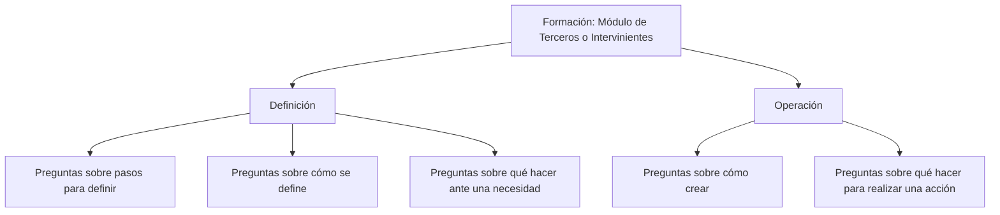

# Formação de Terceiros ou Intervenientes do Sistema

## 1. Metadados do Documento
- **Arquivo de Origem:** Não identificado
- **Tipo de Documento:** Manual Operacional
- **Domínio / Sistema:** Módulo de Terceiros ou Intervenientes do Sistema
- **Público-Alvo:** Usuários do sistema; não detalhado
- **Data/Versão Identificada:** Não identificada

---

## 2. Resumo Executivo & Contexto de Negócio

O documento apresenta a formação relativa ao módulo de **Terceros** ou **Intervinientes** do Sistema. O conteúdo posiciona a formação como um recurso de apoio para definição e operação desse módulo.

A formação está organizada em dois apartados principais: **Definición** e **Operación**. A separação indica que o material procura atender necessidades distintas: configuração ou definição do módulo, e execução de atividades operacionais.

A seção **Definición** é orientada à obtenção de respostas sobre procedimentos necessários para definir elementos no módulo, incluindo perguntas como quais passos devem ser seguidos, como algo é definido e o que deve ser feito diante de uma necessidade específica.

A seção **Operación** é orientada à obtenção de respostas sobre criação e realização de atividades no módulo, incluindo como criar elementos e o que fazer para executar determinada ação. O texto fornecido não especifica entidades, telas, campos, regras, permissões, integrações ou procedimentos detalhados.

---

## 3. Arquitetura, Componentes & Tecnologias Envolvidas

O conteúdo identifica somente o **módulo de Terceiros ou Intervenientes do Sistema** e sua divisão funcional em **Definição** e **Operação**. Também apresenta uma navegação textual com os itens “Search”, “Home”, “Solutions”, “Architectures”, “APIs”, “Events”, “Components”, “Cloud”, “Documentation”, “Zeus”, “Reef”, “Help” e “News”, sem explicar a função desses itens ou suas relações com o módulo.



**Nota de Análise:** O documento não descreve arquitetura técnica, componentes de software, microsserviços, APIs, bancos de dados, protocolos, ambientes ou tecnologias implementadas.

---

## 4. Regras de Negócio, Especificações Funcionais & Processos

### Estrutura da formação

1. A formação é relativa ao módulo de **Terceros** ou **Intervinientes** do Sistema.
2. A formação está dividida em dois apartados:
   - **Definición**
   - **Operación**

### Objetivo do apartado Definición

O apartado **Definición** busca fornecer respostas para perguntas relacionadas à definição de elementos, incluindo:

1. Quais passos devem ser seguidos para poder definir algo.
2. Como algo é definido.
3. O que deve ser feito caso seja necessário algo.

O trecho original utiliza reticências após essas perguntas, mas não fornece exemplos adicionais, sequência operacional, condições de validação ou critérios de aceite.

### Objetivo do apartado Operación

O apartado **Operación** busca fornecer respostas para perguntas relacionadas à execução de atividades, incluindo:

1. Como criar algo.
2. O que fazer para poder realizar algo.

O trecho original utiliza reticências após essas perguntas, mas não fornece procedimentos operacionais completos, detalhes de criação, campos obrigatórios ou regras de negócio.

---

## 5. Tabelas de Parâmetros, Ambientes e Estruturas de Dados

| Item / Parâmetro | Descrição / Função | Tipo / Valores / Formato | Ambiente / Observações |
| :--- | :--- | :--- | :--- |
| Módulo de Terceros | Módulo objeto da formação apresentada. | Módulo do Sistema. | Também denominado módulo de Intervinientes. |
| Definición | Apartado da formação voltado à definição. | Seção funcional. | Não detalha passos concretos, entidades ou campos. |
| Operación | Apartado da formação voltado à operação. | Seção funcional. | Não detalha ações concretas, entidades ou campos. |
| Search | Item textual de navegação apresentado no rodapé. | Navegação. | Sem detalhamento funcional. |
| Home | Item textual de navegação apresentado no rodapé. | Navegação. | Sem detalhamento funcional. |
| Solutions | Item textual de navegação apresentado no rodapé. | Navegação. | Sem detalhamento funcional. |
| Architectures | Item textual de navegação apresentado no rodapé. | Navegação. | Sem detalhamento funcional. |
| APIs | Item textual de navegação apresentado no rodapé. | Navegação. | Sem detalhamento funcional. |
| Events | Item textual de navegação apresentado no rodapé. | Navegação. | Sem detalhamento funcional. |
| Components | Item textual de navegação apresentado no rodapé. | Navegação. | Sem detalhamento funcional. |
| Cloud | Item textual de navegação apresentado no rodapé. | Navegação. | Sem detalhamento funcional. |
| Documentation | Item textual de navegação apresentado no rodapé. | Navegação. | Sem detalhamento funcional. |
| Zeus | Item textual de navegação apresentado no rodapé. | Navegação. | Sem explicação de significado ou relação com o módulo. |
| Reef | Item textual de navegação apresentado no rodapé. | Navegação. | Sem explicação de significado ou relação com o módulo. |
| Help | Item textual de navegação apresentado no rodapé. | Navegação. | Sem detalhamento funcional. |
| News | Item textual de navegação apresentado no rodapé. | Navegação. | Sem detalhamento funcional. |
| EN | Indicador textual de idioma. | Texto de interface. | O trecho principal está em espanhol. |
| CF | Texto ou sigla exibida no rodapé. | Não identificado. | O documento não define o significado. |

---

## 6. Bateria de Perguntas & Respostas para RAG (FAQ Sintético)

### P1: Qual é o tema central da formação apresentada no documento?
**R:** A formação é relativa ao módulo de **Terceros** ou **Intervinientes** do Sistema.

### P2: Em quais apartados a formação do módulo de Terceiros está dividida?
**R:** A formação do módulo de Terceiros ou Intervenientes está dividida nos apartados **Definición** e **Operación**.

### P3: Qual é o objetivo do apartado Definición?
**R:** O apartado **Definición** busca responder perguntas sobre os passos necessários para definir algo, como algo é definido e o que deve ser feito quando existe determinada necessidade.

### P4: Que tipo de pergunta o apartado Definición procura responder sobre procedimentos?
**R:** O apartado **Definición** procura responder à pergunta: “¿Qué pasos he de seguir para poder definir...?”, isto é, quais passos devem ser seguidos para realizar uma definição.

### P5: O documento explica como definir entidades específicas no módulo de Terceiros?
**R:** Não. O documento apresenta perguntas genéricas sobre definição, mas não identifica entidades específicas, campos, telas, parâmetros ou procedimentos detalhados.

### P6: Qual é o objetivo do apartado Operación?
**R:** O apartado **Operación** busca responder perguntas sobre como criar algo e sobre o que deve ser feito para realizar determinada ação.

### P7: O documento informa quais objetos podem ser criados no apartado Operación?
**R:** Não. O texto menciona a pergunta “¿Cómo puedo crear...?”, mas não informa quais objetos, cadastros ou entidades podem ser criados.

### P8: Existem regras de validação ou condições de negócio descritas para o módulo de Terceiros?
**R:** Não. O conteúdo fornecido não apresenta regras de validação, critérios de negócio, campos obrigatórios, cálculos ou restrições operacionais.

### P9: O documento descreve integrações, APIs ou arquitetura técnica do módulo?
**R:** Não. Embora “APIs”, “Architectures” e outros itens apareçam na navegação textual, não há descrição de integrações, contratos, endpoints, tecnologias ou arquitetura técnica.

### P10: O que significa a sigla CF exibida no conteúdo?
**R:** O documento exibe “CF”, mas não fornece definição, expansão ou contexto suficiente para determinar seu significado.

---

## 7. Glossário de Termos, Siglas & Conceitos-Chave

- **Terceros:** Termo em espanhol utilizado para identificar o módulo abordado pela formação; o documento também utiliza “Intervinientes” como denominação alternativa.
- **Intervinientes:** Termo em espanhol apresentado como alternativa para “Terceros” no contexto do módulo do Sistema.
- **Definición:** Apartado da formação orientado a dúvidas sobre como definir elementos e quais passos devem ser seguidos.
- **Operación:** Apartado da formação orientado a dúvidas sobre criação e realização de ações.
- **APIs:** Item textual presente na navegação; o documento não fornece definição ou contexto técnico adicional.
- **CF:** Sigla ou texto exibido no conteúdo sem definição fornecida.

---

## 8. Notas Críticas, Riscos & Limitações

- O arquivo de origem, tipo de arquivo, data, versão e autor não foram identificados no conteúdo fornecido.
- O documento contém uma visão introdutória e não apresenta procedimentos detalhados para o módulo de Terceiros ou Intervenientes.
- Não há descrição de entidades de negócio, campos, telas, permissões, perfis, fluxos de exceção ou critérios de validação.
- Não há informação sobre APIs, métodos HTTP, contratos JSON, URLs, servidores, ambientes, logs, tecnologias ou dependências.
- Os itens de navegação “Zeus”, “Reef” e “CF” são citados sem definição contextual.
- **Nota de Análise:** O documento lista o módulo “Terceros” ou “Intervinientes”, porém não detalha operações, métodos, contratos ou procedimentos específicos.

---

## 9. Conteúdo Bruto Estruturado (Referência Fiel)

```text
--- [PÁGINA 1 DE 1] ---

FORMACIÓN TERCEROS
 En este apartado se encuentra la formación relativa al módulo de Terceros o Intervinientes del Sistema. Dicha formación está dividida en los
apartados siguientes:
Definición
Operación
DEFINICIÓN
Conseguir respuestas a preguntas como:
¿Qué pasos he de seguir para poder definir...?
¿Cómo se define...?
¿Qué he de hacer si necesito...?
...
OPERACIÓN
Obtener respuestas a preguntas:
¿Cómo puedo crear...?
¿Qué hago para poder hacer...?
...
 / 
 CF
Search Home Solutions Architectures APIs Events Components Cloud Documentation Zeus Reef Help News
EN
```
