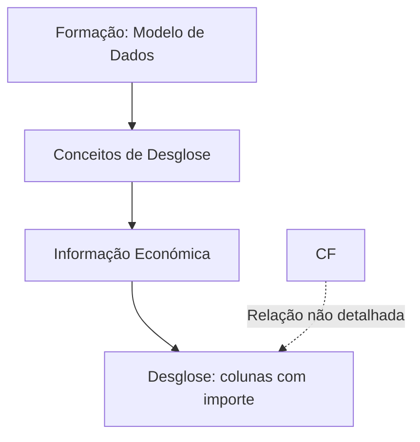

# Formação do Modelo de Dados — Conceitos de Desglose (Informação Económica)

## 1. Metadados do Documento
- **Arquivo de Origem:** Não identificado no conteúdo fornecido
- **Tipo de Documento:** Material formativo
- **Domínio / Sistema:** Modelo de dados; informação económica; conceitos de desglosa/desdobramento
- **Público-Alvo:** Não identificado
- **Data/Versão Identificada:** Não identificada

---

## 2. Resumo Executivo & Contexto de Negócio

O conteúdo fornecido apresenta um material denominado **“FORMACIÓN MODELO DE DATOS - CONCEPTOS DE DESGLOSE”**, associado ao tema de **informação económica**. O objetivo declarado é formativo, com foco em conceitos de desglosa/desdobramento no contexto de um modelo de dados.

O único tópico formativo explicitamente identificado é **“DESGLOSE - Columnas con importe ¿Cómo trabajan?”**, indicando que o documento aborda o funcionamento de colunas que possuem valores monetários ou importes. O texto também contém a sigla **“CF”**, porém não fornece a sua expansão, função ou relação explícita com as colunas de importe.

O trecho inclui ainda uma sequência de termos de navegação — como *Home*, *Solutions*, *Architectures*, *APIs*, *Events*, *Components*, *Cloud*, *Documentation*, *Zeus*, *Reef*, *Help* e *News* — que aparenta ser proveniente de uma interface ou portal. Não há evidência textual suficiente para classificá-los como componentes do modelo de dados, sistemas integrados ou tecnologias da solução.

**Nota de Análise:** o conteúdo disponível é extremamente resumido e não descreve estruturas de dados, regras de cálculo, contratos, APIs, ambientes, responsáveis, fluxos operacionais ou definições do termo “CF”.

---

## 3. Arquitetura, Componentes & Tecnologias Envolvidas

O conteúdo não apresenta uma arquitetura de software, integrações entre sistemas, componentes técnicos, bancos de dados, APIs, serviços, ambientes ou tecnologias implementadas.

Os elementos explicitamente citados são:

- **Modelo de dados**
- **Conceitos de desglosa/desdobramento**
- **Informação económica**
- **Colunas com importe**
- **CF**
- Termos de interface ou navegação: *Search, Home, Solutions, Architectures, APIs, Events, Components, Cloud, Documentation, Zeus, Reef, Help, News, EN*

O fluxo conceitual mínimo sustentado pelo conteúdo é:



**Nota de Análise:** o diagrama representa somente a organização temática inferível a partir dos títulos e tópicos exibidos. O documento não descreve fluxo técnico, troca de dados, dependências ou responsabilidades entre esses elementos.

---

## 4. Regras de Negócio, Especificações Funcionais & Processos

O conteúdo não especifica regras de negócio, fórmulas de cálculo, critérios de validação, estados de processo, exceções, permissões ou procedimentos operacionais.

Os únicos pontos funcionais identificáveis são:

1. O material aborda um **modelo de dados**.
2. O material trata de **conceitos de desglosa/desdobramento** relacionados a **informação económica**.
3. Existe um tópico denominado **“DESGLOSE - Columnas con importe ¿Cómo trabajan?”**.
4. A sigla **“CF”** é apresentada isoladamente, sem definição ou instrução operacional.
5. Não há explicação de como as colunas com importe funcionam, quais valores aceitam, como são calculadas, quais campos as compõem ou como se relacionam com “CF”.

**Nota de Análise:** não é possível extrair regras adicionais sem introduzir informações não suportadas pelo texto original.

---

## 5. Tabelas de Parâmetros, Ambientes e Estruturas de Dados

| Item / Parâmetro | Descrição / Função | Tipo / Valores / Formato | Ambiente / Observações |
| :--- | :--- | :--- | :--- |
| Modelo de dados | Tema principal do material formativo. | Conceito / domínio de dados. | Não há estrutura, entidades ou atributos detalhados. |
| Conceitos de desglosa/desdobramento | Assunto indicado no título do material. | Conceito funcional. | O significado operacional não é definido. |
| Informação económica | Contexto indicado entre parênteses no título. | Domínio de informação. | Não há campos, moeda, cálculo ou origem de dados descritos. |
| DESGLOSE - Columnas con importe ¿Cómo trabajan? | Tópico listado como conteúdo formativo. | Pergunta/tópico funcional. | O funcionamento das colunas com importe não é explicado no trecho. |
| CF | Sigla ou identificador citado isoladamente. | Não identificado. | Expansão, finalidade e relação com outros elementos não detalhadas. |
| Search | Termo exibido na sequência de navegação. | Interface / navegação aparente. | Não caracterizado como componente funcional. |
| Home | Termo exibido na sequência de navegação. | Interface / navegação aparente. | Não há detalhamento. |
| Solutions | Termo exibido na sequência de navegação. | Interface / navegação aparente. | Não há detalhamento. |
| Architectures | Termo exibido na sequência de navegação. | Interface / navegação aparente. | Não há arquitetura descrita. |
| APIs | Termo exibido na sequência de navegação. | Interface / navegação aparente. | Não há API, endpoint ou contrato descrito. |
| Events | Termo exibido na sequência de navegação. | Interface / navegação aparente. | Não há evento ou mensageria descritos. |
| Components | Termo exibido na sequência de navegação. | Interface / navegação aparente. | Não há componentes especificados. |
| Cloud | Termo exibido na sequência de navegação. | Interface / navegação aparente. | Não há provedor ou recurso de nuvem indicado. |
| Documentation | Termo exibido na sequência de navegação. | Interface / navegação aparente. | Não há documento adicional referenciado. |
| Zeus | Termo exibido na sequência de navegação. | Nome próprio não classificado. | O documento não define Zeus. |
| Reef | Termo exibido na sequência de navegação. | Nome próprio não classificado. | O documento não define Reef. |
| Help | Termo exibido na sequência de navegação. | Interface / navegação aparente. | Não há detalhamento. |
| News | Termo exibido na sequência de navegação. | Interface / navegação aparente. | Não há detalhamento. |
| EN | Indicador exibido ao final da sequência de navegação. | Código/indicador não definido. | Pode indicar idioma, mas essa interpretação não é explicitada. |

---

## 6. Bateria de Perguntas & Respostas para RAG (FAQ Sintético)

### P1: Qual é o tema principal do material “FORMACIÓN MODELO DE DATOS - CONCEPTOS DE DESGLOSE”?
**R:** O material trata de formação sobre modelo de dados e conceitos de desglosa/desdobramento, no contexto de informação económica.

### P2: Qual conteúdo formativo é explicitamente listado no documento?
**R:** O conteúdo formativo explicitamente listado é: **“DESGLOSE - Columnas con importe ¿Cómo trabajan?”**.

### P3: O documento explica como funcionam as colunas com importe?
**R:** Não. O documento apresenta “Columnas con importe ¿Cómo trabajan?” como tópico, mas não fornece explicação sobre comportamento, cálculo, preenchimento, validação ou persistência dessas colunas.

### P4: O que significa a sigla CF no documento?
**R:** O significado de **CF** não é identificado. A sigla aparece isoladamente e o trecho não fornece expansão, definição ou contexto funcional suficiente.

### P5: Quais regras de negócio para informação económica são definidas?
**R:** Nenhuma regra de negócio é detalhada no conteúdo fornecido. O texto apenas associa o tema de desglosa/desdobramento à informação económica.

### P6: Existem APIs, endpoints ou contratos de integração documentados?
**R:** Não. Embora o termo “APIs” apareça na sequência de navegação, o documento não descreve endpoints, métodos HTTP, autenticação, payloads, contratos ou integrações.

### P7: O documento identifica uma arquitetura de sistemas ou componentes técnicos?
**R:** Não. O trecho contém termos como “Architectures”, “Components” e “Cloud”, mas não apresenta descrição arquitetural, componentes implementados, fluxos de dados ou dependências técnicas.

### P8: O documento informa ambientes, servidores, URLs ou parâmetros de configuração?
**R:** Não. Não há ambientes, servidores, URLs, portas, variáveis de configuração ou parâmetros técnicos explicitamente definidos.

### P9: Zeus e Reef são sistemas ou componentes do modelo de dados?
**R:** Não é possível afirmar. “Zeus” e “Reef” aparecem somente na sequência de termos de navegação, sem definição de função, tipo, responsabilidade ou vínculo com o modelo de dados.

### P10: O material permite implementar o comportamento das colunas com importe?
**R:** Não. O conteúdo não contém especificação suficiente para implementação, pois faltam definições de campos, tipos, regras de cálculo, validações, fontes de dados e comportamentos esperados.

---

## 7. Glossário de Termos, Siglas & Conceitos-Chave

- **CF:** Sigla apresentada no documento sem expansão ou definição.
- **Colunas com importe:** Colunas que possuem importe/valor, citadas como assunto do conteúdo formativo. O comportamento dessas colunas não é explicado.
- **Desglose / desdobramento:** Conceito indicado no título e no tópico formativo. O documento não fornece uma definição operacional.
- **Informação económica:** Contexto temático associado aos conceitos de desglosa/desdobramento. Não há detalhamento de atributos, cálculos ou fontes.
- **Modelo de dados:** Tema central do material formativo. Não há entidades, relacionamentos, esquemas ou campos apresentados.
- **Zeus:** Termo exibido na sequência de navegação, sem definição no conteúdo.
- **Reef:** Termo exibido na sequência de navegação, sem definição no conteúdo.

---

## 8. Notas Críticas, Riscos & Limitações

- O conteúdo fornecido possui apenas uma página e apresenta informação predominantemente em formato de título, tópico e navegação.
- Não há definição técnica ou funcional para **CF**.
- Não há explicação sobre o funcionamento das **colunas com importe**.
- Não existem modelos de entidades, dicionários de dados, layouts, fórmulas, exemplos, diagramas originais, critérios de validação ou regras de cálculo.
- Não são identificados ambientes, URLs, servidores, tecnologias, versões, responsáveis ou dependências entre equipes.
- Os termos de navegação, incluindo **Zeus** e **Reef**, não podem ser classificados com segurança como sistemas, módulos ou componentes técnicos.
- Qualquer detalhamento adicional sobre cálculo de valores, comportamento de colunas, arquitetura ou integração representaria informação não sustentada pelo documento original.

---

## 9. Conteúdo Bruto Estruturado (Referência Fiel)

```text
--- [PÁGINA 1 DE 1] ---

FORMACIÓN MODELO DE DATOS - CONCEPTOS DE DESGLOSE
(Información económica)
 Contenidos formativos:
CONTENIDO
DESGLOSE - Columnas con importe ¿Cómo trabajan?
 / 
 CF
Search Home Solutions Architectures APIs Events Components Cloud Documentation Zeus Reef Help News
EN
```
