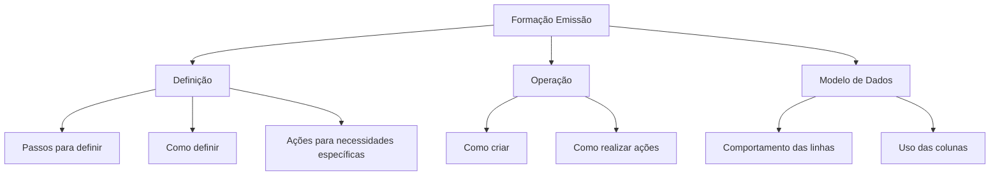

# Formação Emissão — Módulo de Emissão

## 1. Metadados do Documento
- **Arquivo de Origem:** Não identificado
- **Tipo de Documento:** Manual Operacional
- **Domínio / Sistema:** Formação relativa ao módulo de emissão
- **Público-Alvo:** Operação, usuários funcionais e analistas
- **Data/Versão Identificada:** Não identificada

---

## 2. Resumo Executivo & Contexto de Negócio

O documento apresenta uma estrutura de formação para o módulo de emissão. A formação está organizada em três áreas: **Definição**, **Operação** e **Modelo de dados**.

A seção **Definição** é orientada a esclarecer como configurar ou definir elementos do módulo de emissão. O foco são dúvidas sobre etapas necessárias, formas de definição e ações necessárias diante de requisitos específicos.

A seção **Operação** concentra-se na execução de atividades no módulo de emissão, cobrindo dúvidas sobre criação de elementos e procedimentos para realizar ações operacionais.

A seção **Modelo de dados** aborda o comportamento de linhas e o uso de colunas, indicando uma camada de consulta voltada à interpretação estrutural dos dados apresentados pelo módulo.

> *Nota de Análise: O conteúdo não especifica entidades de negócio, telas, serviços, métodos HTTP, contratos de integração, tecnologias, ambientes ou procedimentos detalhados do módulo de emissão.*

---

## 3. Arquitetura, Componentes & Tecnologias Envolvidas

Os únicos componentes funcionais explicitamente identificados são as três áreas de formação do módulo de emissão:

- **Definição:** orientação para configuração e definição.
- **Operação:** orientação para criação e execução de ações.
- **Modelo de dados:** orientação para interpretação de linhas e colunas.

O texto também apresenta referências de navegação ou categorias: `Search`, `Home`, `Solutions`, `Architectures`, `APIs`, `Events`, `Components`, `Cloud`, `Documentation`, `Zeus`, `Reef`, `Help`, `News` e `EN`. Não há detalhamento sobre a função, integração ou relação técnica dessas referências com o módulo de emissão.



---

## 4. Regras de Negócio, Especificações Funcionais & Processos

### Estrutura da formação

1. A formação relativa ao módulo de emissão é dividida em três apartados:
   - Definição;
   - Operação;
   - Modelo de dados.

### Definição

A seção de definição busca responder perguntas relacionadas à configuração ou criação conceitual de elementos no módulo de emissão:

1. Quais passos devem ser seguidos para definir determinado elemento.
2. Como determinado elemento é definido.
3. Qual ação deve ser tomada quando houver necessidade específica de definição.

### Operação

A seção de operação busca responder perguntas relacionadas à utilização prática do módulo de emissão:

1. Como criar determinado elemento.
2. Qual procedimento deve ser executado para realizar determinada ação.

### Modelo de dados

A seção de modelo de dados busca responder perguntas relacionadas à estrutura e ao comportamento dos dados:

1. Como as linhas se comportam.
2. Qual é o uso de determinada coluna.

> *Nota de Análise: O documento não informa regras condicionais, campos obrigatórios, cálculos, critérios de validação, status operacionais, mensagens de erro ou exceções de processo.*

---

## 5. Tabelas de Parâmetros, Ambientes e Estruturas de Dados

| Item / Parâmetro | Descrição / Função | Tipo / Valores / Formato | Ambiente / Observações |
| :--- | :--- | :--- | :--- |
| Formação Emissão | Formação relativa ao módulo de emissão | Estrutura de formação | Dividida em Definição, Operação e Modelo de dados |
| Definição | Área para dúvidas sobre como definir elementos | Perguntas orientativas | Não há exemplos de elementos definíveis |
| Operação | Área para dúvidas sobre criação e execução de ações | Perguntas orientativas | Não há procedimentos operacionais detalhados |
| Modelo de dados | Área para dúvidas sobre linhas e colunas | Perguntas orientativas | Não há esquema, tabela, entidade ou atributo identificado |
| Search | Referência de navegação apresentada no conteúdo | Texto de navegação | Função não detalhada |
| Home | Referência de navegação apresentada no conteúdo | Texto de navegação | Função não detalhada |
| Solutions | Referência de navegação apresentada no conteúdo | Texto de navegação | Função não detalhada |
| Architectures | Referência de navegação apresentada no conteúdo | Texto de navegação | Função não detalhada |
| APIs | Referência de navegação apresentada no conteúdo | Texto de navegação | Não há APIs descritas |
| Events | Referência de navegação apresentada no conteúdo | Texto de navegação | Não há eventos descritos |
| Components | Referência de navegação apresentada no conteúdo | Texto de navegação | Não há componentes descritos |
| Cloud | Referência de navegação apresentada no conteúdo | Texto de navegação | Não há ambiente cloud descrito |
| Documentation | Referência de navegação apresentada no conteúdo | Texto de navegação | Função não detalhada |
| Zeus | Referência apresentada no conteúdo | Nome próprio não definido | Relação com o módulo não detalhada |
| Reef | Referência apresentada no conteúdo | Nome próprio não definido | Relação com o módulo não detalhada |
| Help | Referência de navegação apresentada no conteúdo | Texto de navegação | Função não detalhada |
| News | Referência de navegação apresentada no conteúdo | Texto de navegação | Função não detalhada |
| EN | Indicador textual apresentado no conteúdo | Código textual | Possível indicador de idioma; não confirmado pelo documento |

---

## 6. Bateria de Perguntas & Respostas para RAG (FAQ Sintético)

### P1: Como está organizada a formação do módulo de emissão?
**R:** A formação do módulo de emissão está dividida em três apartados: Definição, Operação e Modelo de dados.

### P2: Que tipo de pergunta a seção Definição procura responder?
**R:** A seção Definição procura responder perguntas sobre os passos necessários para definir algo, sobre como um elemento é definido e sobre o que fazer diante de uma necessidade específica de definição.

### P3: Onde devo procurar orientação para criar um elemento no módulo de emissão?
**R:** A orientação sobre como criar algo está associada à seção Operação da formação do módulo de emissão.

### P4: Onde encontrar orientação sobre como executar uma ação no módulo de emissão?
**R:** A seção Operação busca responder perguntas sobre o que deve ser feito para realizar determinada ação no módulo de emissão.

### P5: Qual seção aborda o comportamento das linhas?
**R:** A seção Modelo de dados aborda perguntas sobre como as linhas se comportam.

### P6: Qual seção explica o uso de uma coluna?
**R:** A seção Modelo de dados busca responder perguntas sobre qual é o uso de uma coluna.

### P7: O documento descreve campos, entidades ou tabelas específicas do modelo de dados?
**R:** Não. O documento apenas indica que a seção Modelo de dados responde dúvidas sobre o comportamento das linhas e o uso das colunas, sem identificar tabelas, entidades, campos ou formatos de dados específicos.

### P8: O documento especifica APIs ou integrações do módulo de emissão?
**R:** Não. Embora o texto apresente a referência “APIs” na navegação, não há descrição de APIs, endpoints, contratos, métodos HTTP ou integrações.

### P9: O documento informa tecnologias ou ambientes utilizados pelo módulo de emissão?
**R:** Não. O conteúdo não descreve tecnologias, servidores, URLs, ambientes, portas, ferramentas de implantação ou mecanismos de autenticação.

### P10: O documento detalha procedimentos operacionais passo a passo?
**R:** Não. O conteúdo indica que a seção Operação responde a perguntas sobre criação e execução de ações, mas não fornece passos operacionais concretos.

---

## 7. Glossário de Termos, Siglas & Conceitos-Chave

- **Formación Emisión:** Formação relativa ao módulo de emissão.
- **Definición / Definição:** Apartado destinado a dúvidas sobre passos, formas e necessidades de definição.
- **Operación / Operação:** Apartado destinado a dúvidas sobre criação e realização de ações.
- **Modelo de datos / Modelo de dados:** Apartado destinado a dúvidas sobre comportamento de linhas e uso de colunas.
- **APIs:** Termo apresentado na navegação; o documento não define APIs específicas.
- **Events:** Termo apresentado na navegação; o documento não descreve eventos específicos.
- **Zeus:** Referência apresentada no conteúdo, sem definição adicional.
- **Reef:** Referência apresentada no conteúdo, sem definição adicional.
- **EN:** Indicador textual apresentado no conteúdo; o significado não é explicitamente definido.

---

## 8. Notas Críticas, Riscos & Limitações

- O documento possui caráter introdutório e não detalha procedimentos, fluxos de negócio ou configurações concretas.
- Não foram identificados requisitos técnicos, contratos de integração, APIs, tecnologias, versões, URLs, servidores ou ambientes.
- Não foram identificados exemplos de entidades, tabelas, linhas, colunas ou regras de validação do modelo de dados.
- As referências `Zeus`, `Reef`, `APIs`, `Events`, `Cloud` e demais itens de navegação não possuem explicação funcional ou arquitetural no conteúdo disponível.
- Não é possível inferir responsabilidades, permissões, dependências entre sistemas ou critérios de sucesso operacional a partir do texto apresentado.

---

## 9. Conteúdo Bruto Estruturado (Referência Fiel)

```text
--- [PÁGINA 1 DE 1] ---

FORMACIÓN EMISIÓN
 En este apartado se encuentra la formación relativa al módulo de emisión. Dicha formación está dividida en los apartados siguientes:
Definición
Operación
Modelo de datos
DEFINICIÓN
Conseguir respuestas a preguntas del estilo:
¿Qué pasos he de seguir para poder definir...?
¿Cómo se define...?
¿Qué hago si necesito...?
OPERACIÓN
Obtener respuestas a preguntas:
¿Cómo puedo crear...?
¿Qué hago para poder hacer...?
MODELO DE DATOS
Responde a preguntas tipo:
¿Cómo se comportan las filas...?
¿Cuál es el uso de la columna...?
 /
 CF
Search Home Solutions Architectures APIs Events Components Cloud Documentation Zeus Reef Help News
EN
```
