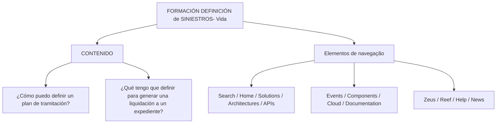

# Formação — Definição de Sinistros: Vida

## 1. Metadados do Documento
- **Arquivo de Origem:** `Não identificado`
- **Tipo de Documento:** `Material de Formação`
- **Domínio / Sistema:** `Definição de Sinistros — Vida`
- **Público-Alvo:** `Não identificado`
- **Data/Versão Identificada:** `Não identificada`

---

## 2. Resumo Executivo & Contexto de Negócio

O conteúdo apresentado identifica um material de formação denominado **“FORMACIÓN DEFINICIÓN de SINIESTROS- Vida”**. O escopo explícito está relacionado à definição de sinistros no domínio de Vida.

A seção de conteúdo apresenta duas perguntas centrais: como definir um plano de tramitação e o que deve ser definido para gerar uma liquidação para um expediente. Essas perguntas indicam que o material aborda, ao menos em nível temático, a configuração de processos de tratamento e de liquidação de expedientes de sinistros.

O trecho fornecido não detalha regras operacionais, critérios de elegibilidade, cálculos, papéis, sistemas envolvidos, contratos de integração ou procedimentos passo a passo. Também não explica o significado da sigla `CF`.

Além do conteúdo de formação, o texto contém itens de navegação de uma interface ou portal, incluindo “Search”, “Home”, “Solutions”, “Architectures”, “APIs”, “Events”, “Components”, “Cloud”, “Documentation”, “Zeus”, “Reef”, “Help” e “News”.

---

## 3. Arquitetura, Componentes & Tecnologias Envolvidas

O conteúdo não descreve uma arquitetura de software, tecnologias, microsserviços, bancos de dados, integrações, ambientes ou protocolos técnicos.

Os únicos elementos nomeados são itens de navegação de uma interface: `Search`, `Home`, `Solutions`, `Architectures`, `APIs`, `Events`, `Components`, `Cloud`, `Documentation`, `Zeus`, `Reef`, `Help` e `News`. O texto não esclarece se `Zeus` e `Reef` são sistemas, produtos, módulos ou categorias de navegação.



**Nota de Análise:** O conteúdo não apresenta detalhamento adicional sobre relações técnicas ou de negócio entre os itens exibidos no diagrama.

---

## 4. Regras de Negócio, Especificações Funcionais & Processos

O trecho extraído contém os seguintes tópicos funcionais:

1. **Definição de plano de tramitação**
   - O documento pergunta: “¿Cómo puedo definir un plan de tramitación?”
   - Não são apresentados os passos para definir o plano de tramitação.
   - Não são informados parâmetros, responsáveis, validações, estados, exceções ou critérios para o plano de tramitação.

2. **Definição necessária para gerar uma liquidação para um expediente**
   - O documento pergunta: “¿Qué tengo que definir para generar una liquidación a un expediente?”
   - Não são apresentadas as definições, os dados de entrada, as regras de cálculo, os pré-requisitos ou o procedimento de geração da liquidação.
   - O conteúdo não descreve o significado operacional de “expediente” no contexto de sinistros de Vida.

3. **Referência a `CF`**
   - O texto inclui a sequência `/ CF`.
   - Não há expansão, definição ou contexto funcional suficiente para determinar o significado de `CF`.

**Nota de Análise:** O material fornecido lista temas de formação, mas não contém o detalhamento necessário para documentar regras de negócio executáveis ou processos operacionais completos.

---

## 5. Tabelas de Parâmetros, Ambientes e Estruturas de Dados

| Item / Parâmetro | Descrição / Função | Tipo / Valores / Formato | Ambiente / Observações |
| :--- | :--- | :--- | :--- |
| Formação | Material denominado `FORMACIÓN DEFINICIÓN de SINIESTROS- Vida` | Título de conteúdo | Não há versão, data ou arquivo identificados |
| Plano de tramitação | Tema apresentado pela pergunta sobre como defini-lo | Processo funcional; detalhes não fornecidos | Não há etapas, parâmetros ou regras descritos |
| Liquidação | Tema apresentado pela pergunta sobre geração de liquidação para um expediente | Processo funcional; detalhes não fornecidos | Não há cálculo, pré-requisito ou fluxo informado |
| Expediente | Entidade mencionada como destino da liquidação | Termo de domínio; definição não fornecida | Relação exata com sinistros não detalhada |
| `CF` | Sigla ou identificador exibido no texto | Não identificado | Sem expansão ou explicação |
| `Zeus` | Item listado na navegação | Não identificado | O texto não confirma se é sistema, módulo ou categoria |
| `Reef` | Item listado na navegação | Não identificado | O texto não confirma se é sistema, módulo ou categoria |
| Idioma | Indicador `EN` exibido ao final | Código/indicador de idioma | O significado operacional não é detalhado |

---

## 6. Bateria de Perguntas & Respostas para RAG (FAQ Sintético)

### P1: Qual é o tema principal do material apresentado?
**R:** O material é denominado **“FORMACIÓN DEFINICIÓN de SINIESTROS- Vida”** e trata do tema de definição de sinistros no domínio de Vida.

### P2: O documento explica como definir um plano de tramitação?
**R:** Não. O documento apenas apresenta a pergunta “¿Cómo puedo definir un plan de tramitación?”, sem fornecer passos, parâmetros, responsáveis, critérios de validação ou regras para definir um plano de tramitação.

### P3: Quais informações devem ser definidas para gerar uma liquidação para um expediente?
**R:** O documento pergunta “¿Qué tengo que definir para generar una liquidación a un expediente?”, mas não informa quais definições, campos, regras de cálculo, pré-requisitos ou procedimentos são necessários.

### P4: O documento contém regras de cálculo para a liquidação?
**R:** Não. O trecho fornecido não apresenta valores, fórmulas, critérios de cálculo, condições de aprovação ou regras de negócio para liquidação.

### P5: O que significa a sigla CF no documento?
**R:** O texto contém a referência `/ CF`, mas não apresenta uma expansão ou definição para a sigla `CF`. Não é possível determinar seu significado com base exclusivamente no conteúdo fornecido.

### P6: O documento identifica sistemas ou componentes de software envolvidos na definição de sinistros?
**R:** Não há sistemas ou componentes explicitamente caracterizados. Os termos `Zeus` e `Reef` aparecem em uma lista de navegação, mas o documento não define se representam sistemas, módulos, produtos ou categorias.

### P7: Quais itens de navegação aparecem no conteúdo bruto?
**R:** O texto apresenta os itens: `Search`, `Home`, `Solutions`, `Architectures`, `APIs`, `Events`, `Components`, `Cloud`, `Documentation`, `Zeus`, `Reef`, `Help` e `News`.

### P8: O documento apresenta um fluxo operacional completo para tramitação de sinistros de Vida?
**R:** Não. O conteúdo apenas menciona a definição de um plano de tramitação como pergunta de formação. Não há sequência de etapas, estados, transições, exceções ou responsáveis operacionais.

### P9: Existe versão ou data identificada para o material de formação?
**R:** Não. O trecho fornecido não contém data, versão, autor, organização responsável ou nome de arquivo de origem.

### P10: O público-alvo do material está definido?
**R:** Não. Embora o título indique que se trata de uma formação relacionada a sinistros de Vida, o documento não identifica explicitamente se o público-alvo é composto por analistas, operadores, desenvolvedores, arquitetos ou equipes de negócio.

---

## 7. Glossário de Termos, Siglas & Conceitos-Chave

- **Sinistros:** Termo presente no título do material; o conteúdo não fornece uma definição formal.
- **Vida:** Qualificador do domínio “SINIESTROS- Vida”; não há detalhamento adicional.
- **Plano de tramitação:** Tema citado como uma pergunta de conteúdo; não possui definição, etapas ou parâmetros no trecho fornecido.
- **Liquidação:** Tema citado em relação à geração para um expediente; não possui definição de cálculo ou processamento no trecho fornecido.
- **Expediente:** Termo citado como alvo da liquidação; não possui definição no trecho fornecido.
- **CF:** Sigla ou identificador sem expansão ou contexto suficiente.
- **Zeus:** Item de navegação sem definição.
- **Reef:** Item de navegação sem definição.
- **EN:** Indicador exibido no texto; o conteúdo não explica seu significado.

---

## 8. Notas Críticas, Riscos & Limitações

- O conteúdo é extremamente resumido e não fornece detalhamento suficiente para operacionalizar a definição de um plano de tramitação.
- Não há regras de negócio, dados obrigatórios, validações, cálculos, estados de processo ou exceções para a geração de liquidação.
- Não há evidência textual que permita classificar `Zeus`, `Reef` ou `CF` com precisão.
- Não foram identificados ambientes, URLs, credenciais, rotas de log, APIs, contratos, tecnologias ou responsáveis.
- Não há data, versão, nome de arquivo ou autoria identificáveis no trecho fornecido.
- Qualquer interpretação adicional sobre sinistros, liquidação, expediente, `CF`, `Zeus` ou `Reef` excederia os fatos disponíveis no conteúdo original.

---

## 9. Conteúdo Bruto Estruturado (Referência Fiel)

```text
--- [PÁGINA 1 DE 1] ---

FORMACIÓN DEFINICIÓN de SINIESTROS- Vida
CONTENIDO
¿Cómo puedo definir un plan de tramitación?
¿Qué tengo que definir para generar una liquidación a un expediente?
 / 
 CF
Search Home Solutions Architectures APIs Events Components Cloud Documentation Zeus Reef Help News
EN
```
