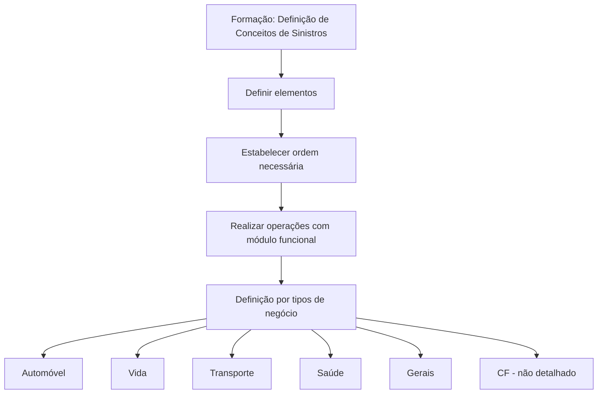

# Formação: Definição de Conceitos de Sinistros

## 1. Metadados do Documento
- **Arquivo de Origem:** Não identificado
- **Tipo de Documento:** Apresentação Executiva
- **Domínio / Sistema:** Conceitos de sinistros; definição por tipos de negócio
- **Público-Alvo:** Negócio, analistas funcionais e operação
- **Data/Versão Identificada:** Não identificada

---

## 2. Resumo Executivo & Contexto de Negócio

O documento apresenta uma formação sobre a definição de conceitos de sinistros. O propósito declarado é identificar os elementos que devem ser definidos e estabelecer a ordem necessária para executar operações com um módulo funcional.

A organização conceitual é feita por tipos de negócio. Os tipos explicitamente listados são Automóvel, Vida, Transporte, Saúde e Gerais. O texto também apresenta a sigla `CF`, sem expansão ou explicação adicional.

O conteúdo disponível é resumido e não detalha regras de processamento, etapas operacionais, contratos técnicos, integrações, sistemas de origem, responsabilidades ou critérios de validação. A informação deve, portanto, ser interpretada como uma classificação inicial de conceitos de sinistros por linha de negócio.

---

## 3. Arquitetura, Componentes & Tecnologias Envolvidas

O documento não descreve uma arquitetura de software, componentes técnicos, microsserviços, bancos de dados ou tecnologias. O fluxo conceitual identificado consiste na definição de elementos e de uma ordem operacional para um módulo funcional, segmentada por tipo de negócio.



> **Nota de Análise:** O documento não detalha quais são os elementos a definir, qual é a ordem de execução nem quais operações são realizadas pelo módulo funcional.

---

## 4. Regras de Negócio, Especificações Funcionais & Processos

1. Para realizar operações com um módulo funcional, devem ser definidos determinados elementos.
2. Deve existir uma ordem necessária para a definição dos elementos e a realização das operações.
3. A definição de conceitos de sinistros é organizada por tipos de negócio.
4. Os tipos de negócio explicitamente apresentados são:
   - Automóvel;
   - Vida;
   - Transporte;
   - Saúde;
   - Gerais.
5. A sigla `CF` aparece no conteúdo, mas não possui definição, regra de negócio ou relacionamento operacional descrito.

> **Nota de Análise:** Não há critérios de elegibilidade, fórmulas, validações, estados de sinistro, regras de aprovação, regras de cálculo ou exceções documentadas no material fornecido.

---

## 5. Tabelas de Parâmetros, Ambientes e Estruturas de Dados

| Item / Parâmetro | Descrição / Função | Tipo / Valores / Formato | Ambiente / Observações |
| :--- | :--- | :--- | :--- |
| Conceitos de sinistros | Tema central da formação apresentada | Conceito funcional | Não detalhado |
| Elementos a definir | Elementos necessários para realizar operações com um módulo funcional | Não especificado | O documento não lista os elementos |
| Ordem necessária | Sequência necessária para realizar operações com o módulo funcional | Processo / sequência | A sequência não é detalhada |
| Módulo funcional | Módulo no qual as operações serão realizadas | Componente funcional | Nome e comportamento não identificados |
| Tipo de negócio: Automóvel | Categoria de negócio para definição de conceitos de sinistros | Linha de negócio | Sem detalhamento adicional |
| Tipo de negócio: Vida | Categoria de negócio para definição de conceitos de sinistros | Linha de negócio | Sem detalhamento adicional |
| Tipo de negócio: Transporte | Categoria de negócio para definição de conceitos de sinistros | Linha de negócio | Sem detalhamento adicional |
| Tipo de negócio: Saúde | Categoria de negócio para definição de conceitos de sinistros | Linha de negócio | Sem detalhamento adicional |
| Tipo de negócio: Gerais | Categoria de negócio para definição de conceitos de sinistros | Linha de negócio | Sem detalhamento adicional |
| CF | Sigla exibida no material | Sigla não expandida | Não definida no documento |
| Search Home Solutions Architectures APIs Events Components Cloud Documentation Zeus Reef Help News | Itens de navegação exibidos no material | Interface / navegação | Não há relação funcional explicada com sinistros |
| EN | Indicador de idioma exibido no material | Idioma / interface | Não detalhado |

---

## 6. Bateria de Perguntas & Respostas para RAG (FAQ Sintético)

### P1: Qual é o objetivo da formação sobre definição de conceitos de sinistros?
**R:** O objetivo declarado é definir os elementos necessários e a ordem que deve ser seguida para realizar operações com um módulo funcional no contexto de conceitos de sinistros.

### P2: Quais tipos de negócio são mencionados para a definição de conceitos de sinistros?
**R:** O documento lista cinco tipos de negócio: Automóvel, Vida, Transporte, Saúde e Gerais.

### P3: O documento explica quais elementos devem ser definidos para operar o módulo funcional?
**R:** Não. O documento afirma que existem elementos que devem ser definidos, mas não identifica nem descreve esses elementos.

### P4: Qual é a ordem operacional necessária para realizar operações no módulo funcional?
**R:** O documento indica que há uma ordem necessária a seguir, mas não apresenta as etapas, a sequência ou os critérios dessa ordem.

### P5: O documento descreve um sistema ou módulo funcional específico?
**R:** Não. O texto menciona apenas um “módulo funcional”, sem informar nome, arquitetura, funcionalidades, integrações ou tecnologia associada.

### P6: Há regras específicas de sinistros para Automóvel, Vida, Transporte, Saúde ou Gerais?
**R:** Não. O documento apenas lista esses tipos de negócio como categorias de definição; não fornece regras específicas para nenhuma das categorias.

### P7: O que significa a sigla CF no documento?
**R:** O significado de `CF` não é identificado no conteúdo fornecido. A sigla é apresentada sem expansão, contexto ou definição adicional.

### P8: O documento contém APIs, URLs de ambiente, servidores ou parâmetros técnicos?
**R:** Não. Apesar de apresentar palavras de navegação como “APIs”, “Cloud”, “Documentation”, “Zeus” e “Reef”, o material não descreve URLs, ambientes, servidores, contratos ou parâmetros técnicos.

### P9: O documento apresenta fluxos completos de tratamento de sinistros?
**R:** Não. O material apresenta somente a necessidade de definir elementos e uma ordem para operações de um módulo funcional, sem detalhar um fluxo completo de tratamento de sinistros.

### P10: Quais limitações devem ser consideradas ao usar este documento como referência operacional?
**R:** O documento é resumido e não contém detalhamento de regras, dados, responsáveis, integrações, procedimentos, critérios de validação ou exemplos de operação. Ele deve ser usado como referência de classificação conceitual inicial, não como manual operacional completo.

---

## 7. Glossário de Termos, Siglas & Conceitos-Chave

- **Sinistros:** Tema central do documento; não possui definição adicional no material.
- **Módulo funcional:** Módulo no qual devem ser realizadas operações após a definição dos elementos e da ordem necessária. Não detalhado.
- **Tipos de negócio:** Categorias usadas para organizar a definição de conceitos de sinistros: Automóvel, Vida, Transporte, Saúde e Gerais.
- **CF:** Sigla apresentada sem significado identificado.
- **EN:** Indicador apresentado no material, possivelmente relacionado a idioma; não detalhado.
- **APIs:** Termo exibido na navegação do material, sem especificação de interfaces ou contratos.
- **Zeus:** Nome exibido na navegação do material, sem contexto funcional ou técnico.
- **Reef:** Nome exibido na navegação do material, sem contexto funcional ou técnico.

---

## 8. Notas Críticas, Riscos & Limitações

- O documento não identifica o arquivo de origem, autor, data, versão ou sistema associado.
- Não há detalhamento dos elementos que precisam ser definidos para operar o módulo funcional.
- Não há sequência operacional, regras de negócio, critérios de validação ou tratamento de exceções.
- Não há especificação técnica de arquitetura, integrações, APIs, dados, logs, ambientes ou URLs.
- A sigla `CF` não é explicada.
- Os termos de navegação, incluindo `Zeus` e `Reef`, são exibidos sem relacionamento explícito com a definição de sinistros.
- O material é insuficiente para implementação técnica ou operação ponta a ponta sem documentação complementar.

---

## 9. Conteúdo Bruto Estruturado (Referência Fiel)

```text
--- [PÁGINA 1 DE 1] ---

FORMACIÓN DEFINICIÓN de CONCEPTOS de SINIESTROS
 Elementos que se han de definir así como el orden necesario a seguir con el fin de poder realizar operaciones con un módulo funcional.
DEFINICIÓN POR TIPOS DE NEGOCIO
 AUTOMÓVIL
  VIDA
  TRANSPORTE
  SALUD
 GENERALES
 / 
 CF
Search Home Solutions Architectures APIs Events Components Cloud Documentation Zeus Reef Help News
EN
```
