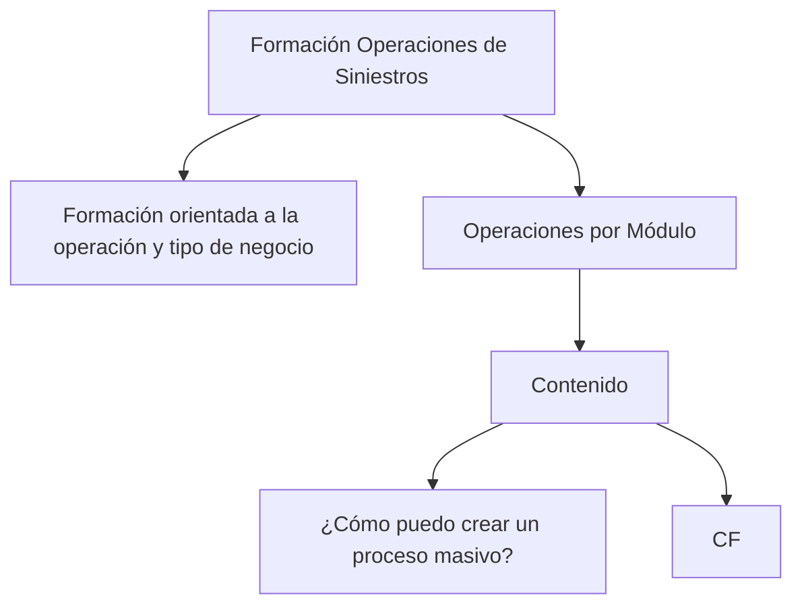

# Formação de Operações de Sinistros por Módulo

## 1. Metadados do Documento
- **Arquivo de Origem:** Não identificado no conteúdo fornecido
- **Tipo de Documento:** Apresentação Executiva
- **Domínio / Sistema:** Operações de Sinistros
- **Público-Alvo:** Operação e negócios
- **Data/Versão Identificada:** Não identificada

---

## 2. Resumo Executivo & Contexto de Negócio

O conteúdo apresenta uma formação orientada à operação de sinistros e ao tipo de negócio. A formação está organizada sob o conceito de operações por módulo, indicando uma segmentação temática ou funcional do material.

O único tópico operacional explicitamente formulado como pergunta é: “¿Cómo puedo crear un proceso masivo?”. O documento fornecido não detalha o procedimento, pré-requisitos, regras de validação, sistemas envolvidos ou resultados esperados para a criação de um processo massivo.

Também aparece uma sequência de termos de navegação e categorias: `Search`, `Home`, `Solutions`, `Architectures`, `APIs`, `Events`, `Components`, `Cloud`, `Documentation`, `Zeus`, `Reef`, `Help` e `News`, além do idioma `EN`. O conteúdo não explica se esses termos pertencem a uma aplicação, portal, menu ou ambiente específico.

> **Nota de Análise:** O material fornecido contém apenas um recorte resumido. Não há detalhamento adicional sobre módulos, fluxos operacionais, integrações, arquitetura, permissões ou contratos técnicos.

---

## 3. Arquitetura, Componentes & Tecnologias Envolvidas

Os elementos identificados no conteúdo são:

| Componente / Termo | Contexto identificado | Detalhamento disponível |
| :--- | :--- | :--- |
| Operações de Sinistros | Tema principal da formação | Formação orientada à operação e ao tipo de negócio |
| Operações por Módulo | Forma de organização do conteúdo | Não são identificados os módulos ou suas responsabilidades |
| Processo massivo | Tópico operacional | O documento pergunta como criá-lo, sem fornecer procedimento |
| CF | Sigla ou marcador apresentado isoladamente | Não detalhado |
| Zeus | Item listado em uma sequência de navegação | Não detalhado |
| Reef | Item listado em uma sequência de navegação | Não detalhado |
| APIs | Categoria ou item de navegação | Não detalhado |
| Events | Categoria ou item de navegação | Não detalhado |
| Components | Categoria ou item de navegação | Não detalhado |
| Cloud | Categoria ou item de navegação | Não detalhado |
| Documentation | Categoria ou item de navegação | Não detalhado |



> **Nota de Análise:** O diagrama representa exclusivamente a hierarquia textual visível no conteúdo. O documento não fornece uma arquitetura de software, integrações entre sistemas, tecnologias implementadas ou fluxos de dados.

---

## 4. Regras de Negócio, Especificações Funcionais & Processos

### Formação de operações de sinistros
- A formação é orientada à operação.
- A formação considera o tipo de negócio.
- O conteúdo é organizado sob o conceito de operações por módulo.

### Criação de processo massivo
- O conteúdo inclui a pergunta: `¿Cómo puedo crear un proceso masivo?`.
- Não há resposta, sequência de etapas, parâmetros, tela, sistema, critérios de elegibilidade ou regras de negócio fornecidos para a criação de um processo massivo.
- Não há indicação de como o termo `CF` se relaciona com o processo massivo.

### Navegação e categorias listadas
O conteúdo apresenta os seguintes termos em sequência:

1. Search
2. Home
3. Solutions
4. Architectures
5. APIs
6. Events
7. Components
8. Cloud
9. Documentation
10. Zeus
11. Reef
12. Help
13. News
14. EN

> **Nota de Análise:** Não é possível afirmar a finalidade funcional, técnica ou operacional dessa sequência sem informações adicionais do documento original.

---

## 5. Tabelas de Parâmetros, Ambientes e Estruturas de Dados

| Item / Parâmetro | Descrição / Função | Tipo / Valores / Formato | Ambiente / Observações |
| :--- | :--- | :--- | :--- |
| Formação de Operações de Sinistros | Título ou tema principal do conteúdo | Texto em espanhol | Sem ambiente identificado |
| Formação orientada à operação e tipo de negócio | Diretriz da formação | Texto em espanhol | Não detalha tipos de negócio |
| Operações por Módulo | Organização declarada das operações | Texto em espanhol | Módulos não identificados |
| Processo massivo | Tema operacional citado como pergunta | `¿Cómo puedo crear un proceso masivo?` | Sem procedimento informado |
| CF | Sigla ou marcador textual | `CF` | Significado não identificado |
| Search | Item de navegação listado | Texto em inglês | Função não detalhada |
| Home | Item de navegação listado | Texto em inglês | Função não detalhada |
| Solutions | Item de navegação listado | Texto em inglês | Função não detalhada |
| Architectures | Item de navegação listado | Texto em inglês | Função não detalhada |
| APIs | Item de navegação listado | Texto em inglês | APIs não especificadas |
| Events | Item de navegação listado | Texto em inglês | Eventos não especificados |
| Components | Item de navegação listado | Texto em inglês | Componentes não especificados |
| Cloud | Item de navegação listado | Texto em inglês | Ambiente cloud não especificado |
| Documentation | Item de navegação listado | Texto em inglês | Documentação não identificada |
| Zeus | Item de navegação listado | Texto em inglês | Papel não detalhado |
| Reef | Item de navegação listado | Texto em inglês | Papel não detalhado |
| Help | Item de navegação listado | Texto em inglês | Função não detalhada |
| News | Item de navegação listado | Texto em inglês | Função não detalhada |
| EN | Indicador textual de idioma | Código `EN` | Provavelmente inglês; não explicado no conteúdo |

---

## 6. Bateria de Perguntas & Respostas para RAG (FAQ Sintético)

### P1: Qual é o tema principal do documento?
**R:** O tema principal é a formação de operações de sinistros, orientada à operação e ao tipo de negócio.

### P2: Como as operações são organizadas no conteúdo?
**R:** O conteúdo declara que as operações são apresentadas por módulo. Contudo, o material fornecido não identifica quais módulos existem nem descreve suas responsabilidades.

### P3: O documento explica como criar um processo massivo?
**R:** Não. O documento apresenta a pergunta “¿Cómo puedo crear un proceso masivo?”, mas não fornece procedimento, parâmetros, critérios, telas, sistemas ou regras para executar a criação de um processo massivo.

### P4: O que significa a sigla CF no documento?
**R:** O conteúdo apresenta o texto `CF` de forma isolada, sem definição ou contexto suficiente para determinar seu significado.

### P5: Quais tecnologias ou plataformas são identificadas no material?
**R:** O material lista os termos APIs, Events, Components, Cloud, Zeus e Reef. Entretanto, não fornece descrições técnicas, versões, integrações ou responsabilidades para nenhum desses termos.

### P6: O documento contém uma arquitetura de software detalhada?
**R:** Não. O documento não descreve camadas arquiteturais, serviços, bancos de dados, protocolos, fluxos de integração ou tecnologias implementadas.

### P7: Zeus e Reef são sistemas ou componentes do domínio de sinistros?
**R:** Zeus e Reef aparecem na sequência textual fornecida, mas o documento não define se são sistemas, componentes, portais, produtos ou categorias de navegação.

### P8: Existe indicação de ambientes, URLs ou servidores?
**R:** Não. O conteúdo não apresenta URLs, nomes de servidores, ambientes de desenvolvimento, homologação, produção, portas, caminhos de logs ou parâmetros de infraestrutura.

### P9: Qual é o público-alvo inferido para a formação?
**R:** A formação é explicitamente orientada à operação e ao tipo de negócio. Portanto, o público-alvo identificado é composto por profissionais de operação e negócio relacionados a sinistros.

### P10: Quais itens de navegação são citados?
**R:** Os itens citados são Search, Home, Solutions, Architectures, APIs, Events, Components, Cloud, Documentation, Zeus, Reef, Help e News. O conteúdo também apresenta `EN`, sem explicar formalmente o seu significado.

---

## 7. Glossário de Termos, Siglas & Conceitos-Chave

- **Sinistros:** Domínio mencionado no título da formação; o documento não fornece uma definição operacional adicional.
- **Operações por Módulo:** Organização das operações declarada no conteúdo; os módulos não são especificados.
- **Processo massivo:** Processo citado na pergunta sobre criação; não há definição, fluxo ou regras associadas.
- **CF:** Sigla ou marcador citado sem expansão ou explicação.
- **APIs:** Termo listado na sequência de navegação; nenhuma interface, contrato ou endpoint é detalhado.
- **Events:** Termo listado na sequência de navegação; nenhum evento é identificado.
- **Components:** Termo listado na sequência de navegação; nenhum componente é descrito.
- **Cloud:** Termo listado na sequência de navegação; nenhum provedor, serviço ou ambiente cloud é informado.
- **Zeus:** Termo listado sem definição contextual.
- **Reef:** Termo listado sem definição contextual.
- **EN:** Código textual listado sem explicação; provavelmente uma indicação de idioma, mas essa interpretação não é confirmada pelo conteúdo.

---

## 8. Notas Críticas, Riscos & Limitações

- O conteúdo fornecido é extremamente resumido e não contém detalhamento operacional suficiente para executar processos de negócio.
- A criação de processo massivo é apresentada somente como uma pergunta, sem resposta ou instrução verificável.
- A sigla `CF` não é definida.
- Zeus, Reef, APIs, Events, Components e Cloud são apenas mencionados; não há evidência documental para classificá-los como sistemas, plataformas, serviços ou funcionalidades.
- Não foram identificados requisitos, regras de negócio, permissões, dados de entrada, saídas, integrações, ambientes, logs, URLs, versões ou responsáveis.
- Não há data, versão, autoria ou nome de arquivo identificáveis no conteúdo bruto fornecido.

---

## 9. Conteúdo Bruto Estruturado (Referência Fiel)

```text
--- [PÁGINA 1 DE 1] ---

FORMACIÓN OPERACIONES de SINIESTROS
 Formación orientada a la operación y tipo de negocio
OPERACIONES por MÓDULO
CONTENIDO
¿Cómo puedo crear un proceso masivo?
 / 
 CF
Search Home Solutions Architectures APIs Events Components Cloud Documentation Zeus Reef Help News
EN
```
