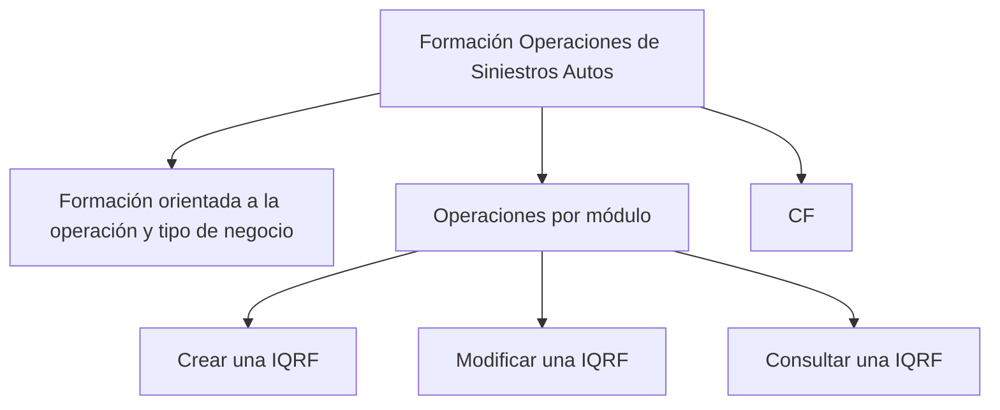

# Formação de Operações de Sinistros Autos — Operações por Módulo

## 1. Metadados do Documento
- **Arquivo de Origem:** Não identificado no conteúdo fornecido
- **Tipo de Documento:** Apresentação Executiva / Material de Formação
- **Domínio / Sistema:** Operações de Sinistros Autos; IQRF; CF
- **Público-Alvo:** Operação
- **Data/Versão Identificada:** Não identificada

---

## 2. Resumo Executivo & Contexto de Negócio

O conteúdo apresenta um material de formação voltado às operações de sinistros de automóveis. A formação é explicitamente orientada à operação e ao tipo de negócio, com organização das operações por módulo.

O índice do material indica que um dos temas abordados é como criar, modificar e consultar uma IQRF. O conteúdo também referencia “CF”, sem expansão da sigla, definição funcional ou detalhamento de procedimentos.

O trecho fornecido não descreve regras de negócio, arquitetura técnica, integrações, ambientes, permissões, telas, campos ou contratos de API. Portanto, o escopo recuperável limita-se à identificação do contexto de formação operacional e dos tópicos listados.

---

## 3. Arquitetura, Componentes & Tecnologias Envolvidas

Os elementos identificados no conteúdo são:

- Formação de Operações de Sinistros Autos.
- Operações por módulo.
- IQRF, citada como objeto sujeito a criação, modificação e consulta.
- CF, citada sem detalhamento.
- Menu ou navegação contendo: `Search`, `Home`, `Solutions`, `Architectures`, `APIs`, `Events`, `Components`, `Cloud`, `Documentation`, `Zeus`, `Reef`, `Help` e `News`.
- Idioma ou seleção de idioma indicada por `EN`.

> **Nota de Análise:** O conteúdo não define relações técnicas entre IQRF, CF, Zeus, Reef ou os demais itens de navegação. Também não informa se os termos representam sistemas, módulos, páginas, categorias de portal ou componentes de arquitetura.



---

## 4. Regras de Negócio, Especificações Funcionais & Processos

O conteúdo fornecido apresenta somente os seguintes tópicos funcionais:

1. A formação é orientada à operação e ao tipo de negócio.
2. As operações são organizadas por módulo.
3. O conteúdo inclui instruções ou cobertura sobre:
   - criação de uma IQRF;
   - modificação de uma IQRF;
   - consulta de uma IQRF.
4. O termo `CF` é listado no conteúdo, mas não possui explicação adicional.

> **Nota de Análise:** O documento não detalha pré-requisitos, responsáveis, etapas operacionais, validações, campos obrigatórios, regras de transição, critérios de consulta, permissões ou resultados esperados para criação, alteração ou consulta de uma IQRF.

---

## 5. Tabelas de Parâmetros, Ambientes e Estruturas de Dados

| Item / Parâmetro | Descrição / Função | Tipo / Valores / Formato | Ambiente / Observações |
| :--- | :--- | :--- | :--- |
| Formação de Operações de Sinistros Autos | Material de formação relacionado a operações de sinistros de automóveis | Título / contexto de formação | Não há ambiente identificado |
| Operações por módulo | Forma de organização das operações apresentadas | Estrutura de conteúdo | Módulos não são enumerados |
| IQRF | Entidade ou item que pode ser criado, modificado e consultado | Sigla não expandida | Não há detalhes de campos, fluxo ou regras |
| CF | Termo citado no conteúdo | Sigla não expandida | Não há detalhamento adicional |
| Search | Item de navegação | Texto de menu | Contexto técnico não identificado |
| Home | Item de navegação | Texto de menu | Contexto técnico não identificado |
| Solutions | Item de navegação | Texto de menu | Contexto técnico não identificado |
| Architectures | Item de navegação | Texto de menu | Contexto técnico não identificado |
| APIs | Item de navegação | Texto de menu | Não há APIs especificadas |
| Events | Item de navegação | Texto de menu | Não há eventos especificados |
| Components | Item de navegação | Texto de menu | Não há componentes especificados |
| Cloud | Item de navegação | Texto de menu | Não há provedor ou ambiente especificado |
| Documentation | Item de navegação | Texto de menu | Não há repositório ou URL informado |
| Zeus | Item de navegação | Nome próprio | Não há definição no conteúdo |
| Reef | Item de navegação | Nome próprio | Não há definição no conteúdo |
| Help | Item de navegação | Texto de menu | Contexto técnico não identificado |
| News | Item de navegação | Texto de menu | Contexto técnico não identificado |
| EN | Indicador textual de idioma | Código / rótulo exibido | Não há confirmação de que seja configuração de idioma |

---

## 6. Bateria de Perguntas & Respostas para RAG (FAQ Sintético)

### P1: Qual é o tema central do material de formação?
**R:** O material trata de operações de sinistros de automóveis, identificado pelo título “FORMACIÓN OPERACIONES de SINIESTROS AUTOS”.

### P2: Para qual contexto a formação é orientada?
**R:** A formação é orientada à operação e ao tipo de negócio, conforme o texto “Formación orientada a la operación y tipo de negocio”.

### P3: Como as operações são organizadas no material?
**R:** O conteúdo informa que as operações são organizadas por módulo. O trecho fornecido não identifica quais módulos compõem essa organização.

### P4: Quais operações relacionadas a IQRF são citadas?
**R:** O conteúdo cita três operações sobre IQRF: criar, modificar e consultar uma IQRF.

### P5: O documento explica como criar uma IQRF?
**R:** Não. O índice pergunta “¿Cómo crear, modificar y consultar una IQRF?”, mas o trecho fornecido não apresenta etapas, telas, campos, validações ou critérios para criação.

### P6: Quais regras de validação devem ser aplicadas ao modificar uma IQRF?
**R:** O conteúdo fornecido não especifica regras de validação para modificação de IQRF.

### P7: O que significa a sigla IQRF neste documento?
**R:** O significado da sigla IQRF não é informado no conteúdo. Apenas é indicado que uma IQRF pode ser criada, modificada e consultada.

### P8: O que significa CF no material?
**R:** O termo “CF” aparece no conteúdo, mas não é expandido nem explicado. Não é possível determinar seu significado com base no trecho fornecido.

### P9: O documento descreve APIs ou eventos de integração?
**R:** Não. Os termos “APIs” e “Events” aparecem em uma lista de navegação, mas não há contratos, endpoints, métodos HTTP, payloads ou eventos detalhados.

### P10: Zeus e Reef são sistemas integrados à operação de sinistros?
**R:** O conteúdo lista “Zeus” e “Reef” em uma navegação, mas não descreve seus papéis, integrações ou relação com a operação de sinistros.

### P11: Existe informação sobre ambientes, URLs ou servidores?
**R:** Não. O trecho não contém URLs, nomes de servidores, portas, credenciais, ambientes de desenvolvimento, homologação ou produção.

### P12: Há detalhes sobre permissões para consultar ou alterar uma IQRF?
**R:** Não. O conteúdo não informa perfis de acesso, matrizes de permissão ou responsabilidades operacionais para IQRF.

---

## 7. Glossário de Termos, Siglas & Conceitos-Chave

- **Sinistros Autos:** Contexto de operações relacionado a sinistros de automóveis, conforme o título do material.
- **IQRF:** Sigla citada como objeto de criação, modificação e consulta; o significado não é definido no conteúdo.
- **CF:** Sigla ou termo citado sem definição adicional.
- **Operações por módulo:** Organização das operações por módulos; os módulos não são detalhados.
- **Zeus:** Nome citado em uma lista de navegação, sem definição funcional ou técnica.
- **Reef:** Nome citado em uma lista de navegação, sem definição funcional ou técnica.
- **EN:** Indicador textual exibido na navegação; o conteúdo não confirma formalmente seu significado.

---

## 8. Notas Críticas, Riscos & Limitações

- O arquivo de origem, a data e a versão não foram identificados no conteúdo fornecido.
- O trecho aparenta ser uma capa, índice ou extrato inicial de uma apresentação, não uma especificação operacional completa.
- A sigla `IQRF` não é expandida nem possui estrutura de dados, regras ou procedimentos detalhados.
- A sigla `CF` é citada sem definição.
- Não há informações sobre arquitetura, integrações, APIs, eventos, ambientes, logs, servidores, URLs, perfis de acesso ou requisitos não funcionais.
- Não é possível inferir a função de `Zeus` e `Reef` somente pela lista de navegação.
- Não há detalhamento adicional para reconstruir os procedimentos de criação, modificação ou consulta de IQRF.

---

## 9. Conteúdo Bruto Estruturado (Referência Fiel)

```text
--- [PÁGINA 1 DE 1] ---

Imagen LOGO
FORMACIÓN OPERACIONES de SINIESTROS AUTOS
 Formación orientada a la operación y tipo de negocio
OPERACIONES por MÓDULO
CONTENIDO
¿Cómo crear, modificar y consultar una IQRF?
 / 
 CF
Search Home Solutions Architectures APIs Events Components Cloud Documentation Zeus Reef Help News
EN
```
