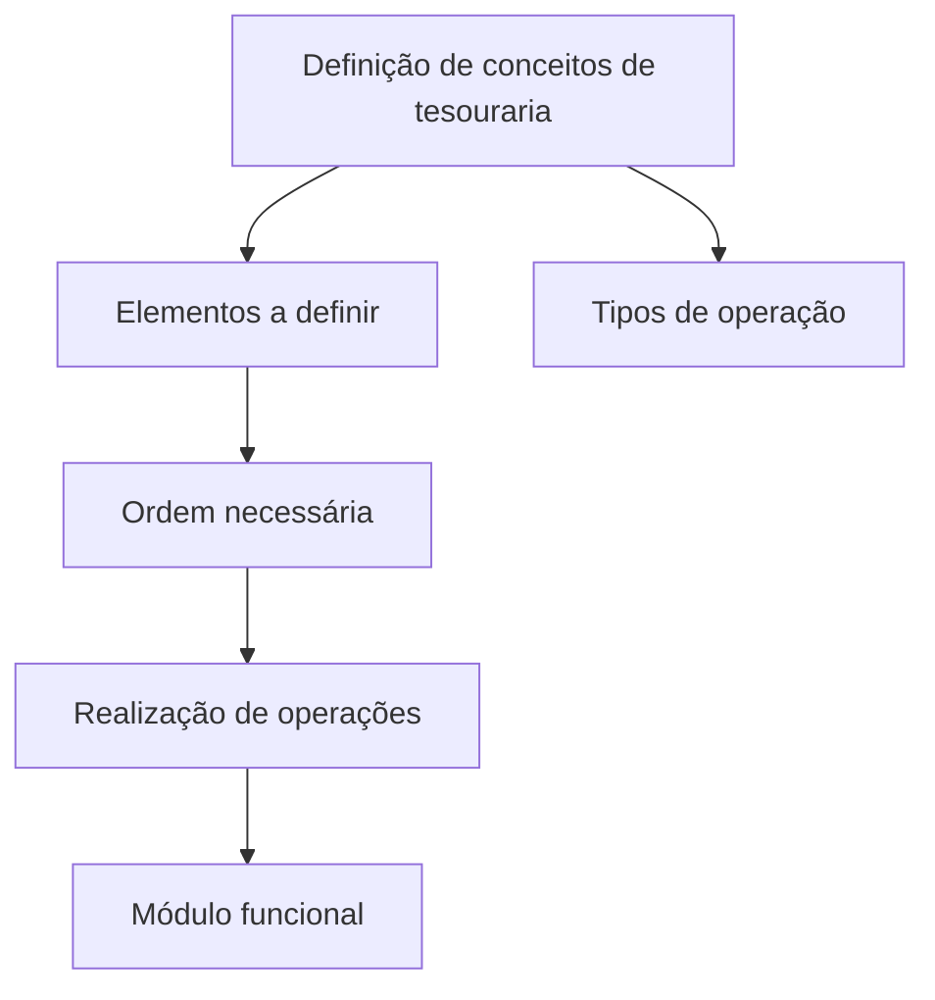

# Definição de Conceitos de Tesouraria — Tipos de Operação

## 1. Metadados do Documento
- **Arquivo de Origem:** Não identificado
- **Tipo de Documento:** Apresentação Executiva
- **Domínio / Sistema:** Tesouraria
- **Público-Alvo:** Não identificado
- **Data/Versão Identificada:** Não identificada

---

## 2. Resumo Executivo & Contexto de Negócio

O conteúdo apresenta a definição de conceitos de tesouraria necessários para a realização de operações em um módulo funcional. O foco declarado é estabelecer os elementos que devem ser definidos e a ordem necessária para que operações possam ser executadas.

O documento cita explicitamente “Tipos de Operação” como tópico relacionado ao domínio de tesouraria. Entretanto, o texto extraído não detalha os tipos existentes, suas regras, parâmetros, fluxos de aprovação, cálculos ou impactos operacionais.

O conteúdo contém referências de navegação a “Solutions”, “Architectures”, “APIs”, “Events”, “Components”, “Cloud”, “Documentation”, “Zeus”, “Reef” e “Help”, mas não descreve a relação dessas referências com o módulo funcional de tesouraria.

---

## 3. Arquitetura, Componentes & Tecnologias Envolvidas

O texto não fornece uma arquitetura técnica, integração entre sistemas, tecnologias, protocolos, serviços, APIs ou ambientes. A única estrutura funcional explicitamente indicada é a necessidade de definir conceitos e seguir uma ordem para realizar operações em um módulo funcional.



> **Nota de Análise:** O documento não detalha componentes técnicos, contratos de API, métodos HTTP, estruturas JSON, bancos de dados, servidores ou mecanismos de integração.

---

## 4. Regras de Negócio, Especificações Funcionais & Processos

1. Devem ser definidos elementos relacionados aos conceitos de tesouraria.
2. Deve existir uma ordem necessária para os elementos definidos.
3. A definição dos elementos e o cumprimento da ordem indicada têm como finalidade permitir a realização de operações.
4. As operações são realizadas em um módulo funcional.
5. “Tipos de Operação” é apresentado como um conceito ou tópico do documento, sem detalhamento adicional sobre classificação, regras ou utilização.

> **Nota de Análise:** O conteúdo não informa quais são os elementos obrigatórios, qual é a sequência operacional, quais tipos de operação existem, nem quais validações devem ser aplicadas.

---

## 5. Tabelas de Parâmetros, Ambientes e Estruturas de Dados

| Item / Parâmetro | Descrição / Função | Tipo / Valores / Formato | Ambiente / Observações |
| :--- | :--- | :--- | :--- |
| Conceitos de Tesouraria | Conceitos a serem definidos para suportar operações. | Não detalhado | Relacionado a um módulo funcional. |
| Elementos a definir | Elementos necessários para realizar operações. | Não detalhado | O documento não enumera os elementos. |
| Ordem necessária | Sequência a ser seguida na definição dos elementos. | Não detalhado | A sequência não é apresentada. |
| Tipos de Operação | Tópico citado no documento. | Não detalhado | Não há lista, classificação ou regra associada. |
| Módulo funcional | Contexto no qual as operações podem ser realizadas. | Não detalhado | Nome do módulo não identificado. |
| Zeus | Referência presente na navegação do conteúdo. | Não detalhado | Relação com tesouraria não informada. |
| Reef | Referência presente na navegação do conteúdo. | Não detalhado | Relação com tesouraria não informada. |

---

## 6. Bateria de Perguntas & Respostas para RAG (FAQ Sintético)

### P1: Qual é o objetivo da definição de conceitos de tesouraria?
**R:** O objetivo é definir os elementos e a ordem necessária para que seja possível realizar operações em um módulo funcional.

### P2: O documento descreve quais elementos de tesouraria devem ser definidos?
**R:** Não. O documento afirma que existem elementos a serem definidos, mas não os identifica ou detalha.

### P3: Existe uma sequência obrigatória para executar operações no módulo funcional?
**R:** O texto informa que há uma ordem necessária a seguir, mas não apresenta as etapas dessa sequência.

### P4: Quais tipos de operação são suportados pelo módulo funcional?
**R:** O documento cita “Tipos de Operação”, porém não enumera nem descreve os tipos suportados.

### P5: O documento especifica regras de validação para operações de tesouraria?
**R:** Não. Não há regras de validação, condições de aprovação, cálculos ou restrições operacionais descritas no conteúdo extraído.

### P6: O documento informa o nome do módulo funcional de tesouraria?
**R:** Não. O conteúdo menciona apenas que as operações podem ser realizadas com um módulo funcional, sem identificá-lo nominalmente.

### P7: O documento detalha APIs ou integrações técnicas relacionadas à tesouraria?
**R:** Não. Embora a navegação cite “APIs”, o texto não fornece contratos, endpoints, métodos HTTP ou integrações relacionadas às operações de tesouraria.

### P8: Qual é a relação entre a definição de elementos e a realização de operações?
**R:** Segundo o documento, os elementos devem ser definidos em uma ordem necessária para viabilizar a realização de operações no módulo funcional.

### P9: Zeus e Reef fazem parte da arquitetura de tesouraria?
**R:** Zeus e Reef aparecem como referências na navegação do conteúdo, mas o documento não explica se fazem parte da arquitetura, do domínio de tesouraria ou do módulo funcional citado.

---

## 7. Glossário de Termos, Siglas & Conceitos-Chave

- **Tesouraria:** Domínio mencionado como contexto para a definição de conceitos e realização de operações.
- **Tipos de Operação:** Tópico citado no documento; não há detalhamento sobre seus valores ou regras.
- **Módulo funcional:** Módulo no qual as operações podem ser realizadas após a definição dos elementos e da ordem necessária.
- **APIs:** Termo presente na navegação; não há especificação de interfaces de programação no conteúdo.
- **Zeus:** Referência de navegação sem definição contextual no texto.
- **Reef:** Referência de navegação sem definição contextual no texto.

---

## 8. Notas Críticas, Riscos & Limitações

- O conteúdo extraído é extremamente resumido e não apresenta especificações funcionais completas.
- Não foram identificados tipos concretos de operação, parâmetros, campos, regras de negócio, cálculos ou validações.
- Não foram identificados sistemas integrados, arquitetura técnica, ambientes, URLs, servidores, logs ou credenciais.
- Não há data, versão, autoria, público-alvo ou nome do arquivo de origem identificados.
- As referências a APIs, Zeus e Reef não possuem contexto suficiente para estabelecer relações técnicas ou funcionais.

---

## 9. Conteúdo Bruto Estruturado (Referência Fiel)

```text
--- [PÁGINA 1 DE 1] ---

EN CONSTRUCCIÓN
DEFINICIÓN de CONCEPTOS de TESORERÍA
Elementos que se han de definir así como el orden necesario a seguir con el fin de poder realizar operaciones con un módulo funcional.
TIPOS DE OPERACIÓN
 / 
 CF
Search Home Solutions Architectures APIs Events Components Cloud Documentation Zeus Reef Help News
EN
```
