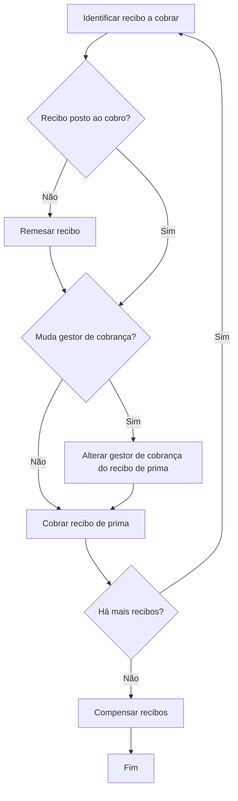

# Procedimento de Tesouraria para Cobrança de Recibos de Prêmio

## 1. Metadados do Documento
- **Arquivo de Origem:** Não identificado no conteúdo fornecido
- **Tipo de Documento:** Procedimento
- **Domínio / Sistema:** Tesouraria, emissão e cobrança de recibos de prêmio de apólice
- **Público-Alvo:** Não identificado explicitamente; o conteúdo descreve operações de tesouraria e cobrança
- **Data/Versão Identificada:** Não identificada

---

## 2. Resumo Executivo & Contexto de Negócio

O documento descreve o processo de **cobrança de um recibo** associado a uma apólice de seguro. Durante as operações de emissão, é determinada a prima que o segurado deve pagar conforme o tipo de risco e as coberturas contratadas.

O plano de pagamento contratado pelo cliente determina a geração dos recibos correspondentes. O pagamento pode gerar um único recibo, pelo valor total da prima para o período vigente, ou vários recibos, quando houver fracionamento de pagamento.

No caso de pagamento fracionado, o plano de pagamento também determina o cálculo do valor da prima correspondente a cada recibo. Portanto, o recibo representa o valor devido pelo segurado para um período específico da apólice.

O módulo de tesouraria registra e contabiliza o dinheiro recebido pelo pagamento da prima devida na apólice. O objetivo operacional é registrar a recepção do dinheiro pago pelo cliente na contabilidade e atualizar a situação do recibo para **cobrado**.

O fluxo apresentado envolve identificar o recibo, verificar se o recibo está posto ao cobro, eventualmente remessar o recibo, verificar possível mudança de gestor de cobrança, alterar o gestor quando necessário, cobrar o recibo e, caso não existam mais recibos, compensar os recibos e finalizar o processo.

---

## 3. Arquitetura, Componentes & Tecnologias Envolvidas

O conteúdo não apresenta arquitetura de software, integrações técnicas, APIs, contratos HTTP, bancos de dados, ambientes ou tecnologias de implementação.

Os elementos funcionais identificados são:

- Operações de emissão;
- Apólice;
- Segurado;
- Prima;
- Coberturas contratadas;
- Plano de pagamento;
- Recibo;
- Módulo de tesouraria;
- Contabilidade;
- Gestor de cobrança;
- Operações de remessa, troca de gestor, cobrança e compensação.

> **Nota de Análise:** O texto contém referências visuais a “CF”, “Home”, “Solutions”, “APIs Documentation” e “Zeus”, mas não descreve a função, integração, arquitetura ou responsabilidade desses termos. Não é possível afirmar que esses elementos sejam sistemas participantes do processo de cobrança.



---

## 4. Regras de Negócio, Especificações Funcionais & Processos

### 4.1 Determinação da prima

1. Nas operações de emissão, é determinada a prima que o segurado deve pagar.
2. A determinação da prima considera:
   - O tipo de risco;
   - As coberturas contratadas.
3. Após a determinação da prima, são gerados os recibos correspondentes ao plano de pagamento selecionado pelo cliente.

### 4.2 Geração de recibos conforme plano de pagamento

1. O plano de pagamento acordado durante a contratação determina como os recibos são gerados.
2. O cliente pode possuir:
   - Um único recibo, pelo valor total da prima referente ao período vigente; ou
   - Pagamento fracionado em múltiplos recibos.
3. Quando o pagamento é fracionado:
   - A quantidade de recibos é determinada pelo plano de pagamento;
   - O valor da prima correspondente a cada recibo também é determinado pelo plano de pagamento.

### 4.3 Finalidade do módulo de tesouraria

O módulo de tesouraria é responsável por:

1. Registrar o dinheiro correspondente ao pagamento da prima devida na apólice;
2. Contabilizar o dinheiro recebido;
3. Tratar o recebimento relacionado a um determinado período de tempo;
4. Registrar a nova situação do recibo como **cobrado**.

### 4.4 Objetivo operacional do procedimento

O procedimento tem como objetivo realizar os passos necessários para:

1. Registrar a recepção do dinheiro abonado pelo cliente;
2. Registrar esse recebimento na contabilidade;
3. Deixar constância da nova situação do recibo como cobrado.

### 4.5 Fluxo operacional de cobrança

| Etapa | Ação | Regra ou decisão associada |
| :--- | :--- | :--- |
| 1 | Identificar recibo a cobrar | O processo inicia com a identificação do recibo que será objeto de cobrança. |
| 2 | Verificar se o recibo está posto ao cobro | Caso o recibo não esteja posto ao cobro, deve ser remessado. |
| 3 | Remesar recibo | A remessa ocorre quando a decisão “Recibo posto ao cobro?” for negativa. |
| 4 | Verificar mudança de gestor de cobrança | Após a verificação do recibo ou após a remessa, deve-se avaliar se há mudança de gestor de cobrança. |
| 5 | Alterar gestor de cobrança do recibo de prima | A alteração é executada somente quando houver mudança de gestor de cobrança. |
| 6 | Cobrar recibo de prima | O recibo de prima é cobrado após a decisão sobre a mudança de gestor. |
| 7 | Verificar existência de mais recibos | Caso existam mais recibos, o fluxo retorna à identificação de outro recibo a cobrar. |
| 8 | Compensar recibos | Quando não houver mais recibos, os recibos devem ser compensados. |
| 9 | Finalizar | O processo termina após a compensação dos recibos. |

> **Nota de Análise:** O documento não detalha os critérios para considerar um recibo “posto ao cobro”, o mecanismo de remessa, os dados do gestor de cobrança, as regras de compensação ou os lançamentos contábeis produzidos.

---

## 5. Tabelas de Parâmetros, Ambientes e Estruturas de Dados

| Item / Parâmetro | Descrição / Função | Tipo / Valores / Formato | Ambiente / Observações |
| :--- | :--- | :--- | :--- |
| Prima | Valor que o segurado deve pagar | Valor monetário; formato não detalhado | Determinada nas operações de emissão conforme risco e coberturas |
| Tipo de risco | Fator utilizado para determinar a prima | Não detalhado | Associado às operações de emissão |
| Coberturas contratadas | Elementos considerados para determinar a prima | Não detalhado | Associadas à contratação da apólice |
| Plano de pagamento | Define a geração e o fracionamento dos recibos | Não detalhado | Acordado na contratação pelo cliente |
| Recibo | Registro correspondente ao valor da prima devido para determinado período | Pode ser único ou fracionado; estrutura não detalhada | Utilizado no processo de tesouraria e cobrança |
| Período vigente | Período ao qual o valor total da prima ou recibo se refere | Não detalhado | Aplicável ao recibo único pelo valor total da prima |
| Gestor de cobrança | Responsável de cobrança associado ao recibo de prima | Não detalhado | Pode ser alterado durante o fluxo |
| Situação do recibo | Estado operacional do recibo após a cobrança | Valor citado: `cobrado` | O procedimento deve deixar constância da nova situação |
| Dinheiro abonado pelo cliente | Valor recebido do cliente para pagamento da prima | Valor monetário; formato não detalhado | Deve ser registrado e contabilizado |
| Módulo de tesouraria | Módulo responsável por registrar e contabilizar o recebimento | Sistema ou módulo; detalhes não informados | Não há URLs, servidores ou ambientes descritos |
| Contabilidade | Destino do registro do dinheiro recebido | Processo ou sistema não detalhado | O recebimento deve ser registrado contabilmente |
| Remesar recibo | Ação executada quando o recibo não está posto ao cobro | Operação funcional; detalhes não informados | Etapa 2 do fluxo |
| Compensar recibos | Ação de encerramento após não haver mais recibos | Operação funcional; detalhes não informados | Etapa 5 do fluxo |

---

## 6. Bateria de Perguntas & Respostas para RAG (FAQ Sintético)

### P1: Qual é o objetivo do procedimento de cobrança de recibos?
**R:** O objetivo é realizar os passos necessários para registrar na contabilidade a recepção do dinheiro pago pelo cliente e deixar constância de que a situação do recibo foi atualizada para cobrado.

### P2: Como a prima que o segurado deve pagar é determinada?
**R:** Nas operações de emissão, a prima é determinada conforme o tipo de risco e as coberturas contratadas pelo segurado.

### P3: Como o plano de pagamento influencia a geração de recibos?
**R:** O plano de pagamento acordado na contratação determina os recibos a serem gerados. O plano pode gerar um único recibo pelo valor total da prima do período vigente ou fracionar o pagamento em vários recibos.

### P4: Quem determina o valor da prima de cada recibo em um pagamento fracionado?
**R:** Em caso de pagamento fracionado, o próprio plano de pagamento determina o valor da prima correspondente a cada recibo.

### P5: Qual é a responsabilidade do módulo de tesouraria no processo?
**R:** O módulo de tesouraria registra e contabiliza o dinheiro correspondente à cobrança da prima devida na apólice para determinado período de tempo, ou seja, para um recibo.

### P6: O que acontece quando um recibo não está posto ao cobro?
**R:** Quando a verificação indicar que o recibo não está posto ao cobro, o fluxo determina que o recibo deve ser remessado.

### P7: Em que situação o gestor de cobrança de um recibo de prima deve ser alterado?
**R:** O gestor de cobrança do recibo de prima deve ser alterado quando a verificação “¿Cambia gestor cobro?” indicar que há mudança de gestor de cobrança.

### P8: Qual ação deve ocorrer depois da decisão sobre uma possível mudança de gestor de cobrança?
**R:** Depois de verificar se há mudança de gestor de cobrança — e depois de alterar o gestor quando necessário — o processo executa a cobrança do recibo de prima.

### P9: O que acontece se existirem mais recibos após a cobrança de um recibo?
**R:** Quando há mais recibos, o fluxo retorna à etapa de identificar outro recibo a cobrar.

### P10: Quando ocorre a compensação de recibos?
**R:** A compensação de recibos ocorre quando a verificação indicar que não há mais recibos a processar. Após compensar os recibos, o processo termina.

### P11: O documento especifica como realizar contabilmente o lançamento do recebimento?
**R:** Não. O documento informa que o dinheiro recebido deve ser registrado na contabilidade, mas não detalha contas contábeis, tipos de lançamento, documentos fiscais, eventos ou regras de conciliação.

### P12: O documento informa APIs, URLs, serviços técnicos ou contratos de integração?
**R:** Não. Apesar de existirem referências visuais a “APIs Documentation” e “Zeus”, o conteúdo não apresenta URLs, métodos HTTP, contratos JSON, serviços, integrações ou detalhes técnicos de implementação.

---

## 7. Glossário de Termos, Siglas & Conceitos-Chave

- **Apólice:** Referência contratual associada à prima devida e aos recibos cobrados no processo.
- **Coberturas contratadas:** Coberturas consideradas, junto ao tipo de risco, para determinar a prima a pagar.
- **Cobrar recibo de prima:** Etapa do fluxo destinada à cobrança do recibo associado à prima.
- **Compensar recibos:** Etapa final executada quando não há mais recibos a cobrar.
- **Emissão:** Operações nas quais é determinada a prima a ser paga pelo segurado conforme risco e coberturas.
- **Gestor de cobrança:** Entidade ou responsável de cobrança associado ao recibo de prima; pode sofrer alteração durante o processo.
- **Plano de pagamento:** Plano acordado na contratação que determina a geração, o número e, no caso de fracionamento, o valor dos recibos.
- **Prima:** Valor que o segurado deve pagar, determinado nas operações de emissão.
- **Recibo:** Registro de valor de prima a ser pago para determinado período; pode representar o valor total ou uma parcela do pagamento fracionado.
- **Recibo posto ao cobro:** Condição verificada no fluxo antes da cobrança; o documento não define seus critérios.
- **Remesar recibo:** Ação realizada quando o recibo não está posto ao cobro; o documento não detalha o mecanismo de remessa.
- **Segurado:** Cliente ou parte que deve pagar a prima determinada para a apólice.
- **Tesouraria:** Módulo que registra e contabiliza o dinheiro recebido na cobrança de prima.
- **CF / Home / Solutions / APIs Documentation / Zeus:** Termos exibidos no conteúdo bruto, sem definição funcional ou técnica adicional.

---

## 8. Notas Críticas, Riscos & Limitações

- O documento não identifica o arquivo original, autor, data, versão ou sistema responsável pelo procedimento.
- Não há detalhamento técnico sobre arquitetura, integrações, APIs, serviços, bancos de dados, ambientes, servidores, URLs, portas ou autenticação.
- O critério para determinar se um recibo está “posto ao cobro” não é informado.
- O mecanismo de remessa do recibo não é descrito.
- As regras que determinam a mudança de gestor de cobrança não são apresentadas.
- Não há detalhes sobre os dados atualizados ao alterar o gestor de cobrança de um recibo de prima.
- O conceito e as regras operacionais ou contábeis de compensação de recibos não são detalhados.
- Não foram identificados códigos de erro, fluxos de exceção, regras de reversão, controles de auditoria ou tratamento para falhas de cobrança.
- O documento afirma que o recebimento deve ser registrado na contabilidade, mas não especifica lançamentos, contas, eventos ou critérios de conciliação.
- As referências a “CF”, “Home”, “Solutions”, “APIs Documentation” e “Zeus” não possuem explicação contextual suficiente para serem classificadas como sistemas, módulos ou tecnologias.

---

## 9. Conteúdo Bruto Estruturado (Referência Fiel)

```text
--- [PÁGINA 1 DE 2] ---

EN CONSTRUCCIÓN
COBRAR un recibo
¿En que consiste?
En las operaciones de emisión se determina la prima que debe pagar el asegurado, según el tipo de
riesgo y las coberturas contratadas. Se generarán los recibos correspondientes al plan de pago
elegido por el cliente.
De esta forma, según el plan de pago que se haya acordado en la contratación, se podrá generar un
único recibo por el importe total de la prima para el período vigente, o fraccionar el pago en tantos
recibos como determine el plan de pago elegido. El cálculo del importe de la prima correspondiente a
cada recibo, en caso de pago fraccionado, lo determinará también el plan de pago.
En el módulo de tesorería se registra y contabiliza el dinero correspondiente al cobro de la prima
adeudada en la póliza, para un determinado período de tiempo, es decir, de un recibo.
Objetivo
Realizar los pasos necesarios para registrar la recepción del dinero abonado por el cliente, en la
contabilidad y dejar constancia de la nueva situación del recibo como cobrado.
Proceso a seguir
 / 
 CF
Home Solutions APIs Documentation Zeus
EN


--- [PÁGINA 2 DE 2] ---

SI
NO SI
NO
SI
NOIDENTIFICAR
recibo a cobrar (1)
¿Recibo
puesto al
cobro?
REMESAR
recibo (2)
¿Cambia
gestor
cobro? CAMBIAR
recibo
prima
gestor (3)
COBRAR
recibo
prima (4)
¿Hay más
recibos?
COMPENSAR
recibos (5) FIN
1. IDENTIFICAR recibo a cobrar
2. REMESAR recibo
3. CAMBIAR recibo prima gestor
4. COBRAR recibo prima
5. COMPENSAR recibo
```
