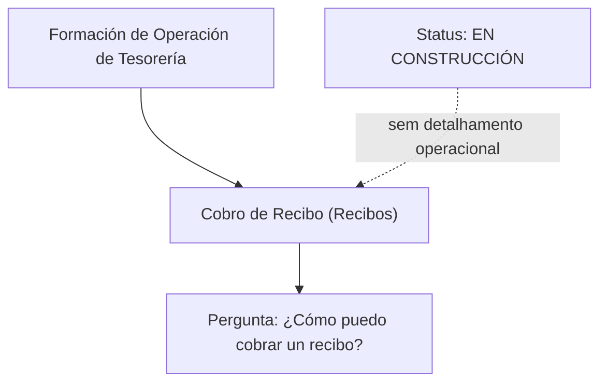

# Formação de Operação de Tesorería — Cobro de Recibos

## 1. Metadados do Documento
- **Arquivo de Origem:** Não identificado
- **Tipo de Documento:** Material de formação operacional em construção
- **Domínio / Sistema:** Tesorería — Cobro de Recibo (Recibos)
- **Público-Alvo:** Operação de Tesorería
- **Data/Versão Identificada:** Não identificada

---

## 2. Resumo Executivo & Contexto de Negócio

O conteúdo apresenta um material de formação para a operação de tesorería, especificamente associado ao processo de **cobro de recibos**. A pergunta central registrada no material é: “¿Cómo puedo cobrar un recibo?”.

O documento está marcado como **“EN CONSTRUCCIÓN”**, indicando que o conteúdo ainda não está concluído. Não há instruções operacionais, regras de negócio, telas, APIs, critérios de validação ou etapas detalhadas para executar o cobro de um recibo.

Também há referências de navegação para áreas como *Home*, *Solutions*, *Architectures*, *APIs*, *Events*, *Components*, *Cloud Documentation*, *Zeus*, *Reef*, *Help* e *News*. O conteúdo fornecido não estabelece relação funcional, técnica ou arquitetural entre essas áreas e o processo de cobro de recibos.

---

## 3. Arquitetura, Componentes & Tecnologias Envolvidas

O conteúdo menciona os termos **CF**, **Zeus** e **Reef**, mas não fornece definição, responsabilidade, integração, tecnologia, contrato ou fluxo de dados para esses elementos.



> **Nota de Análise:** O documento não detalha sistemas, microsserviços, APIs, eventos, componentes, tecnologias, ambientes ou integrações envolvidos no cobro de recibos.

---

## 4. Regras de Negócio, Especificações Funcionais & Processos

O conteúdo disponível não descreve regras de negócio, pré-requisitos, validações, estados, cálculos, perfis de acesso ou sequência operacional para cobrar um recibo.

A única intenção funcional explicitamente registrada é a necessidade de responder à pergunta:

1. “¿Cómo puedo cobrar un recibo?”

> **Nota de Análise:** Não foram fornecidos passos para localizar um recibo, validar dados, registrar cobrança, confirmar pagamento, cancelar operação ou tratar erros.

---

## 5. Tabelas de Parâmetros, Ambientes e Estruturas de Dados

| Item / Parâmetro | Descrição / Função | Tipo / Valores / Formato | Ambiente / Observações |
| :--- | :--- | :--- | :--- |
| Estado do material | Indica o estágio de elaboração do conteúdo | `EN CONSTRUCCIÓN` | O material não contém instruções completas |
| Área de formação | Tema apresentado no cabeçalho | `FORMACIÓN de OPERACIÓN de TESORERÍA` | Relacionada à operação de tesorería |
| Processo funcional | Processo mencionado no conteúdo | `COBRO RECIBO (Recibos)` | Não detalhado |
| Pergunta operacional | Questão central do material | `¿Cómo puedo cobrar un recibo?` | Sem resposta operacional no conteúdo |
| Referência | Termo isolado apresentado | `CF` | Sem definição |
| Navegação | Item de navegação apresentado | `Search` | Sem relação funcional descrita |
| Navegação | Item de navegação apresentado | `Home` | Sem relação funcional descrita |
| Navegação | Item de navegação apresentado | `Solutions` | Sem relação funcional descrita |
| Navegação | Item de navegação apresentado | `Architectures` | Sem relação funcional descrita |
| Navegação | Item de navegação apresentado | `APIs` | Sem relação funcional descrita |
| Navegação | Item de navegação apresentado | `Events` | Sem relação funcional descrita |
| Navegação | Item de navegação apresentado | `Components` | Sem relação funcional descrita |
| Navegação | Item de navegação apresentado | `Cloud Documentation` | Sem relação funcional descrita |
| Navegação | Item de navegação apresentado | `Zeus` | Sem definição técnica ou funcional |
| Navegação | Item de navegação apresentado | `Reef` | Sem definição técnica ou funcional |
| Navegação | Item de navegação apresentado | `Help` | Sem relação funcional descrita |
| Navegação | Item de navegação apresentado | `News` | Sem relação funcional descrita |
| Idioma | Opção exibida no material | `EN` | A pergunta operacional está em espanhol |

---

## 6. Bateria de Perguntas & Respostas para RAG (FAQ Sintético)

### P1: Qual é o assunto principal do material?
**R:** O material trata de formação para a operação de tesorería no processo de **cobro de recibos**, identificado como “COBRO RECIBO (Recibos)”.

### P2: O documento explica como cobrar um recibo?
**R:** Não. O documento registra a pergunta “¿Cómo puedo cobrar un recibo?”, mas não apresenta etapas, procedimentos, telas, validações ou instruções para responder à pergunta.

### P3: Qual é o estado de maturidade do material de formação?
**R:** O conteúdo está identificado como **“EN CONSTRUCCIÓN”**, o que indica que o material está em construção e não deve ser considerado um procedimento operacional completo.

### P4: Existem regras de negócio para o cobro de recibos?
**R:** Não foram identificadas regras de negócio no conteúdo fornecido. O material não informa condições de cobrança, valores, vencimentos, validações ou critérios de aprovação.

### P5: O documento informa quais sistemas devem ser usados para cobrar um recibo?
**R:** Não. Embora os termos Zeus e Reef apareçam na navegação, o conteúdo não confirma que sejam sistemas usados no processo de cobro de recibos nem descreve qualquer interação com eles.

### P6: O que significa a referência “CF” no documento?
**R:** O documento apresenta o termo “CF”, mas não fornece definição, expansão da sigla, finalidade ou relação com a operação de tesorería.

### P7: Há APIs ou contratos de integração documentados para o processo?
**R:** Não. A palavra “APIs” aparece como item de navegação, mas não há endpoints, métodos HTTP, payloads, contratos, autenticação ou fluxos de integração descritos.

### P8: Quais informações operacionais estão ausentes para executar a cobrança?
**R:** O documento não informa como localizar o recibo, validar o estado do recibo, registrar o pagamento, confirmar a cobrança, tratar falhas, cancelar operações ou consultar comprovantes.

### P9: Quem é o público-alvo indicado pelo conteúdo?
**R:** O cabeçalho “FORMACIÓN de OPERACIÓN de TESORERÍA” indica que o público-alvo é a equipe responsável pela operação de tesorería.

### P10: O documento informa ambiente, URL ou credenciais de acesso?
**R:** Não. Não há URLs, ambientes, servidores, portas, perfis de acesso ou credenciais no conteúdo fornecido.

---

## 7. Glossário de Termos, Siglas & Conceitos-Chave

- **Cobro Recibo:** Processo de cobrança de um recibo mencionado no material.
- **Recibos:** Termo usado no documento para identificar os recibos associados ao processo de cobrança.
- **Tesorería:** Área operacional mencionada no cabeçalho de formação.
- **CF:** Referência apresentada sem definição no conteúdo.
- **Zeus:** Item de navegação citado sem definição funcional ou técnica.
- **Reef:** Item de navegação citado sem definição funcional ou técnica.
- **EN CONSTRUCCIÓN:** Indicação de que o material ainda está em construção.

---

## 8. Notas Críticas, Riscos & Limitações

- O material está explicitamente marcado como **“EN CONSTRUCCIÓN”**.
- Não existe procedimento operacional para executar o cobro de um recibo.
- Não foram identificadas regras de negócio, validações, exceções, responsáveis, permissões ou critérios de auditoria.
- Não há detalhes sobre sistemas, integrações, APIs, URLs, ambientes ou tecnologias.
- Os termos **CF**, **Zeus** e **Reef** não são definidos.
- O conteúdo não permite inferir uma arquitetura técnica nem um fluxo operacional completo sem introduzir informações não sustentadas pelo documento.

---

## 9. Conteúdo Bruto Estruturado (Referência Fiel)

```text
--- [PÁGINA 1 DE 1] ---

EN CONSTRUCCIÓN
FORMACIÓN de OPERACIÓN de TESORERÍA - COBRO RECIBO (Recibos)
¿Cómo puedo cobrar un recibo?
 /
 CF
Search Home Solutions Architectures APIs Events Components Cloud Documentation Zeus Reef Help News
EN
```
