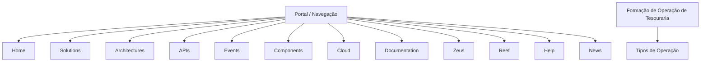

# Formação de Operação de Tesouraria — Conteúdo em Construção

## 1. Metadados do Documento
- **Arquivo de Origem:** Não identificado
- **Tipo de Documento:** Apresentação Executiva
- **Domínio / Sistema:** Operação de Tesouraria; portal de documentação com referências a Zeus e Reef
- **Público-Alvo:** Operação
- **Data/Versão Identificada:** Não identificada

---

## 2. Resumo Executivo & Contexto de Negócio

O conteúdo apresentado indica um material de formação voltado à **operação de tesouraria**. O texto declara que a formação é orientada tanto à operação quanto ao tipo de operação.

O documento está marcado como **“EN CONSTRUCCIÓN”**, sinalizando que o material se encontra em elaboração e que não deve ser interpretado como uma especificação completa ou definitiva.

Há uma seção denominada **“TIPOS DE OPERACIÓN”**, porém o conteúdo fornecido não descreve os tipos de operação, suas regras, responsáveis, entradas, saídas ou critérios de execução.

O trecho também contém itens de navegação de um portal, incluindo *Home*, *Solutions*, *Architectures*, *APIs*, *Events*, *Components*, *Cloud*, *Documentation*, *Zeus*, *Reef*, *Help* e *News*. Não há explicação sobre a função, integração ou relação operacional desses itens com a tesouraria.

---

## 3. Arquitetura, Componentes & Tecnologias Envolvidas

Os únicos elementos de sistema ou navegação explicitamente citados são **Zeus**, **Reef** e as categorias de portal *Solutions*, *Architectures*, *APIs*, *Events*, *Components*, *Cloud* e *Documentation*.

O conteúdo não descreve arquitetura técnica, componentes funcionais, microsserviços, protocolos, APIs, ambientes, fluxos de dados ou tecnologias utilizadas.



> **Nota de Análise:** O diagrama representa apenas a associação visual entre itens explicitamente presentes no texto. O documento não confirma dependências técnicas, fluxo de integração ou hierarquia entre esses elementos.

---

## 4. Regras de Negócio, Especificações Funcionais & Processos

1. O documento declara que existe uma **formação de operação de tesouraria**.
2. A formação é descrita como orientada à **operação** e ao **tipo de operação**.
3. O documento possui uma seção intitulada **“TIPOS DE OPERACIÓN”**.
4. O trecho fornecido não detalha:
   - tipos concretos de operação;
   - regras de negócio;
   - validações;
   - cálculos;
   - processos operacionais;
   - participantes ou responsabilidades;
   - exceções;
   - critérios de aprovação;
   - procedimentos de contingência.

> **Nota de Análise:** Não há detalhamento adicional suficiente para reconstruir processos operacionais de tesouraria sem introduzir informações não sustentadas pelo conteúdo original.

---

## 5. Tabelas de Parâmetros, Ambientes e Estruturas de Dados

| Item / Parâmetro | Descrição / Função | Tipo / Valores / Formato | Ambiente / Observações |
| :--- | :--- | :--- | :--- |
| Estado do documento | Indica o estado informado no conteúdo. | `EN CONSTRUCCIÓN` | Material em elaboração. |
| Formação | Tema declarado no documento. | `FORMACIÓN de OPERACIÓN de TESORERÍA` | Formação orientada à operação e ao tipo de operação. |
| Seção funcional | Título de seção apresentado. | `TIPOS DE OPERACIÓN` | Sem tipos detalhados no trecho fornecido. |
| Idioma | Indicador exibido na navegação. | `EN` | O conteúdo principal também contém termos em espanhol. |
| Zeus | Item listado na navegação. | Nome não detalhado | Não há descrição funcional ou técnica. |
| Reef | Item listado na navegação. | Nome não detalhado | Não há descrição funcional ou técnica. |
| APIs | Item listado na navegação. | Categoria de navegação | Não há endpoints, métodos ou contratos descritos. |
| Events | Item listado na navegação. | Categoria de navegação | Não há eventos, produtores ou consumidores descritos. |
| Cloud | Item listado na navegação. | Categoria de navegação | Não há provedor, serviços ou ambientes descritos. |
| Documentation | Item listado na navegação. | Categoria de navegação | Não há documentos vinculados descritos. |

---

## 6. Bateria de Perguntas & Respostas para RAG (FAQ Sintético)

### P1: Qual é o tema central do documento?
**R:** O documento trata de uma formação de operação de tesouraria, identificada pelo texto “FORMACIÓN de OPERACIÓN de TESORERÍA”.

### P2: A formação de tesouraria é orientada a qual aspecto?
**R:** A formação é orientada à operação e ao tipo de operação, conforme a frase “Formación orientada a la operación y tipo de operación”.

### P3: O documento está concluído?
**R:** Não. O conteúdo apresenta a indicação “EN CONSTRUCCIÓN”, que informa que o material está em construção.

### P4: Quais tipos de operação de tesouraria são descritos?
**R:** Nenhum tipo de operação é detalhado no trecho fornecido. O documento apresenta apenas o título “TIPOS DE OPERACIÓN”.

### P5: O documento informa regras de negócio para operações de tesouraria?
**R:** Não. O conteúdo não apresenta regras de negócio, condições de validação, cálculos, aprovações ou exceções para operações de tesouraria.

### P6: O documento descreve APIs relacionadas à operação de tesouraria?
**R:** Não. “APIs” aparece apenas como item de navegação; não há endpoints, métodos HTTP, contratos, autenticação ou integrações descritos.

### P7: Quais sistemas ou produtos são citados no conteúdo?
**R:** Os nomes “Zeus” e “Reef” são citados como itens de navegação. O documento não explica a finalidade, arquitetura ou relação desses elementos com a operação de tesouraria.

### P8: O documento especifica ambientes técnicos ou URLs?
**R:** Não. O trecho não apresenta URLs, nomes de ambientes, servidores, portas, variáveis de configuração ou rotas de log.

### P9: O documento descreve eventos ou fluxos de integração?
**R:** Não. Embora “Events” seja listado na navegação, não há descrição de eventos, mensagens, produtores, consumidores ou fluxos de integração.

### P10: Qual idioma é indicado no portal exibido no conteúdo?
**R:** O indicador “EN” aparece no trecho de navegação. Entretanto, o título e a descrição da formação estão em espanhol.

### P11: Há procedimentos operacionais executáveis no documento?
**R:** Não. O conteúdo não apresenta passos operacionais, responsáveis, pré-requisitos, entradas, saídas ou procedimentos de execução.

### P12: O que pode ser afirmado sobre Zeus e Reef?
**R:** Apenas que Zeus e Reef aparecem como itens de navegação no conteúdo. Não é possível afirmar suas funções, tecnologias, integrações ou responsabilidades sem extrapolar o texto original.

---

## 7. Glossário de Termos, Siglas & Conceitos-Chave

- **Formación de Operación de Tesorería:** Formação voltada à operação de tesouraria.
- **Tipos de Operación:** Seção citada no documento; os tipos de operação não são especificados.
- **Tesorería:** Termo em espanhol para tesouraria.
- **Zeus:** Item de navegação citado sem definição adicional.
- **Reef:** Item de navegação citado sem definição adicional.
- **APIs:** Item de navegação citado; o documento não expande a sigla nem descreve interfaces de programação.
- **Events:** Item de navegação citado; não há eventos técnicos descritos.
- **Cloud:** Item de navegação citado; não há informações de infraestrutura em nuvem.
- **EN:** Indicador de idioma exibido na navegação.

---

## 8. Notas Críticas, Riscos & Limitações

- O documento está explicitamente marcado como **“EN CONSTRUCCIÓN”**.
- O trecho contém conteúdo muito limitado e não apresenta detalhes operacionais ou técnicos suficientes para orientar a execução de operações de tesouraria.
- Não existem informações sobre arquitetura, APIs, contratos, integrações, ambientes, logs, segurança, permissões ou recuperação de falhas.
- A seção **“TIPOS DE OPERACIÓN”** não contém os tipos de operação correspondentes.
- Zeus e Reef são somente mencionados; suas finalidades não são documentadas no conteúdo fornecido.
- Qualquer detalhamento adicional sobre processos, sistemas, fluxos ou regras representaria inferência não sustentada pelo documento.

---

## 9. Conteúdo Bruto Estruturado (Referência Fiel)

```text
--- [PÁGINA 1 DE 1] ---

EN CONSTRUCCIÓN
FORMACIÓN de OPERACIÓN de TESORERÍA
 Formación orientada a la operación y tipo de operación
TIPOS DE OPERACIÓN
 
  
  
 / 
 CF
Search Home Solutions Architectures APIs Events Components Cloud Documentation Zeus Reef Help News
EN
```
