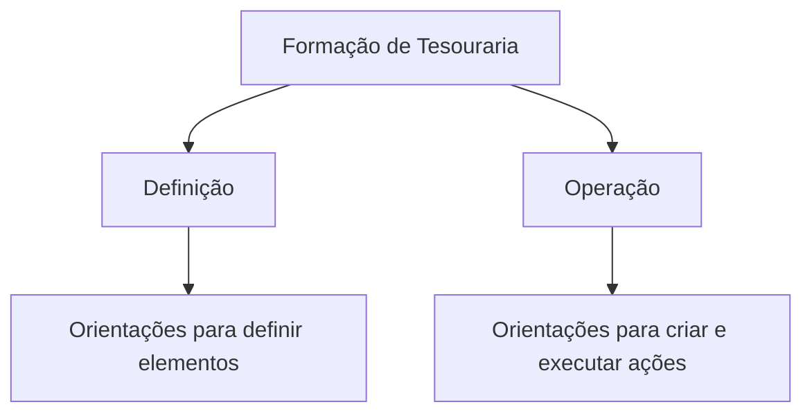

# Formação de Tesouraria — Estrutura de Conteúdo do Módulo

## 1. Metadados do Documento
- **Arquivo de Origem:** Não identificado
- **Tipo de Documento:** Manual Operacional
- **Domínio / Sistema:** Tesouraria
- **Público-Alvo:** Operação e usuários do módulo de tesouraria
- **Data/Versão Identificada:** Não identificada

---

## 2. Resumo Executivo & Contexto de Negócio

O documento apresenta uma estrutura de formação relacionada ao módulo de tesouraria. A formação é organizada em dois blocos principais: **Definição** e **Operação**.

O bloco de **Definição** destina-se a orientar usuários sobre como configurar ou definir elementos necessários no módulo de tesouraria. O documento indica que essa seção responde a perguntas como quais passos devem ser seguidos para definir algo, como realizar uma definição e o que fazer quando houver uma necessidade específica.

O bloco de **Operação** concentra-se no uso prático do módulo de tesouraria. A seção busca responder a questões relacionadas à criação de elementos e à execução de atividades operacionais.

O conteúdo extraído não informa funcionalidades específicas, entidades de negócio, regras de cálculo, integrações, tecnologias, URLs de ambiente ou procedimentos detalhados. Também apresenta itens de navegação relacionados a arquiteturas, APIs, eventos, componentes, cloud, documentação, Zeus, Reef, ajuda e notícias, sem explicar a relação desses itens com a formação de tesouraria.

---

## 3. Arquitetura, Componentes & Tecnologias Envolvidas

O conteúdo menciona o módulo de **Tesouraria** e uma estrutura de navegação com os itens: **CF**, **Search**, **Home**, **Solutions**, **Architectures**, **APIs**, **Events**, **Components**, **Cloud**, **Documentation**, **Zeus**, **Reef**, **Help** e **News**.

Não há descrição de arquitetura de software, componentes técnicos, microsserviços, bancos de dados, protocolos, tecnologias, integrações ou ambientes.



> **Nota de Análise:** O documento não detalha quais elementos são definidos ou criados no módulo de tesouraria, nem descreve os fluxos técnicos associados.

---

## 4. Regras de Negócio, Especificações Funcionais & Processos

### Estrutura da formação

A formação relativa ao módulo de tesouraria é dividida nos seguintes apartados:

1. **Definição**
2. **Operação**

### Finalidade da seção Definição

A seção **Definição** pretende obter respostas para perguntas do tipo:

1. Quais passos devem ser seguidos para poder definir algo.
2. Como algo é definido.
3. O que deve ser feito quando houver necessidade de algo específico.

### Finalidade da seção Operação

A seção **Operação** pretende obter respostas para perguntas do tipo:

1. Como criar algo.
2. O que deve ser feito para poder realizar algo.

> **Nota de Análise:** O documento não fornece regras de negócio explícitas, critérios de validação, sequências operacionais detalhadas, parâmetros de tesouraria ou condições de exceção.

---

## 5. Tabelas de Parâmetros, Ambientes e Estruturas de Dados

| Item / Parâmetro | Descrição / Função | Tipo / Valores / Formato | Ambiente / Observações |
| :--- | :--- | :--- | :--- |
| Formação de Tesouraria | Conteúdo formativo relativo ao módulo de tesouraria. | Estrutura de formação | Dividida entre Definição e Operação. |
| Definição | Seção para orientar definições e necessidades relacionadas ao módulo. | Seção funcional | Não detalha objetos, campos ou procedimentos. |
| Operação | Seção para orientar criação e execução de ações no módulo. | Seção funcional | Não detalha operações, telas ou fluxos. |
| CF | Item presente na navegação. | Não especificado | Não há explicação de significado ou função. |
| Zeus | Item presente na navegação. | Não especificado | Não há relação explicitada com Tesouraria. |
| Reef | Item presente na navegação. | Não especificado | Não há relação explicitada com Tesouraria. |
| EN | Indicador textual exibido no conteúdo. | Código/idioma não confirmado | O documento não explica o significado. |

---

## 6. Bateria de Perguntas & Respostas para RAG (FAQ Sintético)

### P1: Qual é o objetivo da formação de tesouraria?
**R:** A formação de tesouraria tem como objetivo disponibilizar conteúdo relativo ao módulo de tesouraria, organizado nos apartados Definição e Operação.

### P2: Quais são as seções da formação do módulo de tesouraria?
**R:** A formação está dividida em duas seções: Definição e Operação.

### P3: Que tipo de perguntas a seção Definição pretende responder?
**R:** A seção Definição pretende responder perguntas sobre os passos necessários para definir algo, sobre como realizar uma definição e sobre o que fazer diante de uma necessidade específica.

### P4: Que tipo de perguntas a seção Operação pretende responder?
**R:** A seção Operação pretende responder perguntas sobre como criar algo e sobre o que deve ser feito para realizar determinada ação.

### P5: O documento explica como definir entidades específicas de tesouraria?
**R:** Não. O documento informa apenas que a seção Definição responde a perguntas sobre definições, mas não identifica entidades, campos, telas ou etapas específicas.

### P6: O documento descreve procedimentos operacionais detalhados para o módulo de tesouraria?
**R:** Não. A seção Operação é mencionada como fonte para dúvidas sobre criação e execução de ações, mas não contém procedimentos detalhados no conteúdo extraído.

### P7: O documento identifica integrações, APIs ou microsserviços do módulo de tesouraria?
**R:** Não. Embora a navegação contenha os itens “APIs”, “Events”, “Components” e “Cloud”, o documento não descreve integrações, contratos, microsserviços ou tecnologias relacionadas.

### P8: O que significa o item CF exibido no documento?
**R:** O significado de CF não é explicado no conteúdo fornecido. CF aparece apenas como um item textual de navegação.

### P9: Zeus e Reef são componentes do módulo de tesouraria?
**R:** O conteúdo não permite concluir isso. Zeus e Reef aparecem na navegação, mas não há descrição de suas funções nem de sua relação com o módulo de tesouraria.

### P10: Há informações sobre versão, data ou ambiente do módulo de tesouraria?
**R:** Não. O conteúdo extraído não apresenta versão, data, URL de ambiente, servidor, porta ou outra informação de ambiente.

---

## 7. Glossário de Termos, Siglas & Conceitos-Chave

- **Tesouraria:** Módulo ao qual a formação apresentada se refere.
- **Definição:** Apartado da formação destinado a dúvidas sobre como definir elementos e quais passos seguir.
- **Operação:** Apartado da formação destinado a dúvidas sobre criação de elementos e realização de ações.
- **CF:** Item textual presente na navegação; significado não definido no documento.
- **Zeus:** Item textual presente na navegação; função não definida no documento.
- **Reef:** Item textual presente na navegação; função não definida no documento.
- **EN:** Indicador textual exibido no conteúdo; significado não confirmado pelo documento.

---

## 8. Notas Críticas, Riscos & Limitações

- O conteúdo não identifica o arquivo de origem, data, versão ou responsável pelo documento.
- O documento não detalha funcionalidades concretas do módulo de tesouraria.
- Não há regras de negócio, parâmetros, cálculos, validações, permissões, campos ou estruturas de dados especificados.
- Não há informações sobre arquitetura, integrações, APIs, eventos, ambientes ou rotas de log.
- Os itens CF, Zeus, Reef e EN são mencionados sem definição contextual.
- A navegação apresentada não estabelece relação técnica ou funcional explícita com o módulo de tesouraria.

---

## 9. Conteúdo Bruto Estruturado (Referência Fiel)

```text
--- [PÁGINA 1 DE 1] ---

FORMACIÓN TESORERÍA
 En este apartado se encuentra la formación relativa al módulo de tesorería. Dicha formación está dividida en los apartados siguientes:
Definición
Operación
DEFINICIÓN
Conseguir respuestas a preguntas del estilo:
¿Qué pasos he de seguir para poder definir...?
¿Cómo se define...?
¿Qué hago si necesito...?
OPERACIÓN
Obtener respuestas a preguntas:
¿Cómo puedo crear...?
¿Qué hago para poder hacer...?
 / 
 CF
Search Home Solutions Architectures APIs Events Components Cloud Documentation Zeus Reef Help News
EN
```
