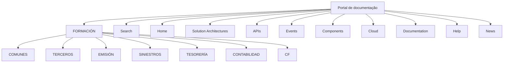

# Formação: Publicação de Elementos Formativos por Módulo

## 1. Metadados do Documento
- **Arquivo de Origem:** Não identificado
- **Tipo de Documento:** Manual Operacional
- **Domínio / Sistema:** Formação / Portal de documentação
- **Público-Alvo:** Usuários que buscam conhecimentos funcionais e técnicos do sistema
- **Data/Versão Identificada:** Não identificada

---

## 2. Resumo Executivo & Contexto de Negócio

O conteúdo descreve a seção **FORMACIÓN**, destinada à publicação de diferentes elementos formativos orientados a casos concretos. Esses conteúdos têm como finalidade permitir a aquisição de conhecimentos funcionais e técnicos relacionados ao sistema.

A organização das publicações é realizada por módulo. Os módulos listados são **COMUNES**, **TERCEROS**, **EMISIÓN**, **SINIESTROS**, **TESORERÍA**, **CONTABILIDAD** e **CF**.

O texto também apresenta elementos de navegação de um portal, incluindo acessos a busca, página inicial, arquiteturas, APIs, eventos, componentes, nuvem, documentação, ajuda, notícias e seleção de idioma em inglês.

O documento não especifica os conteúdos individuais de cada módulo, formatos dos materiais formativos, responsáveis pela publicação, critérios de acesso ou fluxos de consumo do treinamento.

---

## 3. Arquitetura, Componentes & Tecnologias Envolvidas

Os componentes identificados são a seção de formação, os módulos organizacionais/funcionais e os itens de navegação do portal.



**Nota de Análise:** O conteúdo não detalha a arquitetura técnica do portal, tecnologias implementadas, integrações, APIs, métodos HTTP, contratos de dados ou mecanismos de autenticação.

---

## 4. Regras de Negócio, Especificações Funcionais & Processos

1. A seção **FORMACIÓN** contém a publicação de distintos elementos formativos.
2. Os elementos formativos são orientados a casuísticas concretas.
3. O objetivo declarado é permitir a aquisição de conhecimentos funcionais e técnicos do sistema.
4. As publicações são divididas por módulo.
5. Os módulos explicitamente apresentados são: COMUNES, TERCEROS, EMISIÓN, SINIESTROS, TESORERÍA, CONTABILIDAD e CF.
6. O portal contém opções de navegação para Search, Home, Solution Architectures, APIs, Events, Components, Cloud, Documentation, Zeus Reef Help e News.
7. A interface apresentada indica a opção de idioma **EN**.

**Nota de Análise:** Não foram fornecidas regras para publicação, aprovação, versionamento, categorização detalhada, permissões de acesso ou retenção dos materiais formativos.

---

## 5. Tabelas de Parâmetros, Ambientes e Estruturas de Dados

| Item / Parâmetro | Descrição / Função | Tipo / Valores / Formato | Ambiente / Observações |
| :--- | :--- | :--- | :--- |
| FORMACIÓN | Seção de publicação de elementos formativos | Seção funcional | Orientada a conhecimentos funcionais e técnicos |
| COMUNES | Módulo de divisão das publicações | Módulo | Sem detalhamento adicional |
| TERCEROS | Módulo de divisão das publicações | Módulo | Sem detalhamento adicional |
| EMISIÓN | Módulo de divisão das publicações | Módulo | Sem detalhamento adicional |
| SINIESTROS | Módulo de divisão das publicações | Módulo | Sem detalhamento adicional |
| TESORERÍA | Módulo de divisão das publicações | Módulo | Sem detalhamento adicional |
| CONTABILIDAD | Módulo de divisão das publicações | Módulo | Sem detalhamento adicional |
| CF | Módulo de divisão das publicações | Módulo | Sem detalhamento adicional |
| Search | Acesso de navegação | Item de menu | Sem URL identificada |
| Home | Acesso à página inicial | Item de menu | Sem URL identificada |
| Solution Architectures | Acesso a arquiteturas de solução | Item de menu | Sem detalhamento adicional |
| APIs | Acesso a APIs | Item de menu | Não há especificação de APIs |
| Events | Acesso a eventos | Item de menu | Sem detalhamento adicional |
| Components | Acesso a componentes | Item de menu | Sem detalhamento adicional |
| Cloud | Acesso a conteúdo de nuvem | Item de menu | Sem detalhamento adicional |
| Documentation | Acesso à documentação | Item de menu | Sem detalhamento adicional |
| Zeus Reef Help | Acesso à ajuda | Item de menu | Nome exibido no conteúdo bruto |
| News | Acesso a notícias | Item de menu | Sem detalhamento adicional |
| EN | Idioma exibido | Seletor de idioma | Inglês |

---

## 6. Bateria de Perguntas & Respostas para RAG (FAQ Sintético)

### P1: Qual é o objetivo da seção FORMACIÓN?
**R:** A seção FORMACIÓN publica diferentes elementos formativos voltados a casuísticas concretas, permitindo a aquisição de conhecimentos funcionais e técnicos do sistema.

### P2: Como os conteúdos publicados em FORMACIÓN são organizados?
**R:** As publicações da seção FORMACIÓN são divididas por módulo.

### P3: Quais módulos são apresentados na seção FORMACIÓN?
**R:** Os módulos apresentados são COMUNES, TERCEROS, EMISIÓN, SINIESTROS, TESORERÍA, CONTABILIDAD e CF.

### P4: O documento descreve o conteúdo específico do módulo SINIESTROS?
**R:** Não. O documento apenas lista SINIESTROS como um módulo de organização das publicações, sem detalhar materiais, processos ou conteúdos desse módulo.

### P5: A formação cobre conhecimentos técnicos e funcionais?
**R:** Sim. O texto afirma que os elementos formativos permitem adquirir conhecimentos funcionais e técnicos do sistema.

### P6: O que significa a expressão “casuísticas concretas” no contexto de FORMACIÓN?
**R:** O documento informa que os elementos formativos são orientados a casuísticas concretas, mas não define quais casos, cenários ou critérios de seleção são utilizados.

### P7: Quais áreas de navegação do portal são citadas?
**R:** São citadas Search, Home, Solution Architectures, APIs, Events, Components, Cloud, Documentation, Zeus Reef Help e News.

### P8: Há URLs, ambientes ou servidores definidos no conteúdo?
**R:** Não. O conteúdo não fornece URLs, nomes de servidores, portas, ambientes ou parâmetros de infraestrutura.

### P9: O documento descreve APIs ou contratos de integração?
**R:** Não. Embora exista um item de navegação chamado APIs, não são apresentados métodos HTTP, endpoints, contratos JSON, autenticação ou integrações.

### P10: Qual idioma aparece no portal descrito?
**R:** O conteúdo apresenta o indicador de idioma EN.

---

## 7. Glossário de Termos, Siglas & Conceitos-Chave

- **FORMACIÓN:** Seção destinada à publicação de elementos formativos.
- **Casuísticas concretas:** Casos ou situações específicas para os quais os elementos formativos são orientados; o documento não fornece maior detalhamento.
- **COMUNES:** Módulo listado para organização das publicações.
- **TERCEROS:** Módulo listado para organização das publicações.
- **EMISIÓN:** Módulo listado para organização das publicações.
- **SINIESTROS:** Módulo listado para organização das publicações.
- **TESORERÍA:** Módulo listado para organização das publicações.
- **CONTABILIDAD:** Módulo listado para organização das publicações.
- **CF:** Módulo listado para organização das publicações; a sigla não é expandida no conteúdo.
- **EN:** Indicador de idioma inglês.
- **APIs:** Item de navegação; o documento não descreve interfaces de programação específicas.

---

## 8. Notas Críticas, Riscos & Limitações

- O arquivo de origem, a data e a versão não foram identificados.
- O texto não apresenta detalhamento dos conteúdos, responsabilidades ou regras de cada módulo.
- A sigla **CF** não possui definição no conteúdo fornecido.
- Não há informações sobre permissões, autenticação, perfis de usuário ou processo de publicação.
- Não há URLs, endpoints, servidores, ambientes, tecnologias ou contratos técnicos documentados.
- A presença do item de menu **APIs** não constitui especificação de integração.

---

## 9. Conteúdo Bruto Estruturado (Referência Fiel)

```text
--- [PÁGINA 1 DE 1] ---

FORMACIÓN
 En este apartado se encuentra la publicación de distintos elementos formativos orientados a casuísticas concretas que permiten adquirir tanto
conocimientos funcionales como técnicos del sistema.
Las publicaciones están divididas por módulo.
 COMUNES
  TERCEROS
  EMISIÓN
  SINIESTROS
 TESORERÍA
  CONTABILIDAD
 / 
 CF
Search Home Solutions Architectures APIs Events Components Cloud Documentation Zeus Reef Help News
EN
```
