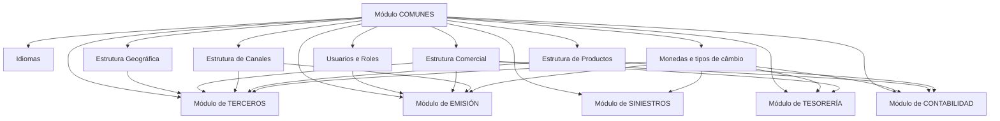

# Módulo COMUNES da Solução Reef.core: Configuração Transversal, Estruturas e Integrações

## 1. Metadados do Documento
- **Arquivo de Origem:** `Não identificado`
- **Tipo de Documento:** `Apresentação Executiva`
- **Domínio / Sistema:** `Módulo COMUNES da Solução Reef.core / MAPFRE`
- **Público-Alvo:** `Desenvolvedores, Arquitetos, Operação e Negócio`
- **Data/Versão Identificada:** `Não identificada`

---

## 2. Resumo Executivo & Contexto de Negócio

O documento descreve o módulo **COMUNES**, responsável por configurar, na Solução e no nível de companhia, conceitos utilizados transversalmente pelos módulos de **Terceros, Emisión, Siniestros, Tesorería e Contabilidad**. O módulo estabelece definições e atributos compartilhados que suportam funcionalidades de diferentes áreas do sistema.

A principal característica do módulo COMUNES é a transversalidade. Os conceitos configurados no módulo, assim como os atributos que os compõem, são utilizados e interagem total ou parcialmente com as funcionalidades dos demais módulos da Solução. Essa centralização busca assegurar consistência e coerência lógica no uso dos conceitos corporativos.

Os conceitos principais identificados são **Idiomas**, **Monedas**, **Usuarios/Roles** e **Estructuras**. As estruturas contemplam organizações de informação geográfica, comercial, de produtos e de canais, associáveis a elementos como terceiros, apólices, sinistros, recibos e comissões.

O documento também apresenta dependências explícitas entre o módulo COMUNES e os módulos funcionais. Exemplos incluem uso de moedas e taxas de câmbio para operações e lançamentos contábeis, utilização de estruturas comerciais na composição de numerações e contabilização, e vinculação de papéis de usuários para autorização de controles técnicos no processo de emissão.

> *Nota de Análise: O documento não detalha telas, endpoints, contratos de integração, métodos HTTP, esquemas de banco de dados, mecanismos de autenticação ou fluxos técnicos de implantação do módulo COMUNES.*

---

## 3. Arquitetura, Componentes & Tecnologias Envolvidas

### Componentes e conceitos identificados

| Componente / Conceito | Descrição sustentada pelo documento |
| :--- | :--- |
| **Módulo COMUNES** | Módulo para configuração, na Solução e no nível de companhia, de conceitos empregados transversalmente nos demais módulos. |
| **Reef.core** | Contexto tecnológico mencionado para a definição de funções que um usuário pode realizar e executar no sistema por meio de papéis. |
| **Idiomas** | Idiomas nos quais os literais ou textos das telas da aplicação podem ser visualizados. |
| **Monedas / Divisas** | Diferentes divisas e tipos de câmbio com os quais o sistema pode operar para executar determinadas operações. |
| **Usuarios** | Pessoas que utilizam a Solução e devem estar declaradas como usuários no sistema. |
| **Roles** | Funções que um usuário pode realizar e executar no sistema; podem agrupar várias funcionalidades ou servir a uma única funcionalidade. |
| **Estructura Geográfica** | Organização geográfica de países por meio de uma estrutura piramidal de cinco níveis. |
| **Estructura Comercial** | Organização comercial das entidades seguradoras por meio de uma estrutura piramidal de três níveis. |
| **Estructura de Productos** | Organização e classificação técnica dos tipos de seguros comercializados pela entidade seguradora em uma estrutura piramidal de três níveis. |
| **Estructura de Canales** | Configuração das formas pelas quais agentes vinculados à estrutura comercial fecham vendas de produtos; possui estrutura piramidal de três níveis. |
| **Ramos Contables** | Chaves associadas às coberturas que as relacionam com a conta em que ocorrerá a contabilização. |
| **Controles Técnicos** | Regras de negócio dinâmicas que entidades MAPFRE podem estabelecer e executar no processo de Emisión; devem estar associadas aos papéis dos usuários para definir autorizações. |

### Relação transversal entre COMUNES e os módulos da Solução



> *Nota de Análise: O diagrama representa somente relações de integração e dependência explicitamente descritas no conteúdo. O documento não informa protocolos, interfaces, mensageria, APIs ou transferência técnica de dados entre módulos.*

---

## 4. Regras de Negócio, Especificações Funcionais & Processos

### 4.1 Transversalidade, consistência e coerência lógica

1. Todos os conceitos do módulo COMUNES e a definição/configuração de seus atributos são empregados e interagem total ou parcialmente nas funcionalidades dos demais módulos da Solução.
2. Os conceitos do módulo COMUNES e seus atributos afetam da mesma forma as funcionalidades dos módulos da Solução que os utilizam.
3. O módulo COMUNES configura conceitos no nível da Solução e no nível de companhia.

### 4.2 Idiomas

1. Os idiomas determinam os idiomas em que os literais ou textos das telas da aplicação podem ser visualizados.
2. O documento não especifica a lista de idiomas suportados, mecanismos de tradução, idioma padrão ou regras de fallback.

### 4.3 Moedas e tipos de câmbio

1. As moedas representam as diferentes divisas com as quais o sistema pode operar para executar determinadas operações.
2. Os tipos de câmbio são associados às divisas.
3. No módulo de Terceros, moedas são associadas à informação dos meios de cobrança e pagamento de segurados, clientes e fornecedores.
4. No módulo de Emisión, a moeda da apólice determina a moeda em que são calculados os prêmios.
5. No módulo de Siniestros, a Solução permite configurar que as liquidações de expedientes possam usar divisas diferentes da moeda em que a apólice foi emitida.
6. No módulo de Tesorería, divisas e tipos de câmbio são utilizados amplamente na maioria das funcionalidades.
7. No módulo de Contabilidad, moedas e tipos de câmbio são utilizados na geração de lançamentos contábeis.

### 4.4 Usuários e papéis

1. Pessoas que utilizam a Solução devem estar declaradas como usuários no sistema.
2. Os usuários devem ter atribuídas as funções que podem desempenhar na Solução mediante o conceito e uso de papéis.
3. Um papel está vinculado à função que uma pessoa desempenha em uma empresa ou organização.
4. No contexto tecnológico de Reef.core, um papel representa as funções que um usuário pode realizar e executar no sistema.
5. Um papel pode agrupar um conjunto de funcionalidades do sistema.
6. Um papel também pode servir a uma única funcionalidade do sistema.
7. Um usuário pode ter um ou vários papéis atribuídos.
8. Controles Técnicos do módulo de Emisión devem ser associados aos papéis dos usuários para identificar quem pode autorizá-los.

### 4.5 Estrutura geográfica

1. A estrutura geográfica permite estabelecer no sistema as diferentes divisões geográficas dos países.
2. A divisão geográfica é realizada por meio de uma estrutura piramidal de cinco níveis.
3. O exemplo de Espanha apresenta os níveis: **País**, **Comunidad/Ciudad Autónoma**, **Provincia**, **Municipio/Localidad** e **Distrito**.
4. Códigos postais não pertencem à estrutura geográfica.
5. Códigos postais são apresentados no gráfico exclusivamente para facilitar a compreensão da estrutura postal.

### 4.6 Estrutura comercial

1. A estrutura comercial configura as divisões por meio das quais entidades seguradoras se organizam comercialmente.
2. A estrutura comercial possui uma estrutura piramidal de três níveis.
3. A estrutura comercial é uma abstração da estrutura geográfica adaptada às necessidades específicas da companhia.
4. A estrutura comercial pode ser utilizada na composição das numerações de apólices e orçamentos.
5. No módulo de Emisión, associam-se à apólice:
   - o terceiro nível da estrutura comercial do agente;
   - a fonte de produção do agente;
   - o terceiro nível da estrutura comercial à qual pertence o usuário emissor/subscritor.
6. No módulo de Tesorería, o terceiro nível da estrutura comercial é associado à apólice a partir da chave do intermediário e, consequentemente, é herdado em recibos, sinistros e outros elementos.
7. Movimentos realizados por caixas na Tesorería são determinados e armazenados utilizando o terceiro nível da estrutura comercial.
8. Numerações de ordens de pagamento e cheques utilizam, em sua formação, o terceiro nível da estrutura comercial definido para a entidade.
9. No módulo de Contabilidad, o terceiro nível da estrutura comercial associado à apólice a partir da chave do intermediário determina a contabilização nos lançamentos.

### 4.7 Estrutura de produtos

1. A estrutura de produtos organiza e classifica tecnicamente os diferentes tipos de seguros comercializados pela entidade seguradora.
2. A estrutura de produtos utiliza uma estrutura piramidal de três níveis.
3. No exemplo apresentado, seguros de VIDA e NO VIDA são considerados setores.
4. VIDA Riesgo e VIDA Ahorro são classificados como subsetores do setor VIDA.
5. Automóviles, Mercancías e Empresas são possíveis subsetores do setor NO VIDA.
6. Coberturas de Incendio e Robo configuradas no ramo de Comercios não pertencem à estrutura de produtos; são exibidas para facilitar a compreensão da possível parametrização dos Ramos Contables.
7. Ramos Contables também não pertencem à estrutura de produtos; são exibidos no gráfico para facilitar a compreensão da sua parametrização.
8. Ramos Contables são chaves associadas às coberturas, relacionando-as com a conta na qual será efetuada sua contabilização.
9. A associação entre ramo contábil e cobertura ocorre no momento da definição da cobertura no ramo.
10. No módulo de Contabilidad, contas contábeis utilizadas em diferentes lançamentos podem ter associados os ramos e os ramos contábeis definidos na estrutura de produtos da entidade.

### 4.8 Estrutura de canais

1. A estrutura de canais configura as diferentes formas pelas quais os agentes vinculados à estrutura comercial da entidade seguradora fecham a venda de produtos.
2. A estrutura de canais utiliza uma estrutura piramidal de três níveis.
3. Os dois primeiros níveis — **Clientes Distribuidores** e **Agrupaciones** — possuem definição corporativa e uso obrigatório.
4. Agrupações do canal direto identificam e classificam seguros comercializados nas oficinas da entidade seguradora.
5. As agrupações do canal direto separam o subconjunto de escritórios destinado à comercialização de seguros para Grandes Cuentas.
6. Agrupações do canal direto também classificam seguros comercializados por meios telefônicos, por meio de call-center, ou via Web, na página web da entidade seguradora.
7. O cliente distribuidor direto é composto por pessoas, normalmente empregados, ou meios de distribuição que realizam vendas para MAPFRE sem receber retribuição variável direta em contrapartida.

### 4.9 Integração com o módulo de TERCEROS

1. Determinados parâmetros da instalação modulam o comportamento da interface da Solução para o módulo de Terceros.
2. Esses parâmetros podem ativar, desativar ou modificar fluxos de captura de informação.
3. A captura de um cliente pode variar conforme o cliente seja pessoa física ou companhia.
4. O módulo de Terceros utiliza diferentes níveis das estruturas geográfica, comercial, de canais e de produtos para associação com elementos como:
   - identificação das localidades de nascimento ou constituição de pessoas físicas ou jurídicas;
   - dados identificativos, de contato e de obrigações fiscais dos segurados;
   - identificação de endereços postais, de trabalho, de correspondência e outros;
   - dados identificativos do segurado quando a pessoa é agente, tramitador de sinistros ou supervisor de sinistros, conforme a atividade do terceiro.
5. O módulo de Terceros utiliza moedas na associação com informações de meios de cobrança e pagamento de segurados, clientes e fornecedores.

### 4.10 Integração com o módulo de EMISIÓN

1. Determinados parâmetros da instalação modulam o comportamento da interface da Solução para o módulo de Emisión.
2. Esses parâmetros modificam o fluxo de captura e validação da informação.
3. Controles Técnicos são regras de negócio que entidades MAPFRE podem estabelecer e executar dinamicamente no processo de Emisión.
4. Controles Técnicos devem ser associados aos papéis dos usuários para determinar quem pode autorizá-los.
5. Numerações de apólices e orçamentos podem usar a estrutura comercial definida para a entidade em sua composição.
6. À apólice são associados:
   - terceiro nível da estrutura comercial do agente;
   - fonte de produção do agente;
   - terceiro nível da estrutura comercial do usuário emissor/subscritor;
   - moeda de emissão, que também determina a moeda de cálculo dos prêmios.

### 4.11 Integração com o módulo de SINIESTROS

1. A Solução permite configurar o uso, nas liquidações de expedientes do módulo de Siniestros, de divisas diferentes daquela usada na emissão da apólice.

### 4.12 Integração com o módulo de TESORERÍA

1. Divisas e tipos de câmbio são amplamente utilizados na maioria das funcionalidades de Tesorería.
2. O terceiro nível da estrutura comercial é associado à apólice a partir da chave do intermediário.
3. O terceiro nível da estrutura comercial é herdado em recibos, sinistros e outros elementos.
4. Movimentos efetuados por caixas na Tesorería são determinados e armazenados com base no terceiro nível da estrutura comercial.
5. Numerações de ordens de pagamento e cheques utilizam na sua formação o terceiro nível da estrutura comercial definido para a entidade.

### 4.13 Integração com o módulo de CONTABILIDAD

1. O processo de fechamento contábil mensal é iniciado de acordo com as datas de processos configuradas para a entidade.
2. Moedas e tipos de câmbio são utilizados na geração dos lançamentos contábeis do módulo.
3. O terceiro nível da estrutura comercial, associado à apólice a partir da chave do intermediário, determina a contabilização nos lançamentos.
4. Contas contábeis usadas em diferentes lançamentos podem possuir ramos e ramos contábeis definidos na estrutura de produtos da entidade.

---

## 5. Tabelas de Parâmetros, Ambientes e Estruturas de Dados

### 5.1 Conceitos principais do módulo COMUNES

| Item / Parâmetro | Descrição / Função | Tipo / Valores / Formato | Ambiente / Observações |
| :--- | :--- | :--- | :--- |
| Idiomas | Define os idiomas de visualização dos literais ou textos das telas. | Idiomas não especificados. | Aplicação / Solução. |
| Monedas | Define as diferentes divisas com que o sistema pode operar. | Divisas não especificadas. | Utilizadas em Terceros, Emisión, Siniestros, Tesorería e Contabilidad. |
| Tipos de câmbio | Associados às divisas para operação do sistema. | Valores e periodicidade não especificados. | Utilizados principalmente em Tesorería e Contabilidad. |
| Usuarios | Pessoas que utilizam a Solução. | Um usuário deve ser declarado no sistema. | Usuários recebem um ou mais papéis. |
| Roles | Define funcionalidades que um usuário pode realizar e executar. | Um papel pode conter várias funcionalidades ou uma única funcionalidade. | No Reef.core, relacionado às funções do usuário no sistema. |
| Estructura Geográfica | Organiza divisões geográficas dos países. | Estrutura piramidal de cinco níveis. | Códigos postais não pertencem à estrutura. |
| Estructura Comercial | Organiza comercialmente as entidades seguradoras. | Estrutura piramidal de três níveis. | Abstração da estrutura geográfica para necessidades da companhia. |
| Estructura de Productos | Organiza e classifica tecnicamente tipos de seguros. | Estrutura piramidal de três níveis. | Pode definir ramos vinculados a contas contábeis. |
| Estructura de Canales | Configura formas de venda pelos agentes associados à estrutura comercial. | Estrutura piramidal de três níveis. | Clientes Distribuidores e Agrupaciones são corporativos e obrigatórios. |

### 5.2 Exemplo de estrutura geográfica da Espanha

| Nível | Valores / Exemplos identificados | Observações |
| :--- | :--- | :--- |
| País | `34 - España` | Primeiro nível da estrutura geográfica exemplificada. |
| Comunidad/Ciudad Autónoma | `1 - Andalucía`, `13 - Madrid` | Segundo nível. |
| Provincia | `4 - Almería`, `11 - Cádiz`, `28 - Madrid` | Terceiro nível. |
| Municipio/Localidad | `127 - Las Rozas de Madrid`, `115 - Pozuelo de Alarcón`, `079 - Madrid` | Quarto nível. |
| Distrito | `01 - Centro`, `02 - Arganzuela`, `01 - Distrito Norte`, `02 - Distrito Centro` | Quinto nível. |
| Código postal | `28231`, `28230` | Não pertence à estrutura geográfica; exibido somente para compreensão da estrutura postal. |

### 5.3 Exemplo de estrutura de produtos MAPFRE

| Nível / Item | Código / Valor | Descrição / Observações |
| :--- | :--- | :--- |
| Compañía | `Compañía - MAPFRE` | Companhia do exemplo. |
| Sector | `Sector 1 - VIDA` | Seguros de VIDA considerados setores. |
| Sector | `Sector 2 - NO VIDA` | Seguros de NO VIDA considerados setores. |
| Subsector | `Subsector 10 - VIDA Riesgo` | Classificação do setor VIDA. |
| Subsector | `Subsector 11 - VIDA Ahorro` | Classificação do setor VIDA. |
| Subsector | `Subsector 20 - Automóviles` | Possível subsetor do setor NO VIDA. |
| Subsector | `Subsector 21 - Mercancías` | Possível subsetor do setor NO VIDA. |
| Subsector | `Subsector 22 - Empresas` | Possível subsetor do setor NO VIDA. |
| Ramo | `Hogar - Ramo 300` | Item apresentado na estrutura de produtos. |
| Ramo | `Comercio - Ramo 301` | Item apresentado na estrutura de produtos. |
| Ramo | `Comunidades - Ramo 302` | Item apresentado na estrutura de produtos. |
| Cobertura | `Cobertura de Incendio - 745` | Não pertence à estrutura de produtos; exibida para explicar Ramos Contables. |
| Cobertura | `Cobertura de Robo - 766` | Não pertence à estrutura de produtos; exibida para explicar Ramos Contables. |
| Ramo Contable | `222XXX001 - Incendios` | Chave associada a uma cobertura e à conta de contabilização. |
| Ramo Contable | `222XXX002 - Resto Coberturas` | Chave associada a uma cobertura e à conta de contabilização. |

### 5.4 Exemplo de estrutura de canais MAPFRE

| Nível / Elemento | Código / Valor | Descrição / Observações |
| :--- | :--- | :--- |
| Compañía | `Compañía - MAPFRE` | Companhia do exemplo. |
| Clientes Distribuidores | `1 - Directo` | Primeiro nível; definição corporativa e uso obrigatório. |
| Clientes Distribuidores | `2 - Red Propia - Agencial` | Primeiro nível; definição corporativa e uso obrigatório. |
| Clientes Distribuidores | `3 - Red Externa - Corredores` | Primeiro nível; definição corporativa e uso obrigatório. |
| Clientes Distribuidores | `4 - Bancario` | Primeiro nível; definição corporativa e uso obrigatório. |
| Clientes Distribuidores | `5 - Acuerdos` | Primeiro nível; definição corporativa e uso obrigatório. |
| Agrupaciones | `10 - Oficinas Directas` | Segundo nível; definição corporativa e uso obrigatório. |
| Agrupaciones | `11 - Directo Grandes Cuentas` | Segundo nível; definição corporativa e uso obrigatório. |
| Agrupaciones | `12 - Directo Digital` | Segundo nível; definição corporativa e uso obrigatório. |
| Agrupaciones | `13 - Directo Telefónico` | Segundo nível; definição corporativa e uso obrigatório. |
| Agrupaciones | `24 - Delegados` | Segundo nível. |
| Agrupaciones | `25 - Agentes Exclusivos` | Segundo nível. |
| Agrupaciones | `36 - Agentes Vinculados` | Segundo nível. |
| Agrupaciones | `37 - Agentes No Vinculados` | Segundo nível. |
| Agrupaciones | `38 - Corredores Locales` | Segundo nível. |
| Agrupaciones | `39 - Corredores Globales` | Segundo nível. |
| Agrupaciones | `41 - Bancario` | Segundo nível. |
| Agrupaciones | `51 - Acuerdos` | Segundo nível. |
| Fuentes de Producción | `1001 - Oficina Directa` | Terceiro nível. |
| Fuentes de Producción | `1002 - Oficina de Gestión` | Terceiro nível. |
| Fuentes de Producción | `1003 - Punto de Venta Directo` | Terceiro nível. |
| Fuentes de Producción | `100x ...` | O documento indica outros valores, sem detalhá-los. |

### 5.5 Dependências por módulo

| Módulo consumidor | Elemento do módulo COMUNES | Uso descrito |
| :--- | :--- | :--- |
| TERCEROS | Parâmetros da instalação | Modulam interface e fluxos de captura; podem ativar, desativar ou modificar a captura de informação. |
| TERCEROS | Estruturas geográfica, comercial, de canais e de produtos | Associação a localidades, dados identificativos, contatos, obrigações fiscais, endereços e atividades de terceiros. |
| TERCEROS | Monedas | Associação aos meios de cobrança e pagamento de segurados, clientes e fornecedores. |
| EMISIÓN | Parâmetros da instalação | Modificam fluxos de captura e validação da informação. |
| EMISIÓN | Roles | Associados a Controles Técnicos para determinar usuários autorizadores. |
| EMISIÓN | Estructura Comercial | Pode compor numerações de apólices e orçamentos; terceiro nível é associado à apólice. |
| EMISIÓN | Estructura de Canales | Fonte de produção do agente é associada à apólice. |
| EMISIÓN | Monedas | Define moeda de emissão da apólice e cálculo dos prêmios. |
| SINIESTROS | Monedas / Divisas | Liquidações podem utilizar divisas diferentes da moeda de emissão da apólice. |
| TESORERÍA | Monedas e tipos de câmbio | Uso amplo na maioria das funcionalidades. |
| TESORERÍA | Estructura Comercial | Terceiro nível determina e armazena movimentos de caixas; compõe numerações de ordens de pagamento e cheques. |
| CONTABILIDAD | Datas de processos configuradas para a entidade | Iniciam o processo de fechamento contábil mensal. |
| CONTABILIDAD | Monedas e tipos de câmbio | Usados na geração de lançamentos contábeis. |
| CONTABILIDAD | Estructura Comercial | Terceiro nível associado à apólice determina contabilização nos lançamentos. |
| CONTABILIDAD | Estructura de Productos / Ramos Contables | Contas contábeis podem ter associados ramos e ramos contábeis. |

---

## 6. Bateria de Perguntas & Respostas para RAG (FAQ Sintético)

### P1: Qual é a finalidade do módulo COMUNES na Solução?
**R:** O módulo COMUNES configura, na Solução e no nível de companhia, conceitos utilizados transversalmente pelos módulos de Terceros, Emisión, Siniestros, Tesorería e Contabilidad. Os conceitos e atributos definidos no módulo são empregados e interagem total ou parcialmente nas funcionalidades dos demais módulos.

### P2: Quais são os principais conceitos configurados pelo módulo COMUNES?
**R:** Os principais conceitos são Idiomas, Monedas, Usuarios/Roles e Estructuras. As estruturas abrangem estruturas geográficas, comerciais, de produtos e de canais.

### P3: Como os papéis de usuários funcionam no contexto de Reef.core?
**R:** No contexto tecnológico de Reef.core, um papel representa as funções que um usuário pode realizar e executar no sistema. Um papel pode agrupar várias funcionalidades ou servir a uma única funcionalidade, e um usuário pode ter um ou mais papéis atribuídos.

### P4: Qual é a relação entre Roles e Controles Técnicos no módulo de Emisión?
**R:** Controles Técnicos são regras de negócio que entidades MAPFRE podem estabelecer e executar dinamicamente durante o processo de Emisión. Esses controles devem ser associados aos papéis dos usuários para identificar quais usuários podem autorizá-los.

### P5: Quantos níveis possui a estrutura geográfica e quais são os níveis exemplificados para a Espanha?
**R:** A estrutura geográfica possui cinco níveis. No exemplo da Espanha, os níveis são País, Comunidad/Ciudad Autónoma, Provincia, Municipio/Localidad e Distrito. Códigos postais são exibidos para compreensão, mas não pertencem à estrutura geográfica.

### P6: O que é a estrutura comercial e qual é a sua profundidade?
**R:** A estrutura comercial configura as divisões pelas quais entidades seguradoras se organizam comercialmente. Ela possui uma estrutura piramidal de três níveis e constitui uma abstração da estrutura geográfica adaptada às necessidades específicas da companhia.

### P7: Quais informações da estrutura comercial são associadas a uma apólice no módulo de Emisión?
**R:** No módulo de Emisión, são associados à apólice o terceiro nível da estrutura comercial do agente, a fonte de produção do agente e o terceiro nível da estrutura comercial ao qual pertence o usuário emissor ou subscritor. A estrutura comercial também pode ser usada na composição das numerações de apólices e orçamentos.

### P8: Como a moeda é utilizada no processo de emissão de apólices?
**R:** A moeda associada à apólice no módulo de Emisión é a moeda em que a apólice é emitida e também a moeda na qual seus prêmios são calculados.

### P9: É possível liquidar um sinistro em uma divisa diferente da moeda da apólice?
**R:** Sim. A Solução permite configurar que as liquidações dos expedientes do módulo de Siniestros possam usar divisas diferentes da moeda usada na emissão da apólice.

### P10: O que são Ramos Contables e quando a associação com uma cobertura ocorre?
**R:** Ramos Contables são chaves associadas às coberturas que relacionam cada cobertura à conta em que sua contabilização será realizada. A associação do ramo contábil com a cobertura ocorre no momento da definição da cobertura no ramo.

### P11: Quais níveis da estrutura de canais têm definição corporativa obrigatória?
**R:** Os dois primeiros níveis da estrutura de canais, Clientes Distribuidores e Agrupaciones, possuem definição corporativa e, portanto, são de uso obrigatório.

### P12: Como as estruturas do módulo COMUNES são usadas no módulo de Terceros?
**R:** O módulo de Terceros utiliza diferentes níveis das estruturas geográfica, comercial, de canais e de produtos para associar localidades de nascimento ou constituição, dados identificativos, dados de contato, obrigações fiscais, endereços e informações relacionadas à atividade de terceiros, como agentes, tramitadores de sinistros ou supervisores de sinistros.

### P13: Como a estrutura comercial é usada em Tesorería?
**R:** Em Tesorería, o terceiro nível da estrutura comercial é associado à apólice a partir da chave do intermediário e é herdado em recibos, sinistros e outros elementos. Esse nível determina e armazena movimentos realizados por caixas e é utilizado na formação das numerações de ordens de pagamento e cheques.

### P14: O que determina o início do fechamento contábil mensal?
**R:** O processo de fechamento contábil mensal é iniciado de acordo com as datas de processos configuradas para a entidade.

### P15: Como a estrutura de produtos influencia a contabilização?
**R:** As contas contábeis usadas nos diferentes lançamentos podem ter associados os ramos e os ramos contábeis definidos na estrutura de produtos da entidade. Os ramos contábeis vinculam coberturas às contas nas quais serão contabilizadas.

---

## 7. Glossário de Termos, Siglas & Conceitos-Chave

- **COMUNES:** Módulo responsável pela configuração transversal de conceitos utilizados nos demais módulos da Solução.
- **Reef.core:** Contexto tecnológico mencionado para as funções que usuários podem realizar e executar no sistema por meio de papéis.
- **Terceros:** Módulo que utiliza estruturas e moedas para informações de pessoas, clientes, segurados, fornecedores e outros terceiros.
- **Emisión:** Módulo que trata de captura, validação, apólices, orçamentos, controles técnicos e moeda de emissão.
- **Siniestros:** Módulo relacionado a expedientes e liquidações de sinistros.
- **Tesorería:** Módulo que utiliza amplamente divisas, tipos de câmbio e estrutura comercial em funcionalidades financeiras e de caixa.
- **Contabilidad:** Módulo que realiza fechamento contábil mensal e geração de lançamentos contábeis.
- **Usuarios:** Pessoas declaradas no sistema que utilizam a Solução.
- **Roles:** Funções ou permissões atribuídas a usuários para execução de funcionalidades no sistema.
- **Monedas / Divisas:** Moedas com as quais a Solução pode operar.
- **Tipos de câmbio:** Tipos associados às divisas para operações da Solução.
- **Estructura Geográfica:** Organização piramidal de cinco níveis para divisões geográficas de países.
- **Estructura Comercial:** Organização piramidal de três níveis para divisões comerciais de entidades seguradoras.
- **Estructura de Productos:** Organização piramidal de três níveis para classificação técnica de seguros.
- **Estructura de Canales:** Organização piramidal de três níveis para formas de venda dos produtos por agentes.
- **Controles Técnicos:** Regras de negócio dinâmicas do processo de Emisión que exigem associação a Roles para autorização.
- **Ramos Contables:** Chaves associadas a coberturas que as vinculam à conta de contabilização.
- **Fuente de Producción:** Elemento da estrutura de canais associado ao agente e à apólice no módulo de Emisión.
- **Grandes Cuentas:** Subconjunto de escritórios destinado à comercialização de seguros para grandes contas.
- **Call-center:** Meio telefônico mencionado para comercialização de seguros no canal direto.

---

## 8. Notas Críticas, Riscos & Limitações

- O documento não identifica nome de arquivo, data, versão, autor, proprietários funcionais ou responsáveis técnicos.
- O documento não fornece URLs, ambientes, servidores, portas, repositórios, caminhos de log ou parâmetros técnicos de infraestrutura.
- Não há especificação de APIs, contratos JSON, interfaces, integrações síncronas ou assíncronas, protocolos de comunicação ou modelos de dados físicos.
- Não são apresentados detalhes de implementação para validações, persistência de estruturas, governança de cadastro, auditoria, versionamento ou ciclo de aprovação.
- O conteúdo sobre a estrutura comercial apresenta a definição de três níveis, mas não nomeia explicitamente esses três níveis no trecho textual, diferentemente da estrutura de canais.
- Valores de exemplo das estruturas geográfica, de produtos e de canais não devem ser interpretados como catálogo completo ou necessariamente como configuração obrigatória fora do contexto apresentado.
- A expressão `100x ...` indica a existência de fontes de produção adicionais, mas o documento não as detalha.
- Os códigos postais apresentados no exemplo geográfico não pertencem à estrutura geográfica.
- Coberturas e ramos contábeis apresentados no exemplo de produtos não pertencem à estrutura de produtos; foram incluídos apenas para facilitar a compreensão da parametrização de ramos contábeis.
- *Nota de Análise: O documento lista o módulo COMUNES e suas integrações funcionais, porém não detalha interfaces técnicas, métodos HTTP, eventos, mecanismos de sincronização ou contratos de dados entre os módulos.*

---

## 9. Conteúdo Bruto Estruturado (Referência Fiel)

```text
--- [PÁGINA 1 DE 7] ---

INTRODUCCIÓN - Módulo COMUNES
Objetivo
La finalidad del módulo "COMUNES" es configurar en la Solución y a nivel de compañía
determinados conceptos que serán empleados transversalmente en los restantes módulos: Terceros,
Emisión, Siniestros, Tesorería y Contabilidad.
Características
Principales Conceptos
Integración y Dependencias con Otros Módulos
Características
Transversalidad
Todos los conceptos del módulo y la definición/configuración de los atributos que los componen se
emplean e interactúan total o parcialmente en las funcionalidades del resto de módulos de la
Solución.
Consistencia y coherencia lógica
Todos los conceptos del módulo y sus atributos afectan de igual manera a las funcionalidades de los
módulos de la Solución que los emplean.
 / 
 RS
Inicio Soluciones APIs Documentación Zeus
ES


--- [PÁGINA 2 DE 7] ---

Principales Conceptos
Idiomas
Monedas
Usuarios/Roles
Estructuras
Idiomas
Los Idiomas en los que se pueden visualizar los literales o textos de las pantallas de la aplicación.
Monedas
Las diferentes divisas y los tipos de cambio con las que puede operar el sistema para ejecutar
determinadas operaciones.
Usuarios y Roles
Las personas que utilizan la Solución han de estar declaradas como Usuarios en el Sistema además
de tener asignadas las funciones que pueden desempeñar en la Solución mediante el concepto y uso
de los roles.
El concepto del Rol está vinculado a la función que una Persona desempeña en una empresa u
organización y en el ámbito tecnológico de Reef.core se refiere a las funciones que un Usuario puede
realizar y ejecutar en el Sistema, teniendo en cuenta que
Un Rol puede agrupar un conjunto de funcionalidades o servir a una única funcionalidad del
Sistema, y
Un Usuario puede tener asignados uno o varios Roles.
Estructuras
Las diferentes organizaciones de información Geográfica, Comercial, Productos y de Canales que se
emplean en el resto de módulos mediante su asociación a sus elementos principales: Terceros,
Pólizas, Siniestros, Recibos, Comisiones, ...
Las principales estructuras de Información con las que cuenta el módulo son:
Estructura Geográfica
Esta Estructura permite establecer en el sistema las diferentes divisiones en las que se organizan
geográficamente los países. Esta división se realiza a través de una estructura piramidal de 5 niveles.
Por ejemplo en la estructura geográfica de España los niveles serían:
Ejemplo:


--- [PÁGINA 3 DE 7] ---

ESTRUCTURA Geográfica España
País Comunidad/Ciudad Autónoma Provincia Municipio/Localidad Distrito
País 34 - España
1 - Andalucía
13 - Madrid
4 - Almería
11 - Cádiz
28 - Madrid
28 - Madrid
127 - Las Rozas de Madrid
115 - Pozuelo de Alarcón
079 - Madrid
01 - Centro
02 - Arganzuela
01 - Distrito Norte
02 - Distrito Centro
28231
28230
Si bien los códigos postales no pertenecen a la estructura geográfica, se muestran en el gráfico
por cuestiones de comprensión de la estructura postal.
Estructura Comercial
En esta estructura se configuran las diferentes divisiones en las que se organizan comercialmente las
entidades aseguradoras. Esta división se realiza a través de una estructura piramidal de tres niveles.
La estructura comercial no es más que una abstracción de la estructura geográfica adaptada a las
necesidades específicas de la compañía.
De esta manera y a modo de ejemplo la estructura comercial de España se organizaría de acuerdo a
las siguientes divisiones:
ESTRUCTURA Comercial
Compañía - MAPFRE Nivel 1 Nivel 2 Nivel 3
Estructura de Productos
En esta estructura se organizan y clasifican técnicamente los distintos tipos de seguros que se
comercializan en la entidad aseguradora. Esta división se realiza a través de una estructura piramidal
de tres niveles.


--- [PÁGINA 4 DE 7] ---

ESTRUCTURA Productos MAPFRE
Compañía Sector Subsector Ramo
Compañía - MAPFRE
Sector 1 - VIDA
Sector 2 - NO VIDA
Subsector 10 - VIDA Riesgo
Subsector 11 - VIDA Ahorro
Subsector 20 - Automóviles
Subsector 21 - Mercancías
Subsector 22 - Empresas
Hogar - Ramo 300
Comercio - Ramo 301
Comunidades - Ramo 302
Cobertura de Incendio - 745
Cobertura de Robo - 766
Ramo Contable 222XXX001 - Incendios
Ramo Contable 222XXX002 - Resto Coberturas
En este Ejemplo se han considerado los Seguros de VIDA y NO VIDA como Sectores, Los Seguros
de VIDA Riesgo y VIDA Ahorro como clasificaciones de los Subsectores del Sector VIDA y los
Seguros de Automóviles, Mercancías y Empresas como los posibles Subsectores del Sector NO
VIDA.
Si bien las Coberturas de Incendio y Robo configuradas en el ramo de Comercios así como sus
Ramos Contables de "Incendios" y "Resto de Garantías" no pertenecen a la Estructura de
Productos, se muestran en el gráfico para facilitar la comprensión en la posible parametrización
de los Ramos Contables.
Los ramos contables son claves, asociadas a las coberturas, que las relacionan con la cuenta sobre
la que se va a realizar su contabilización. La asociación del ramo contable con la cobertura se realiza
en el momento de la definición de la cobertura en el ramo.
Estructura de Canales
En esta estructura se configuran las diferentes formas por las cuales los agentes adscritos a la
estructura comercial de la entidad aseguradora cierran la venta de sus productos. Esta división se
realiza a través de una estructura piramidal de tres niveles.”
ESTRUCTURA de Canales
Compañía - MAPFRE Clientes Distribuidores Agrupaciones Fuentes de Producción
Los dos primeros niveles, Clientes Distribuidores y Agrupaciones, son niveles cuya definición es
Corporativa y por tanto de empleo obligatorio.


--- [PÁGINA 5 DE 7] ---

Compañía - MAPFRE
1 - Directo
2 - Red Propia - Agencial
3 - Red Externa - Corredores
4 - Bancario
5 - Acuerdos
10 - Oficinas Directas
11 - Directo Grandes Cuentas
12 - Directo Digital
13 - Directo Telefónico
24 - Delegados
25 - Agentes Exclusivos
36 - Agentes Vinculados
37 - Agentes No Vinculados
38 - Corredores Locales
39 - Corredores Globales
41 - Bancario
51 - Acuerdos
1001 - Oficina Directa
1002 - Oficina de Gestión
1003 - Punto de Venta Directo
100x ...
De esta manera, las agrupaciones del canal directo identifican y clasifican aquellos seguros que se
han comercializado en las Oficinas de la Entidad Aseguradora (separando de estas, el subconjunto
de oficinas destinadas a la comercialización de seguros para Grandes Cuentas), por medios
telefónicos (vía call-center) o por vía Web (en la página web de la entidad aseguradora).
El cliente distribuidor directo esta compuesto por aquellas personas, normalmente empleados, o
medios de distribución que realizan ventas para MAPFRE sin percibir una Retribución Variable
directa a cambio.
Integración y Dependencias con otros Módulos


--- [PÁGINA 6 DE 7] ---

Como ejemplos de integración y dependencia con los otros Módulos de la Solución ...
Con el Módulo de TERCEROS
Determinados Parámetros de la Instalación modulan el comportamiento de la interfaz de la Solución
para el Módulo de Terceros activando, desactivando o modificando los flujos de captura de su
información (no es igual la captura de un Cliente si este es persona física que si es una compañía)
Además en el módulo de Terceros se utilizan los distintos niveles de las estructuras geográficas,
comercial, canales y de productos para su asociación a elementos como:
La identificación de las Localidades de nacimiento o constitución de las personas físicas o
jurídicas.
Los Datos Identificativos, de Contactos y de Obligaciones Fiscales en los Asegurados.
Las identificación de las Direcciones postales, de Trabajo, de correspondencia, etc.
Los datos identificativos del Asegurado, si la persona es un Agente, un Tramitador de Siniestros
o un Supervisor de Siniestros (de acuerdo con la actividad del Tercero)
Por otra parte, en el módulo de Terceros se utilizan las Monedas para su asociación en la información
de los Medios de Cobro y Pago de los Asegurados, Clientes, Proveedores,...
Con el Módulo de EMISIÓN
Determinados Parámetros de la Instalación modulan el comportamiento de la interfaz de la Solución
para el Módulo de Emisión modificando el flujo de captura y validación de la información.
Determinadas reglas de negocio que las entidades MAPFRE pueden establecer y ejecutar de
manera dinámica en el proceso de Emisión, conocidas como Controles Técnicos, se deben asociar a
los Roles de los Usuarios para saber quién o quienes pueden autorizarlas.
Las Numeraciones de las Pólizas y Presupuestos pueden utilizar en su composición la estructura
comercial definida para la entidad.
Además en el módulo de Emisión se asocian a la póliza:
El tercer nivel de la estructura comercial del agente.
La Fuente de Producción del Agente.
El tercer nivel de la estructura comercial a la que pertenece el Usuario Emisor/Suscriptor.
La Moneda en la que se emite la póliza y por tanto la moneda en la que se calculan las primas
de la misma.
Con el Módulo de SINIESTROS
La solución permite configurar el que las Liquidaciones de los expedientes del módulo de Siniestros
puedan emplear otras divisas diferentes a la moneda en la que se emitió la póliza.
Con el Módulo de TESORERÍA


--- [PÁGINA 7 DE 7] ---

Las Divisas y sus tipos de cambio se utilizan ampliamente en la mayoría de las funcionalidades del
Módulo.
Con el tercer nivel de la estructura comercial (que se asocia a la póliza a partir de la clave del
intermediario y por ende se hereda en sus recibos, siniestros, etcétera) se determinan y almacenan
los movimientos realizados por los Cajeros en la Tesorería como por ejemplo:
Las numeraciones de las órdenes de pago y cheques utilizan en su formación el tercer nivel de la
estructura comercial definida para la entidad.
Con el Módulo de CONTABILIDAD
De acuerdo con las fechas de procesos configuradas para la entidad, se iniciará el proceso de cierre
contable mensual.
Las Monedas y sus tipos de cambio se utilizan en la generación de los Asientos Contables del
Módulo.
Con el tercer nivel de la estructura comercial que se asocia a la póliza a partir de la clave del
intermediario se determina la contabilización en los asientos.
Las Cuentas Contables que se emplean en los diferentes asientos pueden tener asociados los
Ramos y los Ramos Contables definidos en la estructura de productos de la entidad.
```
