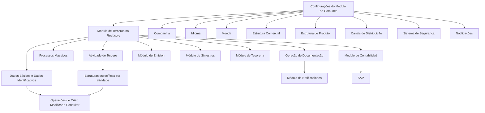
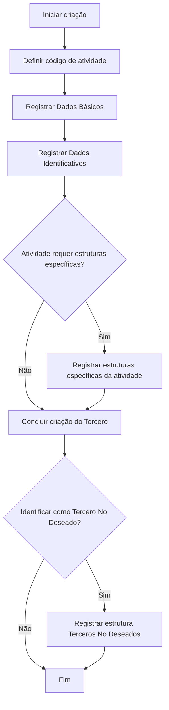
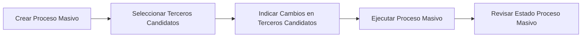

# Módulo de Terceros do Reef.core — Conceitos, Estruturas de Informação, Operações e Integrações Corporativas

## 1. Metadados do Documento
- **Arquivo de Origem:** `Não identificado — texto bruto fornecido na solicitação`
- **Tipo de Documento:** `Manual Operacional / Especificação Funcional`
- **Domínio / Sistema:** `Reef.core — Módulo de Terceros (MAPFRE)`
- **Público-Alvo:** `Negócio, Analistas Funcionais, Desenvolvedores, Arquitetos e Operação`
- **Data/Versão Identificada:** `Não identificada`

---

## 2. Resumo Executivo & Contexto de Negócio

O módulo de **Terceros** do sistema **Reef.core** centraliza o cadastro, a alteração, a consulta e o tratamento em lote de informações sobre pessoas físicas e pessoas jurídicas relacionadas à entidade seguradora MAPFRE. No domínio do Reef.core, o termo **Tercero** é usado indistintamente para pessoas físicas e entidades jurídicas.

O módulo organiza os dados dos Terceros segundo atividades, estruturas de informação e catálogos de configuração. As atividades classificam o papel do Tercero perante a entidade seguradora, como Asegurado/Cliente, Agente, Supervisor de Siniestros, Tramitador de Siniestros, Aseguradora, Reaseguradora, Broker, Empleado de Agencia/Agente, Entidad Bancaria ou níveis da Estrutura Comercial.

A solução busca estabelecer uma visão única do Tercero, baseada em regras de unificação, normalização e padronização dos dados. Essa visão consolidada permite que diferentes áreas de negócio utilizem informações coerentes, reduzindo consultas a múltiplos sistemas e melhorando a confiabilidade dos dados utilizados em processos de emissão, sinistros, tesouraria, contabilidade, faturamento e ação comercial.

A criação e a modificação de um Tercero dependem do respectivo código de atividade e das estruturas obrigatórias de informação. Os Dados Básicos, os Dados Identificativos e as estruturas complementares exigidas pela atividade compõem o registro do Tercero. O módulo também disponibiliza mecanismos de consulta, histórico de modificações, identificação de Terceros No Deseados, processos massivos e geração de documentação.

A operação do módulo depende de configurações prévias do módulo de **Comunes**, incluindo companhia, idioma, moeda, estrutura comercial, estrutura de produtos, canais de distribuição, sistema de segurança e notificações. O documento não especifica detalhes técnicos de APIs, contratos HTTP, bancos de dados, URLs, versões, portas, infraestrutura ou mecanismos internos de persistência.

---

## 3. Arquitetura, Componentes & Tecnologias Envolvidas

### Componentes funcionais identificados

| Componente / Módulo | Papel no contexto do módulo de Terceros |
| :--- | :--- |
| **Reef.core** | Sistema no qual o módulo de Terceros está inserido. |
| **Módulo de Terceros** | Gerencia registro, alteração, consulta, processos massivos e documentação de pessoas físicas e jurídicas. |
| **Módulo de Comunes** | Fornece parâmetros e catálogos necessários para o uso adequado do módulo de Terceros. |
| **Módulo de Emisión** | Identifica tomador/contratante e outros Terceros envolvidos no processo de emissão da apólice. |
| **Módulo de Siniestros** | Utiliza beneficiários identificados na emissão; utiliza Terceros em processos de gestão, liquidação e faturamento. |
| **Módulo de Tesorería** | Exibe tomador ou pagador do recibo como responsável pelo pagamento de prêmios. |
| **Módulo de Contabilidad** | Utiliza a chave do Tercero em lançamentos de comissões e em movimentos de resseguro. |
| **Módulo de Notificaciones** | Configura documentos e documentação que podem ser gerados e enviados a partir do módulo de Terceros. |
| **SAP** | Mencionado como destino ou requisito de consolidação das contas de prêmios e comissões entre empresas do grupo. |

### Dependências de configuração do módulo de Comunes

| Dependência | Finalidade no módulo de Terceros |
| :--- | :--- |
| Companhia | Define a companhia ou companhias da entidade seguradora MAPFRE constituídas localmente. |
| Idioma | Define os idiomas suportados pela aplicação. |
| Moeda | Define divisas, taxas de câmbio e câmbios cruzados usados em movimentos econômicos. |
| Estrutura Comercial | Define níveis e denominações da estrutura comercial de cada companhia. |
| Estrutura de Produto | Define níveis da estrutura de produtos e ramos contábeis de cada companhia. |
| Estrutura de Canais de Distribuição | Define canais de distribuição e a relação com Terceros que possuam atividade de Agente. |
| Sistema de Segurança | Define usuários e papéis que permitem ou negam acesso às atividades e informações dos Terceros. |
| Notificações | Define documentos e documentação que podem ser gerados e enviados desde o módulo de Terceros. |

### Fluxo funcional e de integração



### Nota de Análise

O documento descreve integrações funcionais entre módulos, mas não detalha interfaces técnicas, serviços, APIs, eventos, filas, formatos de mensagens, contratos JSON, protocolos, mecanismos de autenticação ou topologias de implantação.

---

## 4. Regras de Negócio, Especificações Funcionais & Processos

### 4.1 Definição de Tercero

No Reef.core, **Tercero** representa tanto pessoas físicas quanto pessoas jurídicas:

- **Pessoa física:** ser humano.
- **Pessoa jurídica:** entidade.
- O termo Tercero é utilizado para ambas as categorias.
- Um Tercero deve ser associado a uma ou mais classificações denominadas **Actividades**.
- As atividades determinam as tarefas desempenhadas pelo Tercero em relação à MAPFRE como entidade seguradora.

### 4.2 Regras associadas às atividades

| Regra / Exemplo | Descrição |
| :--- | :--- |
| Agente / Intermediário — Atividade `[2]` | A identificação de uma pessoa física como Intermediário ou Agente pode permitir sua entrada automática no processo de devengo de comissões da entidade MAPFRE. |
| Perito — Atividade `[3]` | Uma pessoa identificada como Perito pode participar de tarefas de atribuição e perícia no processo de Gestão de Siniestros y Prestaciones. |
| Empleado — Atividade `[15]` | Uma pessoa identificada como Empleado pode beneficiar-se automaticamente de desconto comercial na contratação de apólices durante o processo de Emisión. |
| Afinidade por atividade | Terceros da mesma atividade possuem dados comuns ou análogos. Exemplo: Agentes estão associados por padrão a uma oficina da estrutura comercial. |
| Pessoa física | Todo Tercero pessoa física possui pelo menos um nome e um sobrenome. |
| Estruturas obrigatórias | Dados Básicos, Dados Identificativos e estruturas complementares exigidas pela atividade são obrigatórios. |

### 4.3 Estruturas de informação comuns

As estruturas comuns podem ser usadas para a maioria das atividades e independentemente de o Tercero ser pessoa física ou jurídica.

| Estrutura | Regra funcional |
| :--- | :--- |
| Dados Básicos del Tercero | Contém dados que identificam inequivocamente o Tercero, incluindo atividade, tipo de documento identificador e chave. Em geral, são dados que não podem ser modificados durante a vida do Tercero. |
| Datos Identificativos del Tercero | Distingue o Tercero como pessoa física ou jurídica, registra categoria, informa se é Pessoa Politicamente Exposta e complementa os Dados Básicos. |
| Obligaciones Fiscales | Determina se o Tercero possui obrigações fiscais em outros países. |
| Personas Políticamente Expuestas | Identifica o Tercero como Pessoa Politicamente Exposta ou registra familiar/colaborador com esse status e vínculo com o Tercero. |
| Contactos | Define meios e métodos de contato do Tercero. |
| Direcciones | Registra endereços e suas tipologias, como residencial, trabalho e correspondência. |
| Documentos Alternativos | Registra documentos identificadores alternativos ao documento principal armazenado nos Dados Básicos. |
| Representantes Legales | Registra informações sobre representantes legais do Tercero. |
| Medios de Cobro y Pago | Contém informações sobre meios de cobrança e pagamento, incluindo contas bancárias e cartões fornecidos pelo Tercero. |
| Accionistas | Identifica acionistas do Tercero e respectivos percentuais acionários. |
| Terceros No Deseados | Permite identificar o Tercero como não desejado sob ponto de vista comercial e técnico. |

### 4.4 Estruturas exclusivas de Asegurados

| Estrutura | Finalidade |
| :--- | :--- |
| Información del Asegurado | Complementa Dados Básicos e Dados Identificativos do Asegurado. |
| Consentimientos | Identifica consentimentos concedidos pelo Asegurado à entidade seguradora. |
| Perfil Analítico | Reúne dados analíticos do Tercero conforme cálculos locais da entidade seguradora, como probabilidades de up-selling, cross-selling e abandono. |
| Licencia/Permiso de Conducir | Registra informações sobre licença ou carteira de motorista do Asegurado. |

### 4.5 Estruturas exclusivas de Agentes

| Estrutura | Finalidade |
| :--- | :--- |
| Información del Agente | Complementa Dados Básicos e Dados Identificativos do Agente. |
| Fuentes de Producción | Identifica fontes de produção habilitadas para o Agente, incluindo tipo de cliente distribuidor, canal de comercialização e atributos de vinculação, localização, oferta de produtos e canal de origem. |
| Cuadros de Comisiones Habilitados | Registra quadros de comissão que podem ser usados pelo Agente na comercialização de apólices. |
| Oficinas Habilitadas | Identifica oficinas da Estrutura Comercial nas quais o Agente pode emitir produção. |

### 4.6 Estruturas exclusivas para demais atividades

| Estrutura | Finalidade |
| :--- | :--- |
| Información de los Terceros Genéricos | Complementa informações de Terceros Genéricos. |
| Información de los Supervisores | Complementa informações de Supervisores de Siniestros. |
| Información de los Tramitadores | Complementa informações de Tramitadores de Siniestros. |
| Información Aseguradora | Complementa informações de companhias seguradoras. |
| Información Reaseguradora | Complementa informações de companhias resseguradoras. |
| Información Broker | Complementa informações de Brokers de Seguros. |
| Información Empleados de Agencia/Agente | Registra dados de empregados de agência ou agente. |
| Información Compañía | Complementa informações de companhias locais da entidade MAPFRE. |
| Información Entidad Bancaria | Registra dados de entidades bancárias. |
| Información Oficina Bancaria | Registra dados de oficinas bancárias. |
| Información Nivel 1 Estructura Comercial | Registra dados do primeiro nível da estrutura comercial. |
| Información Nivel 2 Estructura Comercial | Registra dados do segundo nível da estrutura comercial. |
| Información Nivel 3 Estructura Comercial | Registra dados do terceiro nível da estrutura comercial. |

### 4.7 Processo de criação de Terceros



#### Regras de criação

- A criação de Terceros consiste no registro de informações nas estruturas correspondentes segundo o **Código de Actividad**.
- A operação **Crear Tercero** permite registrar toda ou parte das estruturas comuns, independentemente da atividade associada.
- A criação de Terceros por atividade requer a complementação das respectivas estruturas específicas.
- A identificação como **Tercero No Deseado** ocorre após a criação do Tercero nas atividades em que essa operação é disponibilizada.
- A criação de um Asegurado pode partir das informações de um Asegurado já existente.
- A criação de Asegurado a partir de outro Asegurado pode usar Dados Básicos ou outras estruturas de informação como origem.

### 4.8 Operações de criação suportadas

| Operação | Regra / Estrutura complementar |
| :--- | :--- |
| Crear Tercero | Captura informação em todas ou parte das estruturas comuns. |
| Crear Asegurado | Requer as estruturas específicas de Asegurados. |
| Crear Asegurado Partiendo de Otro | Cria Asegurado tomando outro Asegurado como origem de dados. |
| Crear Agente | Requer estruturas específicas de Agentes. |
| Crear Agente como Tercero No Deseado | Após criar o Agente, registra a estrutura de Tercero No Deseado. |
| Crear Tercero Genérico | Requer estrutura própria de Terceros Genéricos. |
| Crear Tercero Genérico como Tercero No Deseado | Após criar o Tercero Genérico, registra Tercero No Deseado. |
| Crear Supervisor | Requer estrutura específica de Supervisores. |
| Crear Supervisor como Tercero No Deseado | Após criar o Supervisor, registra Tercero No Deseado. |
| Crear Tramitador | Requer estruturas próprias de Tramitadores. |
| Crear Tramitador como Tercero No Deseado | Após criar o Tramitador, registra Tercero No Deseado. |
| Crear Aseguradora | Requer estrutura própria de Aseguradoras. |
| Crear Aseguradora como Tercero No Deseado | Após criar a Aseguradora, registra Tercero No Deseado. |
| Crear Reaseguradora | Requer estrutura específica de companhias resseguradoras. |
| Crear Reaseguradora como Tercero No Deseado | Após criar a Reaseguradora, registra Tercero No Deseado. |
| Crear Broker | Requer estrutura específica do Broker. |
| Crear Broker como Tercero No Deseado | Após criar o Broker, registra Tercero No Deseado. |
| Crear Empleado de Agencia/Agente | Requer estrutura específica para empregados de agência/agente. |
| Crear Empleado de Agencia/Agente como Tercero No Deseado | Após criar o empregado, registra Tercero No Deseado. |
| Crear Compañía | Requer estrutura relativa a companhias. |
| Crear Entidad Bancaria | Requer estrutura específica de entidade bancária. |
| Crear Oficina Bancaria | Requer bloco específico de oficina bancária. |
| Crear Nivel 1 Estructura Comercial | Requer bloco específico do primeiro nível. |
| Crear Nivel 2 Estructura Comercial | Requer bloco específico do segundo nível. |
| Crear Nivel 3 Estructura Comercial | Requer bloco específico do terceiro nível. |
| Crear Proveedor | Requer blocos específicos de Proveedores. |

### 4.9 Processo de modificação

- A operação **Modificar Tercero** permite alterar a maior parte das informações do Tercero.
- Dados que identificam inequivocamente o Tercero não podem ser modificados.
- A operação de modificação deve respeitar a atividade do Tercero.
- A estrutura de Terceros No Deseados pode ser alterada por operações específicas de modificação.
- O módulo disponibiliza histórico de modificações para consulta, mas nem todas as atividades possuem histórico habilitado.

| Operação de modificação | Atividade informada no documento |
| :--- | :--- |
| Modificar Asegurado | `[1]` |
| Modificar Agente | `[2]` |
| Modificar Agente como Tercero No Deseado | `[2]` |
| Modificar Tercero Genérico | `[6 - 15 - 17 y 18,...]` |
| Modificar Tercero Genérico como Tercero No Deseado | `[6 - 15 - 17 y 18,...]` |
| Modificar Supervisor | `[8]` |
| Modificar Tramitador | `[9]` |
| Modificar Aseguradora | `[13]` |
| Modificar Reaseguradora | `[14]` |
| Modificar Broker | `[16]` |
| Modificar Empleado de Agencia/Agente | `[37]` |
| Modificar Compañía | `[39]` |
| Modificar Entidad Bancaria | `[40]` |
| Modificar Oficina Bancaria | `[41]` |
| Modificar Nivel 1 Estructura Comercial | `[42]` |
| Modificar Nivel 2 Estructura Comercial | `[43]` |
| Modificar Nivel 3 Estructura Comercial | `[44]` |
| Modificar Proveedor | Atividade vinculada como Proveedor; código não informado. |

### 4.10 Consultas de Terceros

| Consulta | Critério / Resultado |
| :--- | :--- |
| Consultar Tercero vía Datos del Tercero | Pesquisa por subconjunto de dados do Tercero. |
| Consultar Tercero vía Medios de Contacto | Pesquisa por meio de contato informado como critério. |
| Consultar Tercero por Situación en Histórico | Consulta uma versão do histórico, exibindo mudanças em relação à situação imediatamente anterior. |
| Consultar Tercero por Situación en Vigor | Consulta a última situação ou situação vigente do Tercero. |

### 4.11 Processos massivos



| Etapa | Descrição |
| :--- | :--- |
| Crear Proceso Masivo | Configura processo para criar ou modificar Terceros conforme os códigos de atividade associados ou futuros. |
| Seleccionar Terceros Candidatos | Seleciona pessoas físicas ou jurídicas que participarão do processo. |
| Indicar Cambios en Terceros Candidatos | Define alterações que serão aplicadas aos Terceros participantes. |
| Ejecutar Proceso Masivo | Executa o processo massivo de Terceros. |
| Revisar Estado Proceso Masivo | Revisa o estado e as informações relacionadas aos Terceros após a execução. |

### 4.12 Geração de documentação

A operação **Generar Documentación** gera e envia documentos de saída do Tercero quando:

1. Existe configuração expressa no módulo de **Notificaciones**; e
2. A atividade do Tercero permite ou possui a funcionalidade habilitada.

Exemplo apresentado: ao criar um Intermediário por meio da operação **Crear Agente**, o contrato laboral com a entidade MAPFRE pode ser enviado ao Regulador.

### 4.13 Integrações funcionais com outros módulos

| Módulo integrado | Uso do Tercero na integração |
| :--- | :--- |
| Comunes | Parâmetros da instalação ativam, desativam ou alteram fluxos de captura de informação no módulo de Terceros. |
| Emisión | Identifica tomador/contratante do seguro e outros Terceros segundo a configuração do produto. |
| Siniestros | Utiliza beneficiários identificados na emissão para liquidar pagamentos; utiliza fornecedores e beneficiários em faturamento. |
| Tesorería | Exibe tomador da apólice ou pagador do recibo como responsável pelo pagamento de prêmios. |
| Contabilidad | Registra liquidações de comissão do Agente e usa chave do Tercero para contas de prêmios e comissões entre empresas do grupo. |
| SAP | Requer chave do Tercero para consolidação das contas de prêmios e comissões em movimentos de resseguro com empresas do grupo. |

---

## 5. Tabelas de Parâmetros, Ambientes e Estruturas de Dados

### 5.1 Catálogos comuns para pessoas físicas e jurídicas

| Item / Parâmetro | Descrição / Função | Tipo / Valores / Formato | Ambiente / Observações |
| :--- | :--- | :--- | :--- |
| Documentos Identificadores | Define documentos que identificam individual e inequivocamente os Terceros. | Exemplos: NIF, DNI. | Uso comum para pessoas físicas e jurídicas. |
| Agrupaciones | Define subconjuntos de Terceros que compartilham ao menos uma característica. | Catálogo. | Uso comum. |
| Categorías | Define classes estabelecidas em profissão, carreira ou atividade dos Terceros. | Catálogo. | Uso comum. |
| Clasificación | Define ordenações para organizar atividades dos Terceros. | Catálogo. | Uso comum. |
| Códigos Calidad | Define propriedades que permitem caracterizar e valorar Terceros em relação a outros. | Catálogo. | Uso comum. |
| Entidades de Cobro/Pago | Define entidades comercializadoras dos meios de cobrança e pagamento. | Catálogo. | Uso comum. |
| Medios de Cobro/Pago | Define meios de cobrança e pagamento. | Contas bancárias, cartões e outros. | Uso comum. |
| Token | Define tipos de tokens que podem ser utilizados em meios de cobrança e pagamento. | Catálogo. | Uso comum. |
| Régimen Fiscal | Define regimes fiscais como conjunto de direitos e obrigações decorrentes de atividade econômica. | Catálogo. | Uso comum. |
| Rating | Define qualificações de solvência de Terceros pessoas jurídicas. | Catálogo. | O texto o posiciona na lista de conceitos comuns. |
| Perfil Financiero | Define atributos e características socioeconômicas e financeiras do Tercero. | Catálogo. | Uso comum. |
| Parentescos / Relaciones | Define parentescos e relações intercompanhias entre pessoas físicas e jurídicas. | Catálogo. | Uso comum. |
| Departamentos | Configura departamentos nos quais empresas podem ser organizadas. | Catálogo. | Uso comum. |
| Cargos de Personas Políticamente Expuestas | Define possíveis cargos de Terceros classificados como Pessoas Politicamente Expostas. | Catálogo. | Uso comum. |
| Consentimientos | Define manifestações de vontade pelas quais Terceros aceitam tratamento de dados pessoais. | Catálogo. | Uso comum. |
| Causas Inhabilitación | Define motivos operacionais que podem provocar baixa ou inabilitação de Terceros. | Catálogo. | Uso comum. |

### 5.2 Catálogos exclusivos de pessoas físicas

| Item / Parâmetro | Descrição / Função | Tipo / Valores / Formato | Ambiente / Observações |
| :--- | :--- | :--- | :--- |
| Estados del Permiso de Conducir | Define estados ou situações de licenças e permissões de condução. | Catálogo. | Exclusivo para pessoas físicas. |
| Profesiones | Define empregos ou ocupações exercidos mediante retribuição, remuneração ou salário. | Catálogo. | Exclusivo para pessoas físicas. |
| Titulaciones | Define titulações que os Terceros podem possuir. | Catálogo. | Exclusivo para pessoas físicas. |
| Nivel de Estudios | Define graus ou níveis educacionais concluídos pelos Terceros. | Catálogo. | Exclusivo para pessoas físicas. |

### 5.3 Catálogos exclusivos de pessoas jurídicas

| Item / Parâmetro | Descrição / Função | Tipo / Valores / Formato | Ambiente / Observações |
| :--- | :--- | :--- | :--- |
| Tipos de Personas Jurídicas | Define formas de constituição ou classificações de pessoas jurídicas. | Catálogo. | Exclusivo para entidades jurídicas. |
| Actividad Económica | Configura atividades econômicas de Terceros pessoas jurídicas. | Catálogo. | Exclusivo para entidades jurídicas. |
| Cargos de Accionistas | Define cargos ou empregos de acionistas em Terceros pessoas jurídicas. | Catálogo. | Exclusivo para entidades jurídicas. |

### 5.4 Atividades e códigos explicitamente identificados

| Atividade / Papel | Código de atividade | Observação |
| :--- | :--- | :--- |
| Asegurado / Cliente | `[1]` | Código mencionado em operação de modificação. |
| Agente / Intermediário | `[2]` | Pode participar do devengo de comissões. |
| Perito | `[3]` | Pode participar de tarefas de atribuição e perícia. |
| Tercero Genérico | `[6 - 15 - 17 y 18,...]` | Exemplos: Abogados, Empleado de la Entidad Aseguradora, Taller, Clínica. |
| Supervisor de Siniestros | `[8]` | Código mencionado em modificação. |
| Tramitador de Siniestros | `[9]` | Código mencionado em modificação. |
| Entidad Aseguradora | `[13]` | Código mencionado em modificação. |
| Entidad Reaseguradora | `[14]` | Código mencionado em modificação. |
| Empleado | `[15]` | Pode receber desconto comercial em contratação de apólices. |
| Broker de Seguros | `[16]` | Código mencionado em modificação. |
| Empleado de Agencia/Agente | `[37]` | Código mencionado em modificação. |
| Compañía MAPFRE local | `[39]` | Código mencionado em modificação. |
| Entidad Bancaria | `[40]` | Código mencionado em modificação. |
| Oficina Bancaria | `[41]` | Código mencionado em modificação. |
| Nivel 1 Estructura Comercial | `[42]` | Código mencionado em modificação. |
| Nivel 2 Estructura Comercial | `[43]` | Código mencionado em modificação. |
| Nivel 3 Estructura Comercial | `[44]` | Código mencionado em modificação. |
| Proveedor | Não informado | O documento descreve criação e modificação, sem informar código. |

### 5.5 Ambientes, URLs, servidores e logs

| Item / Parâmetro | Descrição / Função | Tipo / Valores / Formato | Ambiente / Observações |
| :--- | :--- | :--- | :--- |
| Ambientes técnicos | Não detalhados. | Não informado. | O documento não informa DEV, QA, UAT, produção ou equivalentes. |
| URLs | Não detalhadas. | Não informado. | Não há URLs de integração ou acesso ao módulo. |
| Servidores | Não detalhados. | Não informado. | Não há nomes, IPs, portas ou topologias. |
| Rotas de logs | Não detalhadas. | Não informado. | Não há diretórios, ferramentas ou políticas de retenção. |
| APIs / Contratos | Não detalhados. | Não informado. | Não há métodos HTTP, endpoints, payloads ou contratos de serviço. |

---

## 6. Bateria de Perguntas & Respostas para RAG (FAQ Sintético)

### P1: O que é um Tercero no Reef.core?
**R:** No Reef.core, o termo **Tercero** é utilizado indistintamente para representar pessoas físicas e pessoas jurídicas. Uma pessoa física corresponde a um ser humano; uma pessoa jurídica corresponde a uma entidade. O módulo de Terceros registra, organiza, classifica e disponibiliza informações dessas pessoas ou entidades para os processos da seguradora.

### P2: Quais estruturas são obrigatórias no cadastro de um Tercero?
**R:** O documento estabelece que as estruturas que registram os **Datos Básicos**, os **Datos Identificativos** e as estruturas que complementam a informação de acordo com a atividade do Tercero são obrigatórias. Os Dados Básicos incluem elementos como atividade, tipo de documento identificador e chave; os Dados Identificativos distinguem o Tercero como pessoa física ou jurídica.

### P3: O que não pode ser alterado na operação Modificar Tercero?
**R:** A operação **Modificar Tercero** permite modificar a maior parte das informações do Tercero, exceto os dados que o identificam inequivocamente como Tercero. Esses dados são descritos como integrantes dos Dados Básicos e, em geral, não podem ser modificados durante a vida do Tercero.

### P4: Como uma atividade influencia o tratamento de um Tercero?
**R:** A atividade classifica o papel do Tercero perante a entidade seguradora e determina quais estruturas complementares são necessárias. Por exemplo, um Agente possui estruturas específicas como Información del Agente, Fuentes de Producción, Cuadros de Comisiones Habilitados e Oficinas Habilitadas. Um Asegurado possui estruturas como Información del Asegurado, Consentimientos, Perfil Analítico e Licencia/Permiso de Conducir.

### P5: O que ocorre quando uma pessoa é registrada como Agente com atividade `[2]`?
**R:** Quando uma pessoa é identificada como Intermediário ou Agente, com código de atividade `[2]`, essa classificação pode permitir sua entrada automática no processo de devengo de comissões da entidade MAPFRE. Nesse processo, o Agente pode receber retribuição econômica, incluindo parte proporcional das primas obtidas em sua atividade comercial direta, intervenção ou colaboração.

### P6: Como o módulo trata Terceros No Deseados?
**R:** O módulo possui uma estrutura de informação chamada **Terceros No Deseados**, destinada a identificar um Tercero como não desejado sob ponto de vista comercial e técnico. Para várias atividades, a operação de criação correspondente é seguida por uma operação que registra essa estrutura; também existem operações de modificação específicas para atualizar essa classificação.

### P7: Quais opções de consulta estão disponíveis para um Tercero?
**R:** O módulo disponibiliza consulta por dados do Tercero, por meios de contato, por situação em histórico e por situação vigente. A consulta histórica permite selecionar uma versão do histórico e visualizar mudanças em relação à situação imediatamente anterior. O documento ressalta que nem todas as atividades possuem histórico de mudanças habilitado.

### P8: Como funcionam os processos massivos de Terceros?
**R:** O processo massivo é composto por quatro etapas: criar o processo massivo, selecionar os Terceros candidatos, indicar as alterações a serem aplicadas e executar o processo. Depois da execução, é possível revisar o estado do processo e as informações relacionadas aos Terceros participantes.

### P9: Quais condições devem ser atendidas para gerar documentação de um Tercero?
**R:** A geração e o envio de documentos de saída dependem de duas condições: a documentação deve estar configurada expressamente no módulo de Notificaciones, e a atividade do Tercero deve permitir ou ter habilitada essa funcionalidade. O documento cita como exemplo o envio ao Regulador do contrato laboral com a entidade MAPFRE após a criação de um Intermediário por meio de Crear Agente.

### P10: Como o módulo de Terceros se integra ao módulo de Emisión?
**R:** No processo de Emisión, o módulo identifica o tomador ou contratante do seguro e outros Terceros conforme a configuração do produto. Em automóveis, por exemplo, o tomador e o Asegurado normalmente podem coincidir, mas a configuração do país e do produto pode exigir o registro de condutores possíveis, beneficiários e outras relações.

### P11: Qual é o uso do módulo de Terceros em Siniestros e faturamento?
**R:** No tratamento de Siniestros, os beneficiários previamente identificados na emissão da apólice são utilizados para pagamento das liquidações. No faturamento, fornecedores dos serviços prestados e beneficiários das faturas precisam estar registrados no módulo de Terceros com meios de contato e meios de cobrança e pagamento identificados, permitindo contato e pagamentos.

### P12: Por que a chave do Tercero é relevante para Contabilidad e SAP?
**R:** No lançamento de comissões, Contabilidad registra as liquidações realizadas ao Agente responsável pela comercialização da apólice. Em lançamentos de resseguro referentes a movimentos de primas, as contas de primas e comissões entre empresas do grupo usam a chave do Tercero porque ela é requisito para a consolidação em SAP.

---

## 7. Glossário de Termos, Siglas & Conceitos-Chave

- **Asegurado:** Segurado; Tercero cuja atividade corresponde a cliente ou pessoa segurada.
- **Actividad:** Classificação atribuída ao Tercero que determina tarefas, papel perante a MAPFRE e estruturas de informação aplicáveis.
- **Agente:** Tercero que atua na comercialização de apólices e pode estar sujeito ao processo de comissões.
- **Broker:** Broker de seguros com estrutura de informação específica.
- **Comunes:** Módulo que fornece parâmetros, catálogos e configurações necessárias a outros módulos, incluindo Terceros.
- **Datos Básicos:** Estrutura que contém dados que identificam inequivocamente o Tercero.
- **Datos Identificativos:** Estrutura que distingue o Tercero como pessoa física ou jurídica e complementa os Dados Básicos.
- **Devengo de comisiones:** Processo de apropriação ou reconhecimento de comissões associadas ao Agente.
- **DNI:** Documento Nacional de Identidad.
- **Emisión:** Módulo ou processo de emissão de apólices.
- **Entidad Bancaria:** Entidade bancária.
- **MAPFRE:** Entidade seguradora mencionada no documento.
- **NIF:** Número de Identificación Fiscal.
- **Notificaciones:** Módulo responsável pela configuração de documentos e documentação gerados e enviados.
- **Persona Física:** Ser humano.
- **Persona Jurídica:** Entidade ou organização com personalidade jurídica.
- **Persona Políticamente Expuesta:** Tercero com status de Pessoa Politicamente Exposta, ou familiar/colaborador relacionado.
- **Proveedor:** Fornecedor.
- **Reaseguradora:** Companhia resseguradora.
- **Reef.core:** Sistema que contém o módulo de Terceros e módulos relacionados.
- **SAP:** Sistema citado como destino da consolidação de determinadas contas de prêmios e comissões.
- **Siniestros:** Módulo ou processo relacionado a sinistros e suas liquidações.
- **Tercero:** Pessoa física ou jurídica relacionada à entidade seguradora.
- **Tercero No Deseado:** Classificação que identifica um Tercero como não desejado sob perspectiva comercial e técnica.
- **Tesorería:** Módulo ou processo que trata, entre outros elementos, do pagamento de prêmios e recibos.
- **Tomador / Contratante:** Pessoa responsável pela contratação do seguro.
- **Tramitador de Siniestros:** Tercero associado à tramitação de sinistros.

---

## 8. Notas Críticas, Riscos & Limitações

- O documento é funcional e conceitual; não descreve arquitetura técnica de infraestrutura, persistência, APIs, protocolos, autenticação, autorização técnica, eventos, mensageria ou observabilidade.
- Não há informações sobre ambientes, URLs, servidores, portas, rotas de logs, ferramentas de monitoramento ou procedimentos de suporte operacional.
- Nem todas as atividades de Terceros possuem histórico de alterações habilitado.
- A geração de documentação depende simultaneamente da configuração no módulo de Notificaciones e da habilitação da funcionalidade para a atividade do Tercero.
- A captura de informações varia conforme parâmetros configurados no módulo de Comunes, como a diferença entre cadastro de cliente pessoa física, companhia, Agente e Asegurado.
- A classificação do Tercero por atividade é central para determinar estruturas obrigatórias, fluxos de operação e integrações funcionais.
- O documento cita códigos de atividade para diversas operações, mas não apresenta um catálogo completo de todas as atividades nem regras de validação dos códigos.
- O documento menciona a integração com SAP para consolidação, porém não detalha a interface, o mecanismo de integração ou a responsabilidade técnica da sincronização.
- **Nota de Análise:** O documento não detalha os métodos HTTP, contratos JSON, schemas de dados, regras de versionamento, políticas de retenção, modelos de segurança ou SLAs do módulo de Terceros.

---

## 9. Conteúdo Bruto Estruturado (Referência Fiel)

```text
--- [PÁGINA 1 DE 20] ---

INTRODUCCIÓN - Módulo de TERCEROS
Objetivo
El propósito de este módulo es Crear, Modificar y Consultar la información de los Terceros, sean
estos Personas Físicas o Personas Jurídicas, configurando las distintas actividades que éstos van a
tener asociadas además de clasificar y organizar de manera sistemática su información.
Dependencias
Principales Conceptos
Operaciones Soportadas
Características del Módulo
Integración y Dependencias con Otros Módulos
Dependencias
Se tienen que haber configurado previamente determinados conceptos del Módulo de Comunes
para poder utilizar adecuadamente el Módulo de Terceros.
TRANSVERSAL
 /
RS
Inicio Soluciones APIs Documentación Zeus
ES

--- [PÁGINA 2 DE 20] ---

Dependencias con el Módulo de Comunes. Entre otras:
COMPAÑÍA
Definición de la compañía o compañías que
tenga la entidad aseguradora MAPFRE
localmente constituidas.
IDIOMA
Definición de los idiomas soportados por la
aplicación.
MONEDA
Definición de las divisas, sus tipos de cambio
y cambios cruzados con las que se pueden
realizar movimientos económicos de cualquier
tipo (cobro/pago, cálculo de primas,
validaciones de importes,...) en las
operaciones de los diferentes módulos.
ESTRUCTURA COMERCIAL
Definición de la Estructura Comercial de
cada compañía: niveles y denominación de
los mismos.
ESTRUCTURA PRODUCTO
Definición de la Estructura de Productos de
cada compañía: niveles de la estructura y
ramos contables.
ESTRUCTURA CANALES de
DISTRIBUCIÓN
Definición de la Estructura de Canales de
Distribución y su relación con los terceros
cuyas actividades sean Agentes.
SISTEMA de SEGURIDAD
Definición de los Usuarios y sus Roles para
permitir o no el acceso a las actividades e
información de los terceros,...
NOTIFICACIONES
Definición de los
Documentos/Documentación que se puede
generar y enviar desde el módulo de terceros.
Principales Conceptos
Terceros
Actividades
Conceptos Comunes para Personas Físicas y Jurídicas
Conceptos Específicos para Personas Físicas
Conceptos Específicos para Personas Jurídicas

--- [PÁGINA 3 DE 20] ---

Estructuras de Información
Terceros
En el lenguaje legal es muy habitual encontrarnos con los conceptos de persona física y persona
jurídica. La primera se refiere a un ser humano y la segunda, la persona jurídica, a entidades.
En Reef.core el término "Tercero" se utiliza indistintamente para referirse tanto a unas personas
como a otras.
Actividades
Son clasificaciones que o bien identifican al Tercero como miembro de un Grupo afín de Terceros o
bien determinan el conjunto de trabajos o acciones organizadas que son realizados por una persona,
una profesión o una entidad.
A modo de ejemplo, si capturamos en el sistema la información de una persona física y la
identificamos en el sistema con la actividad asociada a un Intermediario o Agente, su código de
actividad [2] le permitirá entrar de manera automática en el proceso de devengo de comisiones de la
entidad MAPFRE, proceso por el que percibirá una retribución económica consistente, entre otros
conceptos, de una parte proporcional de las primas conseguidas en su labor comercial directa o a
través de su intervención o colaboración.
En cambio si a la misma persona la hubiéramos identificado en el sistema como un Perito [3] o como
un Empleado [15], esta persona podría respectivamente estar involucrada en tareas específicas de
asignación y peritaje dentro del proceso de Gestión de Siniestros y Prestaciones o beneficiarse
automáticamente de un descuento comercial en la contratación de sus pólizas en el proceso de
Emisión.
Catálogos de Configuración COMUNES
Son catálogos que se configuran en el modelo de datos del módulo de Terceros y que cuentan con
códigos/claves que sirven para estandarizar la información en el proceso de alta o modificación de
los datos de los Terceros, independientemente que estos sean Personas Físicas o Personas
Jurídicas. Por ejemplo:
En caso de dar de alta a un Cliente uno de los catálogos identifica el perfil financiero del mismo.
En caso de inhabilitación de un Tercero uno de los catálogos identifica el motivo por el que se le
está inhabilitando.
En caso de ingresar la información de un Cliente, uno de los catálogos indicaría el estado del
carnet de conducir.
etcétera.
Consejo:

--- [PÁGINA 4 DE 20] ---

COMUNES
En este nivel encontramos Conceptos que pertenecen al módulo de
Terceros y se utilizan tanto para Personas Físicas como para Personas
Jurídicas. Por ejemplo:
DOCUMENTOS IDENTIFICADORES
Definición de los documentos que permiten
identificar individual e inequívocamente a
los Terceros, como por ejemplo:
NIF - Número de Identificación Fiscal
DNI - Documento Nacional de Identidad
AGRUPACIONES
Definición de las Agrupaciones como
Subconjuntos de Terceros que comparten al
menos una característica entre ellos.
CATEGORÍAS
Definición de las Categorías como las clases
establecidas en una profesión, carrera o
actividad de los Terceros.
CLASIFICACIÓN
Definición de las diferentes Ordenaciones en
las que se pueden organizar las actividades
de los Terceros.
CÓDIGOS CALIDAD
Definición de los conjuntos de propiedades
inherentes a los Terceros que permiten
caracterizar y valorarlos con respecto a los
restantes dentro de su especie.
ENTIDADES de COBRO / PAGO
Definición de las diferentes Entidades
Comercializadoras de los Medios de Cobro y
Pago de los Terceros.
MEDIOS de COBRO / PAGO
Definición de las diferentes Medios de Cobro
y Pago de los Terceros (Cuentas Bancarias,
Tarjetas,...)
TOKEN
Definición de los tipos de tóquenes que se
pueden utilizar en los medios de Cobro y
Pago de los Terceros.
RÉGIMEN FISCAL
Definición de los regímenes fiscales como
conjuntos de derechos y obligaciones que
RATING
Definición de las Calificaciones de
Solvencia de los Terceros Personas Jurídicas

--- [PÁGINA 5 DE 20] ---

surgen del desarrollo de una determinada
actividad económica por parte de los
Terceros.
para hacer frente a sus obligaciones
financieras.
PERFIL FINANCIERO
Definición de los conjuntos de atributos y
características socioeconómicas y
financieras de los Terceros.
PARENTESCOS / RELACIONES
Definición de los Parentescos y Relaciones
inter-compañías que se pueden dar entre las
Personas Físicas y Jurídicas respectivamente.
DEPARTAMENTOS
Configuración de los diferentes
Departamentos en los que se pueden
organizar o estructurar las Empresas.
CARGOS de PERSONAS POLÍTICAMENTE
EXPUESTAS
Definición de los posibles Cargos que puedan
tener los Terceros como Personas
Políticamente Expuestas.
CONSENTIMIENTOS
Definición de las manifestaciones de
voluntad mediante las que los Terceros
aceptan el tratamiento de sus datos
personales.
CAUSAS INHABILITACIÓN
Definición de los diferentes Motivos que
operativamente pueden provocar la baja o
inhabilitación de los Terceros.
Catálogos de Configuración para PERSONAS FÍSICAS
Son catálogos que se configuran en el modelo de datos del módulo de Terceros y que cuentan con
códigos/claves que sirven para estandarizar la información en el proceso de alta o modificación de
los datos de los Terceros cuando estos sean Personas Físicas. Por ejemplo:
En caso de dar de alta a un Asegurado uno de los catálogos identifica el estado en el que se
encuentra su licencia de conducir.
La Profesión de un Asegurado, como actividad habitual de la persona, empleo u ocupación que
generalmente ejerce, se registra si el Tercero tiene la condición de persona Física.
etcétera.
TERCEROS Personas Físicas

--- [PÁGINA 6 DE 20] ---

En este nivel encontramos Conceptos que pertenecen al módulo de
Terceros y se utilizan Exclusivamente para Personas Físicas. Por
ejemplo:
ESTADOS del PERMISO de CONDUCIR
Estados o Situaciones en los que se pueden
encontrar las licencias o permisos de
conducción de las Personas Físicas.
PROFESIONES
Definición de los posibles Empleos u
Ocupaciones que generalmente pueden
ejercer los Terceros a cambio de una
retribución, remuneración o salario.
TITULACIONES
Definición de las diversas Titulaciones que
pueden tener los Terceros.
NIVEL de ESTUDIOS
Definición de los Grados o Niveles
Educativos que los Terceros puedan haber
finalizado.
Catálogos de Configuración para PERSONAS JURÍDICAS
Son catálogos que se configuran en el modelo de datos del módulo de Terceros y que cuentan con
códigos/claves que sirven para estandarizar la información en el proceso de alta o modificación de
los datos de los Terceros cuando estos sean Personas Jurídicas.
En caso de dar de alta a un Asegurado identificar la Actividad Económica en la que se engloba
su actividad principal.
En la Estructura de Información que contiene la relación de accionistas uno de los catálogos
permite identificar el cargo que ocupa en la Entidad siempre y cuando el Tercero tenga la
condición de persona Jurídica.
etcétera.
TERCEROS Personas Jurídicas
En este nivel encontramos Conceptos que pertenecen al módulo de
Terceros y se utilizan Exclusivamente para entes o Entidades Jurídicas.
Por ejemplo:
TIPOS de PERSONAS JURÍDICAS
ACTIVIDAD ECONÓMICA

--- [PÁGINA 7 DE 20] ---

Definición de las posibles Formas de
Constitución o Clasificaciones de las
Personas Jurídicas.
Configuración de las Distintas Actividades
Económicas de los Terceros Personas
Jurídicas.
CARGOS de ACCIONISTAS
Definición de los Cargos o Empleos de los
Accionista para los Terceros Personas
Jurídicas.
Estructuras de Información
En Reef.core la información de los Terceros se registra, ordena y agrupa en Estructuras
contenedoras de información de acuerdo con la taxonomía de los datos que contienen y de su
Actividad.
Las Estructuras que registran los Datos Básicos y los Datos Identificativos además de aquellas
Estructuras que por actividad complementan su información, son Estructuras obligatorias.
ESTRUCTURAS de INFORMACIÓN COMUNES
Estructuras de Información Comunes, es decir, de uso para la mayoría
de las Actividades de los Terceros e independientemente de si estos son
Personas Físicas o Jurídicas.
DATOS BÁSICOS del TERCERO
Estructura de Información que contiene los
Datos que identifican inequívocamente al
Tercero, como por ejemplo la Actividad que
desempeña, el Tipo de documento
identificador, su clave, ... en general aquellos
datos que no pueden modificarse a lo largo
del la vida del Tercero.
DATOS IDENTIFICATIVOS del TERCERO
Estructura que contiene los Datos que
distinguen al Tercero como Persona Física o
Jurídica, su categoría, identifica si es o no
Persona Políticamente Expuesta y
Complementa los Datos Básicos del Tercero.
OBLIGACIONES FISCALES
Estructura que determina si el Tercero tiene o
no Obligaciones Fiscales en otros países.
PERSONAS POLÍTICAMENTE EXPUESTAS
Estructura de Información que reconoce al
tercero como Persona Políticamente

--- [PÁGINA 8 DE 20] ---

Expuesta o informar de algún Familiar o
Colaborador afecto con dicho estatus y con la
que tenga un vínculo o esté relacionada.
CONTACTOS
Estructura que establece los diferentes
Medios y Métodos de Contacto de los
Terceros.
DIRECCIONES
Estructura de información que contiene las
diferentes Direcciones del Tercero y su
tipología: Residencial, Trabajo,
correspondencia,...
DOCUMENTOS ALTERNATIVOS
Estructura de información que contiene otros
Documentos de identificación Alternativos
al Documento Identificador principal
registrado en los Datos Básicos del Tercero.
REPRESENTANTES LEGALES
Estructura que registra la Información de los
Representantes Legales del Tercero.
MEDIOS DE COBRO Y PAGO
Estructura de Datos que contiene la
información relativa a los Medios de Cobro y
Pago (Cuentas Bancarias, tarjetas,...)
provistos por el Tercero.
ACCIONISTAS
Estructura de Información para identificar los
Accionistas del Tercero y sus porcentajes
accionariales.
TERCEROS NO DESEADOS
Estructura de Información que permite
identificar al Tercero como Tercero No
Deseado desde un punto de vista comercial y
técnico.
ESTRUCTURAS de INFORMACIÓN de los
ASEGURADOS
Estructuras de Información de uso exclusivo para los ASEGURADOS.

--- [PÁGINA 9 DE 20] ---

INFORMACIÓN del ASEGURADO
Estructura de Información específica de los
Asegurados que Complementa la
información registrada en los Datos Básicos
e Identificativos del Tercero.
CONSENTIMIENTOS
Estructura de información para identificar los
Consentimientos otorgados a la entidad
aseguradora por parte del Asegurado.
PERFIL ANALÍTICO
El propósito de esta estructura de Información
es recabar los datos del Perfil Analítico del
Tercero de acuerdo con los cálculos
efectuados localmente por la Entidad
aseguradora (Por ejemplo para identificar las
probabilidades de up-selling, cross-selling,
abandono del Tercero, étc.)
LICENCIA/PERMISO de CONDUCIR
Estructura de Datos que contiene la
Información de la Licencia o Carnet de
Conducir del Asegurado.
ESTRUCTURAS de INFORMACIÓN de los
AGENTES
Estructuras de Información de uso exclusivo para los AGENTES.
INFORMACIÓN del AGENTE
Estructura de Información específica de los
Agentes que Complementa la información
registrada en los Datos Básicos e
Identificativos del Tercero.
FUENTES de PRODUCCIÓN
Estructura de información que permite
identificar las Fuentes de Producción
habilitadas para el Agente, siendo éstas las
claves que identifican en el sistema el tipo de
cliente distribuidor, el canal de
comercialización y otros Atributos adicionales
de vinculación, ubicación, oferta de productos
y canal de origen del cliente.
CUADROS de COMISIONES HABILITADOS
Estructura de Información para registrar los
Cuadros de Comisiones que pueden ser
OFICINAS HABILITADAS
Estructura de Información que permite
identificar las Oficinas de la Estructura

--- [PÁGINA 10 DE 20] ---

usados por el Agente en la comercialización
de sus pólizas.
Comercial de la Entidad en las que se
permite emitir la producción del Agente.
ESTRUCTURAS de INFORMACIÓN RESTO de
ACTIVIDADES
Estructuras de Información de uso exclusivo según la ACTIVIDAD del
TERCERO.
INFORMACIÓN de los TERCEROS
GENÉRICOS
Estructura de Información específica de los
Terceros Genéricos que Complementa la
información registrada en los Datos Básicos
e Identificativos del Tercero.
INFORMACIÓN de los SUPERVISORES
Estructura de Información específica de los
Supervisores de Siniestros que
Complementa la información registrada en
los Datos Básicos e Identificativos del Tercero.
INFORMACIÓN de los TRAMITADORES
Estructura de Información específica de los
Tramitadores de Siniestros que
Complementa la información registrada en
los Datos Básicos e Identificativos del Tercero.
INFORMACIÓN ASEGURADORA
Estructura de Información específica para las
Compañías Aseguradoras que Complementa
la información registrada en los Datos
Básicos e Identificativos del Tercero.
INFORMACIÓN REASEGURADORA
Estructura de Información específica para las
Compañías Reaseguradoras que Complementa
la información registrada en los Datos
Básicos e Identificativos del Tercero.
INFORMACIÓN BROKER
Estructura de Información específica para los
Brokers de Seguros que Complementa la
información registrada en los Datos Básicos
e Identificativos del Tercero.
INFORMACIÓN EMPLEADOS de
AGENCIA/AGENTE
Estructura de Información específica para
registrar los datos de los Empleados de
Agencia/Agente que Complementa la
INFORMACIÓN COMPAÑÍA
Estructura de Información específica para las
Compañías de la Entidad MAPFRE Local y
que complementa la información registrada en
los Datos Básicos e Identificativos del Tercero.

--- [PÁGINA 11 DE 20] ---

información registrada en los Datos Básicos
e Identificativos del Tercero.
INFORMACIÓN ENTIDAD BANCARIA
Estructura de Información específica para
registrar los datos de las Entidades Bancarias
que Complementa la información registrada
en los Datos Básicos e Identificativos del
Tercero.
INFORMACIÓN OFICINA BANCARIA
Estructura de Información específica para
registrar los datos de las Oficinas Bancarias
que adicionan la información registrada en los
Datos Básicos e Identificativos del Tercero.
INFORMACIÓN NIVEL 1 ESTRUCTURA
COMERCIAL
Estructura de Información específica para
registrar los datos del primer nivel de la
estructura comercial de la entidad, datos que
Complementan la información registrada en
los Datos Básicos e Identificativos del Tercero.
INFORMACIÓN NIVEL 2 ESTRUCTURA
COMERCIAL
Estructura de Información específica para
registrar los datos del Segundo Nivel de la
estructura comercial de la entidad, datos
que complementan la información registrada
en los Datos Básicos e Identificativos del
Tercero.
INFORMACIÓN NIVEL 3 ESTRUCTURA
COMERCIAL
Estructura de Información específica para
registrar los datos del Tercer nivel de la
estructura comercial de la entidad, datos
que adicionan aquellos otros previamente
informados en los Datos Básicos e
Identificativos del Tercero.
Operaciones Soportadas
El módulo de TERCEROS dispone de las siguientes operaciones agrupadas de acuerdo con los
criterios que se muestran en la siguiente figura:
AGRUPACIÓN DE OPERACIONES
CREAR TERCEROS MODIFICAR TERCEROS CONSULTAR Inf.
de TERCEROS
PROCESOS MASIVOS
con TERCEROS GENERAR DOCUMENTACIÓN

--- [PÁGINA 12 DE 20] ---

CREAR TERCEROS
Consiste en el Alta o registro de la información de los Terceros en las Estructuras de Información
correspondientes de acuerdo al CÓDIGO de ACTIVIDAD.
CREAR Tercero
Consiste en capturar la información en todas
o en parte de las Estructuras de
Información Comunes de los Terceros
independientemente de la actividad que tenga
el Tercero asociada.
CREAR Asegurado
Además de la Operación de creación del
Tercero, se deben registrar las Estructuras
de Información específicas de los
Asegurados.
CREAR Asegurado Partiendo de Otro
Consiste en la Operación CREAR Asegurado
tomando como origen la información de un
Asegurado preexistente que sirve como base
para la Creación del nuevo Tercero (ya sea
por trasladar la información del Tercero en
otra Actividad y desde la Estructura de Datos
Básicos o por seleccionar el tercero a copiar
desde alguna de las otras Estructuras de
Información en la Propia Operación de
Creación)
CREAR Agente
Además de la Operación de creación del
Tercero, se deben registrar las Estructuras
de Información específicas de los Agentes.
CREAR Agente como Tercero No Deseado
Una vez se ha realizado la operación de
creación del agente, se puede registrar la
Estructura de Información que identifica al
agente como tercero no deseado.
CREAR Tercero Genérico
Además de la Operación de creación del
Tercero, se tiene que registrar la información
en la Estructura de Información propia de
los Terceros Genéricos.
CREAR Tercero Genérico como Tercero No
Deseado
Una vez se ha realizado la operación de
creación del tercero genérico, se puede
CREAR Supervisor
Además de la Operación de creación del
Tercero, se tiene que complementar la
Estructura de Información específica para
los Supervisores.

--- [PÁGINA 13 DE 20] ---

registrar la Estructura de Información que lo
identifica como tercero no deseado.
CREAR Supervisor como Tercero No
Deseado
Una vez se ha realizado la operación de
creación del supervisor, se puede registrar la
Estructura de Información que lo identifica
como tercero no deseado.
CREAR Tramitador
Además de las Estructuras de Información
contempladas en la Operación de creación
del Tercero, se deben registrar las
Estructuras de Información propias de los
Tramitadores.
CREAR Tramitador como Tercero No
Deseado
Una vez se ha realizado la operación de
creación del tramitador, se puede registrar la
Estructura de Información que lo identifica
como tercero no deseado.
CREAR Aseguradora
Además de la Operación de creación del
Tercero, se tiene que registrar la Estructura
de Información propia para las
Aseguradoras.
CREAR Aseguradora como Tercero No
Deseado
Una vez se ha realizado la operación de
creación de la Aseguradora, se puede
registrar la Estructura de Información que la
identifica como tercero no deseado.
CREAR Reaseguradora
Además de la Operación de creación del
Tercero, se tiene que capturar la información
de la Estructura de Información específica
para las Compañías Reaseguradoras.
CREAR Reaseguradora como Tercero No
Deseado
Una vez se ha realizado la operación de
creación de la Reaseguradora, se puede
registrar la Estructura de Información que la
identifica como tercero no deseado.
CREAR Broker
Además de la Operación de creación del
Tercero, se tiene que complementar la
Estructura de Información Específico del
Broker.
CREAR Broker como Tercero No Deseado
Una vez se ha realizado la operación de
creación del Broker, se puede registrar la
CREAR Empleado de Agencia/Agente
Además de las Estructuras de información
contempladas en la Operación de creación
del Tercero, se tiene que registrar la

--- [PÁGINA 14 DE 20] ---

Estructura de Información que lo identifica
como tercero no deseado.
Estructura de Información específica para
los Empleados de Agencia/Agente.
CREAR Empleado de Agencia/Agente
como Tercero No Deseado
Una vez se ha realizado la operación de
creación del Empleado de Agencia/Agente, se
puede registrar la Estructura de Información
que lo identificará como tercero no deseado.
CREAR Compañía
Además de la Operación de creación del
Tercero, se tiene que registrar la información
de la Estructura de Información relativa a
las Compañías.
CREAR Entidad Bancaria
Además de las Estructuras de información
contempladas en la Operación de creación
del Tercero, se tiene que capturar los datos de
la Estructura de Información específica para
las Entidades Bancarias.
CREAR Oficina Bancaria
Además de la Operación de creación del
Tercero, se tiene que complementar el
Bloque de Información Específico de la
Oficina Bancaria.
CREAR Nivel 1 Estructura Comercial Además de la Operación de creación del
Tercero, se tiene que complementar el
Bloque de Información Específico para el
Primer Nivel de la Estructura Comercial.
CREAR Nivel 2 Estructura Comercial
Además de la Operación de creación del
Tercero, se tiene que complementar el
Bloque de Información Específico para el
Segundo Nivel de la Estructura Comercial.
CREAR Nivel 3 Estructura Comercial
Además de la Operación de creación del
Tercero, se tiene que complementar el
Bloque de Información Específico del
Tercer Nivel de la Estructura Comercial.
CREAR Proveedor
Además de la Operación de creación del
Tercero, se deben complementar los Bloques
de Información Específicos de los
Proveedores.
MODIFICAR TERCEROS

--- [PÁGINA 15 DE 20] ---

Operaciones relacionadas con la modificación de los Datos en las Estructuras de Información del
TERCERO.
MODIFICAR Tercero
Permite la modificación de la mayor parte de
la información del TERCERO, excepto
aquellos datos que lo identifican
inequívocamente como Tercero.
MODIFICAR Tercero como Tercero No
Deseado
Permite modificar la información del
TERCERO en la Estructura de Información
que lo identifica como tercero no deseado.
MODIFICAR Asegurado
Permite la modificación de la información del
Tercero cuando su Actividad corresponde a la
de un Asegurado/Cliente. ACTIVIDAD [1]
MODIFICAR Agente
Permite la modificación de la información del
Tercero cuando su Actividad corresponde a la
de un Agente. ACTIVIDAD [2]
MODIFICAR Agente como Tercero No
Deseado
Permite modificar la información del Agente
en la Estructura de Información que lo
identifica como tercero no deseado.
ACTIVIDAD [2]
MODIFICAR Tercero Genérico
Permite la modificación de la información del
Tercero cuando su Actividad se corresponde
con la de un Tercero Genérico (Abogados,
Empleado de la Entidad Aseguradora, un
Taller, una Clínica,...). ACTIVIDADES [6 - 15 -
17 y 18,...]
MODIFICAR Tercero Genérico como
Tercero No Deseado
Permite modificar la información del Tercero
Genérico en la Estructura de Información
que lo identifica como tercero no deseado.
ACTIVIDADES [6 - 15 - 17 y 18,...]
MODIFICAR Supervisor
Permite la modificación de la información del
Tercero cuando su Actividad corresponde a la
de un Supervisor de Siniestros. ACTIVIDAD
[8]
MODIFICAR Tramitador
Permite la modificación de la información del
Tercero cuando su Actividad corresponde a la
MODIFICAR Aseguradora
Permite la modificación de la información del
Tercero cuando su Actividad se corresponde

--- [PÁGINA 16 DE 20] ---

de un Tramitador de Siniestros. ACTIVIDAD
[9]
con una Entidad Aseguradora. ACTIVIDAD
[13]
MODIFICAR Reaseguradora
Permite la modificación de la información del
Tercero cuando su Actividad se corresponde
con una Entidad Reaseguradora. ACTIVIDAD
[14]
MODIFICAR Broker
Permite la modificación de la información del
Tercero cuando su Actividad se corresponde
con un Broker de Seguros. ACTIVIDAD [16]
MODIFICAR Empleado de Agencia/Agente
Permite la modificación de la información del
Tercero cuando su Actividad se corresponde
con un Empleado de Agencia o Agente.
ACTIVIDAD [37]
MODIFICAR Compañía
Permite la modificación de la información del
Tercero cuando su Actividad se corresponde
con una Compañía de la Entidad MAPFRE
Local. ACTIVIDAD [39]
MODIFICAR Entidad Bancaria
Permite la modificación de la información del
Tercero cuando su Actividad se corresponde
con una Entidad Bancaria. ACTIVIDAD [40]
MODIFICAR Oficina Bancaria
Permite la modificación de la información del
Tercero cuando su Actividad se corresponde
con una Oficina Bancaria. ACTIVIDAD [41]
MODIFICAR Nivel 1 Estructura Comercial
Permite la modificación de la información del
Tercero cuando su Actividad se corresponde
con el Primer Nivel de la Estructura
Comercial. ACTIVIDAD [42]
MODIFICAR Nivel 2 Estructura Comercial
Permite la modificación de la información del
Tercero cuando su Actividad se corresponde
con el Segundo Nivel de la Estructura
Comercial. ACTIVIDAD [43]
MODIFICAR Nivel 3 Estructura Comercial
Permite la modificación de la información del
Tercero cuando su Actividad se corresponde
con el tercer Nivel de la Estructura Comercial.
ACTIVIDAD [44]
MODIFICAR Proveedor
Permite la modificación de la información del
Tercero siempre y cuando su Actividad esté
vinculada como Proveedor.
CONSULTAS de TERCEROS

--- [PÁGINA 17 DE 20] ---

Distintas opciones de consulta de los TERCEROS.
CONSULTAR TERCERO vía Datos del
Tercero
Acceso a la Información almacenada del
Tercero de acuerdo con un subconjunto de los
Datos del Tercero que sirven como criterios de
búsqueda.
CONSULTAR Tercero vía Medios de
Contacto del TERCERO
Acceso a la Información almacenada del
Tercero de acuerdo con el Medio de Contacto
ingresado como criterio de búsqueda.
CONSULTAR TERCERO por Situación en
Histórico
Acceso a la información almacenada del
Tercero de acuerdo con la versión que se
seleccione de su Histórico de Situaciones,
mostrando los cambios de la situación
seleccionada respecto de la situación
inmediatamente anterior.
(No todas las Actividades de los Terceros
tienen el Histórico de cambios habilitado)
CONSULTAR TERCERO por Situación en
Vigor
Acceso a la información almacenada del
Tercero de acuerdo con la última situación
de este o situación en vigor.
PROCESOS MASIVOS
Operaciones relacionadas con procesos por lotes de manera diferida.
CREAR Proceso Masivo
Se configura un Proceso Masivo que permita
Crear o Modificar Terceros de acuerdo con los
Códigos de Actividad que tengan o vayan a
tener asociados.
SELECCIONAR Terceros Candidatos
Permite la selección de los Terceros, sean
estos Personas Físicas o Jurídicas, que van a
intervenir en el Proceso Masivo.
INDICAR CAMBIOS en Terceros
Candidatos
Se detallan los cambios a efectuar en el
proceso masivo y que soportarán los Terceros
EJECUTAR Proceso Masivo
Ejecución del proceso masivo de Terceros.

--- [PÁGINA 18 DE 20] ---

que participen en él.
REVISAR Estado Proceso Masivo
Revisión del estado e información relacionada
de los Terceros como consecuencia de la
ejecución del Proceso Masivo.
GENERAR DOCUMENTACIÓN
Operación relacionada con la Generación y Envío de la Documentación del Tercero.
GENERAR Documentación
Operación relacionada con la Generación y envío de los Documentos de Salida del Tercero de
acuerdo con:
La configuración expresamente realizada en el Módulo de Notificaciones, y
Siempre y cuando la Actividad del Tercero permita o tenga habilitada esta funcionalidad.
Por ejemplo:
Al dar de alta un Intermediario (CREAR Agente), el envío al Regulador del Contrato laboral
con la entidad MAPFRE.
Características del Módulo
Clasificación
Todo Tercero como Persona física o Jurídica se tiene que asociar a una o varias clasificaciones
denominadas Actividades que determinan las tareas que estos desempeñan respecto a MAPFRE
como Entidad Aseguradora, como por ejemplo: Clientes, Empleados de la Entidad Aseguradora,
Abogados, Peritos o expertos de valoración de Daños, Tramitadores de Siniestros, Brokers de
Seguros, etcétera.
Visión única del Tercero
El módulo de Terceros habilita la visión única del Tercero con los mejores datos del mismo a
través de reglas de unificación, normalización y estandarización para ser empleados por todas las
áreas de Negocio de la Organización mejorando así la interacción y gestión del Tercero.
Mejor Experiencia del Tercero

--- [PÁGINA 19 DE 20] ---

El módulo de Terceros posibilita que durante las interacciones con los Terceros y los Servicios
prestados a los mismos, la entidad Aseguradora se dirija con información sincronizada y
coherente generando percepción de calidad y una atención personalizada.
Afinidad de los Datos
Todas los Terceros que pertenecen a una misma actividad son afines o análogos en el sentido que
poseen información/datos comunes a todos ellos, e.g: Todos los Agentes están asociados por
defecto a una Oficina de la estructura comercial configurada en la entidad aseguradora, todos los
Terceros Personas Físicas tienen al menos un Nombre y un Apellido, étc.
Mejora de la Productividad
Disponer de información consolidada en un único y mismo punto, evita que se requieran múltiples
consultas o extracciones de información de diferentes sistemas para disponer de información
combinada y fiable del Tercero.
Soporte a la Acción Comercial
Disponer de información no fragmentada del Tercero dota al área comercial de la entidad
Aseguradora de mayor conocimiento de la información relevante del Cliente, de su negocio y sus
interacciones con la compañía.
Funcionalidad Reforzada
Un Módulo que en su evolución presenta funcionalidad reforzada para la identificación y gestión de
los Terceros como Proveedores.
Histórico de Modificaciones
El módulo de Terceros permite identificar y consultar
