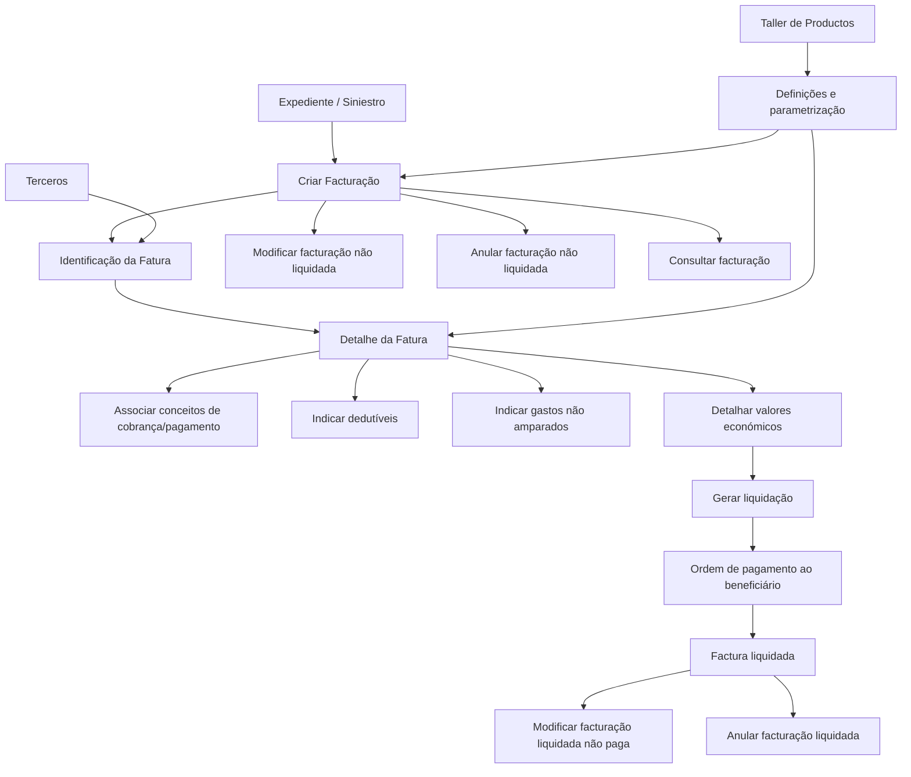

# Módulo de Faturação: Definições, Elementos, Parametrização e Operações de Fatura

## 1. Metadados do Documento
- **Arquivo de Origem:** `Não identificado — texto bruto fornecido pelo usuário`
- **Tipo de Documento:** `Manual Funcional / Apresentação de Módulo`
- **Domínio / Sistema:** `Módulo de Facturação para expedientes/sinistros`
- **Público-Alvo:** `Analistas funcionais, equipas de negócio, operação e configuradores do sistema`
- **Data/Versão Identificada:** `Não identificada`

---

## 2. Resumo Executivo & Contexto de Negócio

O documento descreve o módulo de **Facturação**, responsável por ordenar pagamentos ou cobranças para pessoas singulares ou coletivas que tenham participado num expediente, mediante o registo de uma fatura. Um exemplo indicado é a fatura emitida por um hospital. A criação de uma fatura implica a valoração do expediente; a modificação de uma fatura altera essa valoração; e a liquidação de uma fatura realiza uma liquidação associada ao expediente.

O módulo abrange as funcionalidades necessárias para processar pagamentos ou cobranças por meio de faturas. Uma fatura deve conter dados de identificação, detalhe económico e dados de liquidação. Os conceitos do detalhe da fatura são associados a conceitos de cobrança/pagamento para permitir a liquidação automática de um expediente.

A operação depende de definições prévias configuradas no **Taller de Productos**. O comportamento da aplicação é parametrizável, e as definições estão organizadas pelos níveis Comum, Geral, Setor e Ramo. Esses níveis abrangem, entre outros aspetos, controlo técnico, tipos de expediente, causas de processo, desagregação de conceitos de cobrança/pagamento, valores iniciais e restrições de autorização ou paralisação de operações.

Para que seja possível gerar uma liquidação, cada conceito da fatura deve possuir o respetivo valor económico detalhado. Além disso, tanto o fornecedor como o beneficiário devem estar previamente registados no sistema **Terceros**, incluindo os respetivos meios de contacto e meios de cobrança/pagamento.

O documento distingue ainda os **gastos não amparados**, que são conceitos não cobertos pela companhia e que não devem ser pagos ou reembolsados. O ciclo operacional da fatura inclui criação, modificação de faturas liquidadas ou não liquidadas, geração de liquidação, anulação e consulta, podendo as operações ser realizadas em linha ou de forma diferida.

---

## 3. Arquitetura, Componentes & Tecnologias Envolvidas

O conteúdo descreve componentes funcionais do módulo de Facturação, mas não especifica tecnologias de implementação, protocolos, bases de dados, APIs, métodos HTTP, URLs, ambientes técnicos ou contratos de integração.

| Componente / Sistema | Papel descrito no documento |
| :--- | :--- |
| Módulo de Facturação | Permite ordenar pagamentos ou cobranças por meio de faturas associadas a expedientes. |
| Fatura | Registo com identificação, detalhe económico e liquidação. |
| Expediente / Siniestro | Caso ao qual a fatura afeta e cuja valoração pode ser alterada pelas operações de faturação. |
| Taller de Productos | Origem das definições prévias que parametrizam o comportamento da aplicação. |
| Terceros | Sistema ou cadastro onde fornecedor e beneficiário devem estar registados, com dados de contacto e meios de cobrança/pagamento. |
| Conceitos de cobrança/pagamento | Conceitos associados ao detalhe da fatura para permitir liquidação automática do expediente. |
| Controlo técnico | Definições de erros, tipos de erro e condições para paralisar ou exigir autorização nas operações de faturação. |
| Liquidação | Ordem de pagamento gerada a partir das informações introduzidas na fatura. |



> **Nota de Análise:** O documento não detalha a arquitetura técnica interna do módulo de Facturação, nem métodos HTTP, contratos JSON, filas, serviços, bases de dados, mecanismos de autenticação ou integrações técnicas entre o módulo, Taller de Productos e Terceros.

---

## 4. Regras de Negócio, Especificações Funcionais & Processos

### 4.1 Finalidade da faturação

O módulo de Facturação permite ordenar o pagamento ou a cobrança a pessoas físicas ou jurídicas que tenham intervindo no expediente, por meio de uma fatura.

Exemplo indicado no documento: fatura de um hospital.

### 4.2 Efeito das operações no expediente

| Operação | Efeito indicado |
| :--- | :--- |
| Criar uma fatura | Valora o expediente. |
| Modificar uma fatura | Altera a valoração do expediente. |
| Liquidar uma fatura | Realiza uma liquidação ao expediente. |

### 4.3 Conceitos e detalhe da fatura

Os conceitos que podem constar nas faturas apresentadas por um segurado ou fornecedor devem ser definidos. Esses conceitos devem estar associados aos conceitos de cobrança/pagamento, permitindo realizar automaticamente a liquidação de um expediente.

Exemplo de fatura de Saúde:

| Nº | Detalhe da Fatura | Conceito de Cobrança/Pagamento |
| :--- | :--- | :--- |
| 1 | Medicinas | S01 — Indemnización Clínicas |
| 2 | Anestesia | S01 — Indemnización Clínicas |
| 3 | Quirófano | S01 — Indemnización Clínicas |
| 4 | Rayos X | S01 — Indemnización Clínicas |

### 4.4 Gastos não amparados

Os gastos não amparados são conceitos que a companhia não cobre e que, consequentemente, não serão pagos nem reembolsados.

Exemplos citados:
- Aluguer de televisão.
- Bombons.
- Outros conceitos equivalentes não cobertos.

### 4.5 Requisitos para gerar uma liquidação

Para gerar uma liquidação:

1. Cada conceito da fatura deve ter o seu valor económico detalhado.
2. A fatura deve identificar o expediente afetado.
3. A fatura deve identificar o fornecedor.
4. A fatura deve identificar o beneficiário.
5. O beneficiário deve estar registado em **Terceros**.
6. O fornecedor e o beneficiário devem estar registados no sistema com os respetivos meios de contacto e meios de cobrança/pagamento.
7. A informação introduzida deve permitir gerar uma ordem de pagamento para o beneficiário especificado.

### 4.6 Elementos obrigatórios ou mencionados da fatura

Uma fatura é composta por três grupos de elementos:

1. **Identificação**
2. **Detalhe da fatura**
3. **Liquidação**

#### Dados de identificação

A identificação da fatura deve incluir:

- Siniestro/expediente ao qual a fatura afeta.
- Fornecedor da fatura.
- Beneficiário da fatura.
- Registo do beneficiário em Terceros.
- Data estimada de pagamento.
- Moeda de pagamento.
- Outros dados não especificados no documento.

#### Detalhe da fatura

O detalhe da fatura deve identificar:

- Conceitos afetados pela fatura.
- Dedutíveis.
- Gastos não amparados.

#### Liquidação da fatura

A liquidação é gerada com base nas informações introduzidas na fatura e cria uma ordem de pagamento para pagar o beneficiário indicado.

### 4.7 Níveis de definição e parametrização

As definições de faturação estão organizadas nos níveis Comum, Geral, Setor e Ramo.

#### Nível Comum

O nível Comum inclui definições que não são exclusivas do módulo de sinistros, mas que são necessárias para efetuar a configuração.

| Elemento de definição | Regra ou finalidade |
| :--- | :--- |
| Controlo técnico | Definição de erros e tipos de erros. |

#### Nível Geral

O nível Geral inclui definições que afetam todos os possíveis expedientes de faturação.

| Elemento de definição | Regra ou finalidade |
| :--- | :--- |
| Tipo de expediente | Permite definir os tipos de danos que o módulo de Facturação poderá utilizar. |
| Causa de processo | Permite catalogar as causas dos gastos não amparados. |

#### Nível Setor

O nível Setor contém definições exclusivas para todos os ramos do setor que está a ser definido.

| Elemento de definição | Regra ou finalidade |
| :--- | :--- |
| Desglose concepto cobro pago factura | Determina a desagregação económica e o detalhe da fatura, por exemplo: medicinas, ressonância e honorários de anestesista. |
| Desglose por tipo factura y tipo de expediente | Determina, por tipo de fatura e tipo de expediente, qual desagregação económica ou detalhe de fatura é permitido. |

#### Nível Ramo

O nível Ramo contém definições exclusivas do ramo que está a ser configurado.

| Elemento de definição | Regra ou finalidade |
| :--- | :--- |
| Causa de processo | Permite catalogar, para cada ramo, as causas dos gastos não amparados para os quais se pretende realizar operações. Esses gastos não são cobertos. |
| Valores iniciais | Permite definir valores iniciais para atributos da fatura. |
| Controlo técnico | Define em que condições as operações de faturação podem ser paralisadas ou devem ser autorizadas. |

### 4.8 Operações de fatura

As operações sobre faturas podem ser realizadas tanto **em linha** como **de forma diferida**.

| Operação | Regra funcional |
| :--- | :--- |
| Criar facturação | Permite introduzir uma fatura. |
| Modificar facturação liquidada | Permite alterar informação de uma fatura liquidada e não paga, modificando a liquidação. |
| Modificar facturação não liquidada | Permite alterar informação de uma fatura ainda não liquidada. |
| Gerar liquidação de facturação | Permite criar uma liquidação a partir da informação introduzida na fatura. |
| Anular facturação liquidada | Permite anular uma fatura e a respetiva liquidação. |
| Anular facturação não liquidada | Permite anular uma fatura não liquidada. |
| Consultar facturação | Mostra toda a informação da fatura. |

---

## 5. Tabelas de Parâmetros, Ambientes e Estruturas de Dados

### 5.1 Dados e atributos de identificação

| Item / Parâmetro | Descrição / Função | Tipo / Valores / Formato | Ambiente / Observações |
| :--- | :--- | :--- | :--- |
| Siniestro / expediente | Identifica o expediente afetado pela fatura. | Não especificado | Obrigatório como dado de identificação segundo o documento. |
| Fornecedor da fatura | Identifica o fornecedor associado à fatura. | Não especificado | Deve estar registado em Terceros. |
| Beneficiário da fatura | Identifica quem receberá o pagamento. | Não especificado | Deve estar registado em Terceros. |
| Data estimada de pagamento | Indica a previsão de pagamento. | Data; formato não especificado | Mencionada como dado de identificação. |
| Moeda de pagamento | Indica a moeda aplicável ao pagamento. | Moeda; valores não especificados | Mencionada como dado de identificação. |
| Conceitos da fatura | Identificam os conceitos afetados pela fatura. | Lista de conceitos | Devem associar-se a conceitos de cobrança/pagamento. |
| Dedutíveis | Elementos a identificar no detalhe da fatura. | Não especificado | Sem regras de cálculo detalhadas. |
| Gastos não amparados | Conceitos não cobertos pela companhia. | Lista de causas/conceitos | Não são pagos nem reembolsados. |
| Valor económico por conceito | Valor necessário para gerar uma liquidação. | Valor económico; formato não especificado | Deve ser detalhado para cada conceito de fatura. |

### 5.2 Níveis de configuração

| Item / Parâmetro | Descrição / Função | Tipo / Valores / Formato | Ambiente / Observações |
| :--- | :--- | :--- | :--- |
| Nível Comum | Agrupa definições não exclusivas do módulo de sinistros, mas necessárias para a configuração. | Nível de definição | Inclui controlo técnico. |
| Nível Geral | Abrange definições aplicáveis a todos os expedientes de faturação. | Nível de definição | Inclui tipo de expediente e causa de processo. |
| Nível Setor | Agrupa definições exclusivas de todos os ramos do setor definido. | Nível de definição | Inclui desagregação económica da fatura. |
| Nível Ramo | Agrupa definições exclusivas do ramo definido. | Nível de definição | Inclui causas de gastos não amparados, valores iniciais e controlo técnico. |
| Tipo de expediente | Define os tipos de danos utilizáveis pelo módulo. | Não especificado | Configurado no nível Geral. |
| Causa de processo | Cataloga causas de gastos não amparados. | Não especificado | Presente nos níveis Geral e Ramo, com escopos distintos. |
| Valores iniciais | Define valores iniciais dos atributos da fatura. | Não especificado | Configurado no nível Ramo. |
| Controlo técnico | Define erros, tipos de erros e condições de paralisação/autorização. | Não especificado | Presente nos níveis Comum e Ramo. |

### 5.3 Ambientes, URLs, rotas e logs

| Item / Parâmetro | Descrição / Função | Tipo / Valores / Formato | Ambiente / Observações |
| :--- | :--- | :--- | :--- |
| Ambientes técnicos | Não detalhados no documento. | Não aplicável | Não são informados URLs, servidores, portas ou credenciais. |
| Rotas de log | Não detalhadas no documento. | Não aplicável | Não são informados caminhos, níveis ou formatos de log. |
| Interfaces técnicas | Não detalhadas no documento. | Não aplicável | Não são descritas APIs, mensagens ou contratos técnicos. |

---

## 6. Bateria de Perguntas & Respostas para RAG (FAQ Sintético)

### P1: Qual é a finalidade do módulo de Facturação?
**R:** O módulo de Facturação permite ordenar o pagamento ou a cobrança a pessoas físicas ou jurídicas que tenham intervindo num expediente, por meio de uma fatura. O documento apresenta como exemplo uma fatura emitida por um hospital.

### P2: O que acontece com o expediente quando uma fatura é criada, modificada ou liquidada?
**R:** Ao criar uma fatura, o expediente é valorado. Ao modificar uma fatura, a valoração do expediente é alterada. Ao liquidar uma fatura, é realizada uma liquidação associada ao expediente.

### P3: Quais são os elementos que compõem uma fatura?
**R:** Uma fatura é composta por identificação, detalhe da fatura e liquidação. A identificação inclui, entre outros dados, o expediente, o fornecedor, o beneficiário, a data estimada de pagamento e a moeda de pagamento. O detalhe identifica conceitos, dedutíveis e gastos não amparados. A liquidação gera uma ordem de pagamento ao beneficiário.

### P4: Quais dados devem ser identificados numa fatura?
**R:** A fatura deve identificar o siniestro ou expediente afetado, o fornecedor da fatura, o beneficiário, a data estimada de pagamento e a moeda de pagamento. O documento também indica que o beneficiário deve estar registado no sistema Terceros.

### P5: O que são gastos não amparados no módulo de Facturação?
**R:** Gastos não amparados são conceitos que a companhia não cobre, não paga e não reembolsa. O documento cita como exemplos o aluguer de televisão e bombons.

### P6: Que condição económica é necessária para gerar uma liquidação?
**R:** Para gerar uma liquidação, é necessário detalhar o valor económico de cada conceito da fatura. A liquidação é então criada com base nas informações introduzidas na fatura.

### P7: Qual é a relação entre o detalhe da fatura e os conceitos de cobrança/pagamento?
**R:** Os conceitos que podem constar nas faturas de segurados ou fornecedores devem estar associados a conceitos de cobrança/pagamento. Essa associação permite efetuar automaticamente a liquidação de um expediente.

### P8: Para que serve o sistema Terceros no processo de faturação?
**R:** O sistema Terceros deve conter o registo do fornecedor e do beneficiário da fatura, incluindo os seus meios de contacto e meios de cobrança/pagamento. Esse registo é necessário para realizar pagamentos e contactar as partes envolvidas.

### P9: Quais níveis de definição existem para a parametrização de faturação?
**R:** O documento define quatro níveis: Comum, Geral, Setor e Ramo. O nível Comum contém definições necessárias que não são exclusivas de sinistros; o Geral afeta todos os expedientes de faturação; o Setor contém definições para todos os ramos do setor; e o Ramo contém definições exclusivas do ramo configurado.

### P10: O que pode ser configurado no nível Setor?
**R:** No nível Setor, podem ser configurados o desglose do conceito de cobrança/pagamento da fatura e o desglose por tipo de fatura e tipo de expediente. Essas definições determinam o detalhe económico permitido, como medicinas, ressonância ou honorários de anestesista.

### P11: Qual é a finalidade do controlo técnico no nível Ramo?
**R:** No nível Ramo, o controlo técnico define em que condições as operações de faturação podem ser paralisadas ou necessitam de autorização. No nível Comum, o controlo técnico também contempla a definição de erros e tipos de erros.

### P12: É possível modificar uma fatura que já foi liquidada?
**R:** Sim. A operação “Modificar facturação liquidada” permite alterar as informações de uma fatura liquidada que ainda não tenha sido paga, modificando também a liquidação.

### P13: Quais operações podem ser realizadas sobre uma fatura?
**R:** Podem ser criadas faturas, modificadas faturas liquidadas ou não liquidadas, geradas liquidações, anuladas faturas liquidadas ou não liquidadas e consultadas todas as informações da fatura. As operações podem ser realizadas em linha ou de forma diferida.

---

## 7. Glossário de Termos, Siglas & Conceitos-Chave

- **Facturación / Facturação:** Módulo que permite ordenar pagamentos ou cobranças por meio de faturas associadas a um expediente.
- **Factura / Fatura:** Registo utilizado para ordenar pagamento ou cobrança, composto por identificação, detalhe e liquidação.
- **Expediente:** Caso afetado pela fatura e pela respetiva valoração ou liquidação.
- **Siniestro:** Termo apresentado em conjunto com “expediente” como elemento a identificar na fatura.
- **Liquidación / Liquidação:** Processo que cria uma ordem de pagamento com base nas informações introduzidas na fatura.
- **Beneficiario / Beneficiário:** Pessoa indicada para receber o pagamento da liquidação.
- **Proveedor / Fornecedor:** Entidade ou pessoa associada à emissão ou apresentação da fatura.
- **Terceros:** Sistema onde fornecedor e beneficiário devem estar registados, incluindo meios de contacto e meios de cobrança/pagamento.
- **Taller de Productos:** Origem das definições prévias que parametrizam o comportamento da aplicação.
- **Concepto Cobro Pago:** Conceito de cobrança/pagamento ao qual o detalhe da fatura é associado para permitir liquidação automática.
- **Desglose:** Desagregação económica ou detalhe da fatura.
- **Gastos no amparados:** Conceitos que a companhia não cobre, não paga e não reembolsa.
- **Deducibles / Dedutíveis:** Elementos que devem ser identificados no detalhe da fatura; o documento não especifica regras de cálculo.
- **Control técnico / Controlo técnico:** Definições relacionadas com erros, tipos de erros e condições de paralisação ou autorização de operações.
- **Ramo:** Nível de definição com configurações exclusivas do ramo que está a ser definido.
- **Sector / Setor:** Nível de definição aplicável a todos os ramos do setor configurado.

---

## 8. Notas Críticas, Riscos & Limitações

- O documento não apresenta tecnologias, versões, linguagens, protocolos, bases de dados, APIs, URLs, ambientes, servidores, portas ou rotas de logs.
- O documento não detalha os campos completos da fatura, os formatos de dados, obrigatoriedades técnicas, regras de cálculo, moedas permitidas ou validações de montantes.
- O documento lista dedutíveis como parte do detalhe da fatura, mas não define como devem ser calculados, aplicados ou validados.
- O documento informa que os conceitos de fatura são associados a conceitos de cobrança/pagamento, mas não detalha o mecanismo de associação, as chaves de mapeamento ou os critérios de seleção.
- O documento menciona que o comportamento do módulo depende de definições prévias no Taller de Productos, mas não apresenta o processo operacional de criação, publicação, aprovação ou manutenção dessas definições.
- O documento indica que fornecedor e beneficiário precisam de registo em Terceros, mas não descreve validações cadastrais, integração técnica ou tratamento de falhas de cadastro.
- O documento especifica que operações podem ocorrer em linha ou de forma diferida, mas não descreve critérios de escolha, agendamento, processamento assíncrono ou monitorização.
- **Nota de Análise:** O documento apresenta o módulo de Facturação principalmente numa perspetiva funcional e configuracional; não há detalhamento adicional de arquitetura de software ou operação técnica.

---

## 9. Conteúdo Bruto Estruturado (Referência Fiel)

```text
--- [PÁGINA 1 DE 6] ---

INTRODUCCIÓN - Módulo Facturación
OBJETIVO
La finalidad de este módulo es poder ordenar el pago/cobro a personas físicas o jurídicas que
hayan intervenido en el expediente, a través de una factura, por ejemplo factura de un hospital.
Cuando creamos una factura, valoramos el expediente, cuando modificamos una factura, cambiamos
la valoración, cuando liquidamos una factura, realizamos una liquidación al expediente.
Concepto
Detalle de la factura
Gastos no Amparados
Características
Elementos de una factura
Definiciones de Factura
Operaciones de Factura
Conceptos
Detalle de Factura
 /
 RS
Inicio Soluciones APIs Documentación Zeus
ES


--- [PÁGINA 2 DE 6] ---

Se definirán los conceptos que pueden tener las facturas que presente un asegurado o un proveedor.
Estos conceptos estarán unidos a los conceptos de pago para poder realizar una liquidación de un
expediente automáticamente.
Ejemplo factura de Salud:
Detalle de la Factura | Concepto Cobro Pago
1 Medicinas | S01 Indemnización Clínicas
2 Anestesia | S01 Indemnización Clínicas
3 Quirófano | S01 Indemnización Clínicas
4 Rayos X | S01 Indemnización Clínicas
Gastos no amparados
Son aquellos conceptos que la compañía no cubre, no va a pagar, ni reembolsar. Ejemplo:
Alquiler de Televisión
Bombones
Etc.
Características
Cubre todas las funcionalidades de la facturación
Este módulo, contiene todas las funcionalidades necesarias para ordenar el pago o el cobro a
una persona física o jurídica a través de una factura.
Parametrizable
El módulo es parametrizable y el comportamiento de la aplicación depende de las definiciones
previas (Taller de Productos).
Importes económicos
Para poder generar una liquidación, se ha de detallar el importe de cada concepto de factura.
Registro de Beneficiario
Para introducir los datos de una factura tanto el proveedor como el beneficiario de la misma,
tienen que estar registrados en el sistema (Terceros), con sus medios de contacto, sus medios


--- [PÁGINA 3 DE 6] ---

de cobro / pago, para poder realizar pagos y para poder contactar con ellos.
Elementos de la Facturación
Una factura está compuesta de varios elementos:
FACTURACIÓN
IDENTIFICACIÓN DETALLE DE LA
FACTURA LIQUIDACIÓN
Datos Identificación
Se tiene que identificar:
Siniestro/expediente al que afecta la factura
Proveedor de la Factura
Beneficiario de la Factura (Tiene que estar registrado en Terceros)
Fecha estimada de pago
Moneda de pago
Etc.
Detalle de la Factura
Se tendrá que identificar los conceptos a los que afecta la factura, los deducibles y los gastos no
amparados.
Liquidación de la Factura
Con la información introducida se generará una orden de pago, liquidación para pagar al beneficiario
especificado.
Definiciones de Facturación
Los elementos de definición atienden a distintos niveles:
NIVELES DE DEFINICIÓN
COMÚN GENERAL SECTOR RAMO


--- [PÁGINA 4 DE 6] ---

COMÚN
En este nivel se encuentran definiciones que NO son exclusivas del
módulo de siniestros, pero son necesarias para poder realizar la
definición. Entre otras definiciones se encuentra:
CONTROL TÉCNICO
Definición de errores, tipos de Errores
GENERAL
En este nivel se encuentran definiciones que afectarán a todos los
posibles expedientes de facturación
TIPO EXPEDIENTE
Permite definir los Tipos de Daños que va a
poder utilizar el módulo de facturación
CAUSA PROCESO
Permite catalogar los causas de los gastos no
amparados
SECTOR
Son exclusivas para todos los ramos del sector que se está definiendo
DESGLOSE CONCEPTO COBRO PAGO
FACTURA
Determinar el desglose económico, el detalle
de la factura . Por ejemplo medicinas,
resonancia, honorarios anestesista...
DESGLOSE POR TIPO FACTURA Y TIPO
DE EXPEDIENTE
Determina por tipo de factura y tipo de
expediente, que desglose económico es
permitido, el detalle de la factura . Por
ejemplo medicinas, resonancia, honorarios
anestesista...


--- [PÁGINA 5 DE 6] ---

RAMO
Son exclusivas del ramo que se está definiendo
CAUSA PROCESO
Permite catalogar las causas de gastos no
amparados por los que se quiere realizar las
operaciones para cada ramo. Estos son
gastos que no se cubren
VALORES INICIALES
Permite definir valores iniciales para atributos
de la factura
CONTROL TÉCNICO
Definir en qué condiciones se puede paralizar
las operaciones de la facturación u obligación
de ser autorizada
Operaciones de Factura
FACTURA
Operaciones que se pueden realizar con las facturas, se pueden realizar
tanto en línea como diferido
CREAR facturación
Permite ingresar una factura
MODIFICAR facturación liquidada
Permite cambiar información de factura
liquidada no pagada, modificando la
liquidación
MODIFICAR facturación no liquidada
Permite cambiar información de una factura
GENERAR liquidación facturación
Permite crear una liquidación a partir de la
información introducida en la factura


--- [PÁGINA 6 DE 6] ---

ANULAR facturación liquidada
Permite anular una factura y su liquidación
ANULAR facturación no liquidada
Permite anular una factura
CONSULTAR facturación
Se muestra toda la información de la factura
```
