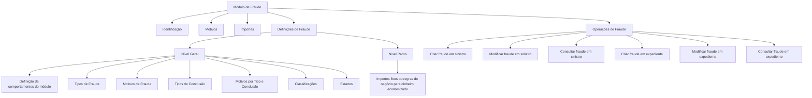

# Módulo de Fraude: Registro, Acompanhamento, Definições e Operações

## 1. Metadados do Documento
- **Arquivo de Origem:** `Não informado`
- **Tipo de Documento:** Apresentação Executiva
- **Domínio / Sistema:** Módulo de Fraude para seguros
- **Público-Alvo:** Negócio, analistas funcionais, operação e equipes responsáveis pela configuração do módulo
- **Data/Versão Identificada:** Não identificada

---

## 2. Resumo Executivo & Contexto de Negócio

O documento apresenta um módulo corporativo destinado ao registro e acompanhamento de possíveis fraudes em operações de seguros. A finalidade declarada é permitir o controle do ciclo de vida de uma suspeita de fraude, desde a identificação inicial envolvendo um segurado, fornecedor ou outro participante até a resolução completa do caso.

O módulo busca reduzir o impacto negativo para a companhia decorrente da ausência de acompanhamento de fraudes. O escopo funcional inclui elementos de identificação, motivos, importes, classificações, estados, conclusões e operações de criação, modificação e consulta.

O módulo possui caráter aberto e suporta múltiplos tipos de negócio de seguros, incluindo Automóvel e Saúde, além de outros ramos não especificados. A configuração por catálogos permite definir o comportamento e as características aplicáveis ao módulo.

As definições de fraude são organizadas em níveis Geral e Ramo. O nível Geral abrange definições comuns a todos os ramos, enquanto o nível Ramo contempla definições específicas, incluindo importes fixos ou regras de negócio para cálculo de dinheiro economizado.

---

## 3. Arquitetura, Componentes & Tecnologias Envolvidas

O documento não descreve arquitetura técnica de software, tecnologias, APIs, bancos de dados, ambientes, protocolos, contratos HTTP ou integrações entre sistemas. O conteúdo apresenta uma arquitetura funcional do módulo de Fraude.

### Componentes funcionais identificados

| Componente | Descrição |
| :--- | :--- |
| Módulo de Fraude | Módulo para registrar e acompanhar possíveis fraudes até a resolução. |
| Identificação do Fraude | Elemento que relaciona a fraude a sinistro ou expediente pendente e registra tipo, classificação, estado e conclusão. |
| Motivos do Fraude | Elemento que contém as razões associadas à fraude. |
| Importes do Fraude | Elemento que contempla importe de honorários e importe economizado. |
| Definições Gerais | Definições aplicáveis a todos os ramos de seguros. |
| Definições por Ramo | Definições específicas por ramo, incluindo importes fixos ou regras de negócio para cálculo de dinheiro economizado. |
| Catálogos | Mecanismo de configuração do comportamento e das características do módulo. |
| Operações de Fraude | Operações para criar, modificar e consultar fraudes associadas a sinistros ou expedientes. |



> **Nota de Análise:** O documento não detalha a implementação técnica do módulo, nem identifica microsserviços, métodos HTTP, contratos JSON, URLs, logs, servidores ou mecanismos de persistência.

---

## 4. Regras de Negócio, Especificações Funcionais & Processos

### 4.1 Finalidade do módulo

O módulo permite registrar todos os possíveis casos de fraude. O documento afirma que, sem acompanhamento, a companhia poderia ser prejudicada. O registro é iniciado quando existe suspeita de fraude associada, por exemplo, a um segurado ou fornecedor, e permanece em acompanhamento até a resolução completa.

### 4.2 Abrangência de negócios

O módulo possui caráter aberto e permite trabalhar com múltiplos tipos de negócio de seguros. Os exemplos explicitamente citados são:

- Automóvel.
- Saúde.
- Outros tipos de seguro não detalhados.

### 4.3 Configurabilidade

O comportamento e as características do módulo de fraude podem ser definidos mediante catálogos. O documento não especifica quais catálogos existem, como são mantidos ou quais permissões são necessárias para sua alteração.

### 4.4 Elementos de um fraude

Um fraude é composto pelos seguintes elementos:

1. **Identificação**
   - Sinistro ou expediente pendente afetado pela fraude.
   - Tipo de fraude.
   - Classificação da fraude.
   - Estado da fraude.
   - Conclusão da fraude.
   - Outros dados não detalhados no documento.

2. **Motivos**
   - Razões associadas à fraude.

3. **Importes**
   - Importe de honorários.
   - Importe economizado.

### 4.5 Níveis de definição

As definições de fraude atendem a dois níveis:

- **Geral:** definições para todos os ramos.
- **Ramo:** definições específicas por ramo.

### 4.6 Definições gerais

As definições gerais incluem:

- Definição de comportamentos do módulo.
- Tipos de fraude.
- Motivos de fraude.
- Tipos de conclusão.
- Motivos de fraude por tipos de conclusão.
- Classificação dos fraudes.
- Estados possíveis do fraude.

### 4.7 Exemplos de valores de definição

O documento apresenta os seguintes exemplos:

- **Tipos de fraude:** fraude identificado sem provas, fraude parcial, fraude confirmado.
- **Motivos de fraude:** delinquência organizada; reclama valor superior ao autorizado; reclama os mesmos danos; reclama lesões fora do acidente.
- **Tipos de conclusão:** procedente; rejeitado.
- **Classificação:** fraude doloso; fraude ocasional.
- **Estados:** atribuído; revisão; revisão D.I.S.M.A.

### 4.8 Definições por ramo

No nível de ramo, o documento descreve a configuração de importes por meio de:

- Importes fixos.
- Regras de negócio para calcular dinheiro economizado.

> **Nota de Análise:** O documento não detalha fórmulas, campos de entrada, critérios de cálculo, moeda, arredondamento ou regras de precedência para o cálculo do importe economizado.

### 4.9 Operações funcionais

| Operação | Entidade associada | Regra funcional descrita |
| :--- | :--- | :--- |
| Criar fraude em sinistro | Sinistro | Permite registrar um fraude em um sinistro. |
| Modificar fraude em sinistro | Sinistro | Permite modificar a informação de fraude de um sinistro. |
| Consultar fraude em sinistro | Sinistro | Mostra toda a informação de um fraude associado a um sinistro. |
| Criar fraude em expediente | Expediente | Permite registrar um fraude em um expediente. |
| Modificar fraude em expediente | Expediente | Permite modificar a informação de fraude de um expediente. |
| Consultar fraude em expediente | Expediente | Mostra toda a informação de um fraude associado a um expediente. |

---

## 5. Tabelas de Parâmetros, Ambientes e Estruturas de Dados

| Item / Parâmetro | Descrição / Função | Tipo / Valores / Formato | Ambiente / Observações |
| :--- | :--- | :--- | :--- |
| Fraude | Registro de possível fraude submetido a acompanhamento até a resolução. | Entidade funcional | Pode envolver segurado, fornecedor ou outro caso não detalhado. |
| Sinistro / expediente pendente | Registro que será afetado pela fraude. | Referência de identificação | O documento não especifica a estrutura ou identificador. |
| Tipo de fraude | Define o tipo atribuído ao fraude. | Exemplos: identificado sem provas; parcial; confirmado | Definição geral. |
| Motivo de fraude | Define a razão associada ao fraude. | Exemplos: delinquência organizada; valor superior ao autorizado; mesmos danos; lesões fora do acidente | Definição geral. |
| Classificação de fraude | Classifica a natureza do fraude. | Exemplos: fraude doloso; fraude ocasional | Definição geral. |
| Estado de fraude | Indica a situação do fraude no processo. | Exemplos: atribuído; revisão; revisão D.I.S.M.A. | Definição geral. |
| Conclusão de fraude | Registra o resultado ou desfecho da análise. | Exemplos: procedente; rejeitado | Definição geral. |
| Motivos por tipo e conclusão | Relaciona motivos de fraude a tipos de conclusão. | Não detalhado | Definição geral. |
| Importe de honorários | Valor relacionado a honorários. | Valor monetário não especificado | Componente de importes. |
| Importe economizado | Valor economizado em decorrência do fraude. | Valor monetário não especificado | Pode ser fixo ou calculado por regra de negócio por ramo. |
| Catálogos | Permitem configurar comportamento e características do módulo. | Estrutura não detalhada | Não há informação sobre manutenção ou permissões. |
| Ramo | Nível de definição específico para uma linha de seguro. | Automóvel, Saúde e outros não detalhados | Utilizado para definições por ramo. |
| Ambiente | Não informado. | Não aplicável | O documento não fornece URLs, servidores ou ambientes. |
| Tecnologia | Não informada. | Não aplicável | O documento não identifica linguagens, plataformas ou integrações. |

---

## 6. Bateria de Perguntas & Respostas para RAG (FAQ Sintético)

### P1: Qual é a finalidade do módulo de Fraude?
**R:** O módulo de Fraude permite registrar e acompanhar possíveis fraudes para evitar prejuízos à companhia. O acompanhamento começa quando existe suspeita de fraude, por exemplo relacionada a um segurado ou fornecedor, e permanece até a resolução completa do caso.

### P2: Quais tipos de seguros podem utilizar o módulo de Fraude?
**R:** O documento informa que o módulo tem caráter aberto e permite trabalhar com múltiplos tipos de negócio de seguros. Automóvel e Saúde são citados como exemplos; outros ramos podem ser suportados, mas não são especificados.

### P3: Quais elementos compõem um registro de fraude?
**R:** Um registro de fraude é composto por identificação, motivos e importes. A identificação contempla sinistro ou expediente pendente afetado, tipo de fraude, classificação, estado e conclusão. Os importes incluem importe de honorários e importe economizado.

### P4: O que deve ser identificado em um fraude?
**R:** A identificação do fraude deve registrar o sinistro ou expediente pendente que será afetado, o tipo de fraude, a classificação, o estado, a conclusão e outros dados não detalhados pelo documento.

### P5: Quais são os níveis de definição do módulo de Fraude?
**R:** O módulo possui dois níveis de definição: Geral e Ramo. O nível Geral contém definições para todos os ramos; o nível Ramo contém definições específicas, incluindo importes fixos ou regras de negócio para calcular dinheiro economizado.

### P6: Quais exemplos de tipos de fraude são apresentados?
**R:** O documento apresenta como exemplos de tipos: fraude identificado sem provas, fraude parcial e fraude confirmado.

### P7: Quais exemplos de motivos de fraude são mencionados?
**R:** São mencionados delinquência organizada, reclamação de valor superior ao autorizado, reclamação dos mesmos danos e reclamação de lesões fora do acidente.

### P8: Quais classificações de fraude são citadas?
**R:** O documento cita fraude doloso e fraude ocasional como exemplos de classificação dos fraudes.

### P9: Quais estados de fraude são apresentados?
**R:** Os estados apresentados são atribuído, revisão e revisão D.I.S.M.A. O documento não descreve transições, responsáveis, condições de entrada ou saída desses estados.

### P10: Como o módulo trata o importe economizado?
**R:** No nível de definições por ramo, o importe economizado pode ser definido por importes fixos ou por regras de negócio para calcular o dinheiro economizado. O documento não fornece a fórmula ou os critérios de cálculo.

### P11: Quais operações podem ser executadas para uma fraude associada a um sinistro?
**R:** Para um sinistro, o módulo permite criar fraude, modificar as informações de fraude e consultar todas as informações do fraude associado ao sinistro.

### P12: Quais operações podem ser executadas para uma fraude associada a um expediente?
**R:** Para um expediente, o módulo permite criar fraude, modificar as informações de fraude e consultar todas as informações do fraude associado ao expediente.

---

## 7. Glossário de Termos, Siglas & Conceitos-Chave

- **Fraude:** Possível caso de fraude que deve ser registrado e acompanhado até sua resolução.
- **Sinistro:** Registro relacionado a uma ocorrência de seguro e que pode ser afetado por um fraude.
- **Expediente:** Registro ou processo que pode ser afetado por um fraude.
- **Ramo:** Nível de negócio ou linha de seguro para a qual podem existir definições específicas.
- **Catálogo:** Mecanismo mencionado para definir o comportamento e as características do módulo.
- **Importe de honorários:** Valor relacionado a honorários no contexto do fraude.
- **Importe economizado:** Valor economizado, definido por importe fixo ou regra de negócio por ramo.
- **Conclusão:** Resultado atribuído ao fraude, com exemplos de procedente e rejeitado.
- **D.I.S.M.A.:** Sigla apresentada como parte do estado “revisão D.I.S.M.A.”; o documento não define seu significado.

---

## 8. Notas Críticas, Riscos & Limitações

- O documento não identifica arquivo de origem, data, versão, autor, sistema corporativo ou responsável pelo módulo.
- Não há descrição de arquitetura de software, componentes técnicos, integrações, APIs, bancos de dados, tecnologias, URLs, ambientes, servidores ou rotas de logs.
- O documento lista operações de criar, modificar e consultar, mas não detalha permissões, perfis de acesso, trilha de auditoria, validações, mensagens de erro ou fluxos de aprovação.
- Não são descritas regras de transição entre os estados atribuído, revisão e revisão D.I.S.M.A.
- Não há detalhamento da relação entre tipo de fraude, motivo, classificação, conclusão e estado.
- O cálculo do importe economizado é mencionado, mas fórmulas, campos de entrada, moeda e critérios de cálculo não são informados.
- A sigla D.I.S.M.A. não é definida no conteúdo fornecido.
- Não há detalhamento adicional para os exemplos de Automóvel, Saúde ou demais ramos suportados.

---

## 9. Conteúdo Bruto Estruturado (Referência Fiel)

```text
--- [PÁGINA 1 DE 4] ---

INTRODUCIR - Fraude
OBJETIVO
La finalidad de este módulo es poder registrar todos los posibles fraudes, que si no se realiza un
seguimiento la compañía saldría perjudicada. Se registra desde que se sospecha el posible fraude de
un asegurado o de un proveedor etc, hasta su completa resolución.
Características
Elementos de un Fraude
Definiciones de Fraude
Operaciones de Fraude
Características
Múltiples tipos de negocio
El carácter abierto del módulo facilita la posibilidad de trabajar seguros del tipo:
Automóvil
Salud
Etc.
 / 
 RS
Inicio Soluciones APIs Documentación Zeus
ES


--- [PÁGINA 2 DE 4] ---

Configurable
Mediante catálogos vamos a poder definir el comportamiento y las características que le vamos a
dar al modulo de Juicios.
Cubre todas las funcionalidades de los fraudes
Este módulo, contiene todas las funcionalidades necesarias para registrar y realizar un
seguimiento de los fraudes .
Elementos de un Fraude
Un fraude está compuesto de varios elementos
FRAUDE
IDENTIFICACIÓN MOTIVOS IMPORTES
Identificación del Fraude
En este elemento del fraude se deberá identificar:
Siniestro/expediente pendiente, al que va afectar el fraude
Tipo de Fraude
Clasificación del Fraude
Estado del Fraude
Conclusión del Fraude
Etc.
Motivos del Fraude
Este elemento contiene cuales son las razones del Fraude.
Importes del Fraude
Importe honorarios
Importe ahorrado
Definiciones de Fraude
Los elementos de definición atienden a distintos niveles:


--- [PÁGINA 3 DE 4] ---

NIVELES DE DEFINICIÓN
GENERAL RAMO
GENERAL
Definiciones para todos los Ramos
FRAUDE DEFINICIÓN
Definición de comportamientos del módulo
TIPOS
Tipos de Fraude: Fraude identificado sin
pruebas, Fraude parcial, Fraude Confirmado...
MOTIVOS
Motivos del Fraude: Delincuencia organizada,
Reclama monto superior al autorizado,
Reclama los mismos daños, Reclama
lesiones fuera del accidente...
CONCLUSIÓN
Tipo de Conclusión: Procedente, Rechazado
MOTIVOS POR TIPO Y CONCLUSIÓN
Motivos de Fraude por tipos de conclusión
CLASIFICACIÓN
Clasificación de los fraudes: fraude doloso,
fraude ocasional
ESTADOS
Estado en el que se puede encontrar el
Fraude: asignado, revisión, revisión
D.I.S.M.A.,
RAMO


--- [PÁGINA 4 DE 4] ---

Definiciones por Ramos
IMPORTES
Importes fijos o reglas de negocio para calcular dinero ahorrado
Operaciones de Fraude
FRAUDE
Operaciones de FRAUDE
CREAR fraude siniestro
Permite registrar un Fraude en un siniestro
MODIFICAR fraude siniestro
Permite modificar la información de Fraude de
un siniestro
CREAR fraude expediente
Permite registrar un Fraude en un expediente
MODIFICAR fraude expediente
Permite modificar la información de Fraude de
un expediente
CONSULTAR fraude siniestro
Muestra toda la información de un Fraude
asociado a un siniestro
CONSULTAR fraude expediente
Muestra toda la información de un Fraude
asociado a un expediente
```
