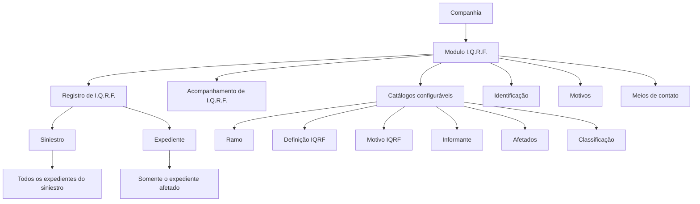
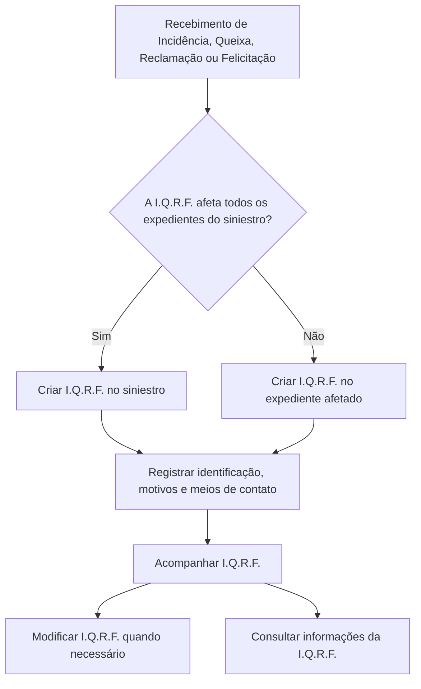

# Módulo I.Q.R.F. — Registro e Acompanhamento de Incidências, Queixas, Reclamações e Felicitações

## 1. Metadados do Documento
- **Arquivo de Origem:** `Não informado`
- **Tipo de Documento:** `Apresentação Executiva / Manual Funcional resumido`
- **Domínio / Sistema:** `Módulo I.Q.R.F.`
- **Público-Alvo:** `Negócio, analistas funcionais, operação e equipes de desenvolvimento`
- **Data/Versão Identificada:** `Não identificada`

---

## 2. Resumo Executivo & Contexto de Negócio

O módulo I.Q.R.F. tem como finalidade registrar todas as Incidências, Queixas, Reclamações e Felicitações recebidas pela companhia. O registro permite que cada ocorrência seja avaliada e que a companhia possa atuar quando necessário.

O módulo possui caráter aberto e suporta múltiplos tipos de negócio, incluindo seguros de Automóvel e Saúde, entre outros. A apresentação informa que o comportamento e as características do módulo são configuráveis por meio de catálogos.

O módulo I.Q.R.F. concentra funcionalidades para registrar e acompanhar ocorrências. Uma I.Q.R.F. pode ser associada a um siniestro ou a um expediente. Quando a ocorrência afeta todos os expedientes de um siniestro, o registro pode ocorrer no nível do siniestro; quando afeta somente um expediente, a I.Q.R.F. é associada ao expediente afetado.

A estrutura funcional de uma I.Q.R.F. é composta por identificação, motivos e meios de contato. Existem também definições configuráveis para ramo, atributos da I.Q.R.F., motivos, informantes, afetados e classificação.

---

## 3. Arquitetura, Componentes & Tecnologias Envolvidas

O documento não descreve arquitetura técnica de software, APIs, tecnologias, protocolos, bancos de dados, ambientes ou integrações entre sistemas. O conteúdo apresenta a estrutura funcional do módulo I.Q.R.F. e suas relações com siniestros, expedientes, ramos e catálogos de definição.

### Componentes funcionais identificados

| Componente | Função descrita |
| :--- | :--- |
| Módulo I.Q.R.F. | Registra e permite acompanhamento de Incidências, Queixas, Reclamações e Felicitações. |
| I.Q.R.F. | Ocorrência composta por identificação, motivos e meios de contato. |
| Siniestro | Entidade à qual uma I.Q.R.F. pode ser registrada ou consultada. |
| Expediente | Entidade à qual uma I.Q.R.F. pode ser registrada ou consultada. |
| Catálogos | Mecanismo utilizado para definir comportamento e características do módulo I.Q.R.F. |
| Ramo | Nível de definição que permite configurações diferentes por ramo. |
| Definição IQRF | Define valores padrão e validações dos atributos da I.Q.R.F. |
| Motivo IQRF | Define motivos de uma Incidência, Queixa, Reclamação ou Felicitação. |
| Informante | Define possíveis informantes de uma I.Q.R.F. |
| Afetados | Define possíveis afetados por uma I.Q.R.F. |
| Classificação | Define a classificação de uma I.Q.R.F. |
| Meios de contato | Armazena contatos dos envolvidos quando esses contatos não estiverem registrados. |



> **Nota de Análise:** O documento não detalha métodos HTTP, contratos JSON, persistência de dados, autenticação, fluxos de integração, tecnologias utilizadas ou responsabilidades de microsserviços.

---

## 4. Regras de Negócio, Especificações Funcionais & Processos

### 4.1 Finalidade do módulo

O módulo I.Q.R.F. deve permitir o registro de todas as Incidências, Queixas, Reclamações e Felicitações que cheguem à companhia. As ocorrências registradas devem poder ser avaliadas para permitir atuação quando necessária.

### 4.2 Abrangência de negócio

O módulo I.Q.R.F. possui caráter aberto para atender múltiplos tipos de negócio de seguros. Os exemplos explicitamente apresentados são:

- Automóvel;
- Saúde;
- Outros tipos de seguro não especificados.

### 4.3 Configurabilidade

O comportamento e as características atribuídas ao módulo I.Q.R.F. são definidos por meio de catálogos. O documento não especifica os mecanismos técnicos, telas, permissões ou procedimentos necessários para administrar esses catálogos.

### 4.4 Associação da I.Q.R.F. a siniestro ou expediente

Uma I.Q.R.F. pode ser associada a um siniestro ou a um expediente.

| Condição funcional | Regra de associação |
| :--- | :--- |
| I.Q.R.F. afeta todos os expedientes de um siniestro | A I.Q.R.F. pode ser registrada no nível do siniestro. |
| I.Q.R.F. afeta somente um expediente | A I.Q.R.F. deve ser associada somente ao expediente afetado. |
| Registro de ocorrência em siniestro | Deve ser utilizada a operação de criação de I.Q.R.F. para siniestro. |
| Registro de ocorrência em expediente | Deve ser utilizada a operação de criação de I.Q.R.F. para expediente. |

### 4.5 Elementos de uma I.Q.R.F.

Uma I.Q.R.F. é composta pelos seguintes elementos:

1. **Identificação**
2. **Motivos**
3. **Meios de contatos**

#### Identificação da I.Q.R.F.

A identificação de uma I.Q.R.F. deve incluir os itens apresentados no documento:

- Siniestro ou expediente pendente que será afetado pela I.Q.R.F.;
- Tipo de I.Q.R.F.;
- Estado da I.Q.R.F.;
- Data de abertura;
- Afetado pela I.Q.R.F.;
- Resolução;
- Outros elementos não detalhados, indicados pelo termo “Etc.”.

#### Motivos da I.Q.R.F.

O elemento de motivos contém as razões da I.Q.R.F.

#### Meios de contato dos envolvidos

O elemento de meios de contato contém os contatos dos envolvidos pela I.Q.R.F. quando esses contatos ainda não estiverem registrados.

### 4.6 Níveis de definição

Os elementos de definição da I.Q.R.F. atendem a distintos níveis.

| Nível / Elemento de definição | Regra ou finalidade descrita |
| :--- | :--- |
| Ramo | Permite definições diferentes por ramo. |
| Definição IQRF | Define valores padrão e validações dos atributos da I.Q.R.F. |
| I.Q.R.F. | Aplica definições para todos os ramos, sem distinção. |
| Motivo IQRF | Define os motivos de uma Incidência, Queixa, Reclamação ou Felicitação. |
| Informante | Define os possíveis informantes de uma Incidência, Queixa, Reclamação ou Felicitação. |
| Afetados | Define os possíveis afetados por uma Incidência, Queixa, Reclamação ou Felicitação. |
| Classificação | Define a classificação de uma Incidência, Queixa, Reclamação ou Felicitação. |

### 4.7 Operações funcionais disponíveis

| Operação | Entidade | Comportamento descrito |
| :--- | :--- | :--- |
| Criar IQRF siniestro | Siniestro | Permite registrar uma Incidência, Queixa, Reclamação ou Felicitação em um siniestro. |
| Modificar IQRF siniestro | Siniestro | Permite alterar uma Incidência, Queixa, Reclamação ou Felicitação em siniestros. |
| Criar IQRF expediente | Expediente | Permite registrar uma Incidência, Queixa, Reclamação ou Felicitação em um expediente. |
| Modificar IQRF expediente | Expediente | Permite alterar uma Incidência, Queixa, Reclamação ou Felicitação em um expediente. |
| Consultar IQRF siniestro | Siniestro | Exibe todas as informações de I.Q.R.F. de um siniestro. |
| Consultar IQRF expediente | Expediente | Exibe todas as informações de I.Q.R.F. de um expediente. |



> **Nota de Análise:** O documento não apresenta regras sobre transição de estados, critérios de resolução, prazos, responsáveis, notificações, anexos, trilha de auditoria ou validações específicas dos atributos de I.Q.R.F.

---

## 5. Tabelas de Parâmetros, Ambientes e Estruturas de Dados

### 5.1 Atributos identificados para I.Q.R.F.

| Item / Parâmetro | Descrição / Função | Tipo / Valores / Formato | Ambiente / Observações |
| :--- | :--- | :--- | :--- |
| Siniestro / expediente pendente | Identifica o siniestro ou expediente que será afetado pela I.Q.R.F. | Não especificado | Item da identificação da I.Q.R.F. |
| Tipo de I.Q.R.F. | Identifica o tipo da ocorrência. | Incidência, Queixa, Reclamação ou Felicitação | O documento não detalha códigos ou catálogo de valores. |
| Estado da I.Q.R.F. | Identifica o estado da ocorrência. | Não especificado | O documento não informa estados possíveis nem transições. |
| Data de abertura | Registra a data de abertura da I.Q.R.F. | Data; formato não especificado | Item da identificação da I.Q.R.F. |
| Afetado por I.Q.R.F. | Identifica o afetado pela ocorrência. | Não especificado | Relacionado à definição de possíveis afetados. |
| Resolução | Registra a resolução da I.Q.R.F. | Não especificado | O documento não estabelece critérios ou fluxo de resolução. |
| Motivos | Registra as razões da I.Q.R.F. | Não especificado | Relacionado à definição de motivos. |
| Meios de contato | Registra contatos dos envolvidos quando não estiverem previamente cadastrados. | Não especificado | Não são descritos canais, formatos ou obrigatoriedade. |

### 5.2 Configurações e catálogos

| Item / Parâmetro | Descrição / Função | Tipo / Valores / Formato | Ambiente / Observações |
| :--- | :--- | :--- | :--- |
| Catálogos | Definem comportamento e características do módulo I.Q.R.F. | Não especificado | O documento não identifica catálogo técnico, interface ou responsável. |
| Ramo | Permite definições diferentes por ramo. | Exemplos de negócio: Automóvel e Saúde | Outros ramos podem existir, mas não foram listados. |
| Definição IQRF | Define valores padrão e validações dos atributos da I.Q.R.F. | Não especificado | Não há lista de atributos, valores padrão ou validações. |
| Motivo IQRF | Define motivos de Incidência, Queixa, Reclamação ou Felicitação. | Não especificado | Não há relação de motivos. |
| Informante | Define possíveis informantes da ocorrência. | Não especificado | Não há relação de informantes. |
| Afetados | Define possíveis afetados da ocorrência. | Não especificado | Não há relação de afetados. |
| Classificação | Define classificação da ocorrência. | Não especificado | Não há categorias ou critérios de classificação. |

### 5.3 Ambientes, URLs, logs e infraestrutura

| Item / Parâmetro | Descrição / Função | Tipo / Valores / Formato | Ambiente / Observações |
| :--- | :--- | :--- | :--- |
| Ambientes | Não identificados no documento. | Não aplicável | Não há referência a desenvolvimento, homologação, produção ou outros ambientes. |
| URLs | Não identificadas no documento. | Não aplicável | Não há URLs de aplicações, APIs ou portais. |
| Logs | Não identificados no documento. | Não aplicável | Não há rotas, níveis, formatos ou políticas de retenção de logs. |
| Servidores | Não identificados no documento. | Não aplicável | Não há nomes de host, endereços ou mapeamento de infraestrutura. |
| Tecnologias | Não identificadas no documento. | Não aplicável | Não há linguagens, frameworks, bancos de dados ou ferramentas técnicas descritas. |

---

## 6. Bateria de Perguntas & Respostas para RAG (FAQ Sintético)

### P1: Qual é a finalidade do módulo I.Q.R.F.?
**R:** O módulo I.Q.R.F. permite registrar todas as Incidências, Queixas, Reclamações e Felicitações recebidas pela companhia. As ocorrências registradas podem ser avaliadas para que a companhia atue quando necessário.

### P2: Quais tipos de negócio o módulo I.Q.R.F. pode atender?
**R:** O documento informa que o módulo possui caráter aberto e permite trabalhar com múltiplos tipos de negócio de seguros. Os exemplos apresentados são seguros de Automóvel e Saúde; outros tipos são indicados genericamente como “Etc.”.

### P3: Como o comportamento do módulo I.Q.R.F. é configurado?
**R:** O comportamento e as características do módulo I.Q.R.F. são definidos por meio de catálogos. O documento não detalha quais são as telas, regras de administração, permissões ou estruturas técnicas desses catálogos.

### P4: Quando uma I.Q.R.F. deve ser registrada no nível do siniestro?
**R:** Uma I.Q.R.F. pode ser registrada no nível do siniestro quando a ocorrência afeta todos os expedientes relacionados a esse siniestro.

### P5: Quando uma I.Q.R.F. deve ser associada a um expediente?
**R:** Uma I.Q.R.F. deve ser associada somente ao expediente afetado quando a ocorrência não afeta todos os expedientes de um siniestro.

### P6: Quais são os elementos que compõem uma I.Q.R.F.?
**R:** Uma I.Q.R.F. é composta por identificação, motivos e meios de contatos. A identificação inclui, entre outros itens, siniestro ou expediente pendente afetado, tipo de I.Q.R.F., estado, data de abertura, afetado e resolução.

### P7: O que deve ser registrado na identificação de uma I.Q.R.F.?
**R:** A identificação deve registrar o siniestro ou expediente pendente afetado, o tipo de I.Q.R.F., o estado da I.Q.R.F., a data de abertura, o afetado pela I.Q.R.F. e a resolução. O documento também indica a existência de outros elementos não especificados.

### P8: Quando os meios de contato dos envolvidos devem ser registrados na I.Q.R.F.?
**R:** Os meios de contato dos envolvidos pela I.Q.R.F. devem ser registrados quando esses contatos não estiverem previamente registrados.

### P9: O que a Definição IQRF configura?
**R:** A Definição IQRF define valores padrão e validações para os atributos da I.Q.R.F. O documento não especifica quais atributos possuem valores padrão ou quais validações são aplicadas.

### P10: Quais operações estão disponíveis para I.Q.R.F. em siniestros?
**R:** Para siniestros, estão disponíveis as operações de criar I.Q.R.F., modificar I.Q.R.F. e consultar I.Q.R.F. A consulta mostra todas as informações de I.Q.R.F. de um siniestro.

### P11: Quais operações estão disponíveis para I.Q.R.F. em expedientes?
**R:** Para expedientes, estão disponíveis as operações de criar I.Q.R.F., modificar I.Q.R.F. e consultar I.Q.R.F. A consulta mostra todas as informações de I.Q.R.F. de um expediente.

### P12: Quais níveis de definição são apresentados para I.Q.R.F.?
**R:** O documento apresenta definições por ramo, definição IQRF, I.Q.R.F. sem distinção de ramo, motivo IQRF, informante, afetados e classificação.

---

## 7. Glossário de Termos, Siglas & Conceitos-Chave

- **I.Q.R.F.:** Incidencias, Quejas, Reclamaciones y Felicitaciones; módulo destinado ao registro e acompanhamento dessas ocorrências.
- **Incidência:** Tipo de ocorrência abrangida pelo módulo I.Q.R.F.; o documento não fornece definição adicional.
- **Queixa:** Tipo de ocorrência abrangida pelo módulo I.Q.R.F.; o documento não fornece definição adicional.
- **Reclamação:** Tipo de ocorrência abrangida pelo módulo I.Q.R.F.; o documento não fornece definição adicional.
- **Felicitação:** Tipo de ocorrência abrangida pelo módulo I.Q.R.F.; o documento não fornece definição adicional.
- **Siniestro:** Entidade à qual uma I.Q.R.F. pode ser associada, criada, modificada ou consultada.
- **Expediente:** Entidade à qual uma I.Q.R.F. pode ser associada, criada, modificada ou consultada.
- **Ramo:** Nível de definição que permite aplicar configurações diferentes conforme o ramo.
- **Definição IQRF:** Elemento que define valores padrão e validações para atributos de I.Q.R.F.
- **Motivo IQRF:** Elemento de definição dos motivos de uma I.Q.R.F.
- **Informante:** Elemento de definição dos possíveis informantes de uma I.Q.R.F.
- **Afetados:** Elemento de definição dos possíveis afetados por uma I.Q.R.F.
- **Classificação:** Elemento de definição da classificação de uma I.Q.R.F.
- **Catálogos:** Mecanismo de configuração do comportamento e das características do módulo I.Q.R.F.

---

## 8. Notas Críticas, Riscos & Limitações

- O documento não identifica nome de arquivo, versão, data de publicação, autores ou responsáveis.
- O conteúdo não descreve arquitetura técnica, APIs, integrações, endpoints, contratos de dados, tecnologias, bancos de dados, ambientes ou infraestrutura.
- Não são apresentados campos completos, formatos, tipos de dados, obrigatoriedade, regras de validação específicas ou valores padrão dos atributos da I.Q.R.F.
- O documento menciona estado e resolução da I.Q.R.F., mas não detalha estados possíveis, máquina de transição, responsáveis, prazos ou critérios de encerramento.
- Não há detalhamento sobre autenticação, autorização, matriz de permissões, auditoria, notificações ou tratamento de erros.
- Não são fornecidos catálogos concretos de motivos, informantes, afetados ou classificações.
- A apresentação contém texto resumido; portanto, funcionalidades não explicitamente documentadas não devem ser inferidas.

---

## 9. Conteúdo Bruto Estruturado (Referência Fiel)

```text
--- [PÁGINA 1 DE 4] ---

INTRODUCIR - I.Q.R.F.
OBJETIVO
La finalidad de este módulo es poder registrar todos las Incidencias, Quejas, Reclamaciones y
Felicitaciones que lleguen a la compañía, para poder ser evaluadas y actuar si fuese necesario.
Características
Elementos de una I.Q.R.F.
Definiciones de I.Q.R.F.
Operaciones de I.Q.R.F.
Características
Múltiples tipos de negocio
El carácter abierto del módulo facilita la posibilidad de trabajar seguros del tipo:
Automóvil
Salud
Etc.
 /
 RS
Inicio Soluciones APIs Documentación Zeus
ES


--- [PÁGINA 2 DE 4] ---

Configurable
Mediante catálogos vamos a poder definir el comportamiento y las características que le vamos a
dar al modulo de IQRF's.
Cubre todas las funcionalidades de los I.Q.R.F
Este módulo, contiene todas las funcionalidades necesarias para registrar y realizar un
seguimiento de las I.Q.R.F.'s .
Se puede asociar a un siniestro o a un expediente
La I.Q.R.F. puede afectar a todos los expedientes de un siniestro, y se registrará a nivel de
siniestro o sólo a un expediente, en ese caso se asociará sólo a el expediente afectado.
Elementos de una I.Q.R.F.
Las I.Q.R.F.'s están compuestas de varios elementos
I.Q.R.F.
IDENTIFICACIÓN MOTIVOS MEDIOS DE CONTACTOS
Identificación de la I.Q.R.F.
En este elemento de la I.Q.R.F. se deberá identificar:
Siniestro/expediente pendiente, al que va afectar el I.Q.R.F.
Tipo de I.Q.R.F.
Estado del I.Q.R.F.
Fecha de apertura
Afectado por la I.Q.R.F.
Resolución
Etc.
Motivos del I.Q.R.F.
Este elemento contiene cuales son las razones del I.Q.R.F.
Medios de contactos de implicados I.Q.R.F.
Este elemento contiene los medios de contacto implicados por la I.Q.R.F. si estos no estuvieran
registrados.


--- [PÁGINA 3 DE 4] ---

Definiciones de I.Q.R.F.
Los elementos de definición atienden a distintos niveles:
NIVELES DE DEFINICIÓN
RAMO I.Q.R.F.
RAMO
Definiciones diferentes por Ramo
DEFINICIÓN IQRF
Define valores por defecto y validaciones de los atributos de IQRF
I.Q.R.F.
Definiciones para todos los ramos sin distinción
MOTIVO IQRF
Definición de los motivos de una Incidencia,
Queja, Reclamación o Felicitación
INFORMANTE
Definición de los posibles informantes de una
Incidencia, Queja, Reclamación o Felicitación
AFECTADOS
Definición de los posibles afectados por una
Incidencia, Queja, Reclamación o Felicitación
CLASIFICACIÓN
Definición de la clasificación de una
Incidencia, Queja, Reclamación o Felicitación
Operaciones de I.Q.R.F.


--- [PÁGINA 4 DE 4] ---

I.Q.R.F.
Todas las Operaciones que se pueden realizar I.Q.R.F.
CREAR IQRF siniestro
Permite registrar una Incidencia, Queja,
Reclamación o Felicitación a un siniestro
MODIFICAR IQRF siniestro
Permite cambiar una Incidencia, Queja,
Reclamación o Felicitación a un siniestros
CREAR IQRF expediente
Permite registrar una Incidencia, Queja,
Reclamación o Felicitación a un expediente
MODIFICAR IQRF expediente
Permite cambiar una Incidencia, Queja,
Reclamación o Felicitación a un expedienteo
CONSULTAR IQRF siniestro
Muestra toda la información de IQRF de un
siniestro
CONSULTAR IQRF expediente
Muestra toda la información de IQRF de un
expediente
```
