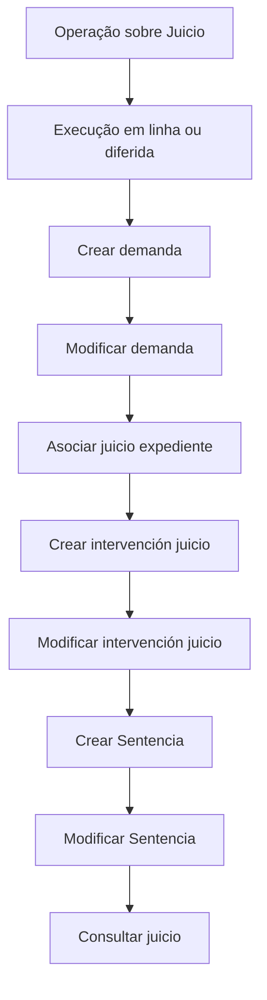

# INTRODUCIR - Juicios: Módulo de Registro, Acompanhamento e Operações de Processos Judiciais

## 1. Metadados do Documento
- **Arquivo de Origem:** Não identificado no conteúdo fornecido
- **Tipo de Documento:** Apresentação Executiva / Manual Funcional
- **Domínio / Sistema:** Módulo de Juicios (processos judiciais), módulo de siniestros
- **Público-Alvo:** Negócio, analistas funcionais, operação e equipes de configuração
- **Data/Versão Identificada:** Não identificada

---

## 2. Resumo Executivo & Contexto de Negócio

O documento descreve o módulo **Juicios**, destinado ao registro e acompanhamento de processos judiciais envolvendo a companhia. O módulo atende tanto situações em que a companhia demanda um terceiro — pessoa física ou jurídica — quanto situações em que um terceiro demanda a companhia.

O módulo possui caráter aberto e permite trabalhar com múltiplos tipos de negócio, incluindo Automóvil, Salud e Vida. A configuração do comportamento e das características do módulo é realizada por meio de catálogos, permitindo adequação a diferentes instalações e ramos.

Um processo judicial é estruturado principalmente por demanda e sentença. Cada uma dessas fases pode conter atributos adicionais, terceiros relacionados e importes. A demanda identifica, entre outros elementos, o siniestro ou expediente pendente afetado, o estado do processo e a data estimada do julgamento. A sentença registra informações como a data do julgamento, tipo de sentença e data de pagamento ou recebimento.

O módulo inclui definições organizadas nos níveis Común, General, Ramo e Juicio. Essas definições abrangem cadastros de advogados, procuradores, tribunais e julgados, além de características gerais, causas de processo, atributos, estruturas de informação, validações e detalhamento econômico.

As operações de Juicios podem ser realizadas tanto em linha quanto de forma diferida. As funcionalidades incluem criar e modificar demanda, associar processos a expedientes, criar e modificar sentença, criar e modificar intervenções e consultar integralmente as informações de um processo judicial.

---

## 3. Arquitetura, Componentes & Tecnologias Envolvidas

O documento não descreve tecnologias de implementação, protocolos, APIs, bancos de dados, URLs, ambientes ou componentes de infraestrutura. O conteúdo apresenta exclusivamente a estrutura funcional e configuracional do módulo de Juicios.

### Componentes funcionais identificados

| Componente | Função descrita |
| :--- | :--- |
| Módulo de Juicios | Registrar e realizar acompanhamento de processos judiciais. |
| Juicio | Entidade central composta por demanda e sentença. |
| Demanda | Registra a demanda de um processo judicial. |
| Sentencia | Registra a sentença de um processo judicial. |
| Atributos | Informações adicionais opcionais para demanda e sentença. |
| Terceros | Pessoas físicas e/ou jurídicas relacionadas ao processo, à demanda ou à sentença. |
| Importes | Valores econômicos associados à demanda ou à sentença. |
| Abogados | Advogados que trabalham com a companhia e que podem participar de processos judiciais. |
| Procuradores | Procuradores que trabalham com a companhia. |
| Tribunales | Tribunais que trabalham com a companhia. |
| Juzgado | Julgados que trabalham com a companhia. |
| Expedientes | Expedientes que podem ser associados a um processo judicial. |
| Catálogos | Mecanismo de definição do comportamento e das características do módulo. |

```mermaid
graph TD
    J[Juicio] --> D[Demanda]
    J --> S[Sentencia]

    D --> DA[Atributos da Demanda]
    D --> DT[Terceros da Demanda]
    D --> DI[Importes da Demanda]
    D --> DE[Siniestro / Expediente pendente afetado]
    D --> ES[Estado do Juicio]
    D --> FE[Fecha estimada del Juicio]
    D --> AB[Abogado]

    S --> SA[Atributos da Sentencia]
    S --> ST[Terceros da Sentencia]
    S --> SI[Importes da Sentencia]
    S --> FJ[Fecha del Juicio]
    S --> TS[Tipo de sentencia]
    S --> FP[Fecha pago o de cobro]

    OP[Operaciones Juicios] --> CD[Crear demanda]
    OP --> MD[Modificar demanda]
    OP --> AE[Asociar juicio expediente]
    OP --> CS[Crear Sentencia]
    OP --> MS[Modificar Sentencia]
    OP --> CI[Crear intervención juicio]
    OP --> MI[Modificar intervención juicio]
    OP --> CO[Consultar juicio]
```



> **Nota de Análise:** O documento não detalha métodos HTTP, contratos JSON, APIs, integrações, tecnologias de infraestrutura ou arquitetura técnica de software do módulo Juicios.

---

## 4. Regras de Negócio, Especificações Funcionais & Processos

### 4.1 Finalidade do módulo

O módulo de Juicios tem como finalidade registrar todos os dados de um processo judicial, independentemente de a companhia ter demandado um terceiro ou de um terceiro ter demandado a companhia.

Os terceiros relacionados podem ser pessoas físicas ou jurídicas.

### 4.2 Tipos de negócio suportados

O caráter aberto do módulo permite trabalhar com seguros de diferentes tipos de negócio:

- Automóvil
- Salud
- Vida
- Outros tipos de negócio não especificados no documento

### 4.3 Configurabilidade

O comportamento e as características do módulo de Juicios são definidos por catálogos. O documento afirma que os catálogos permitem definir o comportamento e as características a serem atribuídas ao módulo.

### 4.4 Estrutura de um Juicio

Um Juicio é composto pelos seguintes elementos:

- Demanda
- Atributos
- Terceros
- Importes
- Sentencia
- Atributos da Sentencia
- Terceros da Sentencia
- Importes da Sentencia

### 4.5 Regras e informações da Demanda

Na Demanda, devem ser identificados os seguintes dados:

- Siniestro ou expediente pendente que será afetado pelo Juicio.
- Estado do Juicio.
- Fecha estimada del Juicio.
- Abogado.
- Outros dados indicados como “Etc.”, sem detalhamento adicional no documento.

### 4.6 Atributos

Os atributos contêm informações adicionais sobre os Juicios.

Regras descritas:

- Os atributos são opcionais.
- Podem existir tanto para a Demanda quanto para a Sentencia.
- As definições de atributos permitem registrar a informação adicional necessária em cada instalação de Juicios.

### 4.7 Terceros

O elemento Terceros permite identificar pessoas relacionadas ao Juicio.

Os terceiros podem ser:

- Pessoas físicas.
- Pessoas jurídicas.
- Testigos.
- Outras pessoas relacionadas ao processo, à Demanda ou à Sentencia.

### 4.8 Importes na fase de Demanda

Quando o Juicio está na primeira fase, correspondente à Demanda, os importes podem incluir:

- Consignaciones.
- Adelanto de Honorarios Abogado.
- Outros importes indicados como “Etc.”, sem detalhamento adicional.

### 4.9 Importes após Sentencia

Quando o Juicio foi celebrado e uma Sentencia foi emitida, os importes podem incluir:

- Honorarios del Abogado.
- Importe de la sentencia.
- Outros importes indicados como “Etc.”, sem detalhamento adicional.

### 4.10 Regras e informações da Sentencia

Na Sentencia, devem ser identificados os seguintes dados:

- Fecha del Juicio.
- Tipo de sentencia.
- Fecha pago o de cobro.
- Outros dados indicados como “Etc.”, sem detalhamento adicional.

### 4.11 Histórico de advogados

O módulo registra todos os advogados que participaram do Juicio.

### 4.12 Níveis de definição

As definições do módulo são atendidas em quatro níveis:

1. Común
2. General
3. Ramo
4. Juicio

### 4.13 Definições do nível Común

O nível Común contém definições que não são exclusivas do módulo de siniestros, mas são necessárias para realizar a definição do módulo de Juicios.

Inclui:

- Abogados: definir os advogados que trabalharão com a companhia.
- Procuradores: definir os procuradores que trabalharão com a companhia.
- Tribunales: definir os tribunais que trabalharão com a companhia.
- Juzgado: definir os julgados que trabalharão com a companhia.

### 4.14 Definições do nível General

O nível General contém definições que afetam todos os expedientes com Juicios.

Inclui:

- Características: características gerais do módulo de siniestros que determinam comportamentos do módulo de Juicios, como permitir mais de um siniestro em um Juicio.
- Causa Proceso: catalogar os motivos pelos quais se deseja reabrir um Juicio em nível de companhia.
- Intereses de demora: definir os diferentes tipos de interesse de demora para os Juicios.

### 4.15 Definições do nível Ramo

O nível Ramo contém definições exclusivas do ramo que está sendo definido.

Inclui:

- Causa Proceso: catalogar os motivos para realizar a reabertura de um Juicio para cada ramo.
- Tipo Expediente: definir os tipos de danos aos quais um Juicio será associado.

### 4.16 Definições do nível Juicio

O nível Juicio contém definições específicas dos processos judiciais.

Inclui:

- Atributo: definir a informação adicional necessária em cada instalação de Juicios.
- Estructura: definir informação adicional do Juicio composta por atributos, obrigatoriedade ou não de solicitar informação e ordem de solicitação.
- Información Inicial: registrar informação inicial padrão dos atributos nas operações de Juicio para evitar introdução posterior.
- Validaciones Información: definir comportamentos e validações das informações core solicitadas nas operações de Juicios.
- Detalle Económico Juicios: determinar o detalhamento econômico dos Juicios, como consignaciones judiciales ou honorarios abogado.

### 4.17 Operações de Juicios

Todas as operações que podem ser realizadas com um Juicio podem ser executadas:

- Em linha.
- De forma diferida.

| Operação | Regra funcional descrita |
| :--- | :--- |
| CREAR demanda | Cria a demanda de um Juicio. |
| MODIFICAR demanda | Permite alterar informações e importes da Demanda de um Juicio. |
| ASOCIAR juicio expediente | Indica quais expedientes estão relacionados ao Juicio. |
| CREAR Sentencia | Gera os dados da Sentencia de um Juicio. |
| MODIFICAR Sentencia | Permite alterar informações, dados e importes da Sentencia. |
| CREAR intervención juicio | Associa ao Juicio as pessoas relacionadas, como advogados e testemunhas. |
| MODIFICAR intervención juicio | Permite modificar as intervenções e as pessoas associadas ao Juicio. |
| CONSULTAR juicio | Visualiza todas as informações de um Juicio. |



---

## 5. Tabelas de Parâmetros, Ambientes e Estruturas de Dados

### 5.1 Elementos do Juicio

| Item / Parâmetro | Descrição / Função | Tipo / Valores / Formato | Ambiente / Observações |
| :--- | :--- | :--- | :--- |
| Juicio | Entidade principal para registro e acompanhamento de processo judicial. | Processo judicial | Pode representar demanda da companhia contra terceiro ou demanda de terceiro contra a companhia. |
| Demanda | Elemento que registra a demanda de um Juicio. | Dados da Demanda | Inclui referências a siniestro ou expediente, estado, data estimada e advogado. |
| Sentencia | Elemento que registra a sentença de um Juicio. | Dados da Sentencia | Inclui data do Juicio, tipo de sentença e data de pagamento ou cobrança. |
| Atributos | Informação adicional de Juicios. | Opcional | Aplicável à Demanda e à Sentencia. |
| Terceros | Identificação de pessoas relacionadas ao Juicio. | Pessoas físicas e/ou jurídicas | Pode incluir testigos. |
| Importes | Valores econômicos associados ao Juicio. | Valores econômicos | O detalhamento depende da fase: Demanda ou Sentencia. |

### 5.2 Dados identificáveis na Demanda

| Item / Parâmetro | Descrição / Função | Tipo / Valores / Formato | Ambiente / Observações |
| :--- | :--- | :--- | :--- |
| Siniestro / expediente pendente | Identifica o siniestro ou expediente que será afetado pelo Juicio. | Referência de siniestro ou expediente | Dado da Demanda. |
| Estado del Juicio | Identifica o estado do Juicio. | Estado | O documento não lista valores possíveis. |
| Fecha estimada del Juicio | Registra a data estimada do Juicio. | Data | Dado da Demanda. |
| Abogado | Identifica o advogado do Juicio. | Referência de advogado | O módulo mantém histórico dos advogados participantes. |

### 5.3 Dados identificáveis na Sentencia

| Item / Parâmetro | Descrição / Função | Tipo / Valores / Formato | Ambiente / Observações |
| :--- | :--- | :--- | :--- |
| Fecha del Juicio | Registra a data do Juicio. | Data | Dado da Sentencia. |
| Tipo de sentencia | Identifica o tipo de sentença. | Tipo de sentença | O documento não especifica catálogo de valores. |
| Fecha pago o de cobro | Registra data de pagamento ou cobrança. | Data | Dado da Sentencia. |

### 5.4 Detalhamento econômico

| Item / Parâmetro | Descrição / Função | Tipo / Valores / Formato | Ambiente / Observações |
| :--- | :--- | :--- | :--- |
| Consignaciones | Exemplo de importe na primeira fase, correspondente à Demanda. | Importe econômico | Pode compor o detalhe econômico da Demanda. |
| Adelanto de Honorarios Abogado | Adiantamento de honorários de advogado. | Importe econômico | Pode compor o detalhe econômico da Demanda. |
| Honorarios del Abogado | Honorários do advogado. | Importe econômico | Pode ser registrado após celebração do Juicio e emissão de Sentencia. |
| Importe de la sentencia | Valor da sentença. | Importe econômico | Pode ser registrado após celebração do Juicio e emissão de Sentencia. |
| Detalle Económico Juicios | Definição do desdobramento econômico dos Juicios. | Configuração | Inclui exemplos como consignaciones judiciales e honorarios abogado. |

### 5.5 Níveis e definições configuráveis

| Item / Parâmetro | Descrição / Função | Tipo / Valores / Formato | Ambiente / Observações |
| :--- | :--- | :--- | :--- |
| Común | Definições não exclusivas do módulo de siniestros, necessárias para a configuração. | Nível de definição | Inclui abogados, procuradores, tribunales e juzgado. |
| General | Definições que afetam todos os expedientes com Juicios. | Nível de definição | Inclui características, causa proceso e intereses de demora. |
| Ramo | Definições exclusivas do ramo configurado. | Nível de definição | Inclui causa proceso e tipo expediente. |
| Juicio | Definições específicas do processo judicial. | Nível de definição | Inclui atributo, estructura, información inicial, validaciones información e detalle económico. |
| Características | Determina comportamentos do módulo de Juicios. | Configuração geral | Exemplo: permitir mais de um siniestro em um Juicio. |
| Causa Proceso | Cataloga motivos de reabertura de um Juicio. | Catálogo | Existe em nível General e em nível Ramo. |
| Intereses de demora | Define tipos de interesse de demora para Juicios. | Catálogo | Definição de nível General. |
| Tipo Expediente | Define tipos de danos aos quais um Juicio será associado. | Catálogo | Definição exclusiva de Ramo. |
| Atributo | Define informação adicional necessária em cada instalação. | Configuração | Definição do nível Juicio. |
| Estructura | Define atributos, obrigatoriedade e ordem de solicitação de informações. | Configuração | Definição do nível Juicio. |
| Información Inicial | Registra dados padrão para atributos das operações de Juicio. | Configuração | Evita introdução posterior de informações. |
| Validaciones Información | Define comportamentos e validações de informação core. | Configuração | Aplicável às operações de Juicios. |

### 5.6 Ambientes, servidores e tecnologias

| Item / Parâmetro | Descrição / Função | Tipo / Valores / Formato | Ambiente / Observações |
| :--- | :--- | :--- | :--- |
| Ambientes | Não especificados. | Não identificado | O documento não informa ambientes de desenvolvimento, teste, homologação ou produção. |
| Servidores | Não especificados. | Não identificado | O documento não informa nomes, endereços ou funções de servidores. |
| URLs | Não especificadas. | Não identificado | O conteúdo apresenta referências visuais a “Inicio”, “Soluciones”, “APIs”, “Documentación” e “Zeus”, sem URLs ou contexto técnico adicional. |
| Tecnologias | Não especificadas. | Não identificado | Não há linguagens, frameworks, bancos de dados ou protocolos descritos. |

---

## 6. Bateria de Perguntas & Respostas para RAG (FAQ Sintético)

### P1: Qual é a finalidade do módulo de Juicios?
**R:** O módulo de Juicios permite registrar todos os dados de um processo judicial e realizar seu acompanhamento. Ele cobre tanto processos em que a companhia demanda um terceiro, pessoa física ou jurídica, quanto processos em que um terceiro demanda a companhia.

### P2: Quais tipos de negócio podem utilizar o módulo de Juicios?
**R:** O documento descreve o módulo como aberto para múltiplos tipos de negócio de seguros. São citados os tipos Automóvil, Salud e Vida. O conteúdo também indica “Etc.”, mas não especifica outros ramos ou linhas de negócio.

### P3: Quais são os elementos que compõem um Juicio?
**R:** Um Juicio é composto por Demanda e Sentencia. Tanto a Demanda quanto a Sentencia podem conter Atributos, Terceros e Importes. A Demanda também identifica o siniestro ou expediente pendente afetado, o estado do Juicio, a data estimada e o advogado. A Sentencia identifica a data do Juicio, o tipo de sentença e a data de pagamento ou cobrança.

### P4: Que informações devem ser identificadas na Demanda de um Juicio?
**R:** A Demanda deve identificar o siniestro ou expediente pendente afetado pelo Juicio, o estado do Juicio, a data estimada do Juicio e o advogado. O documento também utiliza “Etc.”, sem listar outros campos obrigatórios ou opcionais.

### P5: Quais importes podem ser registrados na fase de Demanda?
**R:** Na primeira fase do Juicio, correspondente à Demanda, os importes podem incluir Consignaciones e Adelanto de Honorarios Abogado. O documento menciona que podem existir outros importes, mas não os detalha.

### P6: Quais importes podem ser registrados após a Sentencia?
**R:** Depois de celebrado o Juicio e emitida uma Sentencia, os importes podem incluir Honorarios del Abogado e Importe de la sentencia. Outros valores podem existir, mas não são especificados no documento.

### P7: Como são organizadas as definições do módulo de Juicios?
**R:** As definições são organizadas em quatro níveis: Común, General, Ramo e Juicio. O nível Común inclui advogados, procuradores, tribunais e julgados. O nível General afeta todos os expedientes com Juicios. O nível Ramo contém definições exclusivas de cada ramo. O nível Juicio contém atributos, estruturas, informações iniciais, validações e detalhamento econômico.

### P8: Qual é a diferença entre Causa Proceso no nível General e no nível Ramo?
**R:** No nível General, Causa Proceso permite catalogar os motivos pelos quais se deseja reabrir um Juicio no nível da companhia. No nível Ramo, Causa Proceso permite catalogar os motivos de reabertura de um Juicio especificamente para cada ramo.

### P9: O módulo permite associar mais de um siniestro a um Juicio?
**R:** O documento informa que as Características Gerais do módulo de siniestros determinam comportamentos do módulo de Juicios e apresenta como exemplo a possibilidade de permitir mais de um siniestro em um Juicio. O conteúdo não confirma que esse comportamento é obrigatório ou habilitado por padrão; ele é descrito como exemplo de configuração.

### P10: Quais operações podem ser executadas sobre um Juicio?
**R:** As operações disponíveis são: Crear demanda, Modificar demanda, Asociar juicio expediente, Crear Sentencia, Modificar Sentencia, Crear intervención juicio, Modificar intervención juicio e Consultar juicio. Todas podem ser realizadas em linha ou de forma diferida.

### P11: Para que serve a operação Crear intervención juicio?
**R:** A operação Crear intervención juicio associa ao Juicio as pessoas relacionadas ao processo, incluindo advogados, testemunhas e outras pessoas. A operação Modificar intervención juicio permite modificar essas intervenções e as pessoas associadas ao Juicio.

### P12: O que é configurado por Estructura no nível Juicio?
**R:** Estructura define a informação adicional do Juicio composta por atributos. Também define se a solicitação dessas informações é obrigatória ou não e a ordem em que essas informações devem ser solicitadas.

### P13: Qual é a função de Información Inicial nas operações de Juicio?
**R:** Información Inicial permite registrar informações iniciais padrão para os atributos das operações de Juicio. A finalidade declarada é evitar que essas informações precisem ser introduzidas posteriormente.

### P14: O documento descreve APIs, contratos JSON ou tecnologias utilizadas pelo módulo?
**R:** Não. O documento não detalha APIs, métodos HTTP, contratos JSON, tecnologias, bancos de dados, ambientes, URLs técnicas, protocolos ou componentes de infraestrutura. O conteúdo está limitado à descrição funcional e configuracional do módulo de Juicios.

---

## 7. Glossário de Termos, Siglas & Conceitos-Chave

- **Abogado:** Advogado relacionado ao Juicio ou definido para trabalhar com a companhia.
- **Adelanto de Honorarios Abogado:** Adiantamento de honorários de advogado, citado como importe possível na fase de Demanda.
- **Atributo:** Informação adicional configurável para Juicios.
- **Causa Proceso:** Catálogo de motivos para reabertura de um Juicio, disponível nos níveis General e Ramo.
- **Consignaciones:** Importes possíveis na primeira fase de Demanda; o documento também cita consignaciones judiciales como exemplo de detalhamento econômico.
- **Demanda:** Elemento do Juicio que registra a demanda e dados associados.
- **Detalle Económico Juicios:** Definição que determina o desdobramento econômico dos Juicios.
- **Estructura:** Configuração de informação adicional do Juicio por meio de atributos, obrigatoriedade e ordem de solicitação.
- **Expediente:** Registro ou processo que pode estar relacionado a um Juicio.
- **Información Inicial:** Informação padrão inicial dos atributos das operações de Juicio.
- **Intereses de demora:** Tipos de interesse de demora configuráveis para Juicios.
- **Juzgado:** Julgado definido para trabalhar com a companhia.
- **Juicio:** Processo judicial registrado e acompanhado pelo módulo.
- **Procuradores:** Procuradores definidos para trabalhar com a companhia.
- **Ramo:** Nível de definição exclusivo do ramo que está sendo configurado.
- **Sentencia:** Elemento do Juicio que registra dados da decisão judicial.
- **Siniestro:** Siniestro ou evento associado a um expediente e potencialmente afetado por um Juicio.
- **Terceros:** Pessoas físicas e/ou jurídicas relacionadas ao Juicio, à Demanda ou à Sentencia.
- **Testigos:** Testemunhas que podem ser relacionadas ao Juicio.
- **Tipo Expediente:** Definição dos tipos de danos aos quais um Juicio será associado.
- **Tribunales:** Tribunais definidos para trabalhar com a companhia.
- **Validaciones Información:** Definições de comportamentos e validações das informações core solicitadas nas operações de Juicios.

---

## 8. Notas Críticas, Riscos & Limitações

- O documento não identifica nome do arquivo, data, versão, autor ou responsável pelo conteúdo.
- Não há descrição de APIs, métodos HTTP, contratos JSON, eventos, integrações, filas, bancos de dados, tecnologias ou arquitetura de infraestrutura.
- Não são fornecidos servidores, URLs, portas, ambientes de desenvolvimento, homologação, teste ou produção.
- O documento cita “Inicio”, “Soluciones”, “APIs”, “Documentación” e “Zeus”, mas não explica o significado técnico dessas referências nem apresenta URLs associadas.
- Os campos indicados por “Etc.” não possuem detalhamento adicional. Não é possível inferir campos, regras, valores ou obrigatoriedades não explicitamente descritos.
- O documento apresenta “Tipo de sentencia”, “Estado del Juicio” e “Intereses de demora”, mas não informa valores possíveis, estruturas de catálogo ou regras de seleção.
- A permissão de mais de um siniestro em um Juicio é apresentada como exemplo de comportamento configurável, não como regra obrigatória.
- O documento afirma que as operações podem ser executadas em linha ou diferido, mas não define mecanismos de processamento diferido, agendamento, monitoramento, retentativas ou tratamento de falhas.
- Não há detalhamento sobre segurança, perfis de acesso, matriz de permissões, auditoria, retenção de dados ou requisitos regulatórios.
- **Nota de Análise:** O conteúdo descreve a estrutura funcional do módulo Juicios, mas não detalha os métodos de implementação técnica ou os contratos de integração necessários para desenvolvimento ou operação de serviços.

---

## 9. Conteúdo Bruto Estruturado (Referência Fiel)

```text
--- [PÁGINA 1 DE 6] ---

INTRODUCIR - Juicios
OBJETIVO
La finalidad de este módulo es poder registrar todos los datos de un juicio, tanto si la compañía ha
demandado a un tercero (físico o jurídico), como si un tercero ha demandado a la compañía.
Características
Elementos de un Juicio
Definiciones de un Juicio
Operaciones Juicio
Características
Múltiples tipos de negocio
El carácter abierto del módulo facilita la posibilidad de trabajar seguros del tipo:
Automóvil
Salud
Vida
Etc.
 / 
 RS
Inicio Soluciones APIs Documentación Zeus
ES


--- [PÁGINA 2 DE 6] ---

Configurable
Mediante catálogos se va a poder definir el comportamiento y las características que se le va a
dar al modulo de Juicios.
Cubre todas las funcionalidades de los juicios
Este módulo, contiene todas las funcionalidades necesarias para registrar y realizar un
seguimiento de los juicios .
Histórico de abogados
Se registra todos los abogados que hayan participado en el juicio.
Elementos de un Juicio
Un juicio está compuesto de varios elementos
JUICIO
DEMANDA
ATRIBUTOS
TERCEROS
IMPORTES
SENTENCIA
ATRIBUTOS
TERCEROS
IMPORTES
Demanda
En este elemento del juicio se tiene que identificar:
Siniestro/expediente pendiente, al que va afectar el juicio.
Estado del Juicio


--- [PÁGINA 3 DE 6] ---

Fecha estimada del Juicio
Abogado
Etc.
Atributos
Este elemento contiene información adicional de los juicios, es opcional, tanto para la demanda como
para la sentencia.
Terceros
En este elemento se puede identificar las personas (físicas y/o jurídicas), que tiene relación con el
juicio, tanto en la demanda como en la sentencia, testigos..
Importes
Cuando el juicio esté en la primera fase de la demanda los importes podrían ser:
Consignaciones
Adelanto de Honorarios Abogado
Etc
Cuando se haya celebrado el juicio y se haya dictado una sentencia el detalle de los importes
podrían ser:
Honorarios del Abogado
Importe de la sentencia
Etc
Sentencia
En este elemento del juicio se tiene que identificar:
Fecha del Juicio
Tipo de sentencia
Fecha pago o de cobro
Etc.
Definiciones Juicios
Los elementos de definición atienden a distintos niveles:


--- [PÁGINA 4 DE 6] ---

NIVELES DE DEFINICIÓN
COMÚN GENERAL RAMO JUICIO
COMÚN
En este nivel se encuentran definiciones que NO son exclusivas del
módulo de siniestros, pero son necesarias para poder realizar la
definición. Entre otras definiciones se encuentra:
ABOGADOS
Definir los abogados que van a trabajar con la
compañía
PROCURADORES
Definir los procuradores que van a trabajar
con la compañía
TRIBUNALES
Definir los tribunales que van a trabajar con la
compañía
JUZGADO
Definir los juzgados que van a trabajar con la
compañía
GENERAL
En este nivel se encuentran definiciones que afectarán a todos los
expedientes con juicios.
CARACTERÍSTICAS
Características Generales del módulo de
siniestros, determina comportamientos del
módulo de juicios por ejemplo si se permite
más de un siniestro en un juicio
CAUSA PROCESO
Permite catalogar los motivos por los que se
quiere re-aperturar un juicio a nivel de
compañía
INTERESES DE DEMORA


--- [PÁGINA 5 DE 6] ---

Permite definir los Tipos distintos tipos de
interés de demora para los juicios
RAMO
Son exclusivas del ramo que se está definiendo.
CAUSA PROCESO
Permite catalogar los motivos por los que se
quiere realizar la reapertura de un juicio para
cada ramo
TIPO EXPEDIENTE
Permite definir los Tipos de Daños a los que
se le va a asociar un juicio
JUICIO
Definiciones de juicios
ATRIBUTO
Permite definir la información adicional que se
necesite en cada instalación de los juicios.
ESTRUCTURA
Información adicional del juicio compuesta por
atributos, obligatoriedad o no de pedir
información, orden en el que se va a pedir
INFORMACIÓN INICIAL
Permite registrar información por defecto,
inicial de los atributos de las operaciones de
juicio, para no tener que introducirla
posteriormente
VALIDACIONES INFORMACIÓN
Definir comportamientos y validaciones de la
información core, que se piden en las
operaciones de Juicios
DETALLE ECONÓMICO JUICIOS


--- [PÁGINA 6 DE 6] ---

Determinar el desglose económico de los
juicios. Por ejemplo consignaciones judiciales
u honorarios abogado...
Operaciones Juicios
JUICIOS
Todas las Operaciones que se pueden realizar con un Juicios, se
pueden realizar tanto en línea como diferido
CREAR demanda
En esta operación se crea la demanda de un
juicio
MODIFICAR demanda
Permite cambiar información de la demanda
de un juicio, datos e importes
ASOCIAR juicio expediente
En esta operación se indica que expedientes
están relacionados con el juicio
CREAR Sentencia
En esta operación se generan los datos de la
sentencia de un juicio
MODIFICAR Sentencia
Permite cambiar la información de la
sentencia de un juicio, datos e importes
CREAR intervención juicio
Asociar al juicio las personas relacionadas
con el mismo, abogados, testigos.. etc
MODIFICAR intervención juicio
Permite modificar las intervenciones, las
personas asociadas al juicio
CONSULTAR juicio
Visualiza toda la información de un juicio
```
