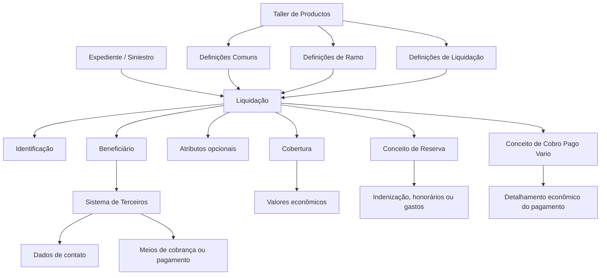
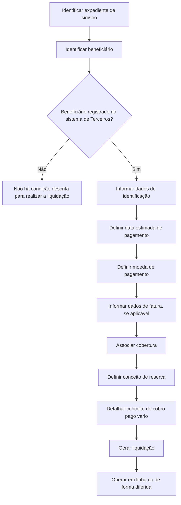

# Módulo de Liquidações de Sinistros — Especificações Funcionais, Definições e Operações

## 1. Metadados do Documento
- **Arquivo de Origem:** Não identificado no conteúdo fornecido
- **Tipo de Documento:** Manual Operacional / Especificação Funcional
- **Domínio / Sistema:** Módulo de Liquidações do módulo de Siniestros
- **Público-Alvo:** Desenvolvedores, Arquitetos, Operação e Negócio
- **Data/Versão Identificada:** Não identificada

---

## 2. Resumo Executivo & Contexto de Negócio

O documento descreve o módulo de **Liquidações**, responsável por ordenar pagamentos ou cobranças destinados a pessoas físicas ou jurídicas que tenham participado de um expediente de sinistro. Cada ordem de pagamento ou cobrança é denominada liquidação. Os destinatários podem incluir fornecedores, prejudicados e outros beneficiários registrados no sistema.

A liquidação de um expediente utiliza conceitos econômicos denominados **conceitos de cobro y pago vario**, que permitem detalhar economicamente um pagamento. Entre os exemplos apresentados estão mão de obra, indenização por valor novo, indenização por valor de reposição e gastos com peritos.

O módulo cobre o ciclo operacional de criação, modificação, anulação e consulta de liquidações. O comportamento e as validações do módulo são parametrizáveis e dependem de definições prévias do “Taller de Productos”. Uma liquidação armazena valores econômicos no nível de cobertura, enquanto o detalhamento do pagamento é realizado por conceitos de cobrança e pagamento diversos.

O processo exige que o beneficiário esteja previamente registrado no sistema de terceiros, incluindo dados de contato e meios de cobrança ou pagamento. Um expediente pode possuir uma ou várias liquidações, conforme a quantidade de beneficiários que precisam receber ou efetuar pagamentos.

O documento também organiza as definições do módulo em três níveis — comum, ramo e liquidação — e apresenta operações que podem ser executadas tanto em linha quanto de forma diferida. Não são detalhados contratos de integração, métodos HTTP, interfaces técnicas, persistência de dados ou mecanismos de execução diferida.

---

## 3. Arquitetura, Componentes & Tecnologias Envolvidas

O conteúdo descreve uma arquitetura funcional estruturada em torno do módulo de Liquidações, do expediente de sinistro, das coberturas, dos beneficiários, dos conceitos econômicos e das definições configuráveis.

### Componentes funcionais identificados

| Componente | Papel descrito |
| :--- | :--- |
| Módulo de Liquidações | Permite ordenar pagamentos e cobranças, modificar, anular e consultar liquidações. |
| Expediente / Siniestro | Contexto ao qual a liquidação é associada. |
| Beneficiário | Pessoa física ou jurídica para quem será realizado pagamento ou cobrança. |
| Sistema de Terceiros | Sistema no qual o beneficiário deve estar registrado, com contatos e meios de cobrança/pagamento. |
| Cobertura | Nível do expediente afetado pela liquidação e onde os valores econômicos são armazenados. |
| Conceito de Reserva | Detalha se o pagamento será realizado por indenização, honorários ou gastos. |
| Conceito de Cobro Pago Vario | Realiza o detalhamento econômico do pagamento ou cobrança. |
| Taller de Productos | Fonte de definições prévias que influenciam comportamentos e validações do módulo. |
| Definições Comuns | Configurações compartilhadas, como oficinas pagadoras, documentos de pagamento, impostos, numeração e controle técnico. |
| Definições de Ramo | Configurações que afetam as liquidações do ramo, como características gerais e causa de processo. |
| Definições de Liquidação | Configurações específicas para as possíveis liquidações de um expediente. |



### Fluxo funcional de uma liquidação



> **Nota de Análise:** O documento descreve componentes e relações funcionais, mas não informa tecnologias de implementação, bancos de dados, APIs, protocolos, URLs, portas, mensageria ou contratos de integração.

---

## 4. Regras de Negócio, Especificações Funcionais & Processos

### Finalidade da liquidação

Uma liquidação permite ordenar o pagamento ou a cobrança a pessoas físicas ou jurídicas que tenham participado do expediente. As ordens podem ser direcionadas, entre outros destinatários, a fornecedores e prejudicados.

### Conceitos de cobrança e pagamento diversos

A liquidação de um expediente, seja para cobrança ou pagamento a um beneficiário, é realizada por meio de conceitos econômicos chamados conceitos de cobrança e pagamento diversos. Esses conceitos permitem detalhar o pagamento.

Exemplos de detalhamento econômico apresentados:

- Mão de obra.
- Indenização por valor novo.
- Indenização por valor de reposição.
- Gastos de peritos.
- Outros conceitos não especificados.

### Características funcionais do módulo

1. O módulo cobre todas as funcionalidades necessárias para ordenar pagamentos ou cobranças a uma pessoa física ou jurídica.
2. O módulo permite modificar uma liquidação.
3. O módulo permite anular uma liquidação.
4. O módulo é parametrizável.
5. O comportamento e as validações dependem de definições prévias no Taller de Productos.
6. Cada liquidação contém valores econômicos armazenados no nível de cobertura.
7. O detalhamento do pagamento é realizado por conceitos de cobrança e pagamento diversos.
8. Os pagamentos podem ser efetuados em moedas diferentes da moeda da apólice ou do expediente.
9. Para realizar uma liquidação, o beneficiário deve estar registrado no sistema de Terceiros.
10. O cadastro do beneficiário deve incluir meios de contato e meios de cobrança ou pagamento.
11. Podem existir tantas liquidações quanto beneficiários houver para pagar ou cobrar em um expediente.

### Elementos de uma liquidação

Uma liquidação é composta pelos elementos a seguir:

| Elemento | Regra ou função |
| :--- | :--- |
| Identificação | Contém informações de identificação da liquidação. |
| Beneficiário | Identifica a pessoa física ou jurídica que receberá ou realizará pagamento/cobrança. |
| Atributos | Contêm informação adicional da liquidação e são opcionais. |
| Cobertura | Identifica a cobertura do expediente afetada pela liquidação. |
| Conceito de Reserva | Especifica se o pagamento corresponde a indenização, honorários ou gastos. |
| Conceito de Cobro Pago Vario | Detalha o pagamento. |

### Dados de identificação

A identificação da liquidação deve incluir:

- O sinistro ou expediente que será afetado pela liquidação.
- A data estimada de pagamento.
- A moeda de pagamento.
- Dados da fatura, caso o pagamento seja realizado mediante fatura.
- Outros dados não especificados no documento.

### Dados do beneficiário

O beneficiário deve ser a pessoa física ou jurídica para a qual será realizado o pagamento ou a cobrança. O documento cita como modalidades de cobrança ou pagamento:

- Dinheiro em espécie.
- Transferência bancária.
- Outros meios não detalhados.

### Níveis de definição

As definições relacionadas às liquidações são estruturadas nos níveis comum, ramo e liquidação.

#### Nível comum

O nível comum contém definições que não são exclusivas do módulo de sinistros, mas que são necessárias para realizar as definições relacionadas a liquidações.

Inclui:

- Oficinas pagadoras.
- Documentos de pagamento.
- Conceitos de cobrança e pagamento.
- Imposto.
- Numeração de ordens de pagamento.
- Controle técnico.

#### Nível ramo

O nível ramo contém definições que afetam todas as liquidações. O documento cita:

- Características gerais.
- Causa de processo.

As características gerais do módulo de sinistros determinam comportamentos do módulo de liquidações. Um exemplo citado é determinar se as faturas de sinistros serão registradas.

A causa de processo permite catalogar os motivos pelos quais se deseja realizar uma operação. O exemplo apresentado é o motivo para anulação de uma liquidação.

#### Nível liquidação

O nível liquidação contém definições que afetam cada uma das possíveis liquidações de um expediente.

Inclui:

- Atributo.
- Estrutura.
- Informação inicial.
- Validações de informação.
- Conceito de cobrança e pagamento.
- Beneficiários da liquidação.
- Valor inicial.
- Valor máximo.
- Controle técnico.

### Regras de parametrização por definição

| Definição | Regra ou finalidade |
| :--- | :--- |
| Atributo | Define a informação adicional da liquidação, como dados de finiquito. |
| Estrutura | Define a informação adicional composta por atributos, a obrigatoriedade de solicitação da informação e a ordem em que a informação será solicitada. |
| Informação inicial | Permite registrar informações prévias para os atributos das operações de liquidação, evitando informar esses dados posteriormente. |
| Validações de informação | Define comportamentos e validações da informação core solicitada nas operações de liquidação. |
| Conceito de cobrança e pagamento | Determina o detalhamento econômico das liquidações. |
| Beneficiários de liquidação | Determina as pessoas físicas e jurídicas para as quais pode ser paga ou cobrada uma liquidação. |
| Valor inicial | Define o valor pelo qual será liquidado o conceito de reserva e o conceito de cobrança e pagamento diverso. |
| Valor máximo | Determina o valor máximo pelo qual podem ser liquidados uma cobertura, um conceito de reserva ou um conceito de cobrança e pagamento diverso. |
| Controle técnico | Define as condições em que operações de liquidação podem ser paralisadas ou submetidas à autorização obrigatória. |

### Exemplo de validação

O documento fornece o seguinte exemplo de regra de validação:

- Se o documento for **Real**, o fornecedor da fatura não pode ser o tomador nem o segurado.

> **Nota de Análise:** O documento não detalha o significado operacional do tipo de documento “Real”, nem descreve a implementação técnica dessa validação.

### Operações de liquidação

As operações de liquidação de um expediente podem ser realizadas em linha ou de forma diferida.

| Operação | Regra funcional |
| :--- | :--- |
| Gerar liquidação | Permite criar uma ordem de pagamento para um beneficiário. |
| Gerar liquidação — expediente terminado | Permite criar uma ordem de pagamento para um beneficiário quando o expediente está terminado. |
| Modificar liquidação | Permite alterar informações e valores de uma liquidação, desde que a liquidação não esteja paga. |
| Anular liquidação | Cancela uma liquidação e reverte seus movimentos, desde que a liquidação não esteja paga. |
| Consultar liquidação | Permite visualizar todas as informações de uma liquidação. |

---

## 5. Tabelas de Parâmetros, Ambientes e Estruturas de Dados

### Estrutura funcional de liquidação

| Item / Parâmetro | Descrição / Função | Tipo / Valores / Formato | Ambiente / Observações |
| :--- | :--- | :--- | :--- |
| Expediente / Siniestro | Identifica o expediente afetado pela liquidação. | Identificador não detalhado. | Obrigatório conforme a seção de dados de identificação. |
| Data estimada de pagamento | Informa a previsão de pagamento. | Data; formato não detalhado. | Dado de identificação. |
| Moeda de pagamento | Define a moeda usada na liquidação. | Moeda; valores não detalhados. | Pode ser diferente da moeda da apólice ou do expediente. |
| Dados da fatura | Registra dados relacionados à fatura. | Não detalhado. | Aplicável quando o pagamento é realizado por fatura. |
| Beneficiário | Pessoa física ou jurídica a pagar ou cobrar. | Pessoa física ou jurídica. | Deve estar registrada no sistema de Terceiros. |
| Meio de pagamento/cobrança | Define como será realizado o pagamento ou a cobrança. | Dinheiro em espécie, transferência bancária ou outros não detalhados. | Associado ao beneficiário. |
| Atributos | Informações adicionais da liquidação. | Opcional. | Pode incluir dados de finiquito. |
| Cobertura | Cobertura do expediente afetada pela liquidação. | Não detalhado. | Armazena valores econômicos da liquidação. |
| Conceito de Reserva | Classifica o pagamento. | Indenização, honorários ou gastos. | Associado à cobertura. |
| Conceito de Cobro Pago Vario | Detalha economicamente o pagamento. | Exemplos: mão de obra, indenizações e gastos de peritos. | Associado ao detalhamento econômico. |
| Valor inicial | Define o valor inicial de liquidação. | Valor monetário; formato não detalhado. | Aplicável a conceito de reserva e conceito de cobrança/pagamento diverso. |
| Valor máximo | Define o limite máximo de liquidação. | Valor monetário; formato não detalhado. | Aplicável a cobertura, conceito de reserva e conceito de cobrança/pagamento diverso. |

### Definições no nível comum

| Item / Parâmetro | Descrição / Função | Tipo / Valores / Formato | Ambiente / Observações |
| :--- | :--- | :--- | :--- |
| Oficinas pagadoras | Registra as oficinas que podem realizar pagamentos. | Registro de oficinas. | Nível comum. |
| Documentos de pagamento | Registra documentos que podem ser pagos ou cobrados. | Exemplos: fatura, nota de crédito. | Nível comum. |
| Conceitos de cobrança e pagamento | Define o detalhamento econômico das ordens de pagamento. | Conceitos econômicos. | Nível comum. |
| Imposto | Define tipos de obrigações tributárias, características e formas de cálculo. | Tipos de imposto; cálculos não detalhados. | Nível comum. |
| Numeração de ordens de pagamento | Define o saco de ordens de pagamento. | Numeração não detalhada. | Nível comum. |
| Controle técnico | Define erros e tipos de erros. | Regras e tipos não detalhados. | Nível comum. |

### Definições nos níveis ramo e liquidação

| Item / Parâmetro | Descrição / Função | Tipo / Valores / Formato | Ambiente / Observações |
| :--- | :--- | :--- | :--- |
| Características gerais | Determina comportamentos do módulo de liquidações. | Configurações de comportamento. | Nível ramo; exemplo: registrar ou não faturas de sinistros. |
| Causa de processo | Cataloga motivos para realizar uma operação. | Motivos; valores não detalhados. | Nível ramo; exemplo: motivo de anulação. |
| Atributo | Define informação adicional. | Dados adicionais; exemplo: dados de finiquito. | Nível liquidação. |
| Estrutura | Organiza atributos, obrigatoriedade e ordem de solicitação. | Estrutura configurável. | Nível liquidação. |
| Informação inicial | Pré-preenche dados de atributos. | Valores iniciais. | Exemplo: atribuir à moeda da fatura a moeda do país. |
| Validações de informação | Define validações da informação core. | Regras configuráveis. | Nível liquidação. |
| Beneficiários de liquidação | Define pessoas físicas e jurídicas elegíveis. | Pessoas físicas e jurídicas. | Nível liquidação. |
| Controle técnico | Define paralisação ou autorização obrigatória de operações. | Condições não detalhadas. | Nível liquidação. |

### Ambientes, URLs, logs e servidores

| Item / Parâmetro | Descrição / Função | Tipo / Valores / Formato | Ambiente / Observações |
| :--- | :--- | :--- | :--- |
| Ambientes | Não descritos. | Não aplicável. | O documento não informa ambientes. |
| URLs | Não descritas. | Não aplicável. | O documento não informa URLs. |
| Servidores | Não descritos. | Não aplicável. | O documento não informa servidores. |
| Rotas de logs | Não descritas. | Não aplicável. | O documento não informa logging ou observabilidade. |

---

## 6. Bateria de Perguntas & Respostas para RAG (FAQ Sintético)

### P1: Qual é a finalidade do módulo de Liquidações no contexto de sinistros?
**R:** O módulo de Liquidações permite ordenar pagamentos ou cobranças para pessoas físicas ou jurídicas que tenham intervindo em um expediente de sinistro. Cada ordem de pagamento ou cobrança é chamada de liquidação e pode atender, por exemplo, fornecedores ou prejudicados.

### P2: O que são conceitos de cobro y pago vario?
**R:** Conceitos de cobro y pago vario são conceitos econômicos utilizados para detalhar uma liquidação de cobrança ou pagamento a um beneficiário. O documento cita como exemplos mão de obra, indenização por valor novo, indenização por valor de reposição e gastos de peritos.

### P3: Uma liquidação pode utilizar uma moeda diferente da moeda da apólice?
**R:** Sim. O documento informa que os pagamentos podem ser realizados em moedas diferentes da moeda da apólice ou da moeda dos expedientes.

### P4: Quais informações de identificação devem ser fornecidas para uma liquidação?
**R:** A identificação da liquidação deve incluir o sinistro ou expediente afetado, a data estimada de pagamento, a moeda de pagamento e, quando o pagamento for realizado por fatura, os dados da fatura. O documento também menciona a existência de outros dados não especificados.

### P5: Quais são os elementos que compõem uma liquidação?
**R:** Uma liquidação é composta por identificação, beneficiário, atributos, cobertura, conceito de reserva e conceito de cobro pago vario. Os atributos são opcionais e armazenam informações adicionais da liquidação.

### P6: O beneficiário precisa estar cadastrado para que uma liquidação seja realizada?
**R:** Sim. Para realizar uma liquidação, o beneficiário deve estar registrado no sistema de Terceiros com meios de contato e meios de cobrança ou pagamento. O beneficiário pode ser uma pessoa física ou jurídica.

### P7: É possível alterar uma liquidação já paga?
**R:** Não. A operação de modificar liquidação permite alterar dados e valores somente quando a liquidação ainda não estiver paga.

### P8: Em quais condições uma liquidação pode ser anulada?
**R:** A anulação cancela uma liquidação e reverte seus movimentos, desde que a liquidação não esteja paga. O documento também indica que a causa de processo pode catalogar motivos de operação, como o motivo para anulação de uma liquidação.

### P9: O que é configurado no nível comum das definições de liquidação?
**R:** O nível comum inclui definições necessárias e não exclusivas do módulo de sinistros: oficinas pagadoras, documentos de pagamento, conceitos de cobrança e pagamento, impostos, numeração de ordens de pagamento e controle técnico.

### P10: Qual é a função do valor inicial e do valor máximo nas definições de liquidação?
**R:** O valor inicial define o importe pelo qual será liquidado o conceito de reserva e o conceito de cobrança e pagamento diverso. O valor máximo define o importe máximo pelo qual podem ser liquidados uma cobertura, um conceito de reserva e um conceito de cobrança e pagamento diverso.

### P11: Qual validação de informação é exemplificada no documento?
**R:** O documento apresenta a regra de que, se o documento for Real, o fornecedor da fatura não pode ser o tomador nem o segurado. O texto não especifica o significado operacional do tipo de documento Real.

### P12: Quais operações de liquidação são suportadas?
**R:** O módulo suporta gerar liquidação, gerar liquidação para expediente terminado, modificar liquidação, anular liquidação e consultar liquidação. As operações podem ser realizadas em linha ou de forma diferida.

---

## 7. Glossário de Termos, Siglas & Conceitos-Chave

- **Liquidação:** Ordem de pagamento ou cobrança para uma pessoa física ou jurídica vinculada a um expediente.
- **Expediente / Siniestro:** Contexto de sinistro ao qual uma liquidação é associada.
- **Beneficiário:** Pessoa física ou jurídica para a qual se realiza um pagamento ou cobrança.
- **Cobertura:** Cobertura do expediente afetada pela liquidação; os valores econômicos são armazenados nesse nível.
- **Conceito de Reserva:** Detalhamento que indica se o pagamento se refere a indenização, honorários ou gastos.
- **Conceito de Cobro Pago Vario:** Conceito econômico que detalha o pagamento ou a cobrança.
- **Taller de Productos:** Origem de definições prévias das quais dependem o comportamento e as validações do módulo.
- **Oficinas Pagadoras:** Registro de oficinas que podem realizar pagamentos.
- **Documentos de Pagamento:** Registro de documentos que podem ser pagos ou cobrados, como fatura e nota de crédito.
- **Controle Técnico:** Definições de erros, tipos de erros ou condições de paralisação/autorização das operações.
- **Causa de Processo:** Configuração que cataloga motivos para a realização de uma operação, como anulação de liquidação.
- **Informação Inicial:** Informação prévia utilizada para evitar o preenchimento posterior de atributos.
- **Finiquito:** Exemplo de informação adicional que pode ser definida por atributos.
- **Tomador:** Papel mencionado na regra de validação de fornecedor de fatura; não definido adicionalmente pelo documento.
- **Segurado:** Papel mencionado na regra de validação de fornecedor de fatura; não definido adicionalmente pelo documento.

---

## 8. Notas Críticas, Riscos & Limitações

- O documento é predominantemente funcional e não apresenta detalhes de arquitetura técnica de implementação.
- Não são informadas tecnologias, linguagens, bancos de dados, APIs, endpoints, protocolos, servidores, URLs, portas ou mecanismos de autenticação.
- As operações podem ocorrer em linha ou de forma diferida, mas não são descritos os critérios de escolha, mecanismos de execução, agendamento, filas ou tratamento de falhas.
- O comportamento e as validações dependem de definições prévias do Taller de Productos; portanto, configurações incorretas ou incompletas podem afetar as operações de liquidação.
- Modificação e anulação são restritas a liquidações não pagas. O documento não descreve o fluxo de exceção para correção de liquidações já pagas.
- A validação relacionada ao documento “Real” não define o conceito de “Real” nem o comportamento esperado quando a validação falha.
- O controle técnico pode paralisar operações ou exigir autorização, mas as condições concretas, os responsáveis pela autorização e os fluxos de aprovação não são detalhados.
- Não há detalhamento sobre limites de valor, algoritmos de cálculo de impostos, formatos de moeda, formatos de data ou critérios de conversão monetária.
- Não há descrição de auditoria, logs, rastreabilidade, retenção de dados, segurança ou controles de acesso.

---

## 9. Conteúdo Bruto Estruturado (Referência Fiel)

```text
--- [PÁGINA 1 DE 6] ---

INTRODUCCIÓN - Módulo Liquidaciones
OBJETIVO
La finalidad de este módulo es poder ordenar el pago/cobro a personas físicas o jurídicas que
hayan intervenido en el expediente, tanto proveedores, como perjudicados. Cada una de esas
órdenes son llamadas liquidaciones.
Concepto
Concepto de Cobro-Pago
Características
Elementos de una liquidación
Definiciones de una Liquidación
Operaciones de Liquidación
Conceptos
Conceptos de Cobro Pago Vario del módulo de Siniestros
La liquidación de un expediente (cobro o pago a un beneficiario), se realiza a través de unos
conceptos económicos que se denominan conceptos de cobro y pago vario. Estos conceptos
/
RS
Inicio Soluciones APIs Documentación Zeus
ES


--- [PÁGINA 2 DE 6] ---

posibilitan detallar el pago. Por ejemplo si se va a pagar a un taller:
Mano de Obra
Indemnización por el nuevo valor
Indemnización por el valor de reposición
Gastos peritos
Etc.
Características
Cubre todas las funcionalidades de las liquidaciones
Este módulo, contiene todas las funcionalidades necesarias para ordenar el pago o el cobro a
una persona física o jurídica, modificarlo, anularlo...
Parametrizable
El módulo es parametrizable y el comportamiento y las validaciones depende de las definiciones
previas (Taller de Productos).
Importe económico
Cada liquidación contiene los importes económicos almacenados a nivel de cobertura. El detalle
del pago se realiza a través de los conceptos de cobro pago vario
Múltiples monedas
Los pagos pueden realizarse en monedas distintas a la de la póliza o a la de los expedientes
Registro de Beneficiario
Para realizar una liquidación el beneficiario tiene que estar registrado en el sistema (Terceros),
con sus medios de contacto, sus medios de cobro / pago, para poder realizar pagos y para poder
contactar con ellos.
Una o varias liquidaciones por expediente
Existirán tantas liquidaciones como beneficiarios haya que pagar o cobrar.
Elementos de un Liquidación
Un liquidación está compuesta de varios elementos:


--- [PÁGINA 3 DE 6] ---

LIQUIDACIÓN
IDENTIFICACIÓN BENEFICIARIO ATRIBUTOS COBERTURA CONCEPTOS DE
RESERVA
CONCEPTO DE
COBRO PAGO
Datos Identificación
Se tiene que identificar:
Siniestro/expediente al que va afectar la liquidación
Fechas estimada de pago
Moneda de pago
Datos de la factura (si es que el pago se realiza por una factura)
Etc.
Beneficiario
Se debe identificar la persona (física o jurídica) a la cual se le va a pagar o cobrar.
El modo en el que se va a pagar o cobrar:
Efectivo
Transferencia Bancaria
Etc.
Atributos
Este elemento contiene información adicional de la liquidación, es opcional.
Cobertura
La cobertura del expediente a la que está afectando la liquidación.
Concepto de Reserva
Detalle de si se va a pagar por indemnización, honorarios o gastos.
Concepto de Cobro Pago Vario
Detalle del pago.
Definiciones Liquidación
Ejemplo:


--- [PÁGINA 4 DE 6] ---

Los elementos de definición atienden a distintos niveles:
NIVELES DE DEFINICIÓN
COMÚN RAMO LIQUIDACIÓN
COMÚN
En este nivel se encuentran definiciones que NO son exclusivas del
módulo de siniestros, pero son necesarias para poder realizar la
definición. Entre otras definiciones se encuentra:
OFICINAS PAGADORAS
Registro de Oficinas que pueden realizar
pagos
DOCUMENTOS DE PAGO
Registro de Documentos que se pueden
pagar o cobrar. Factura, Nota de Crédito..
CONCEPTOS COBRO Y PAGO
Definición del desglose económico que
llevarán las órdenes de pago para detallar el
gasto
IMPUESTO
Definición de los tipos de obligaciones
tributarias que se deben tener en cuenta, así
como sus características y formas de cálculo
NUMERACIÓN ORDENES PAGO
Definición del saco de órdenes de pago
CONTROL TÉCNICO
Definición de errores, tipos de Errores
RAMO
En este nivel se encuentran definiciones que afectarán a todos las
liquidaciones. Entre otros se define:
CARACTERÍSTICAS GENERALES
CAUSA PROCESO


--- [PÁGINA 5 DE 6] ---

Características Generales del módulo de
siniestros, determina comportamientos del
módulo liquidaciones por ejemplo si se va van
a registrar las facturas de siniestros...
Permite catalogar los motivos por los que se
quiere realizar una operación. Ejemplo Motivo
para la Anulación de una liquidación
LIQUIDACIÓN
Definiciones que afectan a cada uno de las posibles liquidaciones de un
expediente
ATRIBUTO
Permite definir la información adicional de la
liquidación, como datos de finiquito
ESTRUCTURA
Información adicional de la liquidación
compuesta por atributos, obligatoriedad o no
de pedir información, orden en el que se va a
pedir
INFORMACIÓN INICIAL
Registrar información previa para los atributos
de las operaciones de liquidaciones, para no
tener que introducirla posteriormente. Un
ejemplo sería dar a la moneda de la factura
inicialmente el valor de la moneda del país
VALIDACIONES INFORMACIÓN
Definir comportamientos y validaciones de la
información core que se piden en las
operaciones de liquidaciones. Ejemplo si el
documento es Real el Proveedor de la factura
no puede ser el tomador, o el asegurado
CONCEPTO COBRO PAGO
Determina el desglose económico de las
liquidaciones
BENEFICIARIOS LIQUIDACIÓN
Determina las personas físicas y Jurídicas a
las que se les puede pagar o cobrar una
liquidación
VALOR INICIAL
Definición del importe con el que se va a
liquidar el concepto de reserva y el concepto
de cobro y pago vario
VALOR MÁXIMO
Determinar el importe Máximo por el que se
puede liquidar una cobertura concepto de
reserva, concepto de cobro y pago vario
CONTROL TÉCNICO


--- [PÁGINA 6 DE 6] ---

Definir en qué condiciones se puede paralizar
las operaciones de liquidación u obligación de
ser autorizada
Operaciones Liquidaciones
LIQUIDACIÓN
Operaciones de liquidaciones de un expediente, se pueden realizar tanto
en línea como diferido
GENERAR liquidación
Permite crear una orden de pago para un
beneficiario
GENERAR liquidación Expediente
Terminado
Permite crear una orden de pago para un
beneficiario,cuando el expediente está
terminado
MODIFICAR liquidación
Permite cambiar la información de una
liquidación, tanto datos, como importes
siempre que no esté pagada
ANULAR liquidación
Cancela una liquidación, revierte sus
movimientos siempre y cuando no esté
pagada
CONSULTAR liquidación
Visualiza toda la información de una
liquidación
```
