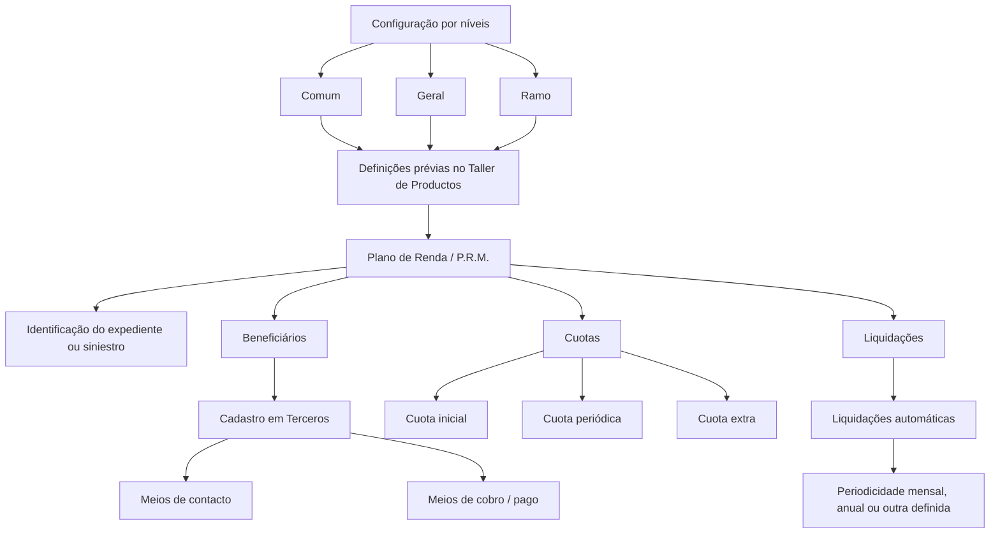
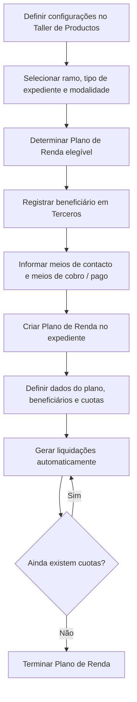

# Plano de Renda (P.R.M.) — Funcionalidades, Definições, Beneficiários, Cuotas e Liquidações

## 1. Metadados do Documento
- **Arquivo de Origem:** Não identificado no conteúdo fornecido
- **Tipo de Documento:** Apresentação Executiva
- **Domínio / Sistema:** Plano de Renda / módulo P.R.M.
- **Público-Alvo:** Negócio, operação, configuração de produtos e equipes de sinistros
- **Data/Versão Identificada:** Não identificada

---

## 2. Resumo Executivo & Contexto de Negócio

O documento descreve o módulo de **Plano de Renda**, identificado como **P.R.M.**, cuja finalidade é cobrir a necessidade de pagar periodicamente um valor a um segurado ou a um ou mais beneficiários. O cenário principal citado é o pagamento decorrente de invalidez permanente, invalidez temporária, acidente laboral ou outras coberturas contratadas.

O Plano de Renda permite ordenar automaticamente pagamentos para pessoas físicas ou jurídicas. Os pagamentos podem permanecer ativos até a recuperação da pessoa, no caso de invalidez temporária, ou até a morte, conforme a descrição funcional das cuotas. O documento também prevê a existência de pagamentos iniciais, periódicos e extraordinários.

O funcionamento do módulo é parametrizável e depende de definições prévias no **Taller de Productos**. As definições são organizadas nos níveis Comum, Geral e Ramo, abrangendo desde controle técnico e erros até planos disponíveis, características, tipos de expediente e modalidades elegíveis.

A operação de um Plano de Renda inclui registrar, consultar, cancelar ou finalizar o plano. As liquidações são geradas automaticamente em periodicidades como mensal ou anual, e a quantidade de liquidações depende dos beneficiários e das cuotas a pagar.

---

## 3. Arquitetura, Componentes & Tecnologias Envolvidas

O documento não detalha arquitetura de software, protocolos, APIs, bancos de dados, microsserviços, tecnologias de implementação, URLs, servidores ou ambientes técnicos.

Os componentes funcionais identificados são:

- **Plano de Renda / P.R.M.:** entidade principal que organiza o pagamento periódico.
- **Expediente / siniestro:** caso ao qual o Plano de Renda está associado.
- **Beneficiários:** pessoas físicas ou jurídicas que recebem pagamentos.
- **Cuotas:** valores a serem pagos, podendo ser iniciais, periódicos ou extras.
- **Liquidações:** registros gerados automaticamente para execução dos pagamentos.
- **Terceros:** sistema ou cadastro no qual o beneficiário deve estar registrado.
- **Taller de Productos:** fonte das definições prévias que parametrizam o comportamento do módulo.
- **Control Técnico:** definição de erros, tipos de erros, condições de paralisação e exigência de autorização.
- **Ramo, tipo de expediente e modalidade:** níveis de configuração que determinam quais expedientes podem operar com Planos de Renda e quais planos podem ser associados.



**Nota de Análise:** o documento apresenta o P.R.M. como módulo funcional, mas não informa a expansão formal da sigla P.R.M., contratos de integração, métodos HTTP, estruturas JSON, persistência de dados ou mecanismos técnicos de execução das liquidações.

---

## 4. Regras de Negócio, Especificações Funcionais & Processos

### Finalidade do Plano de Renda

- O Plano de Renda cobre a necessidade de pagar um importe periodicamente a um segurado ou beneficiário.
- Os casos mencionados incluem invalidez permanente, invalidez temporária, acidente laboral e outras coberturas contratadas.
- O módulo permite ordenar automaticamente pagamentos a uma pessoa física ou jurídica.
- Para invalidez temporária, a cuota é paga até a recuperação.
- Para os demais casos descritos, a cuota pode ser paga até a morte.

### Cuotas

A cuota é o importe que deve ser pago ao beneficiário. O documento identifica os seguintes tipos:

1. **Cuota inicial:** primeira cuota paga no Plano de Renda.
2. **Cuota periódica ou normal:** cuota paga no período estabelecido.
3. **Cuota extra:** cuota paga além das cuotas periódicas; o documento cita como exemplos pagamentos em Natal ou férias.

### Parametrização

- O módulo é parametrizável.
- O comportamento do módulo depende de definições prévias configuradas no **Taller de Productos**.
- As definições são estruturadas nos níveis Comum, Geral e Ramo.

### Moedas

- Os pagamentos podem ser realizados em moedas diferentes da moeda da apólice.
- Os pagamentos também podem ser realizados em moedas diferentes da moeda dos expedientes.

### Registro e condições do beneficiário

- O beneficiário deve estar cadastrado no sistema **Terceros** para permitir as liquidações do Plano de Renda.
- O cadastro do beneficiário deve conter meios de contacto.
- O cadastro do beneficiário deve conter meios de cobro ou pago.
- O cadastro é necessário tanto para realizar pagamentos quanto para contactar os beneficiários.
- Os beneficiários podem ser pessoas físicas e/ou jurídicas.

### Forma de pagamento

O documento menciona as seguintes formas de pagamento:

- Efectivo.
- Transferencia Bancaria.
- Outras formas não especificadas, indicadas por “Etc.”.

### Liquidações

- Deve existir uma ou várias liquidações por Plano de Renda.
- A quantidade de liquidações é determinada pelos beneficiários e pelas cuotas que devem ser pagas.
- As liquidações são geradas automaticamente.
- A geração pode ocorrer mensalmente, anualmente ou em outra periodicidade indicada pelo documento como “etc.”.

### Dados de identificação do Plano de Renda

O Plano de Renda deve identificar:

- Siniestro ou expediente afetado pelo Plano de Renda.
- Datas estimadas de pagamento.
- Moeda de pagamento.
- Importe total do Plano.
- Número de cuotas.
- Outros dados não detalhados, indicados como “Etc.”.

### Níveis de definição

#### Nível Comum

O nível Comum contém definições que não são exclusivas do módulo de siniestros, mas são necessárias para a configuração.

Inclui:

- **Control Técnico:** definição de erros e tipos de erros.

#### Nível Geral

O nível Geral contém definições que afetam todos os expedientes possíveis que possuem Plano de Renda.

Inclui:

- **Plan de Renta:** definição da codificação dos possíveis planos e respectivas validações.
- **Características:** definição das características do Plano de Renda, incluindo número de cuotas e existência de cuotas extras.

#### Nível Ramo

O nível Ramo contém definições que afetam todos os tipos de expediente de um ramo.

Inclui:

- **Tipo de Expediente:** define quais tipos de expediente por ramo podem trabalhar com Planos de Renda.
- **Modalidad:** permite associar, por ramo, tipo de expediente e modalidade, o tipo de Plano de Renda aplicável.
- **Control Técnico:** define as condições em que operações do Plano de Renda podem ser paralisadas ou devem ser autorizadas.

### Operações do Plano de Renda

1. **CREAR Plan Renta:** registra o Plano de Renda no expediente.
2. **ANULAR Plan Renta:** cancela o Plano de Renda.
3. **TERMINAR Plan Renta:** finaliza o Plano de Renda quando não haverá mais cuotas.
4. **TERMINAR Plan Renta sin anular:** finaliza o Plano de Renda sem cancelá-lo.
5. **CONSULTAR Plan Renta:** exibe todas as informações do P.R.M.



---

## 5. Tabelas de Parâmetros, Ambientes e Estruturas de Dados

| Item / Parâmetro | Descrição / Função | Tipo / Valores / Formato | Ambiente / Observações |
| :--- | :--- | :--- | :--- |
| Plano de Renda | Plano para pagamento periódico a segurado ou beneficiário | Entidade funcional do P.R.M. | Associado a um siniestro ou expediente |
| P.R.M. | Sigla usada para o módulo de Plano de Renda | Sigla sem expansão formal informada | O documento alterna “Plan de Renta” e “P.R.M.” |
| Siniestro / expediente | Caso afetado pelo Plano de Renda | Referência obrigatória de identificação | Deve ser identificado no plano |
| Data estimada de pagamento | Data prevista para pagamento | Data | Deve ser identificada no Plano de Renda |
| Moeda de pagamento | Moeda em que ocorre o pagamento | Moeda | Pode ser diferente da moeda da apólice ou expediente |
| Importe total do Plano | Valor total do Plano de Renda | Valor monetário | Deve ser identificado |
| Número de cuotas | Quantidade de cuotas do plano | Número | Característica do Plano de Renda |
| Beneficiário | Pessoa que receberá pagamento | Pessoa física e/ou jurídica | Deve estar registrado em Terceros |
| Meios de contacto | Dados de contato do beneficiário | Não detalhado | Necessários para contactar o beneficiário |
| Meios de cobro / pago | Dados ou instrumentos para pagamento | Não detalhado | Necessários para realizar pagamentos |
| Cuota inicial | Primeira cuota paga pelo Plano de Renda | Valor monetário | Primeiro pagamento do plano |
| Cuota periódica | Cuota normal paga na periodicidade estabelecida | Valor monetário | Paga no período estabelecido |
| Cuota extra | Cuota adicional às cuotas periódicas | Valor monetário | Exemplo: Natal ou férias |
| Liquidação | Registro ou execução automática de pagamento | Uma ou várias por plano | Quantidade varia conforme beneficiários e cuotas |
| Periodicidade de liquidação | Frequência da geração automática de liquidações | Mensal, anual ou outra não detalhada | O documento cita “cada mes, cada año, etc.” |
| Efectivo | Forma de pagamento | Pagamento em dinheiro | Forma explicitamente citada |
| Transferencia Bancaria | Forma de pagamento | Transferência bancária | Forma explicitamente citada |
| Taller de Productos | Fonte de definições prévias | Componente/processo de configuração | Determina o comportamento parametrizável do módulo |
| Control Técnico — Comum | Define erros e tipos de erros | Configuração | Não exclusiva do módulo de siniestros |
| Plan de Renta — Geral | Define codificação de planos e validações | Configuração | Afeta expedientes com Plano de Renda |
| Características — Geral | Define número de cuotas, cuotas extras e outras características | Configuração | Afeta expedientes com Plano de Renda |
| Tipo de Expediente — Ramo | Define tipos de expediente que podem trabalhar com Plano de Renda | Configuração por ramo | Aplicável a todos os tipos de expediente de um ramo |
| Modalidad — Ramo | Associa ramo, tipo de expediente, modalidade e tipo de Plano de Renda | Configuração por ramo | Define o plano que pode ser associado |
| Control Técnico — Ramo | Define condições para parar operações ou exigir autorização | Configuração por ramo | Aplicável a operações de Plano de Renda |
| CREAR Plan Renta | Registra o Plano de Renda no expediente | Operação | Criação do plano |
| ANULAR Plan Renta | Cancela o Plano de Renda | Operação | Anulação do plano |
| TERMINAR Plan Renta | Finaliza o plano quando não haverá mais cuotas | Operação | Finalização com ausência de novas cuotas |
| TERMINAR Plan Renta sin anular | Finaliza o plano sem cancelá-lo | Operação | O documento não detalha a diferença operacional adicional |
| CONSULTAR Plan Renta | Exibe todas as informações do P.R.M. | Operação | Consulta do plano |

---

## 6. Bateria de Perguntas & Respostas para RAG (FAQ Sintético)

### P1: Qual é a finalidade do módulo Plano de Renda ou P.R.M.?
**R:** O módulo Plano de Renda, também referido como P.R.M., cobre a necessidade de pagar periodicamente um importe a um segurado ou a um ou mais beneficiários. O documento cita cenários como invalidez permanente, invalidez temporária, acidente laboral e outras coberturas contratadas.

### P2: Quais tipos de cuota podem existir em um Plano de Renda?
**R:** O documento descreve três tipos de cuota: cuota inicial, que é a primeira paga no plano; cuota periódica ou normal, paga no período estabelecido; e cuota extra, paga além das periódicas, com exemplos como pagamentos em Natal ou férias.

### P3: Até quando uma cuota pode ser paga em caso de invalidez temporária?
**R:** Em caso de invalidez temporária, a cuota é paga ao segurado ou aos beneficiários até a recuperação da pessoa, conforme a definição apresentada no documento.

### P4: O que é necessário para que um beneficiário receba liquidações do Plano de Renda?
**R:** O beneficiário deve estar cadastrado no sistema Terceros. O cadastro deve conter meios de contacto e meios de cobro ou pago, pois essas informações são necessárias para efetuar pagamentos e contactar o beneficiário.

### P5: O Plano de Renda permite pagamentos em moeda diferente da moeda da apólice?
**R:** Sim. O documento informa que os pagamentos podem ser realizados em moedas diferentes da moeda da apólice ou da moeda dos expedientes.

### P6: Quais dados devem identificar um Plano de Renda?
**R:** Devem ser identificados o siniestro ou expediente afetado, as datas estimadas de pagamento, a moeda de pagamento, o importe total do plano e o número de cuotas. O documento também indica a existência de outros dados não especificados por meio de “Etc.”.

### P7: Como são geradas as liquidações do Plano de Renda?
**R:** As liquidações são geradas automaticamente. O documento cita geração mensal, anual ou outra periodicidade não detalhada. A quantidade de liquidações depende dos beneficiários e das cuotas que precisam ser pagas.

### P8: Quais são os níveis de definição do P.R.M.?
**R:** O documento define três níveis: Comum, Geral e Ramo. O nível Comum abrange, entre outros itens, controle técnico de erros. O nível Geral define planos de renda, codificações, validações e características. O nível Ramo define tipos de expediente, modalidade e condições técnicas para paralisação ou autorização de operações.

### P9: O que o nível Geral configura para o Plano de Renda?
**R:** No nível Geral são configurados o Plano de Renda, incluindo codificação dos possíveis planos e suas validações, e as características do plano, incluindo número de cuotas e existência de cuotas extras.

### P10: Como o nível Ramo determina a elegibilidade de um Plano de Renda?
**R:** O nível Ramo define quais tipos de expediente podem trabalhar com Planos de Renda. Também permite associar, por ramo, tipo de expediente e modalidade, o tipo de Plano de Renda que pode ser associado.

### P11: Quais operações podem ser realizadas em um Plano de Renda?
**R:** As operações listadas são: criar o Plano de Renda no expediente, anular o Plano de Renda, terminar o Plano de Renda quando não haverá mais cuotas, terminar o Plano de Renda sem anulá-lo e consultar todas as informações do P.R.M.

### P12: Qual é a diferença documentada entre “TERMINAR Plan Renta” e “TERMINAR Plan Renta sin anular”?
**R:** “TERMINAR Plan Renta” permite finalizar o plano quando não haverá mais cuotas. “TERMINAR Plan Renta sin anular” permite finalizar o plano sem cancelá-lo. O documento não apresenta detalhamento adicional sobre regras, efeitos operacionais ou critérios de uso entre as duas operações.

---

## 7. Glossário de Termos, Siglas & Conceitos-Chave

- **P.R.M.:** sigla utilizada no documento para se referir ao módulo ou contexto de Plano de Renda; a expansão formal não é apresentada.
- **Plano de Renda / Plan de Renta:** plano que organiza pagamentos periódicos a segurados ou beneficiários.
- **Cuota:** importe a ser pago ao beneficiário; pode ser inicial, periódica ou extra.
- **Cuota inicial:** primeira cuota paga no Plano de Renda.
- **Cuota periódica:** cuota normal paga no período estabelecido.
- **Cuota extra:** cuota adicional às periódicas, como pagamentos de Natal ou férias.
- **Liquidação:** geração ou execução automática de pagamento relacionada a beneficiários e cuotas.
- **Beneficiário:** pessoa física ou jurídica que receberá pagamento do Plano de Renda.
- **Siniestro:** ocorrência ou sinistro associado ao Plano de Renda.
- **Expediente:** caso associado ao Plano de Renda.
- **Terceros:** sistema ou cadastro no qual o beneficiário deve ser registrado.
- **Taller de Productos:** contexto de definições prévias que parametriza o comportamento do módulo.
- **Control Técnico:** definição de erros, tipos de erros e condições de paralisação ou autorização de operações.
- **Ramo:** nível de configuração que afeta tipos de expediente de uma área ou ramo.
- **Tipo de Expediente:** classificação de expediente configurada para poder trabalhar com Plano de Renda.
- **Modalidad:** configuração que associa ramo, tipo de expediente e modalidade a um tipo de Plano de Renda.
- **Efectivo:** forma de pagamento em dinheiro.
- **Transferencia Bancaria:** forma de pagamento por transferência bancária.

---

## 8. Notas Críticas, Riscos & Limitações

- O documento não identifica nome de arquivo, autor, data, versão ou histórico de alterações.
- A expansão da sigla **P.R.M.** não é explicitamente informada.
- Não há especificação de arquitetura técnica, APIs, integrações, bancos de dados, mensageria, segurança, autenticação, URLs, servidores ou ambientes.
- O documento não detalha campos, formatos ou validações dos meios de contacto e meios de cobro / pago do beneficiário.
- O documento menciona “Etc.” em dados de identificação, meios de pagamento e periodicidades, sem listar os valores adicionais.
- Não há detalhamento sobre regras de cálculo das cuotas, critérios de distribuição entre múltiplos beneficiários, tratamento de arredondamento, impostos ou conversão de moedas.
- A diferença funcional entre terminar um Plano de Renda e terminá-lo sem anulá-lo não é detalhada além das descrições apresentadas.
- As condições específicas de paralisação de operações e de exigência de autorização são mencionadas no nível Ramo, mas não são enumeradas.

---

## 9. Conteúdo Bruto Estruturado (Referência Fiel)

```text
--- [PÁGINA 1 DE 5] ---

INTRODUCCIÓN - Plan de Renta
OBJETIVO
La finalidad de este módulo es cubrir las necesidades de pagar un importe periódicamente a un
asegurado o beneficiario/s, por una invalidez permanente o temporal.
Concepto
Cuota
Características
Elementos del Plan de Renta
Definiciones P.R.M.
Operaciones P.R.M.
Conceptos
Cuota
Es el importe que hay que pagar al beneficiario hasta su recuperación o muerte.
Existen la posibilidad de tener diferentes cuotas:
- Cuota inicial - Se paga la primera del plan - Cuota periódica (normal)- Se paga en el periodo
 /
 RS
Inicio Soluciones APIs Documentación Zeus
ES


--- [PÁGINA 2 DE 5] ---

establecido
- Cuota extra - cuotas que se pagan además de las periódica, por ejemplo en navidad, en
vacaciones....
Características
Cubre todas las funcionalidades del Plan de Renta
Este módulo, contiene todas las funcionalidades necesarias para ordenar el pago a una persona
física o jurídica automáticamente, cuando una persona tiene contratada una cobertura de
invalidez, accidente laboral, etc.
Parametrizable
El módulo es parametrizable y el comportamiento del mismo depende de las definiciones previas
(Taller de Productos)
Múltiples monedas
Los pagos pueden realizarse en monedas distintas a la de la póliza o a la de los expedientes
Registro de Beneficiario
Para realizar las liquidaciones del Plan, el beneficiario tiene que estar ingresado en el sistema
(Terceros), con sus medios de contacto, sus medios de cobro / pago, para poder realizar pagos y
para poder contactar con ellos.
Una o varias liquidaciones por Plan de Renta
Existirán tantas liquidaciones como beneficiarios y cuotas haya que pagar.
Elementos del Plan de Renta
El Plan de Renta está compuesto de varios elementos:
PRM
IDENTIFICACIÓN BENEFICIARIOS CUOTAS LIQUIDACIONES
Datos Identificación del Plan de Renta
Se tiene que identificar:
Siniestro/expediente al que va afectar el plan de Renta
Fechas estimada de pago
Moneda de pago
Importe Total del Plan
Número de cuotas


--- [PÁGINA 3 DE 5] ---

Etc.
Beneficiarios
Se debe identificar la/s persona/s (físicas y/o jurídicas) a la cual le vamos a pagar.
El modo en el que le vamos a pagar:
Efectivo
Transferencia Bancaria
Etc.
Cuotas
Es el importe que hay que pagar periódicamente a una asegurado o a sus beneficiarios hasta su
recuperación (en caso de invalidez temporal) o muerte.
Liquidación
Se generarán automáticamente cada mes, cada año, etc.
Definiciones P.R.M.
Los elementos de definición atienden a distintos niveles:
NIVELES DE DEFINICIÓN
COMÚN GENERAL RAMO
COMÚN
En este nivel se encuentran definiciones que NO son exclusivas del
módulo de siniestros, pero son necesarias para poder realizar la
definición. Entre otras definiciones se encuentra:
CONTROL TÉCNICO
Definición de errores, tipos de Errores


--- [PÁGINA 4 DE 5] ---

GENERAL
En este nivel se encuentran definiciones que afectarán a todos los
posibles expedientes que tienen un plan de renta
PLAN DE RENTA
Definición de la codificación de los posibles
planes y sus validaciones
CARACTERÍSTICAS
Definición de las características del plan de
renta, número de cuotas, si tiene cuotas
extras, etc
RAMO
En este nivel se encuentran definiciones que afectarán a todos los tipos
de expediente de un ramo
TIPO DE EXPEDIENTE
Define que tipos de expediente por Ramo van
a poder trabajar con planes de Renta
MODALIDAD
Permite asociar por ramo, tipo de expediente
y modalidad que tipo de plan de renta se
puede asociar
CONTROL TÉCNICO
Definir en qué condiciones se puede paralizar
las operaciones de plan de renta u obligación
de ser autorizada
Operaciones P.R.M.
PLAN DE RENTA
Operaciones que se pueden realizar con un Plan de Renta


--- [PÁGINA 5 DE 5] ---

CREAR Plan Renta
Permite registrar el Plan de Renta al
expediente
ANULAR Plan Renta
Permite cancelar un Plan de Renta
TERMINAR Plan Renta
Permite finalizar el Plan de Renta cuando este
ya no va a tener más cuotas
TERMINAR Plan Renta sin anular
Permite finalizar el Plan de Renta sin
cancelarlo
CONSULTAR Plan Renta
Muestra toda la información del P.R.M
```
