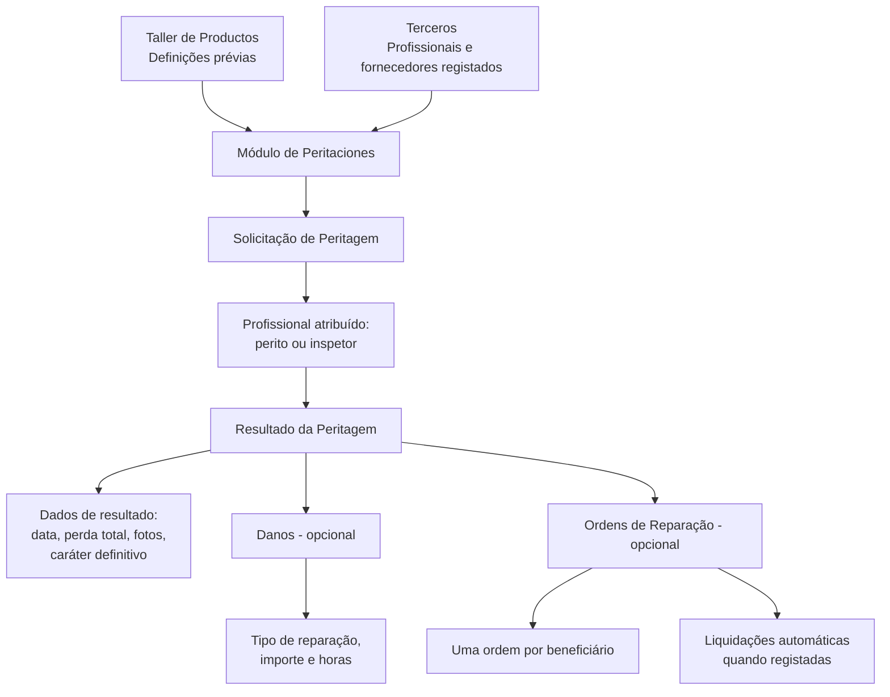
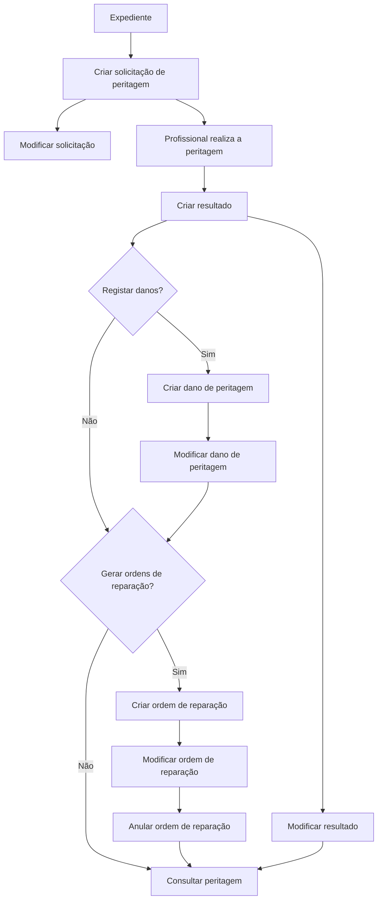

# Módulo de Peritaciones: Registro, Definições, Elementos e Operações de Peritação

## 1. Metadados do Documento
- **Arquivo de Origem:** `Não identificado`
- **Tipo de Documento:** Manual Operacional / Especificação Funcional
- **Domínio / Sistema:** Módulo de Peritaciones (Peritagens), Siniestros e Terceros
- **Público-Alvo:** Negócio, analistas funcionais, tramitadores, peritos, inspetores, equipas de operação e desenvolvimento
- **Data/Versão Identificada:** Não identificada

---

## 2. Resumo Executivo & Contexto de Negócio

O documento descreve o módulo de **Peritaciones**, responsável por registar e gerir o ciclo de vida de uma peritagem. O fluxo abrange desde o pedido ou encargo de uma peritagem a um profissional — como perito ou inspetor — até à sua finalização, incluindo a receção da fatura enviada pelos fornecedores à companhia.

O módulo cobre as funcionalidades necessárias para operar peritagens e declara ser parametrizável. O comportamento da aplicação depende de definições prévias realizadas no **Taller de Productos**, incluindo definições comuns, gerais, por ramo e específicas de peritação.

A realização de uma peritagem depende do registo prévio dos intervenientes no sistema de **Terceros**. Profissionais, fornecedores de peças, oficinas, pedreiros e outros fornecedores devem possuir dados de contacto e meios de cobrança/pagamento, permitindo o contacto operacional e o processamento de pagamentos.

A estrutura funcional da peritagem é composta por solicitação, resultado, danos e ordens de reparação. Os danos e as ordens de reparação são elementos opcionais. Quando são registadas ordens de reparação, podem ser geradas liquidações automaticamente; deve existir uma ordem por cada beneficiário resultante da peritagem.

---

## 3. Arquitetura, Componentes & Tecnologias Envolvidas

### Componentes e entidades identificados

| Componente / Entidade | Papel descrito no documento |
| :--- | :--- |
| Módulo de Peritaciones | Gere o ciclo de vida de peritagens, desde a solicitação até à finalização e faturação de fornecedores. |
| Taller de Productos | Origem das definições prévias que parametrizam o comportamento da aplicação. |
| Terceros | Sistema onde profissionais e fornecedores devem ser registados com contactos e meios de cobrança/pagamento. |
| Expediente | Contexto no qual são realizadas operações de peritação. |
| Solicitud de peritación | Registo do pedido para realização de uma peritagem ou investigação. |
| Resultado de la peritación | Registo dos dados e da conclusão da peritagem executada pelo profissional. |
| Daños | Elemento opcional para detalhar danos, tipo de reparação, importes e horas de reparação. |
| Órdenes de reparación | Elemento opcional utilizado para gerar ordens associadas a intervenientes/beneficiários e permitir pagamentos. |
| Liquidaciones | Podem ser geradas automaticamente quando as ordens de reparação são registadas. |
| Perito | Profissional que pode realizar peritagens. |
| Inspector | Profissional que pode realizar peritagens ou visitas. |
| Taller | Oficina registada pela companhia. |
| Centro de Peritación | Centro ao qual peritos podem ser associados. |
| Tramitador | Atividade indicada como potencialmente capacitada para realizar peritagens. |



### Níveis de definição

```mermaid
graph TD
    A[Definições de Peritação] --> B[Comum]
    A --> C[Geral]
    A --> D[Ramo]
    A --> E[Peritação]

    B --> B1[Perito]
    B --> B2[Taller]
    B --> B3[Centro de Peritación]

    C --> C1[Causa Proceso]
    C --> C2[Lugares Peritación]
    C --> C3[Cuadro Honorarios]
    C --> C4[Resultado Visitas]
    C --> C5[Peritos por Centro]

    D --> D1[Tipo Expediente]
    D --> D2[Causa Proceso]
    D --> D3[Actividad Peritar]
    D --> D4[Características Peritación]

    E --> E1[Atributo]
    E --> E2[Estructura]
    E --> E3[Información Inicial]
    E --> E4[Validaciones Información]
    E --> E5[Concepto Detalle Peritación]
    E --> E6[Partes]
    E --> E7[Daños]
    E --> E8[Reparación]
```



> **Nota de Análise:** O documento não identifica tecnologias, linguagens de programação, protocolos, URLs, ambientes, bases de dados, métodos HTTP ou contratos JSON.

---

## 4. Regras de Negócio, Especificações Funcionais & Processos

### 4.1 Finalidade do módulo

1. O módulo permite registar peritagens desde o respetivo encargo a um profissional até à finalização e receção do resultado.
2. O escopo inclui o envio de faturas por fornecedores à companhia.
3. O módulo cobre funcionalidades desde a solicitação/encargo de peritagem a um profissional até ao encerramento da peritagem.
4. O comportamento da aplicação depende de definições prévias configuradas no Taller de Productos.

### 4.2 Pré-requisito de registo de intervenientes

1. Para executar uma peritagem, profissionais e fornecedores devem estar registados no sistema **Terceros**.
2. Os intervenientes mencionados incluem:
   - Peritos;
   - Inspetores;
   - Fornecedores de peças;
   - Oficinas;
   - Pedreiros;
   - Outros fornecedores.
3. Os registos devem conter meios de contacto.
4. Os registos devem conter meios de cobrança/pagamento.
5. Os dados registados permitem contactar intervenientes e realizar pagamentos.

### 4.3 Elementos de uma peritagem

#### Solicitação de peritagem

A solicitação deve recolher, no mínimo:

- Local da peritagem;
- Profissional atribuído, como perito ou inspetor;
- Data estimada da peritagem;
- Outros dados não detalhados no documento.

#### Resultado da peritagem

O resultado pode conter:

- Data da peritagem;
- Indicação sobre perda total;
- Indicação sobre anexação de fotografias;
- Indicação sobre se a peritagem é definitiva;
- Outros dados não detalhados no documento.

#### Danos

1. O elemento de danos é opcional.
2. Se utilizado, deve detalhar:
   - Danos produzidos;
   - Tipo de reparação;
   - Importe;
   - Número de horas necessárias para reparar;
   - Outros dados não detalhados no documento.

#### Ordens de reparação

1. O elemento de ordens de reparação é opcional.
2. Se utilizado, deve gerar tantas ordens quantos os beneficiários resultantes da peritagem.
3. O registo de ordens permite gerar liquidações automaticamente.
4. Para autos, são mencionados como possíveis intervenientes:
   - Oficina;
   - Fornecedor de peças de reposição;
   - Perito externo.
5. Para gerais, são mencionados como possíveis intervenientes:
   - Pedreiro;
   - Perito externo.

### 4.4 Definições comuns

| Definição | Regra ou finalidade |
| :--- | :--- |
| Perito | Registar todos os peritos da companhia. |
| Taller | Registar todas as oficinas da companhia. |
| Centro de Peritación | Registar os diferentes centros de peritagem para posteriormente associar peritos. |

### 4.5 Definições gerais

| Definição | Regra ou finalidade |
| :--- | :--- |
| Causa Proceso | Catalogar os motivos pelos quais se pretende realizar uma peritagem. |
| Lugares Peritación | Definir locais de trabalho de peritos e inspetores onde podem realizar peritagens, como oficina, residência do segurado ou empresa do segurado. |
| Cuadro Honorarios | Definir honorários diferentes para peritos, inspetores externos e outros, de acordo com os diferentes locais de trabalho. |
| Resultado Visitas | Definir resultados de visitas que podem ou não desencadear o resultado da peritagem. Uma visita falhada não dispara o resultado da peritagem, sendo necessário realizar nova visita. |
| Peritos por Centro | Associar peritos aos diferentes centros de peritagem. |

### 4.6 Definições por ramo

| Definição | Regra ou finalidade |
| :--- | :--- |
| Tipo Expediente | Definir os tipos de dano aos quais pode ser realizada uma peritagem e determinar se a peritagem é obrigatória ou não. |
| Causa Proceso | Catalogar motivos para realizar uma operação, como causa da peritagem, subscrição ou avaliação de danos para reparação. |
| Actividad Peritar | Definir que atividade está capacitada para realizar peritagens, incluindo peritos, inspetores e tramitadores. |
| Características Peritación | Definir a propriedade a ser peritada por tipo de dano e a estrutura de dados adicionais. |

### 4.7 Definições específicas de peritação

| Definição | Regra ou finalidade |
| :--- | :--- |
| Atributo | Definir informação adicional da peritagem. |
| Estructura | Estruturar informação adicional da peritagem. |
| Información Inicial | Registar informação prévia para atributos de operações de peritagem, evitando introdução posterior. O exemplo fornecido é atribuir, por defeito, um perito à atividade de realização da peritagem. |
| Validaciones Información | Definir comportamentos e validações da informação core solicitada nas operações de peritação. |
| Concepto Detalle Peritación | Determinar o conceito de detalhe da peritagem para realizar uma ordem de reparação, como reparação, chapa, pintura ou mão de obra. |
| Partes | Definir partes de uma propriedade; para veículo, por exemplo, parte dianteira ou lateral direita. |
| Daños | Definir danos por propriedade. |
| Reparación | Codificar possíveis reparações de uma propriedade, como substituir ou reparar. |

### 4.8 Operações de peritação

1. As operações de peritação são realizadas no contexto de um expediente.
2. As operações podem ser executadas tanto **em linha** como **diferido**.
3. As operações disponíveis são:
   - Criar solicitação de peritagem;
   - Modificar solicitação;
   - Criar resultado;
   - Modificar resultado;
   - Criar dano de peritagem;
   - Modificar dano de peritagem;
   - Criar ordem de reparação;
   - Modificar ordem de reparação;
   - Anular ordem de reparação;
   - Consultar peritagem.



---

## 5. Tabelas de Parâmetros, Ambientes e Estruturas de Dados

### 5.1 Dados mínimos da solicitação

| Item / Parâmetro | Descrição / Função | Tipo / Valores / Formato | Ambiente / Observações |
| :--- | :--- | :--- | :--- |
| Lugar de peritación | Local onde a peritagem será realizada. | Não detalhado. | Dado mínimo da solicitação. |
| Profesional asignado | Perito ou inspetor atribuído à peritagem. | Perito ou inspetor. | Deve estar registado em Terceros. |
| Fecha estimada de peritación | Data prevista para execução da peritagem. | Data; formato não detalhado. | Dado mínimo da solicitação. |
| Outros dados | Dados adicionais da solicitação. | Não detalhado. | O documento usa “etc.” sem especificação adicional. |

### 5.2 Dados do resultado

| Item / Parâmetro | Descrição / Função | Tipo / Valores / Formato | Ambiente / Observações |
| :--- | :--- | :--- | :--- |
| Fecha de la peritación | Data em que a peritagem ocorreu. | Data; formato não detalhado. | Parte do resultado. |
| Pérdida total | Indica se existe perda total. | Sim/Não implícito; valores não detalhados. | Parte do resultado. |
| Fotos adjuntas | Indica se existem fotografias anexadas. | Sim/Não implícito; formato não detalhado. | Parte do resultado. |
| Peritación definitiva | Indica se a peritagem é definitiva. | Sim/Não implícito; valores não detalhados. | Parte do resultado. |

### 5.3 Dados de danos

| Item / Parâmetro | Descrição / Função | Tipo / Valores / Formato | Ambiente / Observações |
| :--- | :--- | :--- | :--- |
| Daños producidos | Danos ocorridos na propriedade. | Não detalhado. | Elemento opcional. |
| Tipo de reparación | Tipo de reparação associado ao dano. | Não detalhado. | Elemento opcional. |
| Importe | Valor associado ao dano ou reparação. | Não detalhado. | Elemento opcional. |
| Número de horas | Horas necessárias para reparar. | Número; unidade em horas. | Elemento opcional. |

### 5.4 Operações funcionais

| Item / Parâmetro | Descrição / Função | Tipo / Valores / Formato | Ambiente / Observações |
| :--- | :--- | :--- | :--- |
| Crear solicitud peritación | Registar pedido para realizar peritagem ou investigação. | Operação. | Executada num expediente. |
| Modificar solicitud | Alterar informação da solicitação de peritagem. | Operação. | Executada num expediente. |
| Crear resultado | Gerar dados do resultado da peritagem feita por profissional. | Operação. | Executada num expediente. |
| Modificar resultado | Alterar informação do resultado de peritagem. | Operação. | Executada num expediente. |
| Crear daño peritación | Registar danos ocasionados num veículo, imóvel ou outra propriedade. | Operação. | Executada num expediente. |
| Modificar daño peritación | Alterar danos ocasionados num veículo, imóvel ou outra propriedade. | Operação. | Executada num expediente. |
| Crear orden reparación | Gerar ordem para pagar profissional interveniente na peritagem. | Operação. | Executada num expediente. |
| Modificar orden reparación | Alterar dados e importes de uma ordem. | Operação. | Executada num expediente. |
| Anular orden reparación | Cancelar uma ordem de reparação. | Operação. | Executada num expediente. |
| Consultar peritación | Visualizar toda a informação de uma peritagem. | Operação. | Executada num expediente. |

### 5.5 Ambientes, servidores e URLs

| Item / Parâmetro | Descrição / Função | Tipo / Valores / Formato | Ambiente / Observações |
| :--- | :--- | :--- | :--- |
| Ambientes | Não especificados. | Não aplicável. | O documento não apresenta mapeamento de ambientes. |
| Servidores | Não especificados. | Não aplicável. | O documento não apresenta nomes, IPs ou portas. |
| URLs | Não especificadas. | Não aplicável. | O documento não apresenta URLs. |
| Rotas de logs | Não especificadas. | Não aplicável. | O documento não apresenta configuração de logs. |

---

## 6. Bateria de Perguntas & Respostas para RAG (FAQ Sintético)

### P1: Qual é o objetivo do módulo de Peritaciones?
**R:** O módulo de Peritaciones permite registar e gerir todas as peritagens desde o pedido ou encargo feito a um profissional, como perito ou inspetor, até à finalização da peritagem e à receção da fatura enviada por fornecedores à companhia.

### P2: Que sistemas ou definições condicionam o comportamento do módulo de Peritaciones?
**R:** O documento indica que o módulo é parametrizável e que o comportamento da aplicação depende de definições prévias realizadas no Taller de Productos. Além disso, profissionais e fornecedores devem estar registados no sistema Terceros.

### P3: Que informação mínima deve existir numa solicitação de peritagem?
**R:** A solicitação de peritagem deve recolher pelo menos o local da peritagem, o profissional atribuído — perito ou inspetor — e a data estimada para a peritagem. O documento menciona também dados adicionais, mas não os especifica.

### P4: Que informação pode ser registada no resultado de uma peritagem?
**R:** O resultado pode incluir a data da peritagem, a indicação de perda total, a indicação de anexação de fotografias e a indicação de que a peritagem é definitiva. O documento menciona outros dados sem os detalhar.

### P5: Os danos são obrigatórios numa peritagem?
**R:** Não. O elemento de danos é opcional. Quando utilizado, permite detalhar os danos produzidos, o tipo de reparação, o importe e o número de horas necessário para reparar.

### P6: Quando devem ser geradas ordens de reparação?
**R:** As ordens de reparação são opcionais. Quando utilizadas, devem ser geradas tantas ordens quantos os beneficiários surgidos na peritagem. O registo dessas ordens pode permitir a geração automática de liquidações.

### P7: Que intervenientes podem estar associados a ordens de reparação em autos e gerais?
**R:** Para autos, o documento menciona oficina, fornecedor de peças de reposição e perito externo. Para gerais, menciona pedreiro e perito externo.

### P8: O que acontece quando uma visita tem resultado falhado?
**R:** A definição de Resultado Visitas permite determinar resultados que desencadeiam ou não o resultado da peritagem. Se a visita for falhada, o resultado da peritagem não é disparado, porque deve ser realizada uma nova visita.

### P9: Para que serve a definição “Peritos por Centro”?
**R:** A definição Peritos por Centro permite associar os peritos aos diferentes centros de peritagem previamente registados.

### P10: O que a definição “Tipo Expediente” determina?
**R:** Tipo Expediente permite definir os tipos de dano aos quais pode ser realizada uma peritagem e determinar se a peritagem é obrigatória ou não.

### P11: Que atividades podem ser capacitadas para realizar peritagens?
**R:** A definição Actividad Peritar permite configurar quais atividades estão capacitadas para realizar peritagens. O documento cita peritos, inspetores e tramitadores como exemplos.

### P12: Quais operações podem ser executadas numa peritagem de expediente?
**R:** Podem ser criadas e modificadas solicitações, resultados, danos e ordens de reparação; as ordens também podem ser anuladas. A operação Consultar peritación permite visualizar toda a informação da peritagem. Essas operações podem ser realizadas em linha ou de forma diferida.

---

## 7. Glossário de Termos, Siglas & Conceitos-Chave

- **Peritación / Peritagem:** Processo de avaliação, investigação ou análise realizado por um profissional, desde a solicitação até à obtenção do resultado.
- **Perito:** Profissional registado pela companhia que pode realizar peritagens.
- **Inspector / Inspetor:** Profissional que pode ser atribuído a uma peritagem ou visita.
- **Taller:** Oficina registada pela companhia.
- **Centro de Peritación:** Centro de peritagem utilizado para associar peritos.
- **Terceros:** Sistema onde profissionais e fornecedores são registados com dados de contacto e meios de cobrança/pagamento.
- **Expediente:** Contexto funcional onde são executadas operações de peritação.
- **Solicitud de peritación:** Pedido para realização de uma peritagem ou investigação.
- **Resultado de la peritación:** Dados resultantes da peritagem realizada por um profissional.
- **Daños:** Danos produzidos numa propriedade, como veículo ou imóvel.
- **Órdenes de reparación:** Ordens geradas para suportar o pagamento de profissionais que intervieram numa peritagem.
- **Liquidaciones:** Liquidações que podem ser geradas automaticamente quando ordens de reparação são registadas.
- **Ramo:** Nível de definição exclusivo do ramo que está a ser configurado.
- **Causa Proceso:** Definição para catalogar motivos de realização de peritagem ou operação.
- **Cuadro Honorarios:** Definição de honorários para peritos, inspetores externos e outros intervenientes conforme locais de trabalho.
- **Actividad Peritar:** Definição da atividade que está capacitada para executar peritagens.
- **Información Inicial:** Informação prévia para atributos de operações de peritagem.
- **Validaciones Información:** Comportamentos e validações aplicados à informação core solicitada em operações de peritação.
- **Concepto Detalle Peritación:** Conceito de detalhe utilizado numa ordem de reparação, como reparação, chapa, pintura ou mão de obra.

---

## 8. Notas Críticas, Riscos & Limitações

- O módulo depende de definições prévias no Taller de Productos; o documento não apresenta o processo técnico de configuração, responsáveis, permissões ou sequência obrigatória dessas definições.
- A realização de peritagens depende do registo de profissionais e fornecedores em Terceros, incluindo dados de contacto e meios de cobrança/pagamento.
- Danos e ordens de reparação são elementos opcionais; o documento não define critérios adicionais para determinar quando devem ser utilizados.
- Uma visita falhada não desencadeia o resultado da peritagem e exige nova visita.
- A geração automática de liquidações é mencionada, mas o documento não detalha condições, cálculos, estados, integrações ou tratamento de falhas.
- O documento não especifica modelos de dados, campos obrigatórios completos, interfaces, contratos de integração, APIs, mecanismos de autenticação, logs, ambientes ou URLs.
- O documento lista operações em linha e diferidas, mas não define o mecanismo, agendamento, controlo de execução ou recuperação de erros das operações diferidas.

---

## 9. Conteúdo Bruto Estruturado (Referência Fiel)

```text
--- [PÁGINA 1 DE 7] ---

INTRODUCCIÓN - Peritaciones
Objetivo
La finalidad de este módulo, es poder registrar todas las peritaciones, desde que se encargan a un
profesional, hasta que se finaliza y se recibe el resultado.
Características
Elementos de una Peritación
Definiciones de Peritaciones
Operaciones Peritación
Características
Cubre todas las funcionalidades de las peritaciones
Contiene todas las funcionalidades necesarias de las peritaciones, desde el encargo o solicitud
de las peritaciones a un profesional (perito, inspector), hasta la finalización de la misma, con el
envío de la factura por parte de los proveedores a la compañía.
Parametrizable
El módulo es parametrizable y el comportamiento de la aplicación depende de las definiciones
 / 
 RS
Inicio Soluciones APIs Documentación Zeus
ES


--- [PÁGINA 2 DE 7] ---

previas (Taller de Productos).
Registro de Proveedor
Para realizar una peritación, el profesional (perito, inspector..) el proveedor (proveedor de piezas,
taller,albañil..), etc tienen que estar registrados en el sistema (Terceros), con sus medios de
contacto, sus medios de cobro / pago, para poder realizar pagos y para poder contactar con
ellos.
Elementos de las Peritaciones
Las peritaciones están compuestas de varios elementos:
PERITACIONES
SOLICITUD RESULTADO DAÑOS ÓRDENES DE REPARACIÓN
Solicitud de la peritación
Se recogerán los datos mínimos de la peritación:
Lugar de peritación
Profesional asignado (perito, inspector)
Fecha estimada de peritación
Etc
Resultado de la peritación
Este elemento contendrá el resultado de la peritación:
Fecha de la peritación
Se indicará si es pérdida total o no
Si se adjunta fotos
Si es una peritación definitiva
Etc.
Daños
Este elemento es opcional. Si se utiliza, se detallará:
Daños producidos
Tipo de reparación
Importe


--- [PÁGINA 3 DE 7] ---

Número de horas que se tarda en reparar
Etc.
Órdenes de reparación
Este elemento de las peritaciones es opcional. Si se utiliza, se deberá generar tantas órdenes como
beneficiarios hayan surgido en la peritación. Si se registran, se pueden generar las liquidaciones
automáticamente.
Si es de autos: el taller, proveedor de repuestos, perito externo..
Si es de generales: el albañil, el perito externo...
Definiciones Peritación
Los elementos de definición atienden a distintos niveles:
NIVELES DE DEFINICIÓN
COMÚN GENERAL RAMO PERITACIÓN
COMÚN
En este nivel se encuentran definiciones que NO son exclusivas del
módulo de siniestros, pero son necesarias para poder realizar la
definición de peritaciones. En otros se encuentran:
PERITO
Registrar todos los peritos de la compañía
TALLER
Registrar todos los talleres de la compañía
CENTRO DE PERITACIÓN
Registrar los diferentes Centros de Peritación,
para posteriormente asociar peritos


--- [PÁGINA 4 DE 7] ---

GENERAL
En este Nivel se encuentran definiciones que afectarán a todos los
posibles expedientes a los que se les pueda realizar una peritación.
Entre otros se define:
CAUSA PROCESO
Permite catalogar los motivos por los que se
quiere realizar una peritación
LUGARES PERITACIÓN
Permite definir los lugares de trabajo de los
peritos, inspectores, es decir dónde va a
poder realizar las peritaciones. Por ejemplo
en un taller, en el hogar del asegurado, en la
empresa del asegurado, etc
CUADRO HONORARIOS
Permite definir para peritos, inspectores
externos etc, diferentes honorarios según los
distintos lugares de trabajo de los peritos
RESULTADO VISITAS
Permite definir diferentes resultados de las
visitas pudiendo desencadenar o no el
resultado de la peritación. Por ejemplo si la
visita es fallida no se disparará el resultado de
la peritación, ya que habrá que volver a
realizar la visita
PERITOS POR CENTRO
Permite asociar los peritos a los distintos
centros de periración
RAMO
Son exclusivas del ramo que se está definiendo
TIPO EXPEDIENTE
 CAUSA PROCESO


--- [PÁGINA 5 DE 7] ---

Permite definir los Tipos de Daño a los que se
les va a poder realizar una peritación y si esta
es obligatoria o no
Permite catalogar los motivos por los que se
quiere realizar una operación. Ejemplo causa
de la peritación, para suscripción, evaluación
de daños para reparación
ACTIVIDAD PERITAR
Definir que actividad está capacitada para
realizar peritaciones, peritos, inspectores,
tramitadores..
CARACTERÍSTICAS PERITACIÓN
Definición de la propiedad que se va a peritar
por tipo de daño, estructura de datos
adicionales...
PERITACIÓN
Afecta a todas las peritaciones
ATRIBUTO
Permite definir la información adicional de la
peritación
ESTRUCTURA
Información adicional de la peritación
INFORMACIÓN INICIAL
Registrar información previa para los atributos
de las operaciones de peritaciones, para no
tener que introducirla posteriormente. Un
ejemplo sería dar a la actividad para realizar
la peritación por defecto perito
VALIDACIONES INFORMACIÓN
Definir comportamientos y validaciones de la
información core, que se pide en las
operaciones de peritación.
CONCEPTO DETALLE PERITACIÓN
Determina el concepto de detalle de la
peritación para realizar una orden de
reparación. Ejemplo Reparación, chapa,
pintura, mano de obra...
PARTES
Partes de una propiedad Si es un vehículo,
parte delantera, parte lateral derecha...
DAÑOS
Definición de Daños por propiedad
REPARACIÓN


--- [PÁGINA 6 DE 7] ---

Codificación de las posibles reparaciones de
una propiedad, sustituir, reparar
Operaciones de Peritación
PERITACIONES
Operaciones de peritación de un expediente, se pueden realizar tanto en
línea como diferido
CREAR solicitud peritación
En esta operación se registra la solicitud para
que se realice una peritación / investigación
MODIFICAR solicitud
Permite cambiar información de la solicitud de
peritación
CREAR resultado
En esta operación se generan los datos del
resultado de la peritación realizada por un
profesional
MODIFICAR resultado
Permite cambiar la información del resultado
de la peritación
CREAR daño peritación
Permite registrar los daños ocasionados del
vehículo, del inmueble...
MODIFICAR daño peritación
Permite modificar los daños ocasionados del
vehículo, del inmueble...
CREAR orden reparación
Permite generar una orden para poder pagar
a un profesional que haya intervenido en la
peritación
MODIFICAR orden reparación
Permite modificar una orden tanto los datos,
como los importes de la misma
ANULAR orden reparación
Permite cancelar una orden de reparación
CONSULTAR peritación
Visualiza toda la información de una
peritación.


--- [PÁGINA 7 DE 7] ---

[Página em branco ou apenas elementos visuais/imagem]
```
