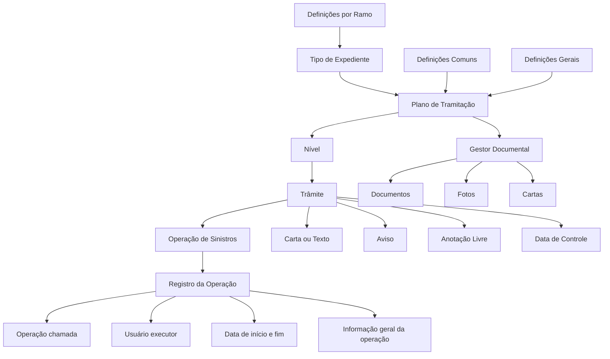
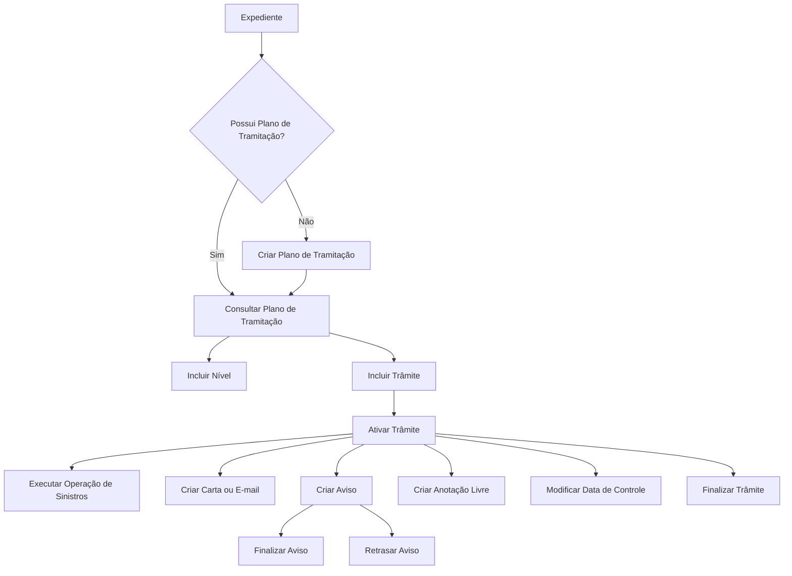

# Plano de Tramitação de Expedientes de Sinistros — Conceitos, Definições e Operações

## 1. Metadados do Documento
- **Arquivo de Origem:** Não informado
- **Tipo de Documento:** Manual Operacional
- **Domínio / Sistema:** Gestão de sinistros e Plano de Tramitação de Expedientes
- **Público-Alvo:** Analistas de sinistros, tramitadores, administradores de parametrização, operação e equipes de negócio
- **Data/Versão Identificada:** Não identificada

---

## 2. Resumo Executivo & Contexto de Negócio

O documento descreve o **Plano de Tramitação** como uma ferramenta para orientar o tramitador, organizar o trabalho, melhorar e especializar a gestão de expedientes segundo sua natureza. Entre as naturezas explicitamente citadas estão danos materiais, danos pessoais e recobros. O plano também busca unificar a forma de trabalho no tratamento dos expedientes.

Um Plano de Tramitação é formado pelo conjunto de **níveis** e **trâmites** necessários para gerir um expediente. Cada tipo de expediente pode possuir um plano específico. O documento apresenta como exemplos os planos de Danos Materiais do Segurado, Danos Materiais do Terceiro e Morte.

Os trâmites representam cada passo requerido para realizar um processo, enquanto os níveis agrupam trâmites de mesma natureza. Como exemplo, um nível de perícia pode agrupar a solicitação de perícia, a comunicação com o perito, o resultado da perícia e a comunicação com o segurado. Um nível de juízos pode agrupar os trâmites necessários para registrar e acompanhar um processo judicial.

O Plano de Tramitação permite executar gestões de um expediente e conectar-se a módulos de sinistros para realizar operações on-line ou batch, tais como abertura de expediente, alteração de valoração, contratação de perícias, gestão de salvamentos e gestão de juízos. O plano também contempla avisos de prazos formais, geração e envio de textos, além de acesso ao gestor documental.

O comportamento do módulo é parametrizável e depende de definições prévias realizadas no **Taller de Productos**. As definições são organizadas nos níveis Comum, Geral e Ramo, cobrindo desde estruturas de informação e características gerais até a associação entre planos e tipos de expediente.

---

## 3. Arquitetura, Componentes & Tecnologias Envolvidas

O documento não especifica uma arquitetura tecnológica, protocolos, APIs, bancos de dados, servidores, linguagens de programação ou integrações técnicas detalhadas. A arquitetura funcional identificável é composta pelos seguintes elementos:

- **Plano de Tramitação:** conjunto de níveis e trâmites atribuídos a um expediente.
- **Nível:** agrupamento de trâmites de mesma natureza dentro do plano.
- **Trâmite:** passo operacional necessário para concluir um processo.
- **Operação de Sinistros:** operação chamada a partir do plano; cada execução fica registrada.
- **Carta / Texto de Comunicação:** texto gerado para envio por correio ordinário, e-mail ou SMS.
- **Aviso:** lembrete gerado automática ou manualmente, com tipologia e estado.
- **Gestor Documental:** recurso para visualizar ou inserir documentos, fotos e cartas relacionados ao sinistro, expediente ou liquidação.
- **Definições Comuns, Gerais e por Ramo:** parametrizações que determinam estruturas, planos, níveis, trâmites, avisos, anotações, observações e papéis.
- **Taller de Productos:** origem das definições prévias que condicionam o comportamento parametrizável do Plano de Tramitação.



> **Nota de Análise:** o documento menciona operações de sinistros on-line ou batch, e-mail, SMS, correio ordinário, gestor documental e Taller de Productos, mas não detalha interfaces, contratos, métodos HTTP, formatos de mensagem, mecanismos de autenticação ou tecnologias subjacentes.

---

## 4. Regras de Negócio, Especificações Funcionais & Processos

### 4.1 Conceitos fundamentais

#### Trâmite
Um trâmite é cada passo necessário para realizar um processo. No processo de perícia, o documento exemplifica os seguintes trâmites:

1. Solicitação de perícia.
2. Comunicação com o perito.
3. Resultado da perícia.
4. Comunicação com o segurado.

#### Nível
Um nível é um agrupamento de trâmites da mesma natureza e representa um conjunto de passos pertencentes a um mesmo processo.

Exemplos apresentados:

- **Nível de Perícia:** agrupa todos os trâmites necessários para realizar uma perícia do início ao fim.
- **Nível de Juízos:** agrupa todos os trâmites necessários para registrar e acompanhar um juízo.

#### Plano de Tramitação
O Plano de Tramitação é o conjunto de níveis e trâmites necessários para tramitar um expediente. Cada tipo de expediente pode possuir seu plano específico.

Exemplos de planos:

- Plano Danos Materiais Segurado.
- Plano Danos Materiais Terceiro.
- Plano Morte.

### 4.2 Capacidades funcionais do Plano de Tramitação

O Plano de Tramitação permite realizar as gestões, operações, passos e atividades necessários para tramitar um expediente.

O plano permite executar operações de sinistros on-line ou batch, incluindo:

- Abertura de um novo expediente.
- Alteração da valoração do expediente.
- Contratação de perícias.
- Gestão de salvamentos.
- Gestão de juízos.

O Plano de Tramitação realiza avisos relacionados a prazos formais, incluindo:

- Avisos judiciais.
- Avisos de prazos obrigatórios.

O plano permite gerar textos e posteriormente enviá-los por:

- Correio ordinário.
- E-mail.
- SMS.

O plano disponibiliza acesso ao gestor documental para visualizar ou anexar:

- Documentação.
- Fotos.
- Cartas.
- Conteúdo relacionado ao sinistro.
- Conteúdo relacionado ao expediente.
- Conteúdo relacionado à liquidação.

### 4.3 Elementos registrados no Plano de Tramitação

#### Nível
O elemento Nível contém a informação do nível ao qual os trâmites pertencem.

#### Trâmite
O elemento Trâmite contém:

- Estado do trâmite.
- Data de início, caso o trâmite tenha sido iniciado.
- Data de fim, caso o trâmite tenha sido finalizado.

#### Operação de Sinistros
O elemento Operação de Sinistros contém a operação chamada. Cada chamada a uma operação fica registrada com:

- Operação chamada.
- Usuário que executou a operação.
- Data de início e fim, que são a mesma data.

O registro também apresenta informação geral da operação. Para uma operação de liquidação, o documento informa que podem ser exibidos:

- Número de liquidação.
- Beneficiário.
- Data estimada de pagamento.

#### Texto para comunicação — Carta
O elemento Carta contém uma ou mais cartas geradas. Uma carta é definida como a geração de um texto que pode ser enviado por correio ordinário, e-mail, SMS ou outros meios indicados no documento.

#### Aviso
O elemento Aviso contém os avisos gerados automática ou manualmente, incluindo sua tipologia e estado.

### 4.4 Definições do Plano de Tramitação

As definições são organizadas nos níveis:

1. **Comum**
2. **Geral**
3. **Ramo**

#### Definições Comuns
As definições comuns são anteriores ao Plano de Tramitação. Não são exclusivas de sinistros, mas são necessárias para realizar a definição do plano.

Incluem:

- **Estrutura:** definição de um conjunto de atributos que compõem uma estrutura de informação.
- **Agrupamento:** associação de estruturas ao agrupamento do Plano de Tramitação.
- **Notas:** definição de informações de notas para obter comunicados.

#### Definições Gerais
As definições gerais abrangem:

- **Características Gerais:** determinam comportamentos do módulo de sinistros e do módulo de Plano de Tramitação. Os exemplos apresentados incluem trabalhar com papéis, trabalhar com datas de controle e utilizar o calendário laboral para cálculo de datas.
- **Plano:** definição dos códigos de planos associados aos tipos de expediente.
- **Nível:** agrupamento de trâmites.
- **Trâmite:** definição de cada passo necessário para concluir um processo.
- **Trâmites de Nível:** associação de trâmites da mesma natureza sob um nível.
- **Níveis do Plano:** definição dos diferentes níveis que um plano contém.
- **Plano Nível Trâmite:** definição completa do Plano de Tramitação, contendo os diferentes passos para tramitar o expediente, agrupados em níveis.
- **Tipos de Avisos:** tipificação dos avisos que podem ser gerados.
- **Tipos de Anotações:** definição de anotações livres.
- **Observação Estrutura:** definição da observação registrada no plano sempre que uma operação for executada.
- **Papéis do Plano:** definição de papéis utilizados no trabalho com Planos de Tramitação.

O documento exemplifica que podem existir papéis com permissão para executar apenas o nível de perícias ou apenas o nível de juízos.

#### Definições por Ramo
A definição por ramo explicitamente apresentada é:

- **Plano Tipo Expediente:** define, para cada tipo de expediente e tipo de dano, qual plano será responsável por tramitar o dano. O plano pode ser fixo ou determinado por diferentes causas.

Também é apresentada a **Confirmação do Tramitador**, que define perguntas para confirmação de trâmites, como:

- Confirmar uma perda total.
- Confirmar coberturas.
- Confirmar uma situação de apólice.

### 4.5 Operações do Plano de Tramitação



As operações disponíveis são:

1. **Criar Plano de Tramitação:** atribui um Plano de Tramitação a um expediente que não possui plano atribuído.
2. **Incluir Trâmite:** adiciona ao plano um trâmite previamente definido no plano.
3. **Incluir Nível:** adiciona ao plano um nível previamente definido no plano.
4. **Ativar Trâmite:** executa o trâmite.
5. **Finalizar Trâmite:** encerra o trâmite.
6. **Criar Aviso:** registra um lembrete no nível de sinistro, de expediente ou de trâmite.
7. **Criar Anotação Livre:** registra uma anotação no nível de sinistro, expediente ou trâmite.
8. **Finalizar Aviso:** encerra um lembrete para que ele deixe de avisar.
9. **Retrasar Aviso:** posterga a data do aviso do trâmite.
10. **Criar Carta, E-mail:** gera a carta ou o texto.
11. **Modificar Data de Controle:** altera a data de controle do trâmite.
12. **Consultar Plano de Tramitação:** apresenta toda a informação do Plano de Tramitação.

---

## 5. Tabelas de Parâmetros, Ambientes e Estruturas de Dados

| Item / Parâmetro | Descrição / Função | Tipo / Valores / Formato | Ambiente / Observações |
| :--- | :--- | :--- | :--- |
| Plano de Tramitação | Conjunto de níveis e trâmites necessários para tramitar um expediente | Plano específico por tipo de expediente | O comportamento depende de definições prévias no Taller de Productos |
| Nível | Agrupamento de trâmites da mesma natureza | Exemplos: Nível de Perícia; Nível de Juízos | Um plano pode conter diferentes níveis |
| Trâmite | Cada passo necessário para realizar um processo | Estado, data de início e data de fim | Pode ser ativado e finalizado |
| Estado do Trâmite | Situação do trâmite | Não detalhado | Registrado no elemento Trâmite |
| Data de Início | Data em que o trâmite foi iniciado | Data | Registrada quando o trâmite é iniciado |
| Data de Fim | Data em que o trâmite foi finalizado | Data | Registrada quando o trâmite é finalizado |
| Operação de Sinistros | Operação chamada a partir do plano | Operação on-line ou batch | Cada chamada fica registrada |
| Usuário Executor | Usuário que executou uma operação | Usuário | Registrado na Operação de Sinistros |
| Data de Início/Fim da Operação | Data de execução da operação | Data | O documento afirma que as datas de início e fim são a mesma |
| Número de Liquidação | Identificador da liquidação | Não detalhado | Exibido como informação geral em operações de liquidação |
| Beneficiário | Beneficiário de uma liquidação | Não detalhado | Exibido como informação geral em operações de liquidação |
| Data Estimada de Pagamento | Previsão de pagamento de uma liquidação | Data | Exibida como informação geral em operações de liquidação |
| Carta / Texto | Texto gerado para comunicação | Correio ordinário, e-mail, SMS ou outros meios indicados | Pode haver uma ou mais cartas |
| Aviso | Lembrete automático ou manual | Tipologia e estado | Pode existir no nível de sinistro, expediente ou trâmite |
| Anotação Livre | Registro textual livre | Não detalhado | Pode ser criada no nível de sinistro, expediente ou trâmite |
| Data de Controle | Data de controle de um trâmite | Data | Pode ser modificada |
| Estrutura | Conjunto de atributos que formam uma estrutura de informação | Definição comum | Prévia ao Plano de Tramitação |
| Agrupamento | Associação de estruturas ao agrupamento do plano | Definição comum | Prévia ao Plano de Tramitação |
| Notas | Informação de notas para obter comunicados | Definição comum | Prévia ao Plano de Tramitação |
| Características Gerais | Define comportamentos do módulo de sinistros e do plano | Papéis, datas de controle, calendário laboral | Definição geral |
| Plano | Código de plano associado a tipos de expediente | Código | Definição geral |
| Trâmites de Nível | Associação de trâmites da mesma natureza sob um nível | Associação | Exemplo: trâmites de perícia |
| Níveis do Plano | Níveis contidos em um plano | Definição | Definição geral |
| Plano Nível Trâmite | Definição completa do plano, níveis e passos | Definição | Organiza passos em níveis |
| Tipos de Avisos | Tipifica avisos que podem ser gerados | Tipo de aviso | Definição geral |
| Tipos de Anotações | Define anotações livres | Tipo de anotação | Definição geral |
| Observação Estrutura | Observação gravada no plano após executar uma operação | Observação | Exemplo: pagamento, valor e outros dados de uma liquidação |
| Papéis do Plano | Define papéis e escopo de execução no plano | Papel | Pode restringir atuação ao nível de perícias ou juízos |
| Plano Tipo Expediente | Define o plano responsável por cada tipo de expediente e tipo de dano | Plano fixo ou determinado por causas | Definição por ramo |
| Confirmação do Tramitador | Perguntas para confirmar trâmites | Ex.: perda total, coberturas, situação de apólice | Definição por ramo |
| Gestor Documental | Visualização ou inclusão de conteúdo documental | Documentos, fotos, cartas | Relacionado a sinistro, expediente ou liquidação |

---

## 6. Bateria de Perguntas & Respostas para RAG (FAQ Sintético)

### P1: O que é um Plano de Tramitação no contexto de gestão de sinistros?
**R:** Um Plano de Tramitação é o conjunto de níveis e trâmites necessários para tramitar um expediente. A ferramenta serve para orientar o tramitador, organizar o trabalho, melhorar e especializar a gestão dos expedientes conforme sua natureza, além de unificar a forma de trabalho.

### P2: Qual é a diferença entre nível e trâmite?
**R:** Um trâmite é cada passo requerido para realizar um processo. Um nível é um agrupamento de trâmites da mesma natureza, formado por passos que pertencem ao mesmo processo. Por exemplo, o Nível de Perícia pode agrupar a solicitação de perícia, a comunicação com o perito, o resultado da perícia e a comunicação com o segurado.

### P3: Cada tipo de expediente pode ter um Plano de Tramitação diferente?
**R:** Sim. O documento informa que cada Tipo de Expediente pode possuir seu plano específico. São apresentados como exemplos o Plano Danos Materiais Segurado, o Plano Danos Materiais Terceiro e o Plano Morte.

### P4: Quais operações de sinistros podem ser realizadas a partir do Plano de Tramitação?
**R:** O Plano de Tramitação permite realizar operações de sinistros on-line ou batch, incluindo abertura de novo expediente, alteração da valoração do expediente, contratação de perícias, gestão de salvamentos e gestão de juízos.

### P5: Que informações ficam registradas quando uma operação é executada no Plano de Tramitação?
**R:** Cada chamada a uma operação fica registrada com a operação chamada, o usuário que a executou e a data de início e fim, que são a mesma data segundo o documento. Também pode ser apresentada informação geral da operação; em uma liquidação, por exemplo, podem ser visualizados o número de liquidação, o beneficiário e a data estimada de pagamento.

### P6: Como funcionam os avisos no Plano de Tramitação?
**R:** O Plano de Tramitação pode gerar avisos judiciais e avisos de prazos obrigatórios. Um aviso pode ser criado automática ou manualmente, possui tipologia e estado, e pode ser registrado no nível de sinistro, expediente ou trâmite. Também é possível finalizar um aviso para que deixe de alertar ou retrasar sua data.

### P7: Em quais níveis uma anotação livre pode ser criada?
**R:** Uma anotação livre pode ser criada no nível de sinistro, ficando visível em todos os expedientes do sinistro, no nível de expediente ou no nível de trâmite.

### P8: O que são as Definições Comuns do Plano de Tramitação?
**R:** As Definições Comuns são definições anteriores ao Plano de Tramitação. Elas não são exclusivas de sinistros, mas são necessárias para construir a definição do plano. Incluem Estrutura, Agrupamento e Notas.

### P9: Quais comportamentos podem ser definidos em Características Gerais?
**R:** As Características Gerais determinam comportamentos do módulo de sinistros e do módulo de Plano de Tramitação. O documento cita como exemplos a utilização de papéis, o trabalho com datas de controle e o uso do calendário laboral para cálculo de datas.

### P10: Como os papéis do plano podem restringir a execução de atividades?
**R:** Os Papéis do Plano definem os papéis utilizados para trabalhar com Planos de Tramitação. O documento indica que podem existir papéis autorizados a executar somente o nível de perícias ou somente o nível de juízos.

### P11: Como é determinado o plano responsável por um tipo de expediente ou dano?
**R:** A definição Plano Tipo Expediente estabelece, para cada tipo de expediente e tipo de dano, qual plano será responsável pela tramitação. O plano pode ser fixo ou determinado por diferentes causas.

### P12: Quais operações permitem alterar a composição e o acompanhamento de um plano atribuído a um expediente?
**R:** É possível criar o plano quando o expediente ainda não possui um plano atribuído, incluir níveis e trâmites previamente definidos, ativar ou finalizar trâmites, criar ou finalizar avisos, retrasar avisos, criar anotações livres, gerar cartas ou e-mails, modificar datas de controle e consultar toda a informação do plano.

---

## 7. Glossário de Termos, Siglas & Conceitos-Chave

- **Aviso:** lembrete automático ou manual, com tipologia e estado, relacionado ao sinistro, expediente ou trâmite.
- **Carta:** texto gerado para comunicação por correio ordinário, e-mail, SMS ou outros meios mencionados no documento.
- **Confirmação do Tramitador:** definição de perguntas usadas para confirmar trâmites, como perda total, coberturas ou situação de apólice.
- **Data de Controle:** data associada ao acompanhamento de um trâmite; pode ser modificada.
- **Expediente:** unidade de gestão de sinistro à qual um Plano de Tramitação pode ser atribuído.
- **Gestor Documental:** recurso de acesso a documentos, fotos e cartas relacionados ao sinistro, expediente ou liquidação.
- **Nível:** agrupamento de trâmites de mesma natureza.
- **Operação de Sinistros:** operação chamada dentro do Plano de Tramitação e registrada com dados de execução.
- **Plano de Tramitação:** conjunto de níveis e trâmites para gerir um expediente.
- **Plano Nível Trâmite:** definição completa do plano, com passos de tramitação organizados em níveis.
- **Ramo:** nível de definição no qual se determina, entre outros aspectos, o plano aplicável a tipos de expediente e danos.
- **Taller de Productos:** origem das definições prévias que determinam o comportamento parametrizável do Plano de Tramitação.
- **Trâmite:** passo requerido para realizar um processo ou completar uma atividade dentro de um expediente.

> **Nota de Análise:** o documento não expande siglas nem apresenta definições para “SMS”, “on-line” ou “batch”; os termos foram preservados conforme o conteúdo fornecido.

---

## 8. Notas Críticas, Riscos & Limitações

- O documento estabelece que o comportamento do Plano de Tramitação depende de definições prévias no **Taller de Productos**. Portanto, a operação do plano depende diretamente da qualidade, consistência e completude dessas parametrizações.
- A associação entre Plano e Tipo de Expediente pode ser fixa ou determinada por diferentes causas, porém o documento não detalha quais causas são consideradas nem quais regras de decisão são aplicadas.
- O documento menciona operações on-line ou batch, mas não descreve critérios de execução, agendamento, tratamento de falhas, reprocessamento ou rastreabilidade específica para operações batch.
- O documento cita papéis que podem limitar a execução de níveis, mas não apresenta matriz completa de permissões, perfis, regras de segregação de funções ou processo de concessão de acesso.
- A geração de cartas e textos para correio ordinário, e-mail e SMS é apresentada, mas não há detalhamento sobre modelos de texto, aprovações, integrações de envio, confirmação de entrega ou tratamento de falhas.
- O acesso ao gestor documental é mencionado sem detalhamento sobre repositório, metadados, controle de acesso, formatos de arquivo, retenção ou versionamento.
- Não foram informados dados de versão, data, autoria, ambiente, URLs, servidores, tecnologias de implementação ou contratos de integração.
- Não foram detalhados os estados possíveis de um trâmite, os estados possíveis de um aviso, regras de transição, prazos, cálculos de datas ou critérios de encerramento.

---

## 9. Conteúdo Bruto Estruturado (Referência Fiel)

```text
--- [PÁGINA 1 DE 8] ---

INTRODUCCIÓN - Plan de Tramitación
Objetivo
Guiar al tramitador, organizar el trabajo, mejorar y especializar la tramitación de los expedientes
según su naturaleza (daños materiales, daños personales, recobros…..), unificar la manera de
trabajar.
Conceptos
Trámite
Nivel
Plan
Características
Elementos del Plan de Tramitación
Definiciones Plan de Tramitación
Operaciones Plan de Tramitación
Conceptos
Trámite
 / 
 RS
Inicio Soluciones APIs Documentación Zeus
ES


--- [PÁGINA 2 DE 8] ---

Cada Paso que se requiere para realizar un proceso.
Por ejemplo en el proceso de Peritación se podrían tener los siguientes trámites o pasos: - Solicitud
de la Peritación - Comunicación con el perito - Resultado de la Peritación - Comunicación con el
Asegurado
Nivel
Agrupación de trámites de la misma naturaleza. Conjunto de pasos que se agrupan y forman parte
de un mismo proceso. Por ejemplo:
Nivel de Peritación
Agrupará todos los trámites necesarios para realizar una peritación de inicio a fin.
Nivel de Juicios
Agrupará todos los trámites necesarios para registrar y llevar el seguimiento de un juicio.
Etc.
Plan de Tramitación
Es la herramienta para Guiar al tramitador, organizar el trabajo, mejorar y especializar la
tramitación de los expedientes según su naturaleza (daños materiales, daños personales,
recobros…..), unificar la manera de trabajar.
El plan de tramitación, es el conjunto de niveles y trámites necesarios para tramitar un expediente.
Cada Tipo de Expediente podrá tener su plan específico.
Por ejemplo:
Plan Daños Materiales Asegurado
Plan Daños Materiales Contrario
Plan Muerte
Etc.
Características
Permite realizar todas las gestiones necesarias de un Expediente
Desde el plan se puede realizar todas las operaciones, pasos, gestiones, necesarias para
tramitar un expediente.
Conexión con los módulos
Desde el plan de tramitación se puede realizar cualquier operación de siniestros on-line o batch:
Apertura de un nuevo expediente
Cambiar valoración del expediente
Encargar Peritaciones


--- [PÁGINA 3 DE 8] ---

Gestionar Salvamentos
Gestionar Juicios
Etc.
Aviso de plazos formales
El plan de tramitación realizará avisos:
Avisos judiciales
Avisos de plazos obligatorios
Etc.
Generación de textos y su envío
Posibilidad de generar textos, su posterior envío vía email, sms, correo ordinario...
Acceso al gestor documental
Acceso al gestor documental para visualizar o subir documentación, fotos, cartas... del siniestro,
del expediente de la liquidación... etc.
Parametrizable
El módulo es parametrizable y el comportamiento del plan depende de las definiciones previas
(Taller de Productos).
Elementos del Plan de Tramitación
Los planes están compuestos de varios elementos:


--- [PÁGINA 4 DE 8] ---

PLAN TRAMITACIÓN
NIVEL 1
TRÁMITE 1.1
OPERACIÓN
CARTA
AVISO
TRAMITE 1.2
CARTA
AVISO
NIVEL 2 TRÁMITE 2 OPERACIÓN
Nivel
En este elemento tendremos la información del nivel al que pertenecen los trámites
Trámite
En este elemento tendremos la información del trámite:
Estado del trámite
Fecha de inicio (si se ha iniciado el trámite)
Fecha fin (si se ha finalizado el trámite)
Operación de Siniestros
Este elemento contendrá la operación a la que se ha llamado. Cada vez que se llame a una
operación quedará registrado.
Operación a la que se ha llamado
Usuario que lo ha ejecutado
Fecha inicio y fin será la misma


--- [PÁGINA 5 DE 8] ---

La información general de esa operación por ejemplo:
Si la operación es una liquidación, se visualizará el número de liquidación, el beneficiario y
fecha estimada de pago.
Texto para comunicarse (carta)
Este elemento contendrá carta o cartas que se han generado, entendiendo como carta, la generación
de un texto que puede enviarse por correo ordinario, email, sms, etc.
Aviso
Este elemento contendrá los avisos generados automática o manualmente, su tipología, su estado,
etc.
Definiciones Plan de Tramitación
Los elementos de definición atienden a distintos niveles:
NIVELES DE DEFINICIÓN
COMÚN GENERAL RAMO
COMÚN
Son definiciones Previas al Plan de tramitación. En este nivel se
encuentran definiciones que NO son exclusivas de siniestros, pero son
necesarias para poder realizar la definición. Entre otras definiciones se
encuentra:
ESTRUCTURA
Definición de un conjunto de atributos que
forman una estructura de información.
AGRUPACIÓN
Asociación de Estructuras a la agrupación del
plan de tramitación
NOTAS


--- [PÁGINA 6 DE 8] ---

Definición de información de notas para
obtener comunicados
GENERAL
Definiciones Generales del Plan de Tramitación
CARACTERÍSTICAS GENERALES
Características Generales del módulo de
siniestros, determina comportamientos del
módulo de plan de tramitación por ejemplo si
se va a trabajar con roles, si se va a trabajar
con fechas de control, si se va a utilizar el
calendario laboral para el cálculo de fechas...
PLAN
Definición de códigos que planes que serán
asociados a los tipos de expedientes
NIVEL
Agrupación de Trámites
TRÁMITE
Definición de cada paso que hay que realizar
para completar un proceso
TRAMITES NIVEL
Asociación de trámites de la misma
naturaleza bajo un nivel, por ejemplo Nivel de
peritación aglutinará todos los trámites de
peritaciones
NIVELES PLAN
Definición de los distintos niveles que va a
contener un plan
PLAN NIVEL TRÁMITE
Definición completa de un plan de tramitación,
todos los diferentes pasos que se pueden
realizar para tramitar el expediente agrupados
en niveles.
TIPOS AVISOS
Tipificar los distintos avisos que se pueden
generar
TIPOS ANOTACIONES
 OBSERVACIÓN ESTRUCTURA


--- [PÁGINA 7 DE 8] ---

Definir las distintas anotaciones libres que se
pueden realizar
Definición de la observación que se grabará
en el plan cada vez que se ejecute una
operación. Ejemplo si se ejecuta una
liquidación a quien se paga, el importe, etc
ROLES PLAN
Definir los distintos roles para poder trabajar
con los planes de tramitación. Puede haber
roles que sólo puedan ejecutar el nivel de
peritaciones, o roles que sólo puedan ejecutar
el nivel de juicios etc
RAMO
Definiciones por RAMO del Plan de Tramitación
PLAN TIPO EXPEDIENTE
Definir para cada tipo de expediente, tipo de
daños qué plan se va a encargar de tramitar
ese daño. Puede ser un plan fijo o que se
determine por diferentes causas
CONFIRMACIÓN TRAMITADOR
Definición de preguntas para confirmación de
trámites. Ejemplo confirmar una pérdida total,
confirmar unas coberturas, una situación de
póliza, etc
Operaciones Plan de Tramitación
PLAN TRAMITACION
Operaciones que se pueden realizar dentro del Plan de tramitación de un
expediente
CREAR plan tramitación
Permite asignar el plan de tramitación a un
expediente, si este no tuviera uno asignado
INCLUIR trámite
Permite añadir un trámite al Plan, previamente
definido en el plan


--- [PÁGINA 8 DE 8] ---

INCLUIR nivel
Permite añadir un nivel al Plan, previamente
definido en el plan
ACTIVAR trámite
Ejecutar el trámite
FINALIZAR trámite
Terminar el trámite
CREAR aviso
Registrar un recordatorio a nivel de siniestro,
visible en los planes de tramitación de todos
los expedientes, a nivel de expediente y a
nivel de trámite.
CREAR anotación libre
Permite ingresar una anotación a nivel de
siniestro visible en todos los expedientes del
siniestro, a nivel de expediente y a nivel de
trámite.
FINALIZAR aviso
Permite terminar el recordatorio para que no
avise más, a nivel de siniestro, expediente y
trámite.
RETRASAR aviso
Permite post-poner la fecha de aviso del
trámite.
CREAR carta, email
Genera la carta o texto
MODIFICAR fecha control
Permite cambiar la fecha de control del
trámite
CONSULTAR plan tramitación
Muestra toda la información del Plan de
tramitación
```
