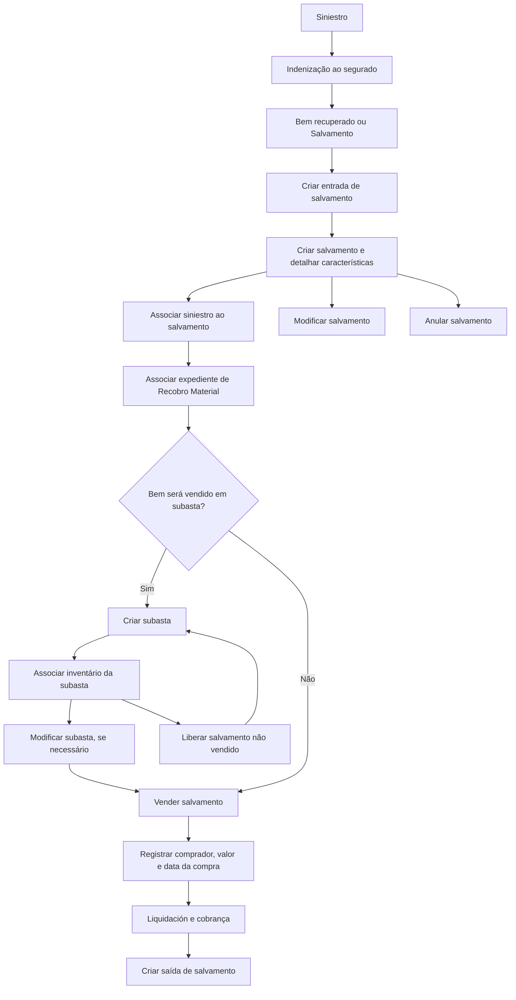

# Módulo de Salvamentos e Recobro Material — Definições, Operações e Controle de Bens Recuperados

## 1. Metadados do Documento
- **Arquivo de Origem:** Não identificado no conteúdo fornecido
- **Tipo de Documento:** Manual Operacional / Especificação Funcional
- **Domínio / Sistema:** Módulo de Salvamentos, Recobro Material e Siniestros
- **Público-Alvo:** Analistas funcionais, equipes de negócio, operação, desenvolvedores e arquitetos
- **Data/Versão Identificada:** Não identificada

---

## 2. Resumo Executivo & Contexto de Negócio

O documento descreve o módulo corporativo de **Salvamentos**, destinado ao controle de bens recuperados de sinistros que passam a ser propriedade da companhia após a indenização do segurado. O ciclo de controle cobre a identificação, classificação, armazenamento, venda, liquidação e saída do bem recuperado.

Um salvamento, também denominado bem recuperado, pode corresponder a veículos roubados e posteriormente localizados, veículos declarados como perda total e destinados à venda como sucata, ou mercadorias transportadas por caminhão, trem ou avião que foram roubadas, indenizadas e posteriormente recuperadas. O documento não restringe os exemplos a esses itens, utilizando também a indicação “etc.”.

A comercialização de um bem recuperado exige a abertura de um expediente de **Recobro Material** ou Recobro Salvamento. O Recobro Material é apresentado como um tipo de dano e tipo de expediente destinado a realizar gestões para recuperar valores devidos à companhia por meio da venda de bens sob sua posse. O documento diferencia recobros econômicos, voltados à recuperação de dinheiro, de recobros materiais, voltados à recuperação parcial do valor do sinistro pela venda de um bem.

O módulo de Salvamentos é parametrizável e depende de definições prévias mantidas no **Taller de Productos**. As definições abrangem níveis comum, geral, setor, ramo e salvamentos, incluindo depósitos, recuperadores, causas de processo, tipos de expediente, localizações, documentos, classificações, atividades compradoras, atributos, estruturas, informações iniciais e validações de informação.

O processo operacional apresentado inclui registrar a entrada do salvamento, detalhar e alterar suas características, vinculá-lo a sinistros e expedientes, criar e administrar subastas, associar inventários, vender ou liberar o bem, anulá-lo quando necessário, registrar sua saída e consultá-lo por sinistro ou por inventário. O documento também estabelece que compradores devem estar registrados no sistema de **Terceros**, com informações de contato e meios de cobrança ou pagamento.

---

## 3. Arquitetura, Componentes & Tecnologias Envolvidas

O documento não apresenta arquitetura técnica de infraestrutura, APIs, bancos de dados, protocolos, servidores, URLs, portas ou tecnologias de implementação. A arquitetura identificada é funcional e organizacional, centrada no módulo de Salvamentos e em suas dependências de cadastro, parametrização, expediente de recobro, subasta, venda e liquidação.

### Componentes e conceitos funcionais identificados

| Componente / Conceito | Função no contexto do módulo |
| :--- | :--- |
| Módulo de Salvamentos | Controla, classifica e permite a venda de bens recuperados de sinistros. |
| Salvamento / Bien recuperado / Salvado | Objeto segurado recuperado após roubo ou após declaração de perda total, que passa a ser propriedade da companhia depois da indenização ao segurado. |
| Recobro Material / Recobro Salvamento | Tipo de dano e expediente necessário para vender o bem recuperado e realizar gestões de recuperação de parte do valor do sinistro. |
| Recobro Econômico | Recobro voltado à recuperação de dinheiro. |
| Expediente de Recobro | Registro obrigatório para a venda de um salvamento. |
| Taller de Productos | Origem das definições prévias das quais depende o comportamento parametrizável da aplicação. |
| Terceros | Sistema ou cadastro no qual o comprador deve estar registrado, incluindo meios de contato e meios de cobrança ou pagamento. |
| Depósitos de Salvamentos | Locais definidos em Terceros onde os salvamentos podem ser depositados. |
| Recuperadores | Pessoas definidas para buscar veículos ou propriedades de segurados que foram roubados. |
| Subasta | Registro de informações de subastas utilizadas para a venda de salvamentos, incluindo data e localização. |
| Inventário de Subasta | Conjunto de salvamentos pendentes associado a uma subasta. |
| Liquidación | Elemento associado ao processo de cobrança com base nas informações registradas no módulo. |

### Fluxo funcional do Salvamento



> **Nota de Análise:** O documento descreve relações funcionais entre Salvamentos, Recobro Material, Terceros, Subastas e Liquidaciones, mas não detalha interfaces técnicas, contratos de integração, métodos HTTP, estruturas JSON, persistência de dados ou responsabilidades de microsserviços.

---

## 4. Regras de Negócio, Especificações Funcionais & Processos

### 4.1. Definição de Salvamento

Um **bem recuperado**, também chamado de salvamento ou salvado, é um objeto segurado que foi recuperado após roubo ou após ter sido declarado como perda total. Após a companhia indenizar o segurado, o bem recuperado passa a ser propriedade da companhia.

Exemplos explicitamente citados:
- Veículo.
- Mercadoria transportada por avião, trem ou caminhão.
- Automóveis roubados, indenizados ao segurado e posteriormente encontrados.
- Automóveis declarados como perda total e destinados à venda como ferro.
- Mercadorias roubadas durante transporte e posteriormente recuperadas.

### 4.2. Obrigatoriedade de abertura de Recobro Material

Para vender um bem recuperado, como um veículo ou mercadoria recuperada de um sinistro, é necessário manter aberto um expediente de **Recobro Material**, também referido como Recobro Salvamento.

O Recobro Material é caracterizado como:
- Um tipo de dano.
- Um tipo de expediente.
- Um mecanismo para realizar gestões destinadas a recuperar valores devidos à companhia.
- Um processo de recuperação parcial do valor do sinistro mediante a venda de um bem recuperado.

### 4.3. Distinção entre Recobro Econômico e Recobro Material

| Tipo de Recobro | Objetivo descrito |
| :--- | :--- |
| Recobro Econômico | Recuperar dinheiro. |
| Recobro Material | Recuperar parte do valor do sinistro por meio da venda de um bem que está em posse da companhia. |

### 4.4. Parametrização do módulo

O módulo de Salvamentos é parametrizável. O comportamento da aplicação depende de definições prévias configuradas no Taller de Productos.

As definições são organizadas nos seguintes níveis:
1. Comum.
2. Geral.
3. Ramo.
4. Setor.
5. Salvamentos.

### 4.5. Registro obrigatório do comprador

Para efetuar cobranças às pessoas que compram salvamentos:
- O comprador deve estar registrado no sistema de Terceros.
- O cadastro do comprador deve conter meios de contato.
- O cadastro do comprador deve conter meios de cobrança ou pagamento.
- O registro é necessário tanto para efetuar a cobrança quanto para contatar o comprador.

### 4.6. Liquidações de Salvamentos

Podem existir uma ou várias liquidações em um expediente de Salvamentos. A quantidade de liquidações corresponde à quantidade de compradores ou pessoas físicas ou jurídicas que intervenham no expediente.

Exemplos apresentados:
- Contratação de uma pessoa para recuperar um veículo roubado.
- Contratação de uma pessoa para transportar mercadoria de um caminhão sinistrado.

Com todas as informações registradas no módulo, é possível realizar a cobrança.

### 4.7. Elementos que compõem Salvamentos

O documento apresenta os seguintes elementos funcionais do módulo:

| Elemento | Descrição extraída |
| :--- | :--- |
| Identificação / Registro | Contém os dados de identificação do salvamento. |
| Atributos | Contém informações adicionais para detalhar o bem recuperado ou dados exigidos por legislação. |
| Subasta | Registra informações de subastas destinadas à venda de salvamentos. |
| Venta | Contém informações da venda do bem recuperado. |
| Liquidación | Suporta a cobrança com base nas informações registradas. |

### 4.8. Dados de identificação do Salvamento

A identificação do Salvamento deve contemplar:
- Tipo de Salvamento, como veículo, mercadoria de barco ou mercadoria de caminhão.
- Estado do bem recuperado.
- Classificação do bem recuperado ou salvado.
- Local onde o bem foi depositado.
- Outros dados indicados pelo documento por “etc.”, sem detalhamento adicional.

### 4.9. Informações da venda do Salvamento

O elemento de venda deve conter, entre outras informações:
- Pessoa física ou jurídica que compra o bem recuperado.
- Valor da venda.
- Data de compra do bem recuperado.
- Outros dados representados por “etc.”, sem especificação adicional.

### 4.10. Definições por nível

#### Nível Comum

O nível Comum contém definições que não são exclusivas do módulo de siniestros, mas são necessárias para realizar a definição de Salvamentos.

| Definição | Regra / finalidade |
| :--- | :--- |
| Depósitos de Salvamentos | Definir, em Terceros, os locais onde os salvamentos podem ser depositados. |
| Recuperadores | Definir as pessoas que se dedicarão a buscar veículos ou propriedades de segurados que foram roubados. |

#### Nível Geral

O nível Geral contém definições que afetam todos os possíveis expedientes de Salvamentos.

| Definição | Regra / finalidade |
| :--- | :--- |
| Causa Processo | Catalogar os motivos pelos quais se deseja realizar uma operação. |
| Tipo Expediente | Definir os Tipos de Dano e sua classe, incluindo se o expediente é de Recobro, seu tipo, ou se não é de Recobro. |

#### Nível Setor

O nível Setor contém definições que afetam todos os ramos do setor configurado.

| Definição | Regra / finalidade |
| :--- | :--- |
| Ubicaciones | Definir as possíveis localizações dos bens recuperados. |
| Documentos | Definir os documentos necessários para que os bens recuperados possam ser vendidos. |
| Clasificación | Definir classificações possíveis dos bens recuperados quanto ao estado para venda. |
| Actividades Compradoras | Definir as atividades que podem comprar salvamentos. |

#### Nível Ramo

O nível Ramo contém definições exclusivas do ramo que está sendo configurado.

| Definição | Regra / finalidade |
| :--- | :--- |
| Causa Processo | Catalogar os motivos para realizar operações em cada ramo. |

#### Nível Salvamentos

O nível Salvamentos contém definições próprias de salvamentos.

| Definição | Regra / finalidade |
| :--- | :--- |
| Atributo | Definir informações adicionais de Salvamentos, incluindo dados do salvado. |
| Estructura | Organizar informações adicionais compostas por atributos, obrigatoriedade de solicitação de informações e ordem em que as informações serão solicitadas. |
| Información Inicial | Registrar informações prévias para atributos das operações de Salvamentos, evitando que sejam inseridas posteriormente. |
| Validaciones Información | Definir comportamentos e validações para as informações solicitadas nas operações de Salvamentos. |

### 4.11. Operações possíveis de Salvamentos

| Operação | Descrição funcional |
| :--- | :--- |
| Criar entrada de salvamento | Registra o ingresso do salvado na companhia. |
| Criar salvamento | Detalha as características do salvamento. |
| Modificar salvamento | Permite alterar as características do salvado. |
| Associar siniestro ao salvamento | Vincula o siniestro ao salvamento registrado. |
| Associar expediente ao salvamento | Vincula o expediente ao salvamento. |
| Criar subasta | Registra informações de subastas para venda de salvamentos, incluindo data e localização. |
| Associar inventário subasta | Vincula os salvamentos pendentes de venda ao inventário da subasta. |
| Modificar subasta | Permite alterar os dados da subasta. |
| Vender salvamento | Registra a venda do salvamento, incluindo comprador e valor. |
| Liberar salvamento | Desvincula o salvamento de uma subasta quando o bem não foi vendido, permitindo associá-lo a outra subasta. |
| Anular salvamento | Elimina o salvamento quando ele não é vendido ou está incorreto. |
| Criar saída salvamento | Registra a saída do salvamento quando o bem é vendido. |
| Consultar salvamentos por siniestro | Mostra todas as informações do salvado mediante a informação do siniestro. |
| Consultar salvamentos por inventário | Mostra todas as informações do salvado mediante a identificação do inventário. |

---

## 5. Tabelas de Parâmetros, Ambientes e Estruturas de Dados

### 5.1. Estrutura funcional do Salvamento

| Item / Parâmetro | Descrição / Função | Tipo / Valores / Formato | Ambiente / Observações |
| :--- | :--- | :--- | :--- |
| Tipo de Salvamento | Identifica a natureza do bem recuperado. | Veículo; mercadoria de barco; mercadoria de caminhão; outros não detalhados. | Informado na identificação do Salvamento. |
| Estado do Salvamento | Representa a condição do bem recuperado. | Não detalhado. | Utilizado para identificação e classificação. |
| Classificação do Salvamento | Classifica o bem recuperado em relação ao seu estado para venda. | Possíveis classificações configuradas. | Definida no nível Setor. |
| Local de depósito | Identifica onde o bem recuperado foi depositado. | Depósito ou localização configurada. | Depósitos definidos em Terceros; localizações definidas no nível Setor. |
| Atributos | Informações adicionais ou informações necessárias por legislação. | Estrutura composta por atributos. | Definidos no nível Salvamentos. |
| Comprador | Pessoa física ou jurídica que compra o bem recuperado. | Cadastro em Terceros. | Deve possuir meios de contato e cobrança/pagamento. |
| Valor da venda | Informa o valor pelo qual o bem recuperado foi vendido. | Não detalhado. | Registrado no elemento Venta. |
| Data da compra | Informa a data de compra do bem recuperado. | Não detalhado. | Registrada no elemento Venta. |
| Subasta | Registra o evento de venda por subasta. | Data, localização e outros dados não detalhados. | Pode ter inventário associado. |
| Inventário da Subasta | Conjunto de salvamentos pendentes para venda em subasta. | Identificação de inventário. | Utilizado na consulta por inventário. |
| Liquidación | Suporta a cobrança decorrente das informações do expediente. | Uma ou várias liquidações. | Quantidade depende de compradores ou intervenientes físicos/jurídicos. |

### 5.2. Definições parametrizáveis

| Item / Parâmetro | Descrição / Função | Tipo / Valores / Formato | Ambiente / Observações |
| :--- | :--- | :--- | :--- |
| Depósitos de Salvamentos | Define locais de depósito dos bens recuperados. | Cadastro de locais. | Nível Comum; definido em Terceros. |
| Recuperadores | Define pessoas responsáveis por buscar veículos ou propriedades roubadas. | Pessoas cadastradas. | Nível Comum. |
| Causa Processo — Geral | Cataloga motivos para realização de operações. | Causas de processo. | Nível Geral; afeta todos os expedientes possíveis de Salvamentos. |
| Tipo Expediente | Define Tipos de Dano e sua classe. | Recobro, tipo de Recobro ou não Recobro. | Nível Geral. |
| Ubicaciones | Define possíveis localizações dos bens recuperados. | Localizações. | Nível Setor; afeta todos os ramos do setor definido. |
| Documentos | Define documentos necessários para venda do bem recuperado. | Documentos exigidos. | Nível Setor. |
| Clasificación | Define classificações do bem recuperado conforme seu estado para venda. | Classificações. | Nível Setor. |
| Actividades Compradoras | Define atividades autorizadas ou consideradas para compra de Salvamentos. | Atividades compradoras. | Nível Setor. |
| Causa Processo — Ramo | Cataloga motivos de operações para cada ramo. | Causas de processo. | Exclusiva do ramo configurado. |
| Atributo | Define informações adicionais do salvamento. | Dados do salvado e outros atributos. | Nível Salvamentos. |
| Estructura | Define composição de atributos, obrigatoriedade e ordem de solicitação. | Estrutura de informações adicionais. | Nível Salvamentos. |
| Información Inicial | Registra previamente informações para atributos de operações de Salvamentos. | Informações iniciais. | Evita inserção posterior. |
| Validaciones Información | Define comportamentos e validações para informações solicitadas. | Regras de validação não detalhadas. | Nível Salvamentos. |

### 5.3. Ambientes, URLs, servidores e logs

| Item / Parâmetro | Descrição / Função | Tipo / Valores / Formato | Ambiente / Observações |
| :--- | :--- | :--- | :--- |
| Ambientes | Não identificados. | Não aplicável. | O documento não informa ambientes. |
| URLs | Não identificadas. | Não aplicável. | O documento não informa URLs. |
| Servidores | Não identificados. | Não aplicável. | O documento não informa servidores. |
| Rotas de logs | Não identificadas. | Não aplicável. | O documento não informa mecanismos de logging. |
| Tecnologias de implementação | Não identificadas. | Não aplicável. | O documento não informa linguagens, frameworks, bancos de dados ou infraestrutura. |

---

## 6. Bateria de Perguntas & Respostas para RAG (FAQ Sintético)

### P1: O que é um Salvamento no contexto de sinistros?
**R:** Um Salvamento, também chamado de bem recuperado ou salvado, é um objeto segurado recuperado após roubo ou após declaração de perda total. Depois que a companhia indeniza o segurado, esse bem passa a ser propriedade da companhia. Os exemplos incluem veículos e mercadorias transportadas por avião, trem ou caminhão.

### P2: É obrigatório abrir um expediente de Recobro Material para vender um Salvamento?
**R:** Sim. O documento estabelece que, para vender um bem recuperado, como um veículo ou uma mercadoria recuperada de um sinistro, é necessário ter aberto um expediente de Recobro Material, também denominado Recobro Salvamento.

### P3: Qual é a diferença entre Recobro Econômico e Recobro Material?
**R:** O Recobro Econômico é utilizado quando a companhia busca recuperar dinheiro. O Recobro Material é utilizado quando a companhia possui um bem recuperado e busca recuperar parte do valor do sinistro por meio da venda desse bem.

### P4: Quais informações devem ser registradas na identificação de um Salvamento?
**R:** A identificação deve registrar o tipo de Salvamento, como veículo ou mercadoria; o estado do bem; a classificação do bem recuperado; e o local em que o bem foi depositado. O documento também menciona que podem existir outros dados, mas não os especifica.

### P5: Quais dados devem ser registrados sobre a venda de um Salvamento?
**R:** A venda deve registrar a pessoa física ou jurídica que compra o bem recuperado, o valor da venda e a data da compra do bem recuperado. O documento menciona a existência de informações adicionais, mas não detalha quais seriam.

### P6: Por que o comprador de um Salvamento precisa estar cadastrado em Terceros?
**R:** O comprador precisa estar registrado em Terceros para que a companhia possa efetuar a cobrança e entrar em contato com a pessoa compradora. O cadastro deve incluir meios de contato e meios de cobrança ou pagamento.

### P7: Em quais situações podem existir várias liquidações em um expediente de Salvamentos?
**R:** Podem existir tantas liquidações quanto compradores ou pessoas físicas ou jurídicas intervenham no expediente de Salvamentos. O documento cita como exemplos a contratação de uma pessoa para recuperar um veículo roubado ou de uma pessoa para transportar mercadoria de um caminhão sinistrado.

### P8: O que acontece quando um Salvamento não é vendido em uma subasta?
**R:** Quando um Salvamento associado a uma subasta não é vendido, a operação de liberar Salvamento permite desvinculá-lo da subasta. Após a liberação, o Salvamento pode ser associado a outra subasta.

### P9: Quais são as operações disponíveis para o ciclo de vida de um Salvamento?
**R:** O módulo permite criar entrada de Salvamento, criar Salvamento, modificar Salvamento, associar siniestro, associar expediente, criar subasta, associar inventário de subasta, modificar subasta, vender Salvamento, liberar Salvamento, anular Salvamento, criar saída de Salvamento e consultar Salvamentos por siniestro ou inventário.

### P10: Quais definições são configuradas no nível Setor?
**R:** No nível Setor são configuradas as possíveis localizações dos bens recuperados, os documentos necessários para venda, as classificações dos bens conforme seu estado para venda e as atividades que podem comprar Salvamentos. Essas definições afetam todos os ramos do setor que está sendo definido.

### P11: Para que servem os atributos e a estrutura de Salvamentos?
**R:** Os atributos armazenam informações adicionais para detalhar o bem recuperado ou atender dados exigidos por legislação. A estrutura organiza essas informações adicionais, definindo atributos, se uma informação é obrigatória e a ordem em que as informações devem ser solicitadas.

### P12: Como consultar as informações de um Salvamento?
**R:** O módulo permite consultar Salvamentos por siniestro, exibindo informações do salvado a partir do siniestro informado, e por inventário, exibindo informações do salvado mediante a identificação do inventário.

---

## 7. Glossário de Termos, Siglas & Conceitos-Chave

- **Salvamento / Salvado / Bien recuperado:** Objeto segurado recuperado após roubo ou após declaração de perda total, que passa a ser propriedade da companhia após a indenização ao segurado.
- **RS:** Sigla apresentada junto ao conceito de “Bien recuperado o Salvado”. O documento não explicita a expansão da sigla.
- **Recobro:** Tipo de expediente destinado a realizar gestões para recuperar o que é devido à companhia.
- **Recobro Económico:** Recobro cujo objetivo é recuperar dinheiro.
- **Recobro Material / Recobro Salvamento:** Recobro voltado à recuperação de parte do valor do sinistro mediante a venda de um bem recuperado.
- **Siniestro:** Evento de sinistro ao qual o Salvamento pode ser associado.
- **Expediente:** Registro ou processo ao qual o Salvamento pode ser vinculado; para venda, é necessário o expediente de Recobro Material.
- **Terceros:** Sistema ou cadastro em que compradores, depósitos e outros envolvidos podem ser definidos ou registrados.
- **Taller de Productos:** Local ou mecanismo de definições prévias que determina o comportamento parametrizável da aplicação.
- **Subasta:** Processo ou registro de leilão para venda de Salvamentos.
- **Inventario Subasta:** Inventário que reúne Salvamentos pendentes de venda e que pode ser associado a uma subasta.
- **Liquidación:** Elemento relacionado à cobrança decorrente das informações registradas no módulo.
- **Ramo:** Nível de definição exclusivo do ramo configurado.
- **Sector:** Nível de definição que afeta todos os ramos do setor definido.
- **Causa Proceso:** Definição usada para catalogar os motivos pelos quais uma operação é realizada.
- **Tipo Expediente:** Definição de Tipos de Dano e suas classes, incluindo se há Recobro e seu tipo.
- **Ubicaciones:** Possíveis localizações dos bens recuperados.
- **Actividades Compradoras:** Atividades que podem comprar Salvamentos.
- **Información Inicial:** Informações registradas previamente para atributos de operações de Salvamentos.
- **Validaciones Información:** Comportamentos e validações aplicáveis às informações solicitadas nas operações de Salvamentos.

---

## 8. Notas Críticas, Riscos & Limitações

- A venda de um bem recuperado depende da abertura prévia de um expediente de Recobro Material. A ausência desse expediente impede a venda segundo a regra descrita.
- A cobrança ao comprador depende do cadastro prévio em Terceros, incluindo meios de contato e meios de cobrança ou pagamento.
- O funcionamento do módulo depende de definições prévias no Taller de Productos; configurações incompletas de depósitos, localizações, documentos, classificações, atividades compradoras, atributos ou validações podem comprometer a operação.
- O documento informa que documentos são necessários para a venda dos bens recuperados, mas não especifica quais documentos são obrigatórios, seus formatos ou regras de validação.
- O documento menciona validações de informação, mas não apresenta regras específicas, mensagens de erro, campos obrigatórios concretos ou critérios de aprovação.
- O documento não especifica estados possíveis do Salvamento, classificações efetivas, tipos de dano disponíveis ou valores permitidos para causas de processo.
- O documento não detalha como é calculada a liquidação, como é realizada a cobrança, nem quais integrações financeiras estão envolvidas.
- O documento não descreve arquitetura técnica, APIs, contratos, autenticação, autorização, persistência, auditoria, logs, URLs, servidores ou ambientes.
- **Nota de Análise:** O documento lista operações de criar, modificar, vender, liberar e anular Salvamentos, mas não detalha pré-condições, pós-condições, permissões de usuário ou transições formais de estado entre essas operações.

---

## 9. Conteúdo Bruto Estruturado (Referência Fiel)

```text
--- [PÁGINA 1 DE 7] ---

INTRODUCCIÓN - Salvamentos
 n
OBJETIVO
La finalidad de este módulo es controlar los bienes que se han recuperado de un siniestro y que
pasan a ser propiedad de la compañía, desde que se recuperan hasta su venta.
Por ejemplo:
Automóviles que han sido robados, se han indemnizado al asegurado y posteriormente
aparecen.
Automóviles declarados pérdida total y se van a vender como hierro.
Mercancía transportada por un camión, tren, avión y se ha robado, se ha indemnizado al
asegurado y posteriormente aparece.
Etc.
Conceptos
Conceptos:
Bien recuperado o Salvado
 / 
 RS
Inicio Soluciones APIs Documentación Zeus
ES


--- [PÁGINA 2 DE 7] ---

Recobro Material
Características
Elementos del Módulo de Salvamento
Definiciones de Salvamentos
Operaciones de Salvamentos
Bien recuperado o salvado
Objeto asegurado que ha sido recuperado, después de ser robado o después de ser declarado
pérdida total. Ese bien pasa a ser propiedad de la compañía, después de haber indemnizado al
asegurado. Ejemplo:
Vehículo
Mercancía que transporta un avión, tren, camión
Etc
Recobro Material (Recobro Salvamento)
Es un tipo de daño, tipo de expediente, que se encarga de realizar todas las gestiones necesarias
para recuperar lo que se le debe a la compañía. Estos tipos de expediente se les denomina
Recobro. Los recobros pueden ser económicos, cuando se quiere recuperar dinero, o materiales,
cuando la compañía tiene un bien y con su venta va a recuperar parte del importe del siniestro.
Características
Obligación apertura de un Recobro
Para poder vender el bien recuperado (un vehículo o mercancía que transporta un camión
recuperada de un siniestro, etc), es necesario tener abierto un expediente de Recobro material
(salvamento)
Cubre todas las funcionalidades para el control de Salvados
Este módulo, contiene todas las funcionalidades necesarias para el control, la clasificación y la
venta de los bienes recuperados (salvados).
Parametrizable
El módulo es parametrizable y el comportamiento de la aplicación depende de las definiciones
previas (Taller de Productos)
Registro del Comprador
Para realizar los cobros a las personas que compran los salvamentos, el comprador tiene que
estar registrado en el sistema (Terceros), con sus medios de contacto, sus medios de cobro /
pago, para poder realizar el cobro y para poder contactar con ellos.


--- [PÁGINA 3 DE 7] ---

Una o varias liquidaciones para Salvamentos
Existirán tantas liquidaciones como compradores o personas físicas o jurídicas intervengan en el
expediente de Salvamentos.
Por ejemplo:
Si se contrata a alguien para que recupere un vehículo robado
Si se contrata a alguien para que transporte la mercancía de un camión siniestrado
Etc.
Elementos de Salvamentos
Los salvamentos está compuesto de varios elementos:
SALVAMENTOS
IDENTIFICACIÓN/REGISTRO ATRIBUTOS SUBASTA VENTA LIQUIDACIÓN
Datos Identificación de Salvamentos
Se tiene que identificar:
Tipo de Salvamento ( si es un vehículo, mercancía de un barco, de un camión, etc)
El estado en el que se encuentra
Clasificación del Bien recuperado o Salvado
El lugar donde se ha depositado
Etc.
Atributos
Este elemento va a contener la información adicional que ayude a detallar mejor el bien recuperado o
datos necesarios por legislación.
Venta del Salvado
Este elemento contiene toda la información de la venta como por ejemplo:
Persona física o jurídica que compra el bien recuperado
Importe de la venta
Fecha del compra del bien recuperado
Etc.
Liquidación


--- [PÁGINA 4 DE 7] ---

Con toda la información recogida en este módulo, se puede realizar el cobro.
Definiciones de Salvamentos
Los elementos de definición atienden a distintos niveles:
NIVELES DE DEFINICIÓN
COMÚN GENERAL RAMO SECTOR SALVAMENTOS
COMÚN
En este nivel se encuentran definiciones que NO son exclusivas del
módulo de siniestros, pero son necesarias para poder realizar la
definición. Entre otras definiciones se encuentra:
DEPÓSITOS DE SALVAMENTOS
Definir en terceros los lugares donde se
pueden depositar los salvados
RECUPERADORES
Definir a las personas que se van a dedidar a
buscar vehículos o propiedades de nuestros
asegurados que han sido robados
GENERAL
En este nivel se encuentran definiciones que afectarán a todos los
posibles expedientes de salvamentos
CAUSA PROCESO
Permite catalogar los motivos por los que se
quiere realizar una operación
TIPO EXPEDIENTE
Permite definir los Tipos de Daño y su clase
(Si es de Recobro y su tipo, Si no es de
Recobro)


--- [PÁGINA 5 DE 7] ---

SECTOR
Afectan a todos los ramos del sector que se está definiendo
UBICACIONES
Definición de las Posibles ubicaciones de los
bienes recuperados
DOCUMENTOS
Definición de Documentos necesarios para
que los bienes recuperados puedan ser
vendidos
CLASIFICACIÓN
Posibles clasificaciones de los bienes
recuperados con respecto al estado para ser
vendidos
ACTIVIDADES COMPRADORAS
Definición de las Actividades que pueden
Comprar salvados
RAMO
Son exclusivas del ramo que se está definiendo
CAUSA PROCESO
Permite catalogar los motivos por los que se quiere realizar las operaciones para cada ramo
SALVAMENTOS
Definiciones propias de salvamentos
ATRIBUTO
Permite definir la información adicional de
salvamentos , como datos del salvado, etc
ESTRUCTURA
Información adicional de salvamentos
compuesta por atributos, obligatoriedad o no


--- [PÁGINA 6 DE 7] ---

de pedir información, orden en el que se va a
pedir
INFORMACIÓN INICIAL
Registrar información previa para los atributos
de las operaciones de salvamentos, para no
tener que introducirla posteriormente.
VALIDACIONES INFORMACIÓN
Definir comportamientos y validaciones de la
información que se pide en las operaciones
de salvamentos
Operaciones de Salvamentos
SALVAMENTOS
Operaciones posibles de salvamentos
CREAR entrada salvamento
Se Registra el ingreso del salvado a la
compañía
CREAR salvamento
Se detalla las características del salvamento
MODIFICAR salvamento
Permite cambiar las características del
salvado
ASOCIAR siniestro al salvamento
Se necesita para vincular el siniestro al
salvamento registrado
ASOCIAR expediente al salvamento
Permite vincular el expediente al salvamento.
CREAR subasta
Se registra la información de las subastas
para la venta de salvamentos, fecha,
ubicación, etc
ASOCIAR inventario subasta
Se vinculan los salvamentos pendientes para
ser vendidos
MODIFICAR subasta
Permite cambiar los datos de la subasta
VENDER salvamento
 LIBERAR salvamento


--- [PÁGINA 7 DE 7] ---

Si un salvamento es vendido se registra su
venta, a quien se le ha vendido, por cuanto,
etc
Permite desvincular el salvamento de la
subasta si este no ha sido vendido para poder
asociarse a otra subasta
ANULAR salvamento
Esta operación permite eliminar el
salvamento, porque no se vende, porque está
erróneo
CREAR salida salvamento
Permite registrar la salida del salvamento
cuando es vendido
CONSULTAR salvamentos (Por Siniestro)
Muestra toda la información del salvado
introduciendo el siniestro
CONSULTAR salvamentos (Por Inventario)
Muestra toda la información del salvado,
introduciendo la identificación del mismo
```
