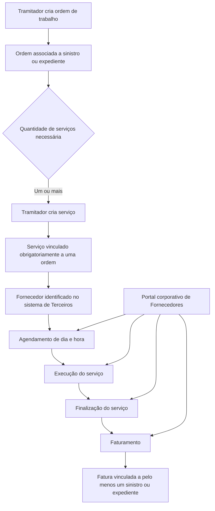
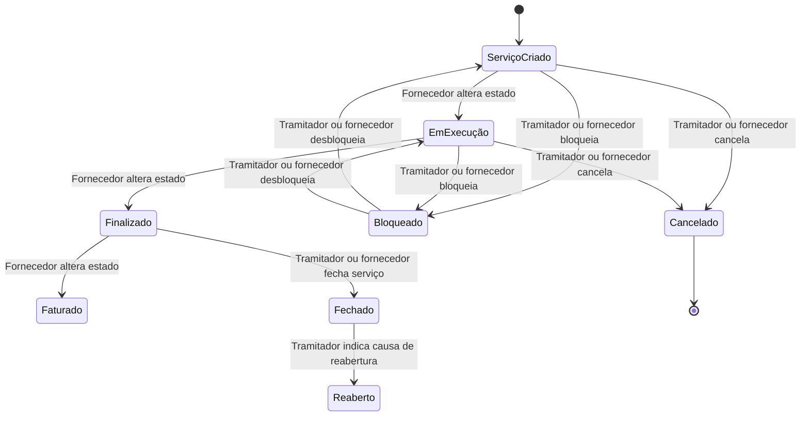

# Módulo de Serviços — Registro, Tramitação e Gestão de Serviços de Fornecedores

## 1. Metadados do Documento
- **Arquivo de Origem:** Não identificado
- **Tipo de Documento:** Manual Funcional / Apresentação Executiva
- **Domínio / Sistema:** Módulo de Serviços para sinistros/expedientes e fornecedores
- **Público-Alvo:** Tramitadores, fornecedores, equipes funcionais e operação
- **Data/Versão Identificada:** Não identificada

---

## 2. Resumo Executivo & Contexto de Negócio

O documento descreve um módulo de Serviços destinado a registrar e acompanhar trabalhos solicitados a profissionais e fornecedores, desde o encargo inicial até a finalização e o recebimento do resultado. O módulo cobre a criação de ordens de trabalho, a solicitação de serviços, o agendamento da execução, a gestão de estados, bloqueios, notificações e faturamento.

A tramitação de serviços está associada ao contexto de sinistros ou expedientes. Uma ordem de serviço é vinculada a um sinistro/expediente e pode exigir de um a vários serviços para ser atendida. Cada serviço representa um trabalho específico solicitado a um fornecedor e permanece obrigatoriamente agrupado dentro de uma ordem.

Os fornecedores — como fornecedores de peças, oficinas e pedreiros — precisam estar previamente registrados no sistema de Terceiros. O registro deve conter meios de contato e meios de cobrança/pagamento, permitindo a comunicação com o fornecedor e a realização de pagamentos.

O comportamento do módulo é parametrizável e depende de definições prévias no “Taller de Productos”. As definições são organizadas em níveis Comum, Geral, Ramo e Expediente, incluindo cadastro de oficinas, causas de processo, motivos de bloqueio e avisos de serviços.

A interação operacional é compartilhada entre o tramitador e o portal corporativo de fornecedores em determinadas ações. O tramitador possui capacidades de criação, alteração, fechamento, cancelamento, reabertura, bloqueio e notificações; o fornecedor, pelo portal, pode executar algumas transições e operações explicitamente autorizadas.

---

## 3. Arquitetura, Componentes & Tecnologias Envolvidas

### Componentes e entidades identificados

| Componente / Entidade | Função descrita |
| :--- | :--- |
| Módulo de Serviços | Gerencia a tramitação de trabalhos solicitados a profissionais e fornecedores. |
| Portal de Serviços | Canal para tramitação de funcionalidades relacionadas aos serviços. |
| Portal corporativo de Fornecedores | Canal pelo qual fornecedores podem agendar, alterar determinados estados, bloquear, desbloquear, fechar, cancelar e consultar informações de serviços. |
| Sistema de Terceiros | Repositório onde fornecedores devem estar cadastrados com meios de contato e cobrança/pagamento. |
| Taller de Productos | Origem das definições prévias que determinam o comportamento parametrizável do módulo. |
| Ordem de Serviço | Encargo de um trabalho associado a um sinistro/expediente; pode ser resolvida por um ou mais serviços. |
| Serviço | Trabalho individual a ser realizado por um fornecedor dentro de uma ordem. |
| Fatura | Valor a pagar pelo serviço ao fornecedor; deve estar vinculada a pelo menos um sinistro/expediente. |
| Liquidação | Elemento apresentado na composição visual dos serviços, sem detalhamento funcional adicional. |
| Tramitador | Usuário responsável por executar operações de tramitação e acompanhamento. |
| Fornecedor | Profissional ou organização que realiza o trabalho solicitado. |

### Fluxo funcional extraído



### Fluxo de estados e intervenções operacionais



> **Nota de Análise:** O documento cita os estados “Ejecución”, “Finalizado”, “Facturado”, “Cerrado” e “Cancelado”, mas não especifica formalmente uma máquina de estados completa, todos os estados possíveis nem todas as transições válidas. O diagrama representa somente relações explicitamente indicadas ou diretamente inferíveis da descrição operacional.

---

## 4. Regras de Negócio, Especificações Funcionais & Processos

### 4.1 Objetivo do módulo

O módulo permite registrar todos os trabalhos desde o momento em que são solicitados a um profissional até a finalização e o recebimento do resultado.

### 4.2 Parametrização

- O módulo de Serviços é parametrizável.
- O comportamento da aplicação depende de definições prévias realizadas no “Taller de Productos”.
- As definições de serviços são organizadas nos níveis:
  - Comum;
  - Geral;
  - Ramo;
  - Expediente.

### 4.3 Pré-requisito de cadastro de fornecedores

Para executar um serviço, os fornecedores devem estar registrados no sistema de Terceiros.

Exemplos de fornecedores citados:

- Fornecedor de peças;
- Oficina;
- Pedreiro.

O cadastro de fornecedor deve conter:

- Meios de contato;
- Meios de cobrança/pagamento.

Essas informações são necessárias para:

- Contatar o fornecedor;
- Realizar pagamentos ao fornecedor.

### 4.4 Estrutura de elementos de serviços

Os serviços são compostos pelos seguintes elementos:

1. Ordem;
2. Serviço;
3. Fatura;
4. Liquidação.

#### Ordem de Serviço

- Representa o encargo de um trabalho.
- Deve ser associada a um sinistro/expediente.
- Pode ser solucionada por um ou vários serviços.

#### Serviço

- Representa cada trabalho individual a ser realizado por um fornecedor.
- Deve estar sempre englobado dentro de uma ordem.
- Contém, entre outros, os seguintes dados:
  - Data de criação do serviço;
  - Identificação do fornecedor;
  - Atividade;
  - Documento;
  - Tipo de documento;
  - Estado;
  - Valores.

#### Fatura

- Representa o valor a pagar ao fornecedor pelo serviço.
- Deve estar sempre vinculada a pelo menos um sinistro/expediente.

#### Liquidação

- É apresentada como elemento da estrutura de serviços.
- O documento não fornece detalhamento funcional adicional sobre liquidação.

### 4.5 Definições por nível

#### Nível Comum

O nível Comum contém definições que não são exclusivas do módulo de sinistros, mas são necessárias para a configuração dos serviços.

Definição citada:

- **Taller:** cadastro de todas as oficinas da companhia, incluindo meios de pagamento e meios de contato.

#### Nível Geral

O nível Geral contém definições que afetam todos os possíveis expedientes aos quais um serviço possa ser associado.

Definições citadas:

- **Causa de Processo:** cataloga os motivos para cancelar ou reabrir um serviço.
- **Motivos de Bloqueio:** cataloga as causas pelas quais um serviço é bloqueado.
- **Motivos de Bloqueio por Estado:** citado como definição, sem detalhamento adicional no conteúdo fornecido.

#### Nível Ramo

O nível Ramo contém definições específicas para cada ramo.

Definições citadas:

- **Causa de Processo:** cataloga os motivos para cancelamento ou reabertura de um serviço por ramo.
- **Avisos de Serviços:** permite definir avisos por tipo de serviço, tipo de expediente, nível, trâmite e outros critérios não detalhados.

#### Nível Expediente

- O documento apresenta o nível Expediente na estrutura de níveis de definição.
- Não descreve regras, parâmetros ou definições específicos desse nível.

### 4.6 Operações sobre serviços

#### Criar ordem

- O tramitador pode gerar uma ordem de trabalho.
- A ordem deve ser associada a um sinistro/expediente.
- Uma ordem pode demandar de um a “n” serviços para ser satisfeita.

#### Criar serviço

- Permite gerar uma solicitação para a realização de um trabalho por um profissional.
- O serviço deve estar sempre incluído dentro de uma ordem.

#### Atribuir serviço

- Permite agendar dia e hora para o fornecedor iniciar o trabalho.
- Exemplos apresentados:
  - Agendar a entrada de um veículo na oficina;
  - Agendar a visita de um pedreiro a um domicílio.
- O fornecedor também pode realizar essa operação pelo portal.

#### Modificar serviço

- O tramitador pode alterar os dados de um serviço quando considerar necessário.
- O documento não enumera quais campos podem ser modificados nem condições de alteração.

#### Modificar estados

- Pelo portal, somente o fornecedor pode colocar o serviço nos estados:
  - Em execução;
  - Finalizado;
  - Faturado.

#### Criar notificações manuais

- O tramitador pode gerar notificações manualmente para o fornecedor.
- O tramitador pode verificar se a notificação foi lida pelo fornecedor.

#### Gerenciar bloqueios

- O tramitador pode paralisar ou bloquear a execução de um serviço.
- O bloqueio deve utilizar motivos catalogados.
- O tramitador também pode desbloquear o serviço.
- Pelo portal, o fornecedor também pode bloquear e desbloquear o serviço.

#### Fechar serviço

- O tramitador pode fechar um serviço.
- O estado Fechado indica que o serviço está terminado e pendente de faturamento.
- Pelo portal, o fornecedor também pode executar a funcionalidade de fechamento.

#### Cancelar serviço

- O tramitador pode cancelar um serviço.
- O estado Cancelado indica que a realização do serviço foi suspensa.
- Após o cancelamento, não é possível realizar mais operações com o serviço.
- Pelo portal, o fornecedor também pode executar a funcionalidade de cancelamento.

#### Reabrir serviço

- O tramitador pode reabrir um serviço fechado.
- A reabertura exige a indicação das causas.

#### Consultar avanços

- Exibe os diferentes movimentos ocorridos dentro do estado Em Execução.
- A consulta está habilitada para o tramitador e para o portal do fornecedor.

#### Consultar histórico de movimentos

- Exibe todos os estados pelos quais um serviço passou.
- A consulta está habilitada para o tramitador e para o portal do fornecedor.

---

## 5. Tabelas de Parâmetros, Ambientes e Estruturas de Dados

### 5.1 Dados mínimos citados para um serviço

| Item / Parâmetro | Descrição / Função | Tipo / Valores / Formato | Ambiente / Observações |
| :--- | :--- | :--- | :--- |
| Data de criação do serviço | Registra a data de criação do serviço. | Data; formato não especificado. | Associado ao serviço. |
| Identificação do fornecedor | Identifica o fornecedor responsável pelo trabalho. | Não especificado. | O fornecedor deve estar registrado no sistema de Terceiros. |
| Atividade | Identifica a atividade vinculada ao serviço. | Não especificado. | Associado ao serviço. |
| Documento | Documento relacionado ao serviço. | Não especificado. | Associado ao serviço. |
| Tipo de documento | Classificação do documento relacionado ao serviço. | Não especificado. | Associado ao serviço. |
| Estado | Indica a situação do serviço. | Em execução, finalizado, faturado, fechado, cancelado; outros estados não especificados. | Associado ao serviço. |
| Valores | Valores associados ao serviço. | Não especificado. | Associado ao serviço. |

### 5.2 Entidades e vínculos obrigatórios

| Item / Parâmetro | Descrição / Função | Tipo / Valores / Formato | Ambiente / Observações |
| :--- | :--- | :--- | :--- |
| Ordem de Serviço | Encargo de um trabalho. | Uma ordem pode ter de um a “n” serviços. | Deve ser associada a um sinistro/expediente. |
| Serviço | Trabalho individual solicitado a um fornecedor. | Um serviço por trabalho. | Deve estar sempre dentro de uma ordem. |
| Fatura | Valor a pagar ao fornecedor pelo serviço. | Valor monetário; formato não especificado. | Deve estar vinculada a pelo menos um sinistro/expediente. |
| Fornecedor | Profissional ou organização que executa o trabalho. | Exemplos: fornecedor de peças, oficina, pedreiro. | Deve estar previamente registrado no sistema de Terceiros. |
| Meios de contato | Informações para contatar o fornecedor. | Não especificado. | Mantidos no cadastro de Terceiros. |
| Meios de cobrança/pagamento | Informações necessárias para pagamentos. | Não especificado. | Mantidos no cadastro de Terceiros. |

### 5.3 Definições parametrizáveis

| Item / Parâmetro | Descrição / Função | Tipo / Valores / Formato | Ambiente / Observações |
| :--- | :--- | :--- | :--- |
| Taller | Registra oficinas da companhia. | Inclui meios de pagamento e contato. | Nível Comum. |
| Causa de Processo | Cataloga motivos para cancelamento ou reabertura de serviços. | Motivos catalogados; valores não especificados. | Nível Geral. |
| Causa de Processo por ramo | Cataloga motivos de cancelamento ou reabertura para cada ramo. | Motivos catalogados; valores não especificados. | Nível Ramo. |
| Motivos de Bloqueio | Cataloga causas de bloqueio do serviço. | Motivos catalogados; valores não especificados. | Nível Geral. |
| Motivos de Bloqueio por Estado | Definição citada sem detalhes funcionais. | Não especificado. | Nível Geral, conforme apresentação. |
| Avisos de Serviços | Define avisos por critérios de classificação. | Tipo de serviço, tipo de expediente, nível, trâmite e outros não detalhados. | Nível Ramo. |

### 5.4 Matriz de operações por ator

| Operação | Tramitador | Fornecedor pelo portal | Observações |
| :--- | :---: | :---: | :--- |
| Criar ordem | Sim | Não informado | A ordem é associada a sinistro/expediente. |
| Criar serviço | Sim | Não informado | O serviço deve estar dentro de uma ordem. |
| Atribuir/agendar serviço | Sim | Sim | Agenda dia e hora para início do trabalho. |
| Modificar dados do serviço | Sim | Não informado | O documento não detalha campos alteráveis. |
| Alterar para Em Execução | Não informado | Sim, somente fornecedor | Alteração pelo portal. |
| Alterar para Finalizado | Não informado | Sim, somente fornecedor | Alteração pelo portal. |
| Alterar para Faturado | Não informado | Sim, somente fornecedor | Alteração pelo portal. |
| Criar notificações manuais | Sim | Não informado | O tramitador verifica leitura pelo fornecedor. |
| Bloquear serviço | Sim | Sim | Deve considerar motivos catalogados. |
| Desbloquear serviço | Sim | Sim | Operação disponível pelo portal. |
| Fechar serviço | Sim | Sim | Fechado significa terminado e pendente de faturamento. |
| Cancelar serviço | Sim | Sim | Após cancelado, não são permitidas outras operações. |
| Reabrir serviço fechado | Sim | Não informado | Exige indicação das causas. |
| Consultar avanços | Sim | Sim | Mostra movimentos no estado Em Execução. |
| Consultar histórico de movimentos | Sim | Sim | Mostra todos os estados do serviço. |

---

## 6. Bateria de Perguntas & Respostas para RAG (FAQ Sintético)

### P1: Qual é o objetivo do módulo de Serviços?
**R:** O módulo de Serviços permite registrar e tramitar trabalhos solicitados a profissionais ou fornecedores desde o encargo inicial até a finalização e o recebimento do resultado. O módulo abrange ordens de trabalho, serviços, faturas, bloqueios, notificações, consultas e operações realizadas pelo tramitador e, em alguns casos, pelo portal corporativo de fornecedores.

### P2: Qual é a relação entre uma ordem de serviço e um serviço?
**R:** Uma ordem de serviço representa o encargo de um trabalho e deve ser associada a um sinistro/expediente. Para atender uma ordem, podem ser necessários de um a vários serviços. Cada serviço representa um trabalho específico executado por um fornecedor e deve estar obrigatoriamente incluído dentro de uma ordem.

### P3: Quais dados de um serviço são mencionados no documento?
**R:** O documento indica que um serviço contém, entre outros dados, a data de criação do serviço, identificação do fornecedor, atividade, documento, tipo de documento, estado e valores. Não são definidos formatos, obrigatoriedade ou regras de validação detalhadas para esses campos.

### P4: O que é necessário para que um fornecedor possa realizar um serviço?
**R:** O fornecedor deve estar previamente registrado no sistema de Terceiros. O cadastro precisa conter meios de contato e meios de cobrança/pagamento, pois essas informações permitem contatar o fornecedor e realizar os pagamentos relacionados aos serviços executados.

### P5: O que representa uma fatura no módulo de Serviços?
**R:** A fatura representa o valor a pagar pelo serviço ao fornecedor. A regra explícita do documento estabelece que toda fatura deve estar vinculada a pelo menos um sinistro/expediente.

### P6: Quem pode alterar os estados Em Execução, Finalizado e Faturado pelo portal?
**R:** Pelo portal, somente o fornecedor pode colocar um serviço nos estados Em Execução, Finalizado e Faturado. O documento não detalha outras permissões de alteração de estado pelo tramitador para esses estados específicos.

### P7: O que ocorre quando um serviço é fechado?
**R:** O fechamento indica que o serviço está terminado, mas permanece pendente de faturamento. Essa funcionalidade pode ser executada pelo tramitador e também pelo fornecedor por meio do portal.

### P8: O que ocorre quando um serviço é cancelado?
**R:** O cancelamento indica que a realização do serviço foi suspensa. A partir do estado Cancelado, não é possível realizar mais operações com o serviço. O cancelamento pode ser realizado pelo tramitador e também pelo fornecedor através do portal.

### P9: Como funciona o bloqueio de um serviço?
**R:** O tramitador pode intervir para paralisar ou bloquear a execução de um serviço usando motivos catalogados, além de poder desbloqueá-lo posteriormente. Pelo portal, o fornecedor também pode bloquear e desbloquear o serviço.

### P10: Quais definições podem ser configuradas no nível Geral?
**R:** No nível Geral podem ser definidas causas de processo, utilizadas para catalogar os motivos de cancelamento ou reabertura de serviços, e motivos de bloqueio, utilizados para catalogar as causas pelas quais um serviço é bloqueado. O documento também cita motivos de bloqueio por estado, sem detalhamento adicional.

### P11: Para que servem os Avisos de Serviços no nível Ramo?
**R:** Os Avisos de Serviços permitem definir avisos por tipo de serviço, tipo de expediente, nível, trâmite e outros critérios não detalhados. Essa definição pertence ao nível Ramo e, portanto, é apresentada como específica para cada ramo.

### P12: Quem pode consultar os avanços e o histórico de um serviço?
**R:** Tanto o tramitador quanto o portal do fornecedor podem consultar avanços e histórico de movimentos. A consulta de avanços mostra os diferentes movimentos dentro do estado Em Execução, enquanto o histórico mostra todos os estados pelos quais o serviço passou.

---

## 7. Glossário de Termos, Siglas & Conceitos-Chave

- **Avisos de Serviços:** Definições de avisos por tipo de serviço, tipo de expediente, nível, trâmite e outros critérios não detalhados.
- **Causa de Processo:** Catálogo de motivos para cancelamento ou reabertura de serviços.
- **Expediente:** Entidade à qual uma ordem de trabalho e uma fatura podem estar associadas; o documento a apresenta juntamente com sinistro.
- **Fatura:** Valor a pagar ao fornecedor por um serviço, vinculado a pelo menos um sinistro/expediente.
- **Fornecedor:** Profissional ou organização que realiza um serviço, como fornecedor de peças, oficina ou pedreiro.
- **Liquidação:** Elemento visualmente listado como parte dos serviços, sem detalhamento adicional.
- **Motivos de Bloqueio:** Catálogo das causas utilizadas para bloquear um serviço.
- **Ordem de Serviço:** Encargo de trabalho associado a sinistro/expediente que pode exigir um ou vários serviços.
- **Portal corporativo de Fornecedores:** Canal pelo qual fornecedores realizam determinadas operações sobre serviços.
- **Serviço:** Trabalho individual solicitado a um fornecedor e obrigatoriamente agrupado em uma ordem.
- **Sinistro:** Entidade à qual ordens e faturas podem estar vinculadas.
- **Sistema de Terceiros:** Sistema onde fornecedores são cadastrados com dados de contato e cobrança/pagamento.
- **Taller:** Definição do nível Comum para registrar oficinas da companhia, meios de pagamento e contato.
- **Taller de Productos:** Fonte de definições prévias das quais depende o comportamento parametrizável do módulo.
- **Tramitador:** Ator que executa operações de criação, alteração, acompanhamento e gestão de serviços.

---

## 8. Notas Críticas, Riscos & Limitações

- O documento não identifica arquivo de origem, versão, data, autor, organização responsável ou ambiente técnico.
- Não há descrição de tecnologias, APIs, contratos de integração, métodos HTTP, formatos JSON, bancos de dados, URLs, servidores, credenciais, rotas de log ou pipeline de implantação.
- O nível Expediente é listado na estrutura de definição, mas não possui regras ou parâmetros detalhados.
- Liquidação é apresentada como elemento de serviços, mas não recebe definição funcional.
- “Motivos de Bloqueio por Estado” é citado, porém não possui explicação de regras, estados associados ou critérios de aplicação.
- O documento não especifica os campos alteráveis pelo tramitador na operação Modificar serviço.
- O documento não fornece uma matriz completa de transições de estado, nem regras para todas as combinações de estados.
- Não há detalhamento sobre permissões, autenticação ou validações necessárias para acesso ao portal corporativo de fornecedores.
- A expressão “um a n serviços” estabelece cardinalidade variável, mas não define limite máximo, critérios de criação ou regras de encerramento de uma ordem.
- A reabertura é descrita somente para serviços fechados e exige indicação de causas; não há regras apresentadas para reabrir serviços cancelados.
- O estado Cancelado impede novas operações no serviço, mas o documento não define como tratar faturas, bloqueios ou notificações existentes no momento do cancelamento.

---

## 9. Conteúdo Bruto Estruturado (Referência Fiel)

```text
--- [PÁGINA 1 DE 5] ---

INTRODUCCIÓN - Servicios
Objetivo
La finalidad de este módulo, es poder registrar todas los trabajos, desde que se encargan a un
profesional, hasta que se finaliza y se recibe el resultado.
Características
Elementos de un Servicio
orden
Servicio
Factura
Definiciones de Servicios
Operaciones de Servicios
Características
Cubre todas las funcionalidades para tramitar servicios, a través del portal de Servicios
Contiene todas las funcionalidades necesarias para la solicitud de un servicio a un profesional,
hasta la finalización del mismo, comunicándose a través del portal corporativo de Proveedores.
 /
 RS
Inicio Soluciones APIs Documentación Zeus
ES


--- [PÁGINA 2 DE 5] ---

Parametrizable
El módulo es parametrizable y el comportamiento de la aplicación depende de las definiciones
previas (Taller de Productos).
Registro de Proveedor
Para realizar un servicio,los proveedores (proveedor de piezas, taller,albañil..), etc tienen que
estar registrados en el sistema (Terceros), con sus medios de contacto, sus medios de cobro /
pago, para poder realizar pagos y para poder contactar con ellos.
Elementos de los Servicios
Las Servicios están compuestas de varios elementos:
SERVICIOS
ORDEN SERVICIO FACTURA LIQUIDACIÓN
Orden del servicio
Encargo de un trabajo, que puede ser solucionado por uno o varios servicios.
Servicio
Cada uno de los trabajos a realizar por un proveedor, para poder solucionar una orden. Este
elemento contendrá:
Fecha creación del servicio
Identificación del proveedor:
Actividad
Documento
Tipo de Documento
Estado
Importes
Etc.
Factura


--- [PÁGINA 3 DE 5] ---

Importe a pagar por el servicio al proveedor. Siempre estará ligado al menos a un siniestro /
expediente.
Definiciones Servicios
Los elementos de definición atienden a distintos niveles:
NIVELES DE DEFINICIÓN
COMÚN GENERAL RAMO EXPEDIENTE
COMÚN
En este nivel se encuentran definiciones que NO son exclusivas del
módulo de siniestros, pero son necesarias para poder realizar la
definición de servicios. En otros se encuentran:
TALLER
Registrar todos los talleres de la compañía con sus medios de pago, medio de contacto, etc
GENERAL
En este Nivel se encuentran definiciones que afectarán a todos los
posibles expedientes a los que se les pueda asociar un servicio. Entre
otros se define:
CAUSA PROCESO
Permite catalogar los motivos por los que se
quiere cancelar un servicio o reaperturar un
servicio
MOTIVOS BLOQUEO
Permite catalogar las causas por las que se
bloquea un servicio


--- [PÁGINA 4 DE 5] ---

MOTIVOS BLOQUEO POR ESTADO
RAMO
En este Nivel se encuentran definiciones para cada ramo
CAUSA PROCESO
Permite catalogar los motivos por los que se
quiere realizar la cancelación o reapertura de
un servicio para cada ramo
AVISOS SERVICIOS
Permite definir los avisos por tipo de servicio,
tipo de expediente, nivel, trámite etc
Operaciones de Servicios
SERVICIOS
Operaciones se pueden realizar con los servicios de los proveedores
CREAR orden
Permite generar una orden de trabajo y
asociarla a un siniestro/expediente. Para
satisfacer una orden puede necesitarse de
uno a "n" servicios
CREAR servicio
Permite generar la petición de la realización
de un trabajo a un profesional, que siempre
estará englobado dentro una orden
ASIGNAR Servicio
Agendar día y hora para que el proveedor
comience el trabajo. Ejemplo: Agendar al
taller cuando entra un vehículo, agendar a
una albañil cuando tiene que ir a un
domicilio...
Desde el portal, el proveedor también puede
realizar esta operación.
MODIFICAR servicio
El tramitador podrá modificar datos del
servicio cuando así lo considere


--- [PÁGINA 5 DE 5] ---

MODIFICAR estados
Desde el portal el proveedor y sólo el
proveedor, podrá poner el servicio en
Ejecución, Finalizado y Facturado.
CREAR notificaciones manuales
El tramitador puede generar notificaciones
manualmente al proveedor. El tramitador
puede visualizar si esta ha sido leída por el
proveedor
GESTIONAR Bloqueos
El tramitador, puede intervenir para paralizar,
bloquear la ejecución del servicio, por motivos
catalogados o para desbloquear el mismo.
Desde el portal, el proveedor también puede
realizar ambas operaciones, bloquear y
desbloquear el servicio.
CERRAR servicio
El tramitador puede cerrar el servicio, este
estado indica que el servicio está acabado,
pendiente de facturar.
Desde el portal, el proveedor también puede
realizar esta funcionalidad
CANCELAR servicio
El tramitador puede cancelar el servicio. Este
estado indica que se suspende la realización
del servicio, desde este estado ya no se
puede realizar más operaciones con el
servicio
Desde el portal, el proveedor también puede
realizar esta funcionalidad
RE-APERTURAR servicio
El tramitador puede reaperturar un servicio
que está cerrado, indicando las causas
CONSULTAR avances
Muestra los diferentes movimientos dentro del
estado de Ejecución. Habilitado para el
tramitador y el portal del proveedor
CONSULTAR Histórico Mvtos.
Muestra todos los estados por los que ha
pasado un servicio. Habilitado para el
tramitador y el portal del proveedor
```
