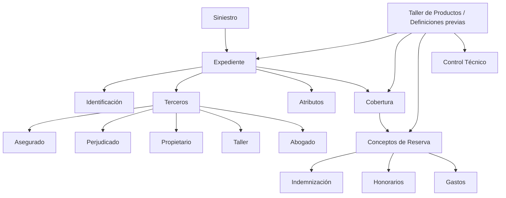
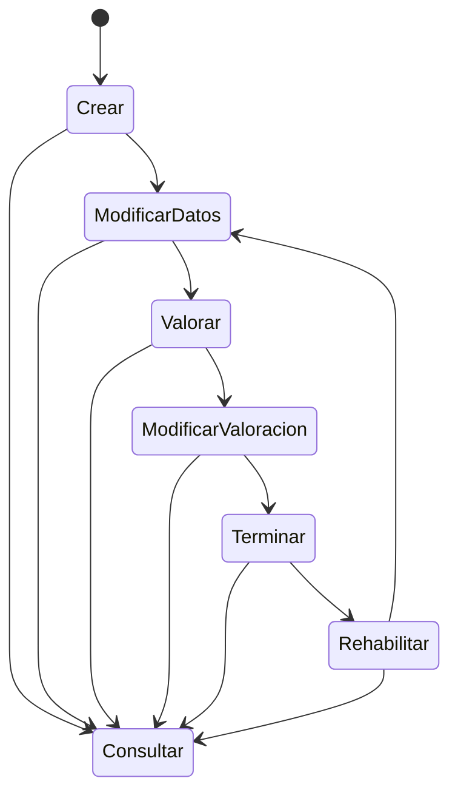

# Módulo de Tramitación de Expedientes — Especificação Funcional e de Parametrização

## 1. Metadados do Documento
- **Arquivo de Origem:** Não identificado no conteúdo fornecido
- **Tipo de Documento:** Especificação Técnica / Manual Funcional
- **Domínio / Sistema:** Módulo de Tramitación de Expedientes — MAPFRE
- **Público-Alvo:** Desenvolvedores, Arquitetos, Operação e Negócio
- **Data/Versão Identificada:** Não identificada

---

## 2. Resumo Executivo & Contexto de Negócio

O módulo de **Tramitación de Expedientes** permite realizar operações sobre expedientes associados a um sinistro. O expediente representa um registro dos danos ocasionados por um sinistro e centraliza sua identificação, terceiros envolvidos, atributos adicionais, coberturas afetadas e conceitos de reserva econômica.

A valoração econômica de um expediente é estruturada por cobertura e por conceito de reserva. Os conceitos de reserva permitem identificar o valor reservado e sua finalidade econômica, podendo corresponder a **Indemnización**, **Honorarios** ou **Gastos**. O documento também apresenta exemplos de conceitos como Indemnización, Honorarios Profesionales, Gastos Profesionales e Reservas Matemáticas.

O módulo é parametrizável, e seu comportamento depende de definições prévias no **Taller de Productos**. As definições são organizadas em níveis comum, geral, ramo e expediente, permitindo configurar estruturas de tramitação, tipos de expediente, atributos, validações, coberturas, conceitos de reserva, valores iniciais, valores máximos e controles técnicos.

Um sinistro pode possuir de um a múltiplos expedientes, conforme a quantidade de danos ocasionados. Cada número de expediente é composto pelo número do sinistro acrescido de um consecutivo iniciado em 1. O módulo também suporta valoração e pagamento em moedas distintas: a moeda de valoração pode ser diferente da moeda do sinistro ou da apólice, e a moeda de pagamento pode ser diferente da moeda de valoração.

---

## 3. Arquitetura, Componentes & Tecnologias Envolvidas

O conteúdo descreve uma arquitetura funcional centrada no módulo de tramitação de expedientes. Não há tecnologias de infraestrutura, linguagens de programação, APIs, protocolos, URLs, servidores ou ambientes técnicos detalhados no documento.

Os elementos funcionais explicitamente identificados são:

- **Siniestro:** evento ao qual um ou mais expedientes estão vinculados.
- **Expediente:** unidade de tramitação associada aos danos de um sinistro.
- **Identificación:** informações de identificação do expediente, incluindo sinistro afetado, datas de notificação e moeda.
- **Terceros:** pessoas físicas ou jurídicas intervenientes no expediente.
- **Atributos:** dados adicionais opcionais, dependentes do tipo de expediente.
- **Cobertura:** proteção que ampara o risco e define a prestação da MAPFRE quando o risco é afetado.
- **Conceptos de Reserva:** detalhamento econômico de uma cobertura para reserva de indenização, honorários ou gastos.
- **Taller de Productos:** origem das definições prévias que configuram o comportamento do módulo.
- **Control Técnico:** definição de erros, condições de paralisação e exigências de autorização na tramitação.



> **Nota de Análise:** O documento não descreve componentes técnicos implementáveis, como microsserviços, métodos HTTP, contratos JSON, bancos de dados, filas, pipelines de CI/CD, autenticação ou integrações externas.

---

## 4. Regras de Negócio, Especificações Funcionais & Processos

### 4.1 Objetivo do módulo

A finalidade do módulo de Tramitación de Expedientes é permitir realizar qualquer operação sobre um expediente.

### 4.2 Conceitos de reserva

A valoração econômica de um expediente é realizada por meio de conceitos econômicos denominados **conceptos de reserva**. Cada conceito de reserva permite detalhar, para cada cobertura:

- O valor que está sendo reservado.
- A finalidade econômica afetada pela reserva.
- A classificação da reserva em indenização, honorários ou gastos.

Os três tipos apresentados de conceitos de reserva são:

1. **Indemnización**
2. **Honorarios**
3. **Gastos**

Exemplos apresentados:

- `12 — Indemnización`
- `22 — Honorarios Profesionales`
- `34 — Gastos Profesionales`
- `44 — Reservas Matemáticas`

### 4.3 Características funcionais do módulo

- O módulo cobre todas as funcionalidades necessárias para tramitar expedientes.
- O módulo é parametrizável.
- O comportamento da aplicação depende de definições prévias realizadas no Taller de Productos.
- É possível realizar abertura automática dos tipos de expediente definidos.
- Cada expediente armazena valores econômicos no nível de cobertura e conceito de reserva.
- Um expediente pode ser valorado em uma moeda diferente da moeda do sinistro ou da apólice.
- Um expediente pode ser pago em uma moeda diferente da moeda utilizada na valoração.
- Um sinistro pode possuir de um a `n` expedientes, de acordo com os danos ocasionados.
- O número do expediente corresponde ao número do sinistro mais um consecutivo iniciado em `1`.

### 4.4 Elementos de um expediente

Um expediente é composto pelos seguintes elementos:

#### Identificación

A identificação do expediente inclui, entre outros dados:

- O sinistro que será afetado pelo expediente.
- Datas de notificação.
- Moeda do expediente.

#### Terceros

O elemento de terceiros identifica pessoas físicas e/ou jurídicas intervenientes no expediente. Esses terceiros são necessários para realizar gestões como comunicações e geração de liquidações.

Exemplos de terceiros:

- Asegurado
- Perjudicado
- Propietario
- Taller
- Abogado

#### Atributos

Atributos são dados adicionais relacionados ao expediente. O elemento é opcional, e sua informação varia segundo o tipo de expediente.

Exemplos para expediente do tipo **Daños al vehículo contrario**:

- Propietario vehículo contrario
- Conductor vehículo contrario
- Aseguradora del contrario
- Matrícula
- Marca
- Modelo

Exemplos para expediente do tipo **Daños Personales**:

- Lesionado
- Lesiones
- Información de contacto
- Hospital

#### Cobertura

A cobertura identifica o elemento que ampara o risco. Quando o risco é afetado — por exemplo, por roubo, quebra, dano, lesão ou doença — a cobertura determina a prestação que a MAPFRE realizará.

Um expediente pode afetar uma ou várias coberturas.

#### Concepto de Reserva

O conceito de reserva representa o detalhamento econômico da cobertura. Para cada cobertura, determina-se se haverá reserva de valor para:

- Indemnización
- Honorarios
- Gastos

Cada cobertura pode afetar um ou mais conceitos de reserva.

Exemplo apresentado:

| Cobertura | Conceito de Reserva | Descrição |
| :--- | :--- | :--- |
| 2001 Daños Propios Vehículo | 1 | Indemnización Asegurado |
| 2001 Daños Propios Vehículo | 2 | Honorarios Profesionales |
| 2001 Daños Propios Vehículo | 3 | Gastos Profesionales |

### 4.5 Níveis de definição

As definições de tramitação são organizadas nos níveis **Común**, **General**, **Ramo** e **Expediente**.

```mermaid
graph TD
    N[Níveis de Definição] --> C[Común]
    N --> G[General]
    N --> R[Ramo]
    N --> E[Expediente]

    C --> CE[Estructura Tramitación]
    C --> CC[Cobertura]
    C --> CF[Franquicia]
    C --> CCT[Control Técnico]

    G --> GG[Características Generales]
    G --> GCP[Causas de Proceso]
    G --> GTE[Tipo Expediente]

    R --> RTE[Tipo Expediente por Produto]
    R --> RCP[Causa Proceso por Ramo]
    R --> RSL[Sub-Límites]

    E --> EA[Atributo]
    E --> EES[Estructura]
    E --> EVI[Validaciones Información]
    E --> ECO[Cobertura]
    E --> ECR[Concepto Reserva]
    E --> ECC[Causa-Consecuencia]
    E --> EVI2[Valor Inicial]
    E --> EVM[Valor Máximo]
    E --> ECT[Control Técnico]
```



#### Nível Común

Inclui definições não exclusivas do módulo de sinistros, mas necessárias para sua configuração:

- **Estructura Tramitación:** definição das oficinas nas quais os expedientes são tramitados, supervisores e tramitadores.
- **Cobertura:** obrigação principal em um contrato de seguro. Existem diversos tipos de cobertura que determinam o comportamento nos processos de emissão e de prestações.
- **Franquicia:** estabelece o valor pelo qual o asegurado responde em caso de sinistro.
- **Control Técnico:** definição de erros e tipos de erros para tramitação de expedientes.

#### Nível General

Inclui definições aplicáveis a todos os possíveis expedientes de um sinistro:

- **Características Generales:** características gerais do módulo de sinistros; permitem definir o comportamento das operações sobre expedientes.
- **Causas de Proceso:** cataloga os motivos para executar uma operação de expediente, como solicitar causas na abertura do expediente ou na alteração de valoração.
- **Tipo Expediente:** permite definir os tipos de dano.

#### Nível Ramo

Inclui definições exclusivas do ramo configurado:

- **Tipo Expediente:** associa a cada produto os tipos de danos possíveis e suas características.
- **Causa Proceso:** cataloga os motivos para executar operações por ramo.
- **Sub-Límites:** define, por ramo, os tipos de expediente e coberturas que utilizarão sub-limites.

#### Nível Expediente

Inclui definições que afetam cada possível expediente do sinistro:

- **Atributo:** define informações adicionais do sinistro, como dados de veículo contrário e dados de lesionado.
- **Estructura:** organiza informação adicional do expediente composta por atributos, definindo obrigatoriedade e ordem de solicitação.
- **Validaciones Información:** define comportamentos e validações da informação core solicitada nas operações de expediente. O exemplo apresentado é tornar obrigatória a data de declaração de um expediente.
- **Cobertura:** define, dentre as coberturas existentes no produto, quais serão afetadas por cada tipo de expediente e qual será seu comportamento.
- **Concepto Reserva:** determina o detalhamento econômico do expediente. Os tipos apresentados são Indemnización, Honorarios e Gastos.
- **Causa-Consecuencia:** permite propor os possíveis tipos de expediente que poderão ser abertos.
- **Valor Inicial:** define o custo médio utilizado para valorar um expediente quando não há uma valoração clara.
- **Valor Máximo:** determina o valor máximo pelo qual uma cobertura e conceito de reserva podem ser valorados.
- **Control Técnico:** define condições que podem paralisar a tramitação de um expediente ou torná-lo sujeito a autorização.

### 4.6 Operações sobre expedientes

As operações podem ser realizadas em linha ou de forma diferida.



| Operação | Descrição funcional |
| :--- | :--- |
| CREAR Expediente | Registra os distintos danos ocasionados pelo sinistro. |
| MODIFICAR Datos del Expediente | Permite alterar informações e dados registrados em um expediente. |
| VALORAR Expediente | Permite reservar um valor para um expediente por cobertura e conceito de reserva. |
| MODIFICAR Valoración Expediente | Permite alterar a reserva de um expediente por cobertura e conceito de reserva. |
| TERMINAR Expediente | Finaliza expedientes reajustando sua reserva. |
| REHABILITAR Expediente | Reabre um expediente terminado. |
| CONSULTAR Expediente | Mostra todas as informações do expediente. |

---

## 5. Tabelas de Parâmetros, Ambientes e Estruturas de Dados

### 5.1 Tipos e exemplos de conceitos de reserva

| Item / Parâmetro | Descrição / Função | Tipo / Valores / Formato | Ambiente / Observações |
| :--- | :--- | :--- | :--- |
| Concepto de Reserva | Detalha o valor reservado por cobertura e a finalidade econômica da reserva. | Indemnización, Honorarios, Gastos | Cada cobertura pode afetar um ou vários conceitos de reserva. |
| 12 | Exemplo de conceito de reserva. | Indemnización | Sem detalhamento adicional. |
| 22 | Exemplo de conceito de reserva. | Honorarios Profesionales | Sem detalhamento adicional. |
| 34 | Exemplo de conceito de reserva. | Gastos Profesionales | Sem detalhamento adicional. |
| 44 | Exemplo de conceito de reserva. | Reservas Matemáticas | Sem detalhamento adicional. |

### 5.2 Estrutura do expediente

| Item / Parâmetro | Descrição / Função | Tipo / Valores / Formato | Ambiente / Observações |
| :--- | :--- | :--- | :--- |
| Expediente | Registro de tramitação associado a danos de um sinistro. | Um sinistro pode possuir de 1 a n expedientes. | O número do expediente é o número do sinistro mais consecutivo iniciado em 1. |
| Identificación | Identifica os dados fundamentais do expediente. | Sinistro afetado, datas de notificação, moeda do expediente, entre outros. | O documento não detalha todos os campos. |
| Terceros | Identifica pessoas físicas e/ou jurídicas que intervêm no expediente. | Asegurado, Perjudicado, Propietario, Taller, Abogado, entre outros. | Utilizado para comunicações, liquidações e outras gestões. |
| Atributos | Armazena dados adicionais relacionados ao expediente. | Opcional; conteúdo varia por tipo de expediente. | Pode incluir dados do veículo contrário ou dados do lesionado. |
| Cobertura | Identifica o amparo do risco e a prestação da MAPFRE quando o risco é afetado. | Uma ou várias coberturas por expediente. | Exemplos de risco: roubo, quebra, dano, lesão, doença. |
| Concepto de Reserva | Detalhamento econômico associado à cobertura. | Indemnización, Honorarios, Gastos. | Uma cobertura pode possuir um ou mais conceitos. |

### 5.3 Atributos exemplificados por tipo de expediente

| Item / Parâmetro | Descrição / Função | Tipo / Valores / Formato | Ambiente / Observações |
| :--- | :--- | :--- | :--- |
| Propietario vehículo contrario | Identificação do proprietário do veículo contrário. | Atributo | Aplicável ao tipo Daños al vehículo contrario. |
| Conductor vehículo contrario | Identificação do condutor do veículo contrário. | Atributo | Aplicável ao tipo Daños al vehículo contrario. |
| Aseguradora del contrario | Identificação da seguradora da parte contrária. | Atributo | Aplicável ao tipo Daños al vehículo contrario. |
| Matrícula | Identificação do veículo. | Atributo | Aplicável ao tipo Daños al vehículo contrario. |
| Marca | Marca do veículo. | Atributo | Aplicável ao tipo Daños al vehículo contrario. |
| Modelo | Modelo do veículo. | Atributo | Aplicável ao tipo Daños al vehículo contrario. |
| Lesionado | Pessoa lesionada. | Atributo | Aplicável ao tipo Daños Personales. |
| Lesiones | Informações sobre lesões. | Atributo | Aplicável ao tipo Daños Personales. |
| Información de contacto | Dados de contato. | Atributo | Aplicável ao tipo Daños Personales. |
| Hospital | Hospital relacionado ao expediente. | Atributo | Aplicável ao tipo Daños Personales. |

### 5.4 Definições por nível

| Item / Parâmetro | Descrição / Função | Tipo / Valores / Formato | Ambiente / Observações |
| :--- | :--- | :--- | :--- |
| Común — Estructura Tramitación | Define oficinas, supervisores e tramitadores. | Definição comum | Não exclusiva do módulo de sinistros. |
| Común — Cobertura | Define obrigação principal de contrato de seguro. | Definição comum | Impacta processos de emissão e prestações. |
| Común — Franquicia | Define valor sob responsabilidade do asegurado em caso de sinistro. | Definição comum | Sem detalhamento de cálculo. |
| Común — Control Técnico | Define erros e tipos de erros para tramitação. | Definição comum | Sem catálogo de erros apresentado. |
| General — Características Generales | Define comportamento das operações de expedientes. | Definição geral | Aplicável a todos os possíveis expedientes do sinistro. |
| General — Causas de Proceso | Cataloga motivos para operações de expediente. | Definição geral | Exemplos: abertura e alteração de valoração. |
| General — Tipo Expediente | Define tipos de dano. | Definição geral | Sem lista de tipos apresentada. |
| Ramo — Tipo Expediente | Associa produtos a tipos de danos e características. | Definição por ramo | Exclusiva do ramo definido. |
| Ramo — Causa Proceso | Cataloga motivos para operações por ramo. | Definição por ramo | Sem catálogo apresentado. |
| Ramo — Sub-Límites | Define tipos de expediente e coberturas que usam sub-limites. | Definição por ramo | Sem valores ou regras de sub-limites. |
| Expediente — Atributo | Define informação adicional, como dados de veículo contrário ou lesionado. | Definição por expediente | O conteúdo depende do tipo de expediente. |
| Expediente — Estructura | Define atributos, obrigatoriedade e ordem de solicitação. | Definição por expediente | Estrutura informações adicionais. |
| Expediente — Validaciones Información | Define validações e comportamentos para dados core. | Definição por expediente | Exemplo: data de declaração obrigatória. |
| Expediente — Cobertura | Define coberturas afetadas por tipo de expediente e comportamento. | Definição por expediente | Baseia-se nas coberturas do produto. |
| Expediente — Concepto Reserva | Determina detalhamento econômico do expediente. | Indemnización, Honorarios, Gastos | Sem regras monetárias detalhadas. |
| Expediente — Causa-Consecuencia | Propõe tipos de expediente que podem ser abertos. | Definição por expediente | Sem matriz de causa e consequência apresentada. |
| Expediente — Valor Inicial | Define custo médio para valoração sem valor claro. | Valor monetário não especificado | Sem fórmula ou valores apresentados. |
| Expediente — Valor Máximo | Determina máximo para valoração de cobertura e conceito de reserva. | Valor monetário não especificado | Sem limites apresentados. |
| Expediente — Control Técnico | Define paralisação de tramitação ou obrigatoriedade de autorização. | Definição por expediente | Sem condições específicas apresentadas. |

### 5.5 Cobertura e conceitos de reserva exemplificados

| Item / Parâmetro | Descrição / Função | Tipo / Valores / Formato | Ambiente / Observações |
| :--- | :--- | :--- | :--- |
| Cobertura 2001 | Daños Propios Vehículo | Cobertura | Associada a três conceitos de reserva no exemplo. |
| Conceito 1 | Indemnización Asegurado | Conceito de reserva | Relacionado à Cobertura 2001. |
| Conceito 2 | Honorarios Profesionales | Conceito de reserva | Relacionado à Cobertura 2001. |
| Conceito 3 | Gastos Profesionales | Conceito de reserva | Relacionado à Cobertura 2001. |

> **Nota de Análise:** O documento não apresenta URLs, servidores, portas, nomes de ambientes, caminhos de logs, variáveis de configuração ou estruturas de banco de dados.

---

## 6. Bateria de Perguntas & Respostas para RAG (FAQ Sintético)

### P1: Qual é a finalidade do módulo de Tramitación de Expedientes?
**R:** A finalidade do módulo de Tramitación de Expedientes é permitir realizar qualquer operação sobre um expediente associado a um sinistro. As operações incluem criar, modificar dados, valorar, modificar valoração, terminar, reabilitar e consultar expedientes.

### P2: Como um expediente é identificado em relação a um sinistro?
**R:** Um expediente é associado ao sinistro que será afetado. O número do expediente é formado pelo número do sinistro mais um número consecutivo iniciado em 1. Um sinistro pode ter de um a múltiplos expedientes, conforme os danos ocasionados.

### P3: Quais são os elementos que compõem um expediente?
**R:** Um expediente é composto por identificação, terceiros, atributos, cobertura e conceitos de reserva. A identificação inclui, entre outros dados, sinistro afetado, datas de notificação e moeda do expediente. Terceiros representam pessoas ou entidades intervenientes; atributos armazenam informações adicionais; cobertura ampara o risco; e conceitos de reserva detalham a reserva econômica.

### P4: Quais tipos de conceitos de reserva são definidos no documento?
**R:** O documento define três tipos de conceitos de reserva: Indemnización, Honorarios e Gastos. Esses conceitos permitem reservar valores por cobertura e especificar a finalidade econômica do valor reservado.

### P5: Uma cobertura pode ter mais de um conceito de reserva?
**R:** Sim. Cada cobertura pode afetar um ou vários conceitos de reserva. O exemplo da cobertura `2001 Daños Propios Vehículo` apresenta os conceitos Indemnización Asegurado, Honorarios Profesionales e Gastos Profesionales.

### P6: Como são tratados múltiplos expedientes para um mesmo sinistro?
**R:** Um sinistro pode ter de um a `n` expedientes, podendo existir tantos expedientes quanto danos tenham sido ocasionados. Cada expediente é identificado pelo número do sinistro acrescido de um consecutivo iniciado em 1.

### P7: O módulo suporta operações em diferentes moedas?
**R:** Sim. Os expedientes podem ser valorados em uma moeda diferente da moeda do sinistro ou da apólice. Além disso, o pagamento pode ocorrer em uma moeda diferente da moeda usada na valoração.

### P8: O que é configurado no nível General das definições de tramitação?
**R:** No nível General são configuradas definições que afetam todos os possíveis expedientes de um sinistro. O documento cita Características Generales, Causas de Proceso e Tipo Expediente. Causas de Proceso podem catalogar motivos para operações como abertura de expediente ou alteração de valoração.

### P9: O que é definido no nível Ramo?
**R:** No nível Ramo são definidas configurações exclusivas do ramo em tratamento. Entre elas estão Tipo Expediente, para associar produtos a tipos de danos e características; Causa Proceso, para catalogar motivos de operações por ramo; e Sub-Límites, para definir os tipos de expediente e coberturas que utilizarão sub-limites.

### P10: Qual é a função do Valor Inicial de um expediente?
**R:** O Valor Inicial define o custo médio utilizado para valorar um expediente quando não existe uma valoração clara. O documento não informa fórmula, moeda, algoritmo de cálculo ou valores específicos para o Valor Inicial.

### P11: Qual é a finalidade do Valor Máximo?
**R:** O Valor Máximo determina o valor máximo pelo qual uma combinação de cobertura e conceito de reserva pode ser valorada. O documento não especifica os valores monetários, regras de exceção ou mecanismos de validação associados a esse limite.

### P12: Quais operações podem ser executadas sobre um expediente?
**R:** As operações listadas são CREAR Expediente, MODIFICAR Datos del Expediente, VALORAR Expediente, MODIFICAR Valoración Expediente, TERMINAR Expediente, REHABILITAR Expediente e CONSULTAR Expediente. Essas operações podem ser realizadas em linha ou de forma diferida.

### P13: O que ocorre na operação TERMINAR Expediente?
**R:** A operação TERMINAR Expediente finaliza expedientes reajustando sua reserva. O documento não detalha as regras de reajuste, os critérios de encerramento nem os efeitos sobre os conceitos de reserva individuais.

### P14: Quais dados adicionais podem existir em um expediente de danos ao veículo contrário?
**R:** Para o tipo de expediente Daños al vehículo contrario, o documento cita atributos como proprietário do veículo contrário, condutor do veículo contrário, seguradora do contrário, matrícula, marca e modelo.

### P15: Para que serve o Control Técnico nas definições de expediente?
**R:** No nível Expediente, o Control Técnico define as condições nas quais a tramitação de um expediente pode ser paralisada ou passar a exigir autorização. No nível Común, o Control Técnico também contempla a definição de erros e tipos de erros para a tramitação de expedientes.

---

## 7. Glossário de Termos, Siglas & Conceitos-Chave

- **Asegurado:** pessoa segurada, citada como possível terceiro interveniente no expediente.
- **Atributo:** informação adicional relacionada ao expediente; pode variar segundo o tipo de expediente.
- **Causa-Consecuencia:** definição que permite propor os possíveis tipos de expediente que poderão ser abertos.
- **Causa Proceso / Causas de Proceso:** definição que cataloga os motivos para realizar operações sobre expedientes.
- **Cobertura:** obrigação principal em um contrato de seguro; identifica o amparo de um risco e a prestação a ser realizada quando o risco é afetado.
- **Concepto de Reserva:** conceito econômico utilizado para detalhar valores reservados por cobertura.
- **Control Técnico:** definição de erros, tipos de erro e condições que podem paralisar a tramitação ou exigir autorização.
- **Expediente:** registro de tramitação associado a danos ocasionados por um sinistro.
- **Franquicia:** valor pelo qual o asegurado responde em caso de sinistro.
- **Gastos:** tipo de conceito de reserva associado a despesas.
- **Honorarios:** tipo de conceito de reserva associado a honorários.
- **Indemnización:** tipo de conceito de reserva associado à indenização.
- **MAPFRE:** entidade mencionada como responsável por realizar a prestação determinada pela cobertura quando o risco é afetado.
- **Perjudicado:** pessoa prejudicada, citada como possível terceiro interveniente no expediente.
- **Ramo:** nível de definição exclusivo do ramo que está sendo configurado.
- **Reservas Matemáticas:** exemplo de conceito de reserva apresentado no documento.
- **Siniestro:** evento ao qual um ou mais expedientes estão vinculados.
- **Sub-Límites:** definição por ramo que indica tipos de expediente e coberturas que utilizarão sub-limites.
- **Taller:** terceiro interveniente citado no expediente; o documento também menciona Taller de Productos como fonte de definições prévias.
- **Taller de Productos:** contexto de definições prévias que condicionam o comportamento do módulo.
- **Terceros:** pessoas físicas e/ou jurídicas que intervêm em um expediente.
- **Tipo Expediente:** definição de tipos de dano; no nível Ramo, associa tipos de dano e características a cada produto.
- **Valor Inicial:** custo médio utilizado quando não há uma valoração clara de expediente.
- **Valor Máximo:** valor máximo permitido para valorar uma combinação de cobertura e conceito de reserva.

---

## 8. Notas Críticas, Riscos & Limitações

- O comportamento do módulo depende de definições prévias no **Taller de Productos**. Configurações ausentes, inconsistentes ou incompletas podem afetar operações de expediente.
- O documento menciona abertura automática de expedientes, mas não especifica critérios, gatilhos, tipos habilitados, regras de exceção ou responsáveis pela configuração.
- O documento descreve operações em linha e diferidas, mas não informa mecanismos de processamento, agendamento, estados técnicos, retentativas ou tratamento de falhas.
- O suporte a múltiplas moedas é informado, porém não há especificação de taxas de câmbio, data de cotação, regras de conversão, arredondamento ou controles contábeis.
- Valor Inicial e Valor Máximo são apresentados como definições relevantes, mas não há valores, fórmulas, moedas, critérios de manutenção ou tratamento de exceções.
- O Control Técnico pode paralisar a tramitação ou exigir autorização, mas o documento não fornece condições, níveis de autorização, fluxos de aprovação ou catálogo de erros.
- Não são detalhados métodos HTTP, contratos JSON, APIs, endpoints, integrações, bancos de dados, segurança, autenticação, observabilidade, logs, URLs ou ambientes.
- **Nota de Análise:** O documento lista funcionalidades e definições de alto nível; não há detalhamento adicional suficiente para derivar contratos técnicos ou regras de implementação além das explicitamente apresentadas.

---

## 9. Conteúdo Bruto Estruturado (Referência Fiel)

```text
--- [PÁGINA 1 DE 8] ---

INTRODUCCIÓN - Módulo Tramitación de
Expedientes
Objetivo
La finalidad de este módulo es poder realizar cualquier operación con un Expediente.
Concepto
Concepto de Reserva
Características
Elementos de un expediente
Definiciones Tramitación de Expedientes
Operaciones Tramitación de Expedientes
Conceptos
Concepto de Reserva
La valoración económica de un expediente, se realiza a través de unos conceptos económicos que
denominaremos conceptos de reserva. Estos permiten detallar para cada cobertura, el importe que
se está reservando a qué está afectando. Hay tres tipos de Conceptos:
 /
 RS
Inicio Soluciones APIs Documentación Zeus
ES


--- [PÁGINA 2 DE 8] ---

Indemnización
Honorarios
Gastos
Ejemplo:
Conceptos de Reserva
12 Indemnización
22 Honorarios Profesionales
34 Gastos Profesionales
44 Reservas Matemáticas
Características
Cubre todas las funcionalidades de expedientes
Este módulo, contiene todas las funcionalidades necesarias para tramitar expedientes.
Parametrizable
El módulo es parametrizable y el comportamiento de la aplicación depende de las definiciones
previas (Taller de Productos).
Apertura Automática de expedientes
Se podrán aperturar automáticamente todos los tipos de expediente que se decidan.
Importes económicos
Cada expediente tiene importes económicos almacenados a nivel de cobertura y concepto de
reserva.
Múltiples monedas
Los expedientes pueden valorarse en una moneda diferente a la del siniestro (póliza) y pagarse
en otra moneda diferente a la de la valoración.
Múltiples expedientes
Un siniestro podrá tener de uno a n expedientes, tantos expedientes como daños se hayan
ocasionado. El número de expediente es el número de siniestro más un consecutivo empezando


--- [PÁGINA 3 DE 8] ---

por el 1.
Elementos de un expediente
Un expediente está compuesto de varios elementos:
EXPEDIENTE
IDENTIFICACIÓN TERCEROS ATRIBUTOS COBERTURA CONCEPTOS DE RESERVA
Datos Identificación del expediente
Se identifica:
El siniestro al que va afectar el expediente
Las fechas de notificación
Moneda del expediente
Etc.
Terceros
Se identifica a las personas (físicas y/o jurídicas) que intervienen en el Expediente. Son necesarias
para realizar distintas gestiones, como comunicaciones, generar liquidaciones, etc.
Asegurado
Perjudicado
Propietario
Taller
Abogado
Etc.
Atributos
Este elemento contiene todos los datos adicionales, relacionados con el expediente, es opcional. La
información variará dependiendo del tipo de expediente.
Ejemplo de estas características:
Si el tipo de expediente es Daños al vehículo contrario:
Propietario vehículo contrario
Conductor vehículo contrario
Aseguradora del contrario


--- [PÁGINA 4 DE 8] ---

Matrícula
Marca
Modelo
Etc.
Si el tipo de expediente es Daños Personales:
Lesionado
Lesiones
Información de contacto
Hospital
Etc.
Cobertura
Este elemento identifica contra qué está amparado el riesgo y determina en caso que este se vea
afectado (como puede ser por un robo, una rotura, un daño, una lesión, enfermedad, etc.), la
prestación que MAPFRE realizará. Un expediente puede afectar a una o varias coberturas
Concepto de Reserva
Detalle económico de la cobertura, en el que se determina si se va a reservar un importe para pagar
Indemnización, Honorarios o Gastos. Cada cobertura puede afectar a uno o varios conceptos de
reserva.
Cobertura Concepto Reserva
2001 Daños Propios Vehículo 1 Indemnización Asegurado
2 Honorarios Profesionales
3 Gastos Profesionales
Definiciones Tramitación de Expedientes
Los elementos de definición atienden a distintos niveles:


--- [PÁGINA 5 DE 8] ---

NIVELES DE DEFINICIÓN
COMÚN GENERAL RAMO EXPEDIENTE
COMÚN
En este nivel se encuentran definiciones que NO son exclusivas del
módulo de siniestros, pero son necesarias para poder realizar la
definición. Entre otras definiciones se encuentra:
ESTRUCTURA TRAMITACIÓN
Definición de oficinas donde se tramitan
expedientes, supervisores tramitadores
COBERTURA
Obligación principal en un contrato de seguro.
Existen diversos tipos de cobertura que
determinan el comportamiento tanto en el
proceso de emisión, como en el proceso de
prestaciones
FRANQUICIA
Establecer la cantidad por la que el
asegurado responde en caso de siniestro
CONTROL TÉCNICO
Definición de errores, tipos de Errores para
tramitación de expedientes
GENERAL
En este nivel se encuentran definiciones que afectarán a todos los
posibles expedientes de un siniestro. Entre otros se define:
CARACTERÍSTICAS GENERALES
Características generales del módulo de
siniestros, permite definir el comportamiento
de las operaciones de expedientes como por
CAUSAS DE PROCESO
Permite catalogar los motivos por los que se
quiere realizar una operación de expediente


--- [PÁGINA 6 DE 8] ---

ejemplo si se va a pedir causas en la apertura
de expediente, en al cambio de valoración...
TIPO EXPEDIENTE
Permite definir los Tipos de Daño
RAMO
Son exclusivas del ramo que se está definiendo. Por ejemplo:
TIPO EXPEDIENTE
Permite asociar a cada Producto los Tipos de
daños posibles y sus características
CAUSA PROCESO
Permite catalogar los motivos por los que se
quiere realizar las operaciones para cada
ramo
SUB-LIMITES
Permite definir por Ramo, qué tipos de
expediente y coberturas van a utilizar sub-
límites.
EXPEDIENTE
Definiciones que afectan a cada uno de los posibles expedientes del
siniestro
ATRIBUTO
Permite definir la información adicional del
siniestro, como datos vehículo contrario,
datos lesionado, etc.
ESTRUCTURA
Información adicional del expediente
compuesta por atributos, obligatoriedad o no
de pedir información, orden en el que se va a
pedir


--- [PÁGINA 7 DE 8] ---

VALIDACIONES INFORMACIÓN
Definir comportamientos y validaciones de la
información core, que se piden en las
operaciones de expedientes. Ejemplo poner
obligatoria la fecha de declaración de un
expediente
COBERTURA
Definir de todas las coberturas definidas en el
producto, cual va a ser afectada por cada uno
de los tipos de expedientes y su
comportamiento
CONCEPTO RESERVA
Determinar el desglose económico del
expediente. Los tipos de conceptos de
reserva pueden ser Indemnización,
Honorarios o Gastos
CAUSA-CONSECUENCIA
Permite proponer los posibles Tipos de
Expedientes que se podrán aperturar
VALOR INICIAL
Definición del coste medio con el que se va a
valorar el expediente si no se tiene una
valoración clara
VALOR MÁXIMO
Determinar el importe Máximo por el que se
puede valorar una cobertura concepto de
reserva
CONTROL TÉCNICO
Definir en qué condiciones se puede paralizar
la tramitación de un expediente u obligación
de ser autorizada
Operaciones Tramitación de Expedientes
OPERACIÓN EXPEDIENTE
Operaciones que se pueden realizar a cada uno de los posibles
expedientes del siniestro, se pueden realizar tanto en línea como
diferido
CREAR Expediente
 MODIFICAR Datos del Expediente


--- [PÁGINA 8 DE 8] ---

En esta operación se registran los distintos
daños que ha ocasionado el siniestro
Permite cambiar la información, los datos
registrados de un expediente
VALORAR Expediente
Permite reservar un importe a un expediente
por cobertura y concepto de reserva
MODIFICAR Valoración Expediente
Permite cambiar la reserva de un expediente
por cobertura y concepto de reserva
TERMINAR Expediente
Finaliza expedientes reajustando su reserva
REHABILITAR Expediente
Reabre un Expediente Terminado
CONSULTAR Expediente
Muestra toda la información del Expediente
```
