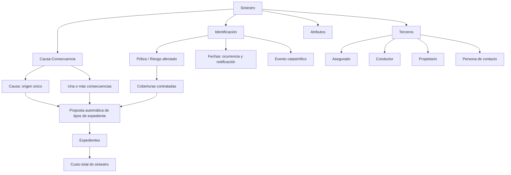

# Tramitación de Siniestros — Conceitos, Definições, Configuração e Operações

## 1. Metadados do Documento
- **Arquivo de Origem:** Não identificado no conteúdo fornecido
- **Tipo de Documento:** Manual Funcional
- **Domínio / Sistema:** Tramitación de Siniestros
- **Público-Alvo:** Não explicitamente identificado; conteúdo direcionado à configuração e operação do módulo de sinistros
- **Data/Versão Identificada:** Não identificada

---

## 2. Resumo Executivo & Contexto de Negócio

O documento descreve o módulo de **Tramitación de Siniestros**, cuja finalidade é permitir a realização de operações sobre um sinistro. O sinistro centraliza informações comuns aos expedientes relacionados e não possui valores econômicos próprios: o custo do sinistro corresponde à soma dos custos de todos os seus expedientes.

A classificação de um sinistro começa pela identificação de uma única **causa**, entendida como o motivo ou origem do evento. O sinistro também deve possuir pelo menos uma **consequência**, que representa os danos resultantes do evento. A combinação entre causa e consequências permite ao sistema propor automaticamente os possíveis tipos de expediente a serem abertos.

A abertura de expedientes proposta pelo sistema depende não somente da relação causa-consequência, mas também das coberturas contratadas na relação apólice-risco. No exemplo apresentado, a causa “Atropello”, combinada com determinadas consequências, pode resultar na proposta de abertura de expedientes de Danos Próprios e Danos Pessoais, desde que as coberturas correspondentes estejam contratadas.

O módulo é parametrizável. Seu comportamento depende de definições organizadas em quatro níveis: **Comum**, **General**, **Ramo** e **Siniestro**. Esses níveis abrangem informações corporativas, regras gerais do módulo, regras específicas por ramo e definições aplicáveis aos expedientes de um sinistro.

As operações disponíveis sobre um sinistro são criar, modificar, terminar, reabilitar e consultar. As operações podem ser executadas tanto em linha quanto de forma diferida.

---

## 3. Arquitetura, Componentes & Tecnologias Envolvidas

O conteúdo não descreve arquitetura de software, microsserviços, protocolos, bancos de dados, tecnologias, URLs, ambientes ou contratos de integração. O documento apresenta uma arquitetura funcional e de parametrização do módulo de sinistros.

Os componentes funcionais identificados são:

- **Siniestro:** entidade que reúne as informações comuns aos expedientes.
- **Expedientes:** itens associados ao sinistro, cujos custos compõem o custo total do sinistro.
- **Causa:** origem única do sinistro.
- **Consecuencia:** dano ou danos decorrentes do sinistro.
- **Póliza / Riesgo:** relação cuja cobertura contratada condiciona a proposta de abertura de expedientes.
- **Terceros:** pessoas físicas e/ou jurídicas que intervêm no sinistro.
- **Atributos:** informações adicionais do sinistro.
- **Definições de configuração:** regras distribuídas nos níveis Comum, General, Ramo e Siniestro.
- **Operações de Tramitación Siniestros:** criar, modificar, terminar, reabilitar e consultar sinistros.

```mermaid
graph TD
    D[Definiciones Tramitación de Siniestro] --> COM[Común]
    D --> GEN[General]
    D --> RAM[Ramo]
    D --> SIN[Siniestro]

    COM --> COMP[Compañía]
    COM --> MON[Moneda]
    COM --> GEO[Estructura geográfica]
    COM --> COMER[Estructura comercial]
    COM --> PROD[Estructura producto]
    COM --> CT[Control técnico]

    GEN --> NUM[Numeración]
    GEN --> EVT[Eventos]
    GEN --> CG[Características generales]
    GEN --> CP[Causas de procesos]

    RAM --> EXT[Extemporaneidad]
    RAM --> CPR[Causa proceso]
    RAM --> ES[Especialidad supervisores]
    RAM --> ET[Especialidad tramitadores]

    SIN --> COA[Causa origen]
    SIN --> CONS[Consecuencia]
    SIN --> ATR[Atributo]
    SIN --> EST[Estructura]
    SIN --> II[Información inicial]
    SIN --> VI[Validaciones información]
    SIN --> CTS[Control técnico]
```





> **Nota de Análise:** o documento não detalha tecnologias de implementação, interfaces, métodos HTTP, contratos JSON, modelos físicos de dados, autenticação, logs ou integrações externas.

---

## 4. Regras de Negócio, Especificações Funcionais & Processos

### 4.1. Finalidade do módulo

O módulo de Tramitación de Siniestros tem a finalidade de permitir a realização de qualquer operação relacionada a um sinistro.

### 4.2. Causa do sinistro

- A causa é o motivo que origina o sinistro.
- A causa representa a origem do sinistro.
- Cada sinistro possui uma única causa.
- A causa deve refletir o evento originador, mesmo que outros eventos ocorram posteriormente.

**Exemplos documentados:**

1. Se um veículo é roubado e posteriormente incendiado, a causa ou origem do sinistro é **Robo**.
2. Se uma casa é incendiada e, posteriormente, invadida para roubo, a causa do sinistro é **Incendio**.

### 4.3. Consequências do sinistro

- Consequências são os danos resultantes do sinistro.
- Um sinistro deve possuir pelo menos uma consequência selecionada.
- Um sinistro pode possuir múltiplas consequências.
- As consequências representam os diferentes danos ocasionados a partir do sinistro.

**Exemplos documentados de consequências:**

- Daños materiales a vehículos.
- Daños materiales a cosas.
- Muerte.
- Invalidez Permanente.
- Daños personales.

### 4.4. Relação entre causa, consequência e abertura de expedientes

A seleção conjunta da causa e das consequências permite ao sistema realizar uma proposta automática dos possíveis tipos de expediente a serem abertos.

A proposta automática depende de duas condições:

1. A combinação de causa e consequência selecionada.
2. A existência das coberturas correspondentes contratadas na apólice-risco.

#### Exemplo: causa “Atropello”

| Causa | Consequência | Tipo de Expediente | Cobertura |
| :--- | :--- | :--- | :--- |
| Atropello | Daños Vehículo Asegurado | DPM - Daños Propios Materiales | Daños Propios |
| Atropello | Daños Personales a Terceros | DPA - Daños Personales | Responsabilidad Civil |

**Regras do exemplo:**

- Se a causa selecionada for **Atropello** e forem selecionadas as duas consequências do exemplo, o sistema propõe a abertura de dois tipos de expedientes:
  - Daños Propios.
  - Daños Personales.
- A proposta dos dois expedientes ocorre somente se a apólice-risco possuir as duas coberturas contratadas.
- Se a causa selecionada for **Atropello** e somente a consequência **Daños al Vehículo Asegurado** for selecionada, o sistema propõe somente a abertura do expediente de tipo **Daños Propios**.
- A proposta do expediente de Daños Propios ocorre somente se a apólice-risco possuir essa cobertura contratada.

### 4.5. Características do sinistro

#### Informação comum

O sinistro engloba toda a informação comum aos seus expedientes.

#### Sem custo próprio

O sinistro não possui importes econômicos próprios. O custo do sinistro corresponde à soma dos custos de todos os seus expedientes.

#### Parametrização

O comportamento do módulo depende de sua definição ou parametrização.

### 4.6. Elementos que compõem um sinistro

Um sinistro é composto pelos seguintes elementos:

1. Identificação.
2. Terceiros.
3. Causa-consequência.
4. Atributos.

#### Identificação

A identificação do sinistro inclui, entre outros dados:

- Apólice-risco afetada.
- Data de ocorrência.
- Data de notificação.
- Evento catastrófico.

#### Terceiros

Os terceiros identificam as pessoas físicas e/ou jurídicas que intervêm no sinistro. Os exemplos apresentados são:

- Asegurado.
- Conductor.
- Propietario.
- Persona de Contacto.

#### Causa-consequência

O elemento causa-consequência abrange:

- Causa do sinistro, correspondente à origem do sinistro.
- Consequência do sinistro, correspondente a cada dano ocasionado no sinistro.

#### Atributos

Os atributos reúnem dados adicionais do sinistro. Para um risco de automóvel, o documento apresenta os seguintes exemplos:

- Relato do sinistro.
- Localização do lugar do sinistro.

### 4.7. Níveis de definição do módulo

As definições de Tramitación de Siniestro atendem aos níveis:

1. Común.
2. General.
3. Ramo.
4. Siniestro.

#### Nível Común

O nível Común contém definições que não são exclusivas do módulo de sinistros, mas são necessárias para realizar a configuração.

Inclui:

- Compañía.
- Moneda.
- Estructura Geográfica.
- Estructura Comercial.
- Estructura Producto.
- Control Técnico.
- Definição de erros e tipos de erros.
- Estructura Tramitación.

#### Nível General

O nível General contém definições que não são exclusivas de um ramo e são utilizadas no módulo de sinistros.

Inclui:

- Numeración.
- Eventos.
- Características Generales.
- Causas de Procesos.

#### Nível Ramo

O nível Ramo contém definições exclusivas do ramo configurado.

Inclui:

- Extemporaneidad.
- Causa Proceso.
- Especialidad Supervisores.
- Especialidad Tramitadores.

#### Nível Siniestro

O nível Siniestro contém definições que afetam todos os possíveis expedientes de um sinistro.

Inclui:

- Causa Origen.
- Consecuencia.
- Atributo.
- Estructura.
- Información Inicial.
- Validaciones Información.
- Control Técnico.

### 4.8. Operações de Tramitación Siniestros

As operações sobre um sinistro podem ser realizadas em linha ou de forma diferida.

| Operação | Regra funcional documentada |
| :--- | :--- |
| CREAR Siniestro | Permite gerar um novo sinistro. |
| MODIFICAR Siniestro | Permite alterar as informações do sinistro. |
| TERMINAR Siniestro | Finaliza sinistros sem expedientes. |
| REHABILITAR Siniestro | Reabre um sinistro terminado. |
| CONSULTAR Siniestro | Exibe todas as informações do sinistro. |

---

## 5. Tabelas de Parâmetros, Ambientes e Estruturas de Dados

### 5.1. Estrutura funcional do sinistro

| Item / Parâmetro | Descrição / Função | Tipo / Valores / Formato | Ambiente / Observações |
| :--- | :--- | :--- | :--- |
| Siniestro | Centraliza a informação comum a todos os expedientes. | Entidade funcional | Não possui importes econômicos próprios. |
| Expediente | Item associado ao sinistro. | Entidade funcional | O custo do sinistro é a soma dos custos dos expedientes. |
| Causa | Motivo ou origem do sinistro. | Uma causa por sinistro | A causa é única por sinistro. |
| Consecuencia | Dano resultante do sinistro. | Uma ou mais consequências | Deve ser selecionada ao menos uma consequência. |
| Póliza / Riesgo | Apólice-risco afetada pelo sinistro. | Referência de identificação | As coberturas contratadas condicionam a proposta de expedientes. |
| Identificación | Dados identificadores do sinistro. | Apólice-risco, datas, evento catastrófico, entre outros | Inclui ocorrência e notificação. |
| Terceros | Pessoas físicas e/ou jurídicas intervenientes. | Asegurado, conductor, propietario, persona de contacto, entre outros | Não há lista exaustiva documentada. |
| Atributos | Dados adicionais do sinistro. | Relato, localização e outros atributos configuráveis | Exemplo apresentado para risco de automóvel. |

### 5.2. Relação causa-consequência-expediente

| Item / Parâmetro | Descrição / Função | Tipo / Valores / Formato | Ambiente / Observações |
| :--- | :--- | :--- | :--- |
| Causa Atropello | Causa de exemplo para proposta de expedientes. | Atropello | Exemplo funcional do documento. |
| Consequência: Daños Vehículo Asegurado | Dano ao veículo segurado. | Consequência | Pode resultar em DPM. |
| Tipo de expediente: DPM | Daños Propios Materiales. | Tipo de expediente | Exige cobertura Daños Propios. |
| Cobertura Daños Propios | Cobertura associada ao expediente DPM. | Cobertura de apólice-risco | Deve estar contratada. |
| Consequência: Daños Personales a Terceros | Dano pessoal a terceiros. | Consequência | Pode resultar em DPA. |
| Tipo de expediente: DPA | Daños Personales. | Tipo de expediente | Exige cobertura Responsabilidad Civil. |
| Cobertura Responsabilidad Civil | Cobertura associada ao expediente DPA. | Cobertura de apólice-risco | Deve estar contratada. |

### 5.3. Parâmetros de definição por nível

| Item / Parâmetro | Descrição / Função | Tipo / Valores / Formato | Ambiente / Observações |
| :--- | :--- | :--- | :--- |
| Compañía | Informação geral da empresa. | Definição Común | Não exclusiva do módulo de sinistros. |
| Moneda | Informação geral das moedas. | Definição Común | Não exclusiva do módulo de sinistros. |
| Estructura Geográfica | Divisões do país por zonas. | Definição Común | Não exclusiva do módulo de sinistros. |
| Estructura Comercial | Divisões organizativas da companhia. | Definição Común | Não exclusiva do módulo de sinistros. |
| Estructura Producto | Divisões dos ramos. | Definição Común | Conteúdo apresentado em continuidade entre as páginas 4 e 5. |
| Control Técnico | Definição de controle técnico. | Definição Común e Siniestro | No nível Siniestro, define condições de paralisação ou obrigação de autorização. |
| Definición de errores | Definição de erros e tipos de erros. | Definição Común | Sem detalhamento adicional. |
| Estructura Tramitación | Define escritórios onde expedientes são tratados, supervisores e tramitadores. | Definição Común | Sem detalhamento adicional. |
| Numeración | Determina elementos do número de sinistro e sua ordem. | Definição General | Aplicável ao módulo de sinistros. |
| Eventos | Registra fenômenos catastróficos ocorridos em determinada zona geográfica. | Definição General | Aplicável ao módulo de sinistros. |
| Características Generales | Determina comportamentos do módulo de sinistros. | Definição General | Sem regras específicas detalhadas. |
| Causas de Procesos | Cataloga os motivos pelos quais se deseja realizar uma operação. | Definição General | Aplicável ao módulo de sinistros. |
| Extemporaneidad | Indica o número máximo de dias entre ocorrência e notificação à companhia. | Definição Ramo | Exclusiva do ramo configurado. |
| Causa Proceso | Cataloga motivos para realizar operações por ramo. | Definição Ramo | Exclusiva do ramo configurado. |
| Especialidad Supervisores | Especializa supervisores em determinados produtos. | Definição Ramo | Exclusiva do ramo configurado. |
| Especialidad Tramitadores | Especializa tramitadores em determinados produtos. | Definição Ramo | Exclusiva do ramo configurado. |
| Causa Origen | Cataloga causas que originam um sinistro. | Definição Siniestro | Afeta possíveis expedientes do sinistro. |
| Consecuencia | Define os danos possíveis decorrentes de um sinistro. | Definição Siniestro | Exemplos: danos materiais e danos pessoais. |
| Atributo | Define informação adicional do sinistro. | Definição Siniestro | Exemplos: dados de veículo contrário e dados de lesionado. |
| Estructura | Organiza informação adicional composta por atributos. | Definição Siniestro | Define obrigatoriedade e ordem de solicitação da informação. |
| Información Inicial | Registra informação prévia para atributos das operações. | Definição Siniestro | Exemplo: data de comunicação preenchida com a data do dia. |
| Validaciones Información | Define comportamentos e validações da informação core solicitada nas operações. | Definição Siniestro | Exemplo: tornar obrigatória a hora de declaração. |
| Control Técnico | Define condições para paralisar a tramitação ou exigir autorização. | Definição Siniestro | Afeta todos os possíveis expedientes de um sinistro. |

### 5.4. Ambientes, servidores, URLs e logs

| Item / Parâmetro | Descrição / Função | Tipo / Valores / Formato | Ambiente / Observações |
| :--- | :--- | :--- | :--- |
| Ambientes | Não identificados. | Não informado | O documento não apresenta URLs, ambientes ou servidores. |
| Rotas de log | Não identificadas. | Não informado | O documento não apresenta caminhos, variáveis ou políticas de log. |
| Tecnologias | Não identificadas. | Não informado | O documento não especifica linguagens, frameworks ou infraestrutura. |

---

## 6. Bateria de Perguntas & Respostas para RAG (FAQ Sintético)

### P1: Qual é a finalidade do módulo de Tramitación de Siniestros?
**R:** A finalidade do módulo de Tramitación de Siniestros é permitir a realização de qualquer operação relacionada a um sinistro.

### P2: Um sinistro pode ter mais de uma causa?
**R:** Não. A causa é o motivo ou origem do sinistro e é única por sinistro. O documento exemplifica que, quando um veículo é roubado e depois incendiado, a causa do sinistro permanece sendo “Robo”, pois foi o evento originador.

### P3: Quantas consequências devem ser selecionadas para um sinistro?
**R:** Deve ser selecionada pelo menos uma consequência para o sinistro. As consequências representam os danos resultantes do evento e podem incluir, por exemplo, danos materiais a veículos, danos materiais a coisas, morte, invalidez permanente e danos pessoais.

### P4: Como o sistema propõe tipos de expediente a partir de um sinistro?
**R:** O sistema realiza uma proposta automática de possíveis tipos de expediente com base na combinação entre a causa do sinistro e as consequências selecionadas. A proposta somente é aplicável quando a apólice-risco possui contratadas as coberturas correspondentes.

### P5: O que acontece ao selecionar a causa “Atropello” com danos ao veículo segurado e danos pessoais a terceiros?
**R:** O sistema propõe abrir dois tipos de expediente: DPM — Daños Propios Materiales, associado à cobertura Daños Propios, e DPA — Daños Personales, associado à cobertura Responsabilidad Civil. A proposta ocorre somente se a apólice-risco tiver as duas coberturas contratadas.

### P6: Um sinistro possui valor econômico próprio?
**R:** Não. O documento informa que o sinistro não possui importes econômicos próprios. O custo do sinistro é obtido pela soma do custo de todos os seus expedientes.

### P7: Quais elementos compõem um sinistro?
**R:** Um sinistro é composto por identificação, terceiros, causa-consequência e atributos. A identificação inclui informações como apólice-risco afetada, datas de ocorrência e notificação e evento catastrófico. Terceiros incluem pessoas físicas e/ou jurídicas intervenientes. Atributos armazenam dados adicionais, como relato e localização do sinistro.

### P8: O que é configurado no nível General das definições de sinistros?
**R:** No nível General são configurados elementos não exclusivos de um ramo e utilizados pelo módulo de sinistros: Numeración, Eventos, Características Generales e Causas de Procesos. A Numeración determina os elementos do número de sinistro e sua ordem; Eventos registra fenômenos catastróficos por zona geográfica.

### P9: Para que serve a configuração de Extemporaneidad no nível Ramo?
**R:** Extemporaneidad permite indicar o número máximo de dias que podem transcorrer entre a data de ocorrência do sinistro e a data em que o sinistro é notificado à companhia. Trata-se de uma definição exclusiva do ramo configurado.

### P10: O que a configuração Información Inicial permite fazer?
**R:** Información Inicial permite registrar previamente informações para atributos das operações de sinistros, evitando a necessidade de introduzi-las posteriormente. O exemplo apresentado é a data de comunicação do sinistro ser preenchida com a data do dia.

### P11: Quais operações podem ser realizadas sobre um sinistro?
**R:** As operações são CREAR Siniestro, MODIFICAR Siniestro, TERMINAR Siniestro, REHABILITAR Siniestro e CONSULTAR Siniestro. Elas podem ser executadas tanto em linha quanto de forma diferida.

### P12: Em que situação a operação TERMINAR Siniestro pode ser utilizada?
**R:** TERMINAR Siniestro finaliza sinistros sem expedientes. O documento não detalha condições adicionais, validações ou autorizações para essa operação.

---

## 7. Glossário de Termos, Siglas & Conceitos-Chave

- **Siniestro:** Entidade que engloba toda a informação comum aos expedientes.
- **Expediente:** Item associado a um sinistro; os custos dos expedientes compõem o custo do sinistro.
- **Causa:** Motivo ou origem do sinistro; é única por sinistro.
- **Consecuencia:** Dano ou danos resultantes do sinistro.
- **Causa-Consecuencia:** Combinação de causa e consequências que permite a proposta automática de tipos de expediente.
- **Póliza / Riesgo:** Apólice-risco afetada pelo sinistro e cujas coberturas contratadas condicionam a abertura proposta de expedientes.
- **Terceros:** Pessoas físicas e/ou jurídicas que intervêm no sinistro.
- **Atributos:** Informações adicionais do sinistro.
- **DPM:** Daños Propios Materiales.
- **DPA:** Daños Personales.
- **Daños Propios:** Cobertura associada, no exemplo, ao expediente DPM.
- **Responsabilidad Civil:** Cobertura associada, no exemplo, ao expediente DPA.
- **Extemporaneidad:** Número máximo de dias entre a ocorrência do sinistro e sua notificação à companhia.
- **Numeración:** Definição que determina os elementos integrantes do número de sinistro e sua ordem.
- **Información Inicial:** Registro prévio de informações para atributos das operações de sinistros.
- **Validaciones Información:** Definições de comportamentos e validações da informação core solicitada nas operações.
- **Control Técnico:** Definição das condições para paralisar a tramitação de um sinistro ou exigir autorização.

---

## 8. Notas Críticas, Riscos & Limitações

- O documento não identifica o nome do arquivo de origem, data, versão, organização responsável ou público-alvo formal.
- O documento não descreve arquitetura técnica de software, tecnologias, infraestrutura, ambientes, servidores, URLs, logs, APIs, contratos de integração ou mecanismos de autenticação.
- As regras de proposta automática de expedientes são exemplificadas somente para a causa **Atropello** e as consequências apresentadas; não há catálogo completo de causas, consequências, coberturas ou tipos de expediente.
- Não são detalhadas regras de precedência, tratamento de conflitos, mensagens de erro, fluxos de aprovação, permissões de usuários ou critérios de autorização.
- A operação **TERMINAR Siniestro** é definida apenas como finalização de sinistros sem expedientes; o documento não detalha condições complementares.
- A operação **REHABILITAR Siniestro** é definida apenas como reabertura de sinistro terminado; não são descritas validações, permissões ou impactos sobre expedientes.
- A estrutura de dados dos atributos, os critérios de obrigatoriedade e a ordem de solicitação são configuráveis, mas o documento não apresenta exemplos completos de configuração.
- **Nota de Análise:** o documento apresenta o termo “Control Técnico” nos níveis Común e Siniestro, mas somente o nível Siniestro possui descrição explícita sobre paralisação da tramitação ou obrigação de autorização.

---

## 9. Conteúdo Bruto Estruturado (Referência Fiel)

```text
--- [PÁGINA 1 DE 7] ---

INTRODUCCIÓN - Tramitación Siniestros
Objetivo
La finalizad de este módulo es poder realizar cualquier operación con un Siniestro.
Conceptos
Causa
Consecuencias
Causas-Consecuencias
Características
Elementos de un siniestro
Definiciones Tramitación de Siniestros
Operaciones de Tramitación Siniestros
Conceptos
Causa
Es el motivo que origina el siniestro, origen del siniestro. La causa es única por siniestro.
 / 
 RS
Inicio Soluciones APIs Documentación Zeus
ES


--- [PÁGINA 2 DE 7] ---

Ejemplos:
Si un vehículo es robado y luego se incendia, la causa del siniestro,el origen es "Robo".
Si una casa se incendia y luego entran a robar, la causa del siniestro será "Incendio".
Consecuencias
Es el o los daños que resultan del siniestro, es decir, las consecuencias son los diferentes daños que
podrán ser ocasionados a raíz de un siniestro.
En un siniestro, se tiene que seleccionar al menos una consecuencia.
Ejemplos de consecuencias:
Daños materiales a vehículos
Daños materiales a Cosas
Muerte
Invalidez Permanente
Daños personales....
Unión Causa Consecuencias
Mediante la elección de la causa del siniestro y de las consecuencias, el sistema es capaz de realizar
una propuesta automática de los posibles Tipos de Expedientes a aperturar.
Ejemplo de causa de autos y diferentes consecuencias:
Causa Consecuencia Tipo Expediente Cobertura
Atropello Daños Vehículo
Asegurado
DPM- Daños Propios
Materiales
Daños Propios
Daños Personales a
Terceros
DPA- Daños Personales Responsabilidad
Civil
En este caso:
Si seleccionamos como causa del siniestro "Atropello" y las dos consecuencias, el sistema
propondrá abrir dos tipos de Expedientes el de Daños Propios y el de Daños Personales,
siempre y cuando la póliza-riesgo tenga esas dos coberturas contratadas.
Si seleccionamos como causa del siniestro "Atropello" y sólo la consecuencia de Daños al
Vehículo Asegurado, el sistema sólo propondrá la apertura del expediente de tipo de
expediente Daños Propios, siempre y cuando la póliza riesgo, tenga contratada esa cobertura.


--- [PÁGINA 3 DE 7] ---

Características
Información Común a todos los expedientes
El siniestro, engloba toda la información común a todos los expedientes.
Sin Coste
No tiene importes económicos, el coste del siniestro es la suma del coste de todos sus
expedientes.
Parametrizable
El comportamiento del módulo depende de la definición del mismo.
Elementos de un siniestro
Un siniestro está compuesto de varios elementos
SINIESTRO
IDENTIFICACIÓN TERCEROS CAUSA-CONSECUENCIA ATRIBUTOS
Datos Identificación
Se identifican:
La póliza/ riesgo afectado
Fechas: ocurrencia, notificación
Evento catastrófico
Etc.
Terceros
Se identifica que personas (físicas y/o jurídicas) intervienen en el Siniestro.
Asegurado
Conductor
Propietario
Persona de Contacto
Etc.
Causa-Consecuencia


--- [PÁGINA 4 DE 7] ---

Causa del siniestro, Origen del siniestro
Consecuencia del siniestro , cada uno de los Daños ocasionados en siniestro
Atributos
Este elemento contiene todos los datos adicionales del siniestro. Un ejemplo de estas características
puede ser, y suponiendo que el riesgo es un automóvil:
Relato del siniestro
Ubicación del lugar del siniestro
Etc.
Definiciones Tramitación de Siniestro
Los elementos de definición atienden a distintos niveles:
NIVELES DE DEFINICIÓN
COMÚN GENERAL RAMO SINIESTRO
COMÚN
En este nivel se encuentran definiciones que NO son exclusivas del
módulo de siniestros, pero son necesarias para poder realizar la
definición. Entre otras definiciones se encuentra:
COMPAÑÍA
Información General de la empresa
MONEDA
Información General de las monedas
ESTRUCTURA GEOGRÁFICA
Divisiones del país por zonas
ESTRUCTURA COMERCIAL
Divisiones organizativas de la compañía
ESTRUCTURA PRODUCTO
 CONTROL TÉCNICO


--- [PÁGINA 5 DE 7] ---

Divisiones de los ramos
 Definición de errores, tipos de Errores
ESTRUCTURA TRAMITACIÓN
Definición de oficinas donde se tramitan
expedientes, supervisores tramitadores
GENERAL
Son definiciones que NO son exclusivas de un ramo y se utilizan en el
módulo de siniestros. Las más importantes son:
NUMERACIÓN
Determina qué elementos formarán parte del
número de siniestros y en qué orden
EVENTOS
Registra todos los fenómenos catrastróficos
ocurridos en una zona geográfica
determinada
CARACTERÍSTICAS GENERALES
Determinar comportamientos del módulo de
siniestros
CAUSAS DE PROCESOS
Permite catalogar los motivos por los que se
quiere realizar una operación
RAMO
Son exclusivas del ramo que se está definiendo. Por ejemplo:
EXTEMPORANEIDAD
Permite indicar el número máximo de días
que pueden transcurrir entre la fecha de
ocurrencia del siniestro y la fecha en la que se
notifica a la compañía
CAUSA PROCESO
Permite catalogar los motivos por los que se
quiere realizar las operaciones para cada
ramo
ESPECIALIDAD SUPERVISORES
 ESPECIALIDAD TRAMITADORES


--- [PÁGINA 6 DE 7] ---

Permite especializar a los supervisores en
Productos determinados
Permite especializar a los tramitadores en
Productos determinados
SINIESTRO
En este nivel se encuentran definiciones que afectarán a todos los
posibles expedientes de un siniestro. Entre otros se define:
CAUSA ORIGEN
Catalogar las diferentes causas que originan
un siniestro
CONSECUENCIA
Permite definir los posibles daños ocurridos
por el siniestro (Daños materiales, daños
personales...)
ATRIBUTO
Permite definir la información adicional del
siniestro, como datos vehículo contrario,
datos lesionado, etc.
ESTRUCTURA
Información adicional del siniestro compuesta
por atributos, obligatoriedad o no de pedir
información, orden en el que se va a pedir
INFORMACIÓN INICIAL
Registrar información previa para los atributos
de las operaciones de siniestros, para no
tener que introducirla posteriormente. Un
ejemplo sería la fecha de comunicación del
siniestro que salga la fecha del día
VALIDACIONES INFORMACIÓN
Definir comportamientos y validaciones de la
información core, que se piden en las
operaciones de siniestros. Ejemplo poner
obligatoria la hora de declaración de un
siniestro
CONTROL TÉCNICO
Definición de en qué condiciones se puede
paralizar la tramitación de un siniestro u
obligación de ser autorizado
Operaciones de Tramitación Siniestros


--- [PÁGINA 7 DE 7] ---

SINIESTRO
Operaciones que se pueden realizar a un siniestro, se pueden realizar
tanto en línea como diferido
CREAR Siniestro
Permite generar un nuevo siniestro
MODIFICAR Siniestro
Permite cambiar la información del siniestro
TERMINAR Siniestro
Finaliza siniestros sin expedientes
REHABILITAR Siniestro
Reabre un siniestro Terminado
CONSULTAR Siniestro
Muestra toda la información del siniestro
```
