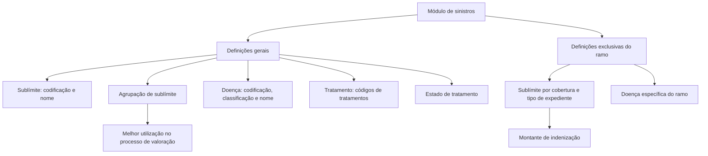

# Configuração de Sublímites, Doenças e Tratamentos no Módulo de Sinistros

## 1. Metadados do Documento
- **Arquivo de Origem:** `Não identificado`
- **Tipo de Documento:** `Apresentação Executiva`
- **Domínio / Sistema:** `Módulo de sinistros; parametrização de sublímites, doenças e tratamentos`
- **Público-Alvo:** `Negócio, analistas funcionais e equipes de configuração`
- **Data/Versão Identificada:** `Não identificada`

---

## 2. Resumo Executivo & Contexto de Negócio

O documento apresenta conceitos de parametrização utilizados no módulo de sinistros, com foco em sublímites, doenças e tratamentos. O conteúdo diferencia definições gerais, reutilizáveis no módulo de sinistros, de definições específicas de cada ramo.

Um sublímite é definido como um elemento de livre definição associado a um tipo de expediente e a uma cobertura. O sublímite determina o montante pelo qual a companhia indenizará. A parametrização de sublímites deve ocorrer nos níveis de ramo, cobertura e tipo de expediente.

Os sublímites podem ser agrupados para melhorar sua utilização no processo de valoração. Para isso, o documento distingue a codificação e o nome de sublímites individuais da definição de códigos de agrupação para sublímites de mesma natureza.

No domínio de doenças, o documento apresenta configurações gerais para codificação, classificação e nome de doenças, tratamentos aplicáveis e estados de tratamentos. Também indica uma definição de doenças específica do ramo, porém o trecho extraído termina antes de detalhar completamente essa configuração.

---

## 3. Arquitetura, Componentes & Tecnologias Envolvidas

O documento não descreve arquitetura tecnológica, interfaces, microsserviços, bancos de dados, protocolos, URLs, ambientes ou ferramentas de implantação. O conteúdo descreve uma estrutura funcional de parametrização dentro do módulo de sinistros.

Componentes e conceitos identificados:

- **Módulo de sinistros:** contexto de uso das definições gerais.
- **Ramo:** contexto para definições exclusivas do ramo configurado.
- **Cobertura:** nível de associação de características de sublímites.
- **Tipo de expediente:** nível de associação de sublímites.
- **Sublímite:** elemento que determina o montante de indenização da companhia.
- **Agrupação de sublímite:** mecanismo para agrupar sublímites de mesma natureza.
- **Doença:** entidade configurável em definições gerais e específicas de ramo.
- **Tratamento:** códigos de tratamentos aplicáveis para curar doenças.
- **Estado:** estados configuráveis para tratamentos.
- **Processo de valoração:** processo citado como beneficiário do agrupamento de sublímites.



> **Nota de Análise:** O documento não detalha tecnologias, métodos de integração, contratos, interfaces de usuário ou persistência de dados para essas parametrizações.

---

## 4. Regras de Negócio, Especificações Funcionais & Processos

### Sublímites

1. Um sublímite é um elemento de livre definição.
2. Um sublímite está associado a um tipo de expediente e a uma cobertura.
3. Um sublímite determina o montante pelo qual a companhia indenizará.
4. Sublímites devem ser definidos nos níveis de:
   - ramo;
   - cobertura;
   - tipo de expediente.
5. Sublímites devem ser agrupados para permitir melhor utilização no processo de valoração.
6. A definição geral de sublímite permite configurar:
   - codificação de diferentes sublímites;
   - nome de diferentes sublímites.
7. A agrupação de sublímites permite definir códigos para reunir sublímites de mesma natureza.
8. A definição de sublímite no ramo permite definir características de sublímites por cobertura e por tipo de expediente.

### Doenças

1. As definições gerais de doenças não são exclusivas de um ramo.
2. As definições gerais de doenças são utilizadas no módulo de sinistros.
3. A configuração geral de doença permite definir:
   - codificação;
   - classificação;
   - nome das diferentes doenças.
4. A definição de doença no ramo é exclusiva do ramo que está sendo definido.
5. O documento inicia a descrição da definição de doença específica do ramo com a frase “Permite definir las diferentes enfermedades que se pueden dar por consecuencia”, mas não apresenta continuação no conteúdo extraído.

### Tratamentos e estados

1. A definição de tratamento permite configurar códigos dos diferentes tratamentos que podem ser aplicados para curar diferentes doenças.
2. A definição de estado permite configurar estados de tratamentos.
3. O documento não detalha os valores possíveis para códigos de tratamento, estados de tratamento ou regras de transição entre estados.

---

## 5. Tabelas de Parâmetros, Ambientes e Estruturas de Dados

| Item / Parâmetro | Descrição / Função | Tipo / Valores / Formato | Ambiente / Observações |
| :--- | :--- | :--- | :--- |
| Sublímite | Elemento de livre definição que determina o montante de indenização da companhia. | Não especificado. | Associado a tipo de expediente e cobertura. |
| Codificação de sublímite | Permite definir a codificação dos diferentes sublímites. | Código; formato não especificado. | Definição geral usada no módulo de sinistros. |
| Nome de sublímite | Permite definir o nome dos diferentes sublímites. | Nome; formato não especificado. | Definição geral usada no módulo de sinistros. |
| Agrupação de sublímite | Permite definir códigos para agrupar diferentes sublímites de mesma natureza. | Código; formato não especificado. | Destinada a melhorar a utilização no processo de valoração. |
| Sublímite por ramo | Permite definir características de sublímites. | Características não especificadas. | Exclusivo do ramo; aplicável por cobertura e tipo de expediente. |
| Cobertura | Nível de associação para características de sublímites. | Não especificado. | Associada ao ramo e ao tipo de expediente na definição de sublímite. |
| Tipo de expediente | Nível de associação para sublímites. | Não especificado. | Associado à cobertura e ao ramo. |
| Doença geral | Permite definir codificação, classificação e nome de doenças. | Código, classificação e nome; formatos não especificados. | Definição geral, não exclusiva de ramo, utilizada no módulo de sinistros. |
| Doença por ramo | Permite definir doenças exclusivas do ramo configurado. | Não especificado. | A descrição está incompleta no conteúdo extraído. |
| Tratamento | Permite definir códigos de tratamentos aplicáveis para curar doenças. | Código; formato não especificado. | Definição geral utilizada no módulo de sinistros. |
| Estado | Permite definir estados dos tratamentos. | Estado; valores não especificados. | Definição geral utilizada no módulo de sinistros. |
| Ambiente | Não há servidores, URLs ou ambientes técnicos descritos. | Não aplicável. | Não identificado. |

---

## 6. Bateria de Perguntas & Respostas para RAG (FAQ Sintético)

### P1: O que é um sublímite no módulo de sinistros?
**R:** Um sublímite é um elemento de livre definição associado a um tipo de expediente e a uma cobertura. O sublímite determina o montante pelo qual a companhia indenizará.

### P2: Em quais níveis um sublímite deve ser definido?
**R:** Os sublímites devem ser definidos nos níveis de ramo, cobertura e tipo de expediente.

### P3: Qual é a finalidade da agrupação de sublímites?
**R:** A agrupação de sublímites permite definir códigos para reunir diferentes sublímites de mesma natureza, possibilitando melhor utilização no processo de valoração.

### P4: O que pode ser configurado na definição geral de sublímite?
**R:** A definição geral de sublímite permite definir a codificação e o nome dos diferentes sublímites.

### P5: O que a definição de sublímite no ramo permite configurar?
**R:** A definição de sublímite no ramo permite definir as características dos diferentes sublímites por cobertura e por tipo de expediente.

### P6: As definições gerais de doenças são exclusivas de um ramo?
**R:** Não. O documento informa que as definições gerais não são exclusivas de um ramo e são utilizadas no módulo de sinistros.

### P7: Quais atributos podem ser definidos para doenças nas configurações gerais?
**R:** As configurações gerais de doença permitem definir a codificação, a classificação e o nome das diferentes doenças.

### P8: Para que servem os códigos de tratamento?
**R:** Os códigos de tratamento permitem identificar os diferentes tratamentos que podem ser aplicados para curar diferentes doenças.

### P9: O que são os estados de tratamento?
**R:** Estados de tratamento são configurações que permitem definir os estados associados aos tratamentos. O documento não informa quais estados podem ser utilizados nem as regras de transição entre eles.

### P10: O documento detalha quais doenças podem ser configuradas especificamente por ramo?
**R:** Não completamente. O documento indica que existe uma definição de doença exclusiva do ramo e inicia a frase “Permite definir las diferentes enfermedades que se pueden dar por consecuencia”, mas o conteúdo extraído é interrompido antes do detalhamento.

---

## 7. Glossário de Termos, Siglas & Conceitos-Chave

- **Agrupação de sublímite:** configuração de códigos para reunir sublímites de mesma natureza.
- **Cobertura:** elemento associado ao sublímite na definição de características e indenização.
- **Doença:** entidade configurável por codificação, classificação e nome; também possui definição específica por ramo.
- **Estado:** configuração de estados associados aos tratamentos.
- **Módulo de sinistros:** módulo no qual são utilizadas as definições gerais descritas.
- **Processo de valoração:** processo citado como beneficiário do agrupamento de sublímites.
- **Ramo:** contexto de negócio no qual existem definições exclusivas de sublímites e doenças.
- **Sublímite:** elemento de livre definição que determina o montante pelo qual a companhia indenizará.
- **Tratamento:** configuração de códigos de tratamentos aplicáveis para curar doenças.
- **Tipo de expediente:** elemento associado ao sublímite juntamente com a cobertura.

---

## 8. Notas Críticas, Riscos & Limitações

- O arquivo de origem, data, versão, autor e sistema corporativo específico não foram identificados no conteúdo fornecido.
- O material possui características de apresentação resumida e não apresenta detalhes técnicos de implementação.
- Não há informações sobre tecnologias, arquitetura de software, APIs, contratos de dados, URLs, servidores, ambientes, logs ou mecanismos de segurança.
- O documento não apresenta formatos, domínios de valores, obrigatoriedade ou regras de validação para códigos, classificações, estados ou nomes.
- A explicação da definição de doença específica por ramo está incompleta na extração da página 2 e da página 3.
- Os termos “GENERAL”, “RAMO”, “CF”, “Home Solutions APIs Documentation Zeus” e “EN” aparecem no conteúdo, mas parte deles pode corresponder a elementos de navegação, cabeçalhos ou rodapés; o texto fornecido não explica seu significado.

---

## 9. Conteúdo Bruto Estruturado (Referência Fiel)

```text
--- [PÁGINA 1 DE 3] ---

INTRODUCCIÓN - Varios
OBJETIVO
Sublímite
Enfermedad
Conceptos
SUBLÍMITE
SUBLÍMITE
Un sublímite es un elemento de libre
definición asociado a un tipo de expediente,
cobertura, que determinará el monto por el
que la compañía indemnizará. Los sub-límites
deberán ser definidos a nivel de ramo,
cobertura y tipo de expediente. Los sub-
límites serán agrupados para una mejor
utilización en el proceso de valoración.
GENERAL
SUB-LIMITE
 / 
 CF
Home Solutions APIs Documentation Zeus
EN


--- [PÁGINA 2 DE 3] ---

Son definiciones que NO son
exclusivas de un ramo y se
utilizan en el módulo de
siniestros. Las más importantes
son:
Permite definir la codificación y nombre de los
diferentes sub-límites
AGRUPACIÓN SUB-LIMITE
Permite definir códigos para aunar, agrupar,
diferentes sub-límites de la misma naturaleza.
RAMO
Son exclusivas del ramo que se
está definiendo
SUB-LIMITE
Permite definir las características de los
diferentes sub-límites por cobertura y tipo de
expediente
ENFERMEDAD
ENFERMEDAD
Definición de enfermedades, suele ser usado
para siniestros de salud y de vida.
GENERAL
Son definiciones que NO son
exclusivas de un ramo y se
utilizan en el módulo de
siniestros. Las más importantes
son:
ENFERMEDAD
Permite definir la codificación clasificación y
nombre de las diferentes enfermedades
TRATAMIENTO
Permite definir códigos de los diferentes
tratamientos que se pueden aplicar para
poder curar las diferentes enfermedades
ESTADO
Permite definir estados de los tratamientos
RAMO
ENFERMEDAD
Permite definir las diferentes enfermedades
que se pueden dar por consecuencia


--- [PÁGINA 3 DE 3] ---

Son exclusivas del ramo que se
está definiendo
```
